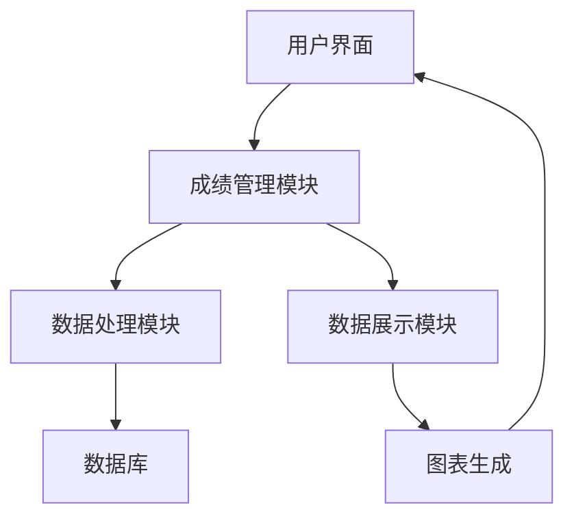

# 成绩计算分析系统详细设计与具体代码实现

作者：禅与计算机程序设计艺术

## 1. 背景介绍

### 1.1 教育信息化的需求

随着信息技术的迅猛发展，教育行业对信息化的需求日益增加。传统的成绩管理方式已经无法满足现代教育的需求，特别是在大规模的教育机构中，手工管理成绩不仅效率低下，且容易出错。因此，开发一个高效、准确的成绩计算分析系统显得尤为重要。

### 1.2 成绩计算分析系统的目标

成绩计算分析系统的目标是提供一个全面的、自动化的成绩管理平台，帮助教育机构实现成绩的自动计算、分析和可视化展示。系统应具备以下功能：

- 自动化成绩录入与计算
- 成绩数据的多维度分析
- 可视化展示成绩数据
- 提供个性化的成绩报告

### 1.3 文章结构

本篇文章将详细介绍成绩计算分析系统的设计与实现，包括核心概念、算法原理、数学模型、代码实例、实际应用场景、工具和资源推荐，最后总结未来的发展趋势与挑战，并附上常见问题与解答。

## 2. 核心概念与联系

### 2.1 成绩管理的基本概念

成绩管理系统主要涉及以下几个基本概念：

- **学生信息**：包括学生的基本信息，如姓名、学号、班级等。
- **课程信息**：包括课程的基本信息，如课程名称、课程代码、学分等。
- **成绩信息**：包括每个学生在每门课程中的成绩。

### 2.2 数据库设计

成绩计算分析系统的数据存储主要依赖于数据库。数据库设计需要考虑以下几个主要表：

- **学生表**：存储学生的基本信息。
- **课程表**：存储课程的基本信息。
- **成绩表**：存储学生在各门课程中的成绩。

### 2.3 数据处理流程

数据处理流程主要包括数据的录入、计算、分析和展示。以下是数据处理的主要步骤：

1. 数据录入：将学生、课程和成绩数据录入系统。
2. 数据计算：根据预设的计算规则，自动计算学生的总成绩、平均成绩等。
3. 数据分析：对成绩数据进行多维度分析，如按班级、按课程等。
4. 数据展示：通过图表等形式展示分析结果。

### 2.4 系统架构

成绩计算分析系统的架构设计如下图所示：



## 3. 核心算法原理具体操作步骤

### 3.1 成绩计算算法

成绩计算是成绩管理系统的核心功能之一，常用的成绩计算算法包括：

- **加权平均法**：根据各科成绩的权重计算总成绩。
- **百分制换算法**：将各科成绩换算成百分制后计算总成绩。

### 3.2 数据分析算法

数据分析算法用于对成绩数据进行多维度分析，常用的分析方法包括：

- **描述性统计分析**：计算平均值、标准差等统计量。
- **数据聚类分析**：将学生按成绩分组，找出成绩相似的学生群体。
- **回归分析**：分析成绩与其他变量（如出勤率、作业完成情况等）之间的关系。

### 3.3 数据可视化算法

数据可视化算法用于将分析结果以图表的形式展示，常用的图表类型包括：

- **柱状图**：展示各科成绩的对比。
- **折线图**：展示成绩的变化趋势。
- **饼图**：展示成绩的分布情况。

## 4. 数学模型和公式详细讲解举例说明

### 4.1 加权平均法

加权平均法的公式如下：

$$
\text{总成绩} = \frac{\sum_{i=1}^{n} (成绩_i \times 权重_i)}{\sum_{i=1}^{n} 权重_i}
$$

其中，$成绩_i$ 表示第 $i$ 门课程的成绩，$权重_i$ 表示第 $i$ 门课程的权重。

### 4.2 百分制换算法

百分制换算法的公式如下：

$$
\text{百分制成绩} = \frac{\text{实际成绩}}{\text{满分}} \times 100
$$

其中，$\text{实际成绩}$ 表示学生在某门课程中的实际得分，$\text{满分}$ 表示该课程的满分。

### 4.3 描述性统计分析

描述性统计分析中常用的公式包括：

- **平均值**：

$$
\bar{x} = \frac{\sum_{i=1}^{n} x_i}{n}
$$

- **标准差**：

$$
\sigma = \sqrt{\frac{\sum_{i=1}^{n} (x_i - \bar{x})^2}{n}}
$$

### 4.4 数据聚类分析

数据聚类分析常用的算法包括 K-means 算法，其核心公式如下：

$$
J = \sum_{i=1}^{k} \sum_{j=1}^{n} ||x_j^{(i)} - \mu_i||^2
$$

其中，$k$ 表示聚类的个数，$n$ 表示数据点的个数，$x_j^{(i)}$ 表示第 $i$ 个聚类中的第 $j$ 个数据点，$\mu_i$ 表示第 $i$ 个聚类的中心。

### 4.5 回归分析

回归分析常用的公式包括：

- **线性回归**：

$$
y = \beta_0 + \beta_1 x + \epsilon
$$

其中，$y$ 表示因变量，$x$ 表示自变量，$\beta_0$ 和 $\beta_1$ 表示回归系数，$\epsilon$ 表示误差项。

## 5. 项目实践：代码实例和详细解释说明

### 5.1 数据库设计与实现

#### 5.1.1 数据库表结构

```sql
CREATE TABLE students (
    student_id INT PRIMARY KEY,
    name VARCHAR(100),
    class VARCHAR(50)
);

CREATE TABLE courses (
    course_id INT PRIMARY KEY,
    course_name VARCHAR(100),
    credits INT
);

CREATE TABLE grades (
    grade_id INT PRIMARY KEY,
    student_id INT,
    course_id INT,
    grade FLOAT,
    FOREIGN KEY (student_id) REFERENCES students(student_id),
    FOREIGN KEY (course_id) REFERENCES courses(course_id)
);
```

#### 5.1.2 数据库连接与操作

```python
import sqlite3

# 连接数据库
conn = sqlite3.connect('grades.db')
cursor = conn.cursor()

# 创建表
cursor.execute('''CREATE TABLE IF NOT EXISTS students (
                    student_id INTEGER PRIMARY KEY,
                    name TEXT,
                    class TEXT)''')

cursor.execute('''CREATE TABLE IF NOT EXISTS courses (
                    course_id INTEGER PRIMARY KEY,
                    course_name TEXT,
                    credits INTEGER)''')

cursor.execute('''CREATE TABLE IF NOT EXISTS grades (
                    grade_id INTEGER PRIMARY KEY,
                    student_id INTEGER,
                    course_id INTEGER,
                    grade REAL,
                    FOREIGN KEY (student_id) REFERENCES students(student_id),
                    FOREIGN KEY (course_id) REFERENCES courses(course_id))''')

# 插入数据
cursor.execute("INSERT INTO students (student_id, name, class) VALUES (1, 'Alice', 'Class 1')")
cursor.execute("INSERT INTO courses (course_id, course_name, credits) VALUES (1, 'Math', 3)")
cursor.execute("INSERT INTO grades (grade_id, student_id, course_id, grade) VALUES (1, 1, 1, 95.0)")

# 提交事务
conn.commit()

# 查询数据
cursor.execute("SELECT * FROM students")
print(cursor.fetchall())

# 关闭连接
conn.close()
```

### 5.2 成绩计算与分析

#### 5.2.1 成绩计算

```python
def calculate_weighted_average(grades, weights):
    total_weighted_score = sum(g * w for g, w in zip(grades, weights))
    total_weight = sum(weights)
    return total_weighted_score / total_weight

# 示例数据
grades = [95, 85, 75]
weights = [0.5, 0.3, 0.2]

# 计算加权平均成绩
average_grade = calculate_weighted_average(grades, weights)
print(f"加权平均成绩: {average_grade}")
```

#### 5.2.2 数据分析

```python
import numpy as np

# 描述性统计分析
def descriptive_statistics(grades):
    mean = np.mean(grades)
    std_dev = np.std(grades)
    return mean, std_dev

# 示例数据
grades = [95, 85, 75, 