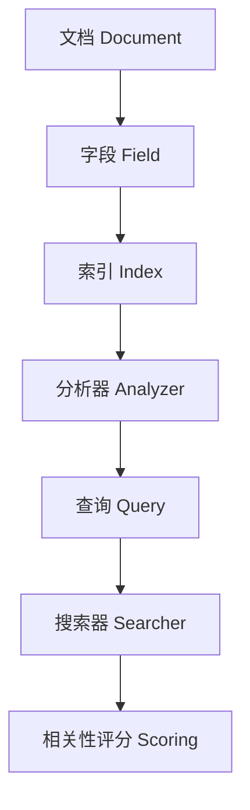

# 手把手教你用Lucene实现商品搜索

作者：禅与计算机程序设计艺术

## 1. 背景介绍

随着电子商务的快速发展，商品搜索已经成为电商平台的核心功能之一。高效的商品搜索不仅能够提升用户体验，还能显著增加平台的转化率。Apache Lucene是一个高性能、全功能的文本搜索引擎库，广泛应用于各种搜索引擎和数据分析平台。在这篇文章中，我们将深入探讨如何使用Lucene来实现一个高效的商品搜索系统。

## 2. 核心概念与联系

在实现商品搜索之前，我们需要了解Lucene的一些核心概念和它们之间的联系：

### 2.1 文档（Document）

Lucene中的文档是信息的基本单元。每个文档由多个字段（Field）组成，每个字段包含一个键值对。对于商品搜索来说，一个文档可以表示一个商品，字段可以包括商品名称、描述、价格等。

### 2.2 字段（Field）

字段是文档的组成部分。每个字段都有一个名称和一个值。字段可以是不同的类型，例如字符串、数值、日期等。

### 2.3 索引（Index）

索引是Lucene存储和搜索文档的核心数据结构。索引由多个段（Segment）组成，每个段包含一组文档。Lucene通过倒排索引（Inverted Index）来加速搜索操作。

### 2.4 分析器（Analyzer）

分析器用于将文本分割成词元（Token），并对词元进行处理，例如去除停用词、词干提取等。不同的分析器适用于不同的语言和应用场景。

### 2.5 查询（Query）

查询是用户请求的表达形式。Lucene支持多种查询类型，包括关键词查询、布尔查询、范围查询等。查询通过解析器（QueryParser）解析成Lucene能够理解的格式。

### 2.6 搜索器（Searcher）

搜索器用于执行查询并返回结果。它在索引中查找与查询匹配的文档，并按照相关性排序返回。

### 2.7 相关性评分（Scoring）

相关性评分用于衡量文档与查询的匹配程度。Lucene使用TF-IDF（词频-逆文档频率）模型计算相关性评分。

以下是Lucene核心概念的Mermaid流程图：



## 3. 核心算法原理具体操作步骤

在这一部分，我们将详细讲解使用Lucene实现商品搜索的具体操作步骤。

### 3.1 创建索引

创建索引是Lucene搜索系统的第一步。我们需要将商品数据转换成Lucene文档，并将这些文档添加到索引中。

```java
import org.apache.lucene.analysis.standard.StandardAnalyzer;
import org.apache.lucene.document.Document;
import org.apache.lucene.document.Field;
import org.apache.lucene.document.StringField;
import org.apache.lucene.document.TextField;
import org.apache.lucene.index.IndexWriter;
import org.apache.lucene.index.IndexWriterConfig;
import org.apache.lucene.store.Directory;
import org.apache.lucene.store.RAMDirectory;

public class Indexer {
    public static void main(String[] args) {
        try {
            // 创建一个内存目录
            Directory directory = new RAMDirectory();
            // 使用标准分析器
            StandardAnalyzer analyzer = new StandardAnalyzer();
            // 配置IndexWriter
            IndexWriterConfig config = new IndexWriterConfig(analyzer);
            IndexWriter writer = new IndexWriter(directory, config);

            // 创建商品文档
            Document doc = new Document();
            doc.add(new StringField("id", "1", Field.Store.YES));
            doc.add(new TextField("name", "Apple iPhone 13", Field.Store.YES));
            doc.add(new TextField("description", "Latest iPhone with A15 Bionic chip", Field.Store.YES));
            doc.add(new StringField("price", "799", Field.Store.YES));
            writer.addDocument(doc);

            // 关闭IndexWriter
            writer.close();
        } catch (Exception e) {
            e.printStackTrace();
        }
    }
}
```

### 3.2 查询索引

创建索引后，我们可以使用Lucene的搜索功能来查找商品。以下是一个简单的查询示例：

```java
import org.apache.lucene.analysis.standard.StandardAnalyzer;
import org.apache.lucene.document.Document;
import org.apache.lucene.index.DirectoryReader;
import org.apache.lucene.index.IndexReader;
import org.apache.lucene.queryparser.classic.QueryParser;
import org.apache.lucene.search.IndexSearcher;
import org.apache.lucene.search.Query;
import org.apache.lucene.search.ScoreDoc;
import org.apache.lucene.search.TopDocs;
import org.apache.lucene.store.Directory;
import org.apache.lucene.store.RAMDirectory;

public class Searcher {
    public static void main(String[] args) {
        try {
            // 创建一个内存目录
            Directory directory = new RAMDirectory();
            // 使用标准分析器
            StandardAnalyzer analyzer = new StandardAnalyzer();
            // 创建IndexReader
            IndexReader reader = DirectoryReader.open(directory);
            // 创建IndexSearcher
            IndexSearcher searcher = new IndexSearcher(reader);

            // 创建查询解析器
            QueryParser parser = new QueryParser("name", analyzer);
            Query query = parser.parse("iPhone");

            // 执行查询
            TopDocs results = searcher.search(query, 10);
            for (ScoreDoc scoreDoc : results.scoreDocs) {
                Document doc = searcher.doc(scoreDoc.doc);
                System.out.println("Found: " + doc.get("name"));
            }

            // 关闭IndexReader
            reader.close();
        } catch (Exception e) {
            e.printStackTrace();
        }
    }
}
```

## 4. 数学模型和公式详细讲解举例说明

Lucene的相关性评分基于TF-IDF模型。TF-IDF模型由词频（Term Frequency, TF）和逆文档频率（Inverse Document Frequency, IDF）组成。

### 4.1 词频（TF）

词频表示词语在文档中出现的频率。对于文档 $d$ 中的词语 $t$，词频 $TF(t, d)$ 可以表示为：

$$
TF(t, d) = \frac{f_{t,d}}{\sum_{t' \in d} f_{t',d}}
$$

其中，$f_{t,d}$ 是词语 $t$ 在文档 $d$ 中出现的次数。

### 4.2 逆文档频率（IDF）

逆文档频率表示词语在整个文档集合中的重要性。对于词语 $t$，逆文档频率 $IDF(t)$ 可以表示为：

$$
IDF(t) = \log \frac{N}{df_t}
$$

其中，$N$ 是文档的总数，$df_t$ 是包含词语 $t$ 的文档数。

### 4.3 TF-IDF

TF-IDF是词频和逆文档频率的乘积，用于衡量词语在文档中的重要性：

$$
TF\text{-}IDF(t, d) = TF(t, d) \times IDF(t)
$$

## 5. 项目实践：代码实例和详细解释说明

在这一部分，我们将结合前面的概念和算法，详细讲解如何使用Lucene实现一个完整的商品搜索系统。

### 5.1 项目结构

我们将创建一个简单的Java项目，包含以下几个部分：

- `Indexer`: 负责创建索引
- `Searcher`: 负责查询索引
- `Product`: 表示商品的类
- `Main`: 程序入口

### 5.2 创建商品类

首先，我们定义一个表示商品的类：

```java
public class Product {
    private String id;
    private String name;
    private String description;
    private double price;

    // 构造函数、getter和setter方法
    public Product(String id, String name, String description, double price) {
        this.id = id;
        this.name = name;
        this.description = description;
        this.price = price;
    }

    public String getId() {
        return id;
    }

    public String getName() {
        return name;
    }

    public String getDescription() {
        return description;
    }

    public double getPrice() {
        return price;
    }
}
```

### 5.3 创建索引器

接下来，我们实现`Indexer`类，用于创建索引：

```java
import org.apache.lucene.analysis.standard.StandardAnalyzer;
import org.apache.lucene.document.*;
import org.apache.lucene.index.IndexWriter;
import org.apache.lucene.index.IndexWriterConfig;
import org.apache.lucene.store.Directory;
import org.apache.lucene.store.RAMDirectory;

import java.io.IOException;
import java.util.List;

public class Indexer {
    private IndexWriter writer;

    public Indexer(Directory directory) throws IOException {
        StandardAnalyzer analyzer = new StandardAnalyzer();
        IndexWriterConfig config = new IndexWriterConfig(analyzer);
        writer = new IndexWriter(directory, config);
    }

    public void close() throws IOException