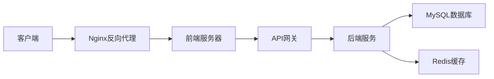
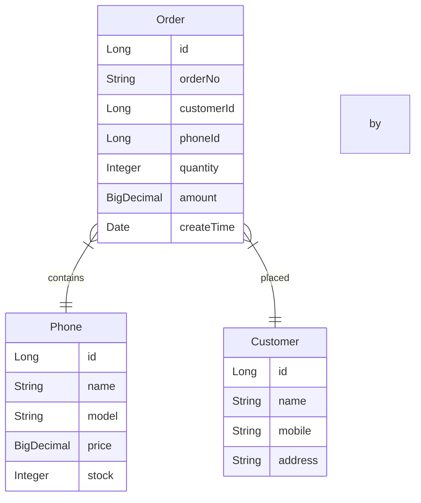

# 手机销售系统详细设计与具体代码实现

作者：禅与计算机程序设计艺术

## 1. 背景介绍

### 1.1 手机销售系统的重要性
在当今移动互联网时代,手机已成为人们生活中不可或缺的一部分。与此同时,手机销售市场的竞争也日趋激烈。为了在激烈的市场竞争中立于不败之地,企业急需一套高效、可靠、易用的手机销售系统,以提升销售效率,简化业务流程,为客户提供更加优质的服务体验。

### 1.2 系统建设的必要性
传统的手机销售模式存在诸多弊端,如信息孤岛、业务流程复杂、数据统计困难等,严重制约了企业的发展。因此,开发一套功能完善、性能优异的手机销售系统势在必行。该系统将帮助企业实现销售数据的集中管理,优化业务流程,提高工作效率,为管理决策提供有力支撑。

### 1.3 项目目标
本项目旨在设计并实现一套基于Web的手机销售系统,涵盖手机管理、订单管理、客户管理、统计报表等核心模块。系统将采用当前流行的Vue前端框架和Spring Boot后端框架,并严格遵循软件工程规范,力求为企业提供一套高质量、高性能、高可用的解决方案。

## 2. 核心概念与联系

### 2.1 系统架构
系统采用前后端分离的架构模式,前端使用Vue框架,后端使用Spring Boot框架。前后端通过RESTful API进行数据交互,实现了松耦合、易维护、高性能的优点。系统整体架构如下图所示:



### 2.2 关键技术

- 前端:Vue 3.0、Element Plus UI组件库、Axios
- 后端:Spring Boot 2.5、MySQL 8.0、MyBatis Plus、Redis
- 部署:Docker容器化、Nginx反向代理
- 开发工具:IntelliJ IDEA、VS Code、Git
- 项目管理:Maven、Jira

### 2.3 数据模型
系统涉及的核心数据模型包括:

- 手机(Phone):手机基本信息,如名称、型号、价格、库存等。
- 订单(Order):销售订单信息,如订单编号、客户、手机、数量、金额等。
- 客户(Customer):客户基本信息,如姓名、联系方式、地址等。

各个数据模型之间的关系可用ER图表示如下:



## 3.核心算法原理具体操作步骤

### 3.1 订单编号生成算法

订单编号采用日期+顺序流水号的方式,如20230601001表示2023年6月1日的第1个订单。生成步骤如下:

1. 获取当前日期,格式为yyyyMMdd
2. 从Redis缓存中获取当天的订单序号,初始为1
3. 递增订单序号,并更新Redis缓存
4. 将日期和订单序号拼接成订单编号
5. 补齐订单序号位数至3位,不足前面补0

核心代码如下:

```java
public String generateOrderNo() {
    String today = LocalDate.now().format(DateTimeFormatter.ofPattern("yyyyMMdd"));
    Long sequence = redisTemplate.opsForValue().increment("order:seq:" + today);
    return today + String.format("%03d", sequence);
}
```

### 3.2 库存扣减算法

为了避免超卖问题,采用乐观锁+Redis分布式锁的方式进行库存扣减。具体步骤如下:

1. 从数据库中查询手机库存,并记录当前版本号
2. 尝试获取该手机的Redis分布式锁,避免并发问题
3. 如果库存充足,则在数据库中扣减库存,并更新版本号
4. 释放Redis分布式锁
5. 如果更新失败(版本号不一致),则重试步骤1-4
6. 如果重试达到最大次数仍失败,则库存扣减失败

核心代码如下:

```java
public boolean decreaseStock(Long phoneId, Integer quantity) {
    int maxRetries = 5;
    for (int i = 0; i < maxRetries; i++) {
        Phone phone = phoneMapper.selectById(phoneId);
        if (phone.getStock() < quantity) {
            return false;
        }
        String lockKey = "lock:phone:" + phoneId;
        Boolean locked = redisTemplate.opsForValue().setIfAbsent(lockKey, "1", 10, TimeUnit.SECONDS);
        if (!locked) {
            continue;
        }
        try {
            phone.setStock(phone.getStock() - quantity);
            phoneMapper.updateById(phone);
            return true;
        } catch (Exception e) {
            // 版本号不一致,重试
        } finally {
            redisTemplate.delete(lockKey);
        }
    }
    return false;
}
```

## 4.数学模型和公式详细讲解举例说明

### 4.1 销售额预测模型

通过分析历史销售数据,可以建立时间序列预测模型,如ARIMA模型,预测未来一段时间的销售额。ARIMA(p,d,q)模型公式如下:

$$
\begin{aligned}
y'_t &= \mu + \phi_1 y'_{t-1} + \cdots + \phi_p y'_{t-p} \\
&+ \theta_1 \varepsilon_{t-1} + \cdots + \theta_q \varepsilon_{t-q} + \varepsilon_t
\end{aligned}
$$

其中,$\mu$是常数项,$\phi_i$是自回归系数,$\theta_i$是移动平均系数,$y'_t$是时间$t$经过$d$阶差分后的序列,$\varepsilon_t$是白噪声序列。

假设某手机的历史月销量数据如下:

| 月份 | 销量(部) |
|-----|---------|
| 1   | 5200    |
| 2   | 4800    |
| 3   | 5500    |
| 4   | 5800    |
| 5   | 6100    |
| 6   | 5900    |

通过R语言的forecast包,可以建立ARIMA(1,1,1)模型,预测未来3个月的销量:

```r
library(forecast)

data <- c(5200,4800,5500,5800,6100,5900)
fit <- auto.arima(data)
forecast(fit, h=3)
```

预测结果如下:

```
     Point Forecast Lo 80 Hi 80 Lo 95 Hi 95
7          6305.90  5921  6691  5705  6907
8          6371.81  5884  6860  5613  7130
9          6436.73  5840  7033  5512  7361 
```

可见未来3个月的销量预计在6000~7000部之间,为销售计划提供了参考依据。

### 4.2 客户价值评估模型

根据客户的历史消费金额、购买频次、时间间隔等因素,可以评估客户的价值。一种简单的评估公式如下:

$$CV = \frac{M}{T} \times F \times C$$

其中,$CV$表示客户价值,$M$表示过去一年的消费总额,$T$表示第一次购买至今的时间(月),$F$表示过去一年的购买频次,$C$表示最近一次购买距今的时间(月),系数可根据实际情况调整。

例如,客户张三过去一年购买手机的记录如下:

| 购买日期   | 金额(元) |
|------------|----------|
| 2022-01-15 | 5299     |
| 2022-05-20 | 3999     |
| 2022-08-10 | 4599     |
| 2022-12-01 | 6199     |

假设当前日期为2023-06-01,则相关变量取值如下:

- $M$ = 5299 + 3999 + 4599 + 6199 = 20096
- $T$ = 17 (2022-01-15至2023-06-01共17个月)
- $F$ = 4
- $C$ = 6 (2022-12-01至2023-06-01共6个月)

代入公式计算得:

$$CV = \frac{20096}{17} \times 4 \times 6 = 28311$$

可见张三的客户价值得分为28311,属于高价值客户,应给予重点关注和服务。

该模型可根据实际情况进一步优化,如引入客户流失时间、客单价等因素,以更准确地评估客户价值。

## 5.项目实践：代码实例和详细解释说明

以下是手机销售系统的部分核心代码实例,并附有详细解释说明。

### 5.1 手机管理模块

```java
@RestController
@RequestMapping("/phones")
public class PhoneController {
    @Autowired
    private PhoneService phoneService;

    /**
     * 添加新手机
     * @param phone 手机信息
     * @return 添加结果
     */
    @PostMapping
    public Result addPhone(@RequestBody Phone phone) {
        return phoneService.save(phone) ? 
            Result.ok() : Result.error("添加失败");
    }

    /**
     * 查询手机列表
     * @param pageNum 页码
     * @param pageSize 每页条数
     * @return 手机列表
     */
    @GetMapping
    public Result listPhone(@RequestParam(defaultValue = "1") Integer pageNum,
                             @RequestParam(defaultValue = "10") Integer pageSize) {
        Page<Phone> page = new Page<>(pageNum, pageSize);
        Page<Phone> result = phoneService.page(page);
        return Result.ok(result);
    }

    // 其他方法省略...
}
```

该控制器使用`@RestController`注解,表示返回JSON格式的数据。`@RequestMapping`指定了该控制器处理的请求路径前缀为`/phones`。

在`addPhone`方法中,使用`@PostMapping`注解表示处理POST请求。方法接收一个`Phone`对象作为请求体,调用`PhoneService`的`save`方法进行保存,根据结果返回统一的`Result`对象。

在`listPhone`方法中,使用`@GetMapping`注解表示处理GET请求。方法接收`pageNum`和`pageSize`参数,默认值分别为1和10。方法内部使用`MyBatis-Plus`的`Page`对象进行分页查询,最后将结果封装到`Result`对象返回。

### 5.2 订单管理模块

```java
@Service
public class OrderServiceImpl implements OrderService {
    @Autowired
    private OrderMapper orderMapper;
    @Autowired
    private PhoneService phoneService;
    @Autowired
    private RedisTemplate redisTemplate;

    @Override
    @Transactional
    public boolean placeOrder(PlaceOrderDTO placeOrderDTO) {
        // 减库存
        if (!phoneService.decreaseStock(placeOrderDTO.getPhoneId(),
            placeOrderDTO.getQuantity())) {
            throw new RuntimeException("手机库存不足");
        }
        // 生成订单
        Order order = new Order();
        order.setOrderNo(generateOrderNo());
        order.setPhoneId(placeOrderDTO.getPhoneId());
        order.setCustomerId(placeOrderDTO.getCustomerId());
        order.setQuantity(placeOrderDTO.getQuantity());
        order.setAmount(placeOrderDTO.getQuantity() * placeOrderDTO.getPrice());
        order.setCreateTime(new Date());
        orderMapper.insert(order);
        // 发送消息
        sendOrderMessage(order);
        return true;
    }

    private String generateOrderNo() {
        String today = LocalDate.now().format(DateTimeFormatter.ofPattern("yyyyMMdd"));
        Long sequence = redisTemplate.opsForValue().increment("order:seq:" + today);
        return today + String.format("%03d", sequence);
    }

    private void sendOrderMessage(Order order) {
        // 发送订单创建消息,代码省略...
    }
    
    // 其他方法省略...
}
```

该服务实现类实现了`OrderService`接口,使用`@Service`注解标识。

在`placeOrder`方法中,首先调用`PhoneService`的`decreaseStock`方法进行减库存操作,减库存成功后继续执行,否则抛出异常。减库存过程通过乐观锁和Redis分布式锁保证并发安全,代码见前文。

接着根据下单信息创建`Order`对象,设置订单编号、客户、手机、数量、金额等信息。订单编号通过`generateOrderNo`方法生成,使用Redis自增序列保证唯一性。

创建订单后,调用`sendOrderMessage`方法发送异步消息,通知其他系统处理相关业务,如发货、发票等。该过程可使用RocketMQ等消息中间件实现,代码略。

整个方法使用`@