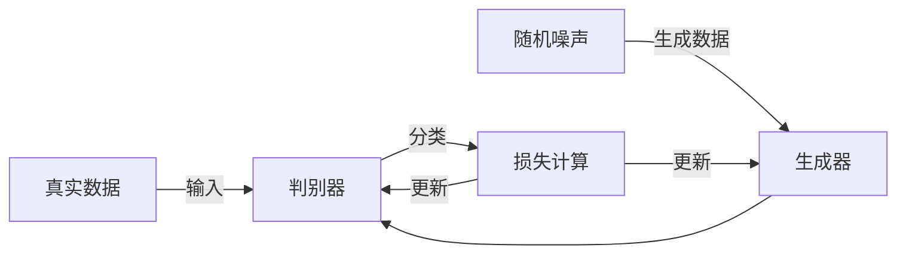
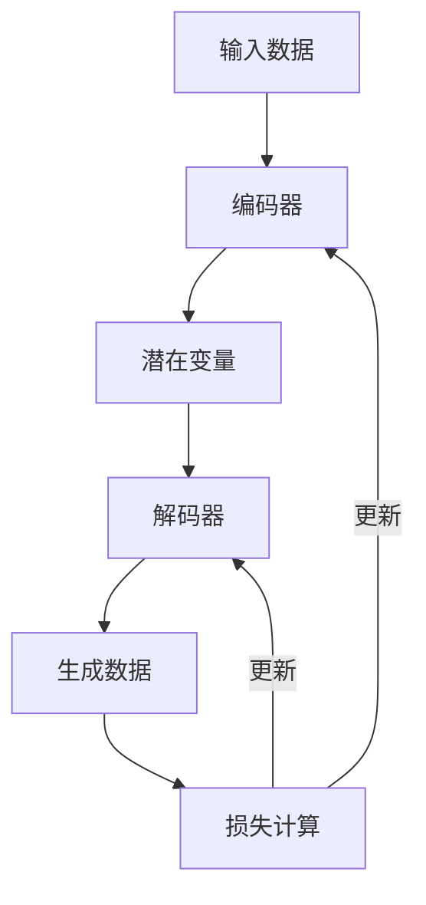
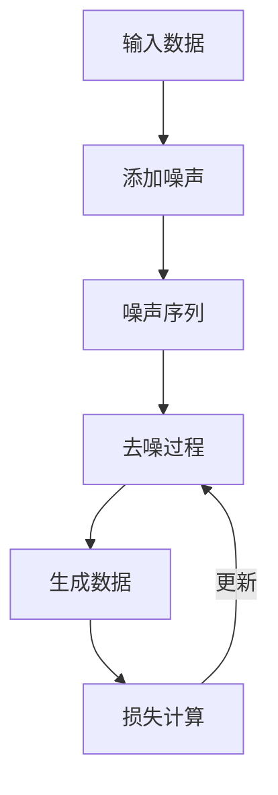

# 扩散模型vsGANvsVAE:三大生成模型王者对决

## 1. 背景介绍

### 1.1 生成模型的崛起

生成模型在过去的十年中取得了显著的发展。生成模型的目标是学习数据的分布，然后从中生成新的、类似的数据。这些模型在图像生成、文本生成、语音合成等领域有着广泛的应用。主要的生成模型包括生成对抗网络（GAN）、变分自编码器（VAE）和近年来兴起的扩散模型（Diffusion Models）。

### 1.2 三大生成模型的简要概述

#### 1.2.1 生成对抗网络（GAN）

GAN由Ian Goodfellow等人在2014年提出。GAN由两个神经网络组成：生成器（Generator）和判别器（Discriminator）。生成器试图生成看起来真实的数据，而判别器则试图区分真实数据和生成的数据。两个网络通过对抗训练，相互提升。

#### 1.2.2 变分自编码器（VAE）

VAE由Kingma和Welling在2013年提出。VAE是基于概率图模型的生成模型，通过编码器将数据映射到一个潜在空间，再通过解码器从潜在空间生成数据。VAE引入了变分推断，使得训练过程能够高效进行。

#### 1.2.3 扩散模型（Diffusion Models）

扩散模型是近年来兴起的一类生成模型。它们通过逐步添加噪声到数据中，然后学习如何反向去噪声，从而生成新的数据。扩散模型的训练过程通常较为复杂，但在图像生成任务中表现出色。

## 2. 核心概念与联系

### 2.1 生成对抗网络（GAN）

#### 2.1.1 对抗训练

GAN的核心思想是对抗训练。生成器和判别器通过博弈论中的零和博弈相互竞争。生成器的目标是最大化判别器的错误率，而判别器的目标是最小化其错误率。

#### 2.1.2 判别器与生成器

判别器是一个二分类器，用于区分真实数据和生成的数据。生成器是一个神经网络，用于生成看起来真实的数据。

### 2.2 变分自编码器（VAE）

#### 2.2.1 编码器与解码器

VAE由编码器和解码器组成。编码器将输入数据映射到潜在空间，解码器则从潜在空间生成数据。

#### 2.2.2 变分推断

VAE引入了变分推断，通过最大化证据下界（ELBO）来优化模型参数。变分推断使得训练过程更加高效。

### 2.3 扩散模型（Diffusion Models）

#### 2.3.1 正向扩散过程

扩散模型通过逐步添加噪声到数据中，形成一个噪声序列。

#### 2.3.2 反向去噪过程

扩散模型通过学习如何反向去噪声，从而生成新的数据。反向去噪过程通常通过神经网络实现。

### 2.4 三者的联系

尽管GAN、VAE和扩散模型在实现细节上有所不同，但它们的目标都是相同的：从数据分布中生成新的数据。GAN通过对抗训练实现，VAE通过概率图模型实现，而扩散模型通过逐步去噪声实现。

## 3. 核心算法原理具体操作步骤

### 3.1 生成对抗网络（GAN）

#### 3.1.1 初始化网络

在GAN中，首先初始化生成器和判别器的网络参数。生成器通常使用反卷积层，判别器使用卷积层。

#### 3.1.2 训练过程

1. 从真实数据分布中采样一个批次的真实数据。
2. 从潜在空间中采样一个批次的随机噪声，并通过生成器生成数据。
3. 使用判别器对真实数据和生成的数据进行分类，计算损失。
4. 更新判别器的参数以最小化分类损失。
5. 更新生成器的参数以最大化判别器的错误率。



### 3.2 变分自编码器（VAE）

#### 3.2.1 编码过程

1. 输入数据通过编码器映射到潜在空间，得到均值和方差。
2. 从均值和方差中采样潜在变量。

#### 3.2.2 解码过程

1. 采样的潜在变量通过解码器生成数据。
2. 计算重构损失和KL散度损失。

#### 3.2.3 训练过程

1. 最小化重构损失和KL散度损失的和。



### 3.3 扩散模型（Diffusion Models）

#### 3.3.1 正向扩散过程

1. 逐步添加噪声到数据中，形成一个噪声序列。

#### 3.3.2 反向去噪过程

1. 通过神经网络学习如何反向去噪声。
2. 从噪声序列中生成新的数据。

#### 3.3.3 训练过程

1. 最小化去噪过程中的损失。



## 4. 数学模型和公式详细讲解举例说明

### 4.1 生成对抗网络（GAN）

#### 4.1.1 损失函数

GAN的损失函数由生成器和判别器的损失函数组成。生成器的目标是最大化判别器的错误率，而判别器的目标是最小化分类错误率。

$$
\min_G \max_D V(D, G) = \mathbb{E}_{x \sim p_{data}(x)}[\log D(x)] + \mathbb{E}_{z \sim p_z(z)}[\log (1 - D(G(z)))]
$$

### 4.2 变分自编码器（VAE）

#### 4.2.1 证据下界（ELBO）

VAE通过最大化证据下界（ELBO）来优化模型参数。ELBO由重构损失和KL散度损失组成。

$$
\mathcal{L} = \mathbb{E}_{q(z|x)}[\log p(x|z)] - D_{KL}(q(z|x) \| p(z))
$$

### 4.3 扩散模型（Diffusion Models）

#### 4.3.1 去噪过程

扩散模型的反向去噪过程通过最小化去噪损失来优化模型参数。

$$
\mathcal{L}_{\text{diffusion}} = \mathbb{E}_{q(x_t | x_0)}[\log p(x_{t-1} | x_t)]
$$

## 5. 项目实践：代码实例和详细解释说明

### 5.1 生成对抗网络（GAN）

#### 5.1.1 初始化网络

```python
import torch
import torch.nn as nn

class Generator(nn.Module):
    def __init__(self):
        super(Generator, self).__init__()
        self.main = nn.Sequential(
            nn.ConvTranspose2d(100, 512, 4, 1, 0, bias=False),
            nn.BatchNorm2d(512),
            nn.ReLU(True),
            nn.ConvTranspose2d(512, 256, 4, 2, 1, bias=False),
            nn.BatchNorm2d(256),
            nn.ReLU(True),
            nn.ConvTranspose2d(256, 128, 4, 2, 1, bias=False),
            nn.BatchNorm2d(128),
            nn.ReLU(True),
            nn.ConvTranspose2d(128, 64, 4, 2, 1, bias=False),
            nn.BatchNorm2d(64),
            nn.ReLU(True),
            nn.ConvTranspose2d(64, 3, 4