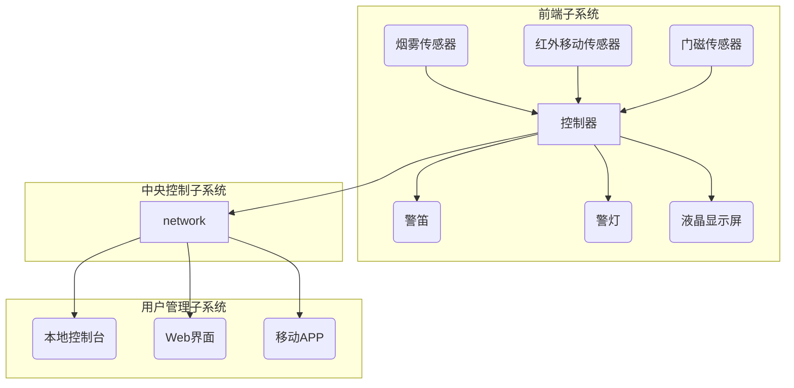
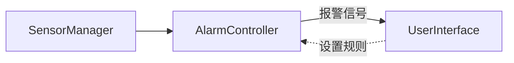

# 报警系统详细设计与具体代码实现

## 1.背景介绍

### 1.1 报警系统概述

报警系统是一种安全监控系统,用于实时监测各种传感器的状态,一旦检测到异常情况(如火灾、入室盗窃等),就会触发相应的报警机制,发出声光警报,并通知相关人员及时采取应对措施。报警系统广泛应用于家庭、商业楼宇、工厂车间等各个领域,对于保护人身财产安全、防患于未然具有重要作用。

### 1.2 报警系统发展历程

早期的报警系统比较简单,主要由若干传感器、控制器和报警器组成。随着科技发展和安全需求的不断增长,报警系统也在不断演进,集成了更多智能化功能,例如:

- 视频监控
- 远程控制与状态查看
- 移动端APP管理
- 云端数据存储与分析
- 人工智能技术应用(如人脸识别、行为分析等)

现代报警系统不仅仅是简单的报警装置,更是一个综合性的安全管理平台。

### 1.3 报警系统设计要求

一个优秀的报警系统设计,需要满足以下几个基本要求:

- 高可靠性:能够24小时稳定运行,准确检测各种安全威胁
- 快速响应:一旦发生紧急情况,能够第一时间触发报警并采取行动
- 易用性强:操作界面友好,普通用户也能快速上手
- 可扩展性好:能够方便地添加新的传感器、报警设备等硬件
- 成本可控:在满足功能需求的前提下,尽量控制整体投入成本

基于以上需求,我们需要进行全面的系统设计,涵盖硬件、软件、网络通信、用户体验等各个方面。

## 2.核心概念与联系

### 2.1 系统架构概览

报警系统整体上可以分为三个核心部分:

1. **前端子系统**:包括各种传感器设备(如烟雾传感器、红外移动传感器、门磁传感器等)和报警设备(如警笛、警灯、液晶显示屏等)。它们是系统的"眼睛"和"嘴巴",负责采集环境信息并发出报警信号。

2. **中央控制子系统**:由一个或多个控制器组成,是整个系统的"大脑"。它接收来自前端传感器的数据,根据预设的规则判断是否存在安全威胁,并发出相应的控制指令,驱动报警设备工作。

3. **用户管理子系统**:提供人机交互界面,允许用户远程查看系统状态、设置报警规则、接收报警信息等。可以是本地控制台界面,也可以是Web界面或移动APP。

这三个子系统通过有线或无线网络相互连接和协同工作,共同构成了完整的报警系统。



### 2.2 核心技术点

实现一个高效智能的报警系统,需要综合应用多种技术,包括但不限于:

- 嵌入式系统开发技术
- 传感器与执行器技术 
- 有线/无线通信技术
- 计算机网络技术
- 云计算与大数据技术
- 人工智能技术

其中,嵌入式系统开发、传感器技术、通信技术是报警系统的基础,决定了系统的实时性、可靠性和稳定性。而云计算、大数据、人工智能等新兴技术,则为报警系统带来了更多智能化功能,提升了系统的威力和附加值。

## 3.核心算法原理具体操作步骤  

### 3.1 数据采集与传输

各种传感器设备将采集到的现场数据(如温度、湿度、烟雾浓度、红外线变化等)通过有线或无线方式传输给控制器。常见的有线传输方式有RS-485、CAN总线等;无线传输可使用ZigBee、Wi-Fi、蓝牙等技术。

在数据传输过程中,需要注意:

1. 数据完整性
2. 数据及时性
3. 抗干扰性
4. 节能省电(对于无线传感器)

可以采用数据校验、纠错编码、加密传输等技术手段,确保数据的可靠传输。

### 3.2 数据处理与状态判断

控制器接收到传感器数据后,需要对这些数据进行解析、处理和分析,并与预设的报警规则进行匹配,判断当前是否处于安全状态。

这个过程可以使用经典的IF-ELSE规则,也可以使用更复杂的算法模型,如决策树、贝叶斯网络等。具体算法的选择取决于实际需求的复杂程度。

以烟雾报警为例,一个基本的判断逻辑如下:

```python
# 获取当前烟雾浓度值
current_smoke_level = sensor.get_smoke_level()

# 判断是否超过报警阈值
if current_smoke_level > ALARM_THRESHOLD:
    # 触发报警流程
    trigger_alarm()
else:
    # 正常状态,无需报警
    pass
```

对于复杂场景,我们可以综合考虑多种传感器数据,使用加权算法进行整体评估。

### 3.3 报警执行与信息传递

一旦判断出当前处于危险状态,控制器就需要立即执行报警动作,包括:

1. 驱动声光报警设备启动,发出警报声音和警示灯光,提醒现场人员
2. 通过网络将报警信息发送至用户管理系统,以便通知相关人员(例如发送短信、推送APP消息等)
3. 同时启动其他辅助设备,如自动喷淋、通风排气等

在报警执行过程中,需要保证响应的快速性和可靠性。报警系统的核心目的就是尽快发现危险并采取行动,以最大限度减小损失。

### 3.4 用户交互与远程控制

用户管理子系统为用户提供了与报警系统交互的渠道,主要功能包括:

- 实时查看系统状态
- 设置报警规则和阈值
- 接收报警信息推送
- 远程控制报警设备
- 查看报警历史记录

用户可以通过本地控制台、Web页面或移动APP与系统连接,实现上述功能。这需要在控制器和用户管理系统之间建立通信机制,例如基于TCP/IP协议的Socket通信。

控制器作为服务器端,持续监听来自远程客户端(控制台/Web/APP)的指令,并进行相应处理。例如,收到"查看系统状态"指令后,控制器就需要读取各传感器的最新数据,并封装成状态报文发送给客户端。

## 4.数学模型和公式详细讲解举例说明

在报警系统中,我们可以使用一些数学模型和公式,对传感器数据进行分析和处理,提高报警的准确性。

### 4.1 时间序列分析

许多传感器数据(如温度、湿度等)会随时间变化而变化,呈现出一定的时间序列模式。我们可以对这些时间序列数据进行分析,发现其中的异常模式,从而提前发现潜在的安全隐患。

最常用的一种时间序列分析方法是**移动平均(Moving Average,MA)**模型。设某个时间点 t 的观测值为 $y_t$,则长度为 n 的移动平均值可以表示为:

$$
\overline{y}_t = \frac{1}{n}\sum_{i=0}^{n-1}y_{t-i}
$$

移动平均可以平滑原始数据序列,消除随机噪声,从而更容易发现真实的数据模式和趋势。

另一种常用方法是**指数加权移动平均(Exponential Weighted Moving Average, EWMA)**模型,它给予最新数据更大的权重:

$$
s_t = \lambda y_t + (1-\lambda)s_{t-1}  \qquad (0<\lambda<1)
$$

其中 $s_t$ 为时间 t 的加权平均值, $\lambda$ 为平滑系数,决定了对最新数据和历史数据的权重分配。

通过设置合理的阈值,如果实际观测值与移动平均值的差距超过一定范围,就可能意味着异常情况的发生,系统需要发出报警信号。

### 4.2 贝叶斯模型

在某些情况下,我们需要根据多个传感器的数据综合判断是否存在安全隐患。这时可以使用贝叶斯模型,将各种证据有机结合,得出最终的判断结果。

假设有 n 个独立的传感器证据 $E_1, E_2, \cdots, E_n$,我们想计算在这些证据存在的条件下,某个事件(如火灾)发生的概率 $P(H|E_1, E_2, \cdots, E_n)$,可以使用贝叶斯公式:

$$
\begin{split}
P(H|E_1,E_2,\cdots,E_n) &= \frac{P(E_1,E_2,\cdots,E_n|H)P(H)}{P(E_1,E_2,\cdots,E_n)} \\
                        &= \alpha P(H)\prod_{i=1}^nP(E_i|H)
\end{split}
$$

其中 $\alpha$ 为归一化常数, $P(H)$ 为事件 H 的先验概率, $P(E_i|H)$ 为在事件 H 发生的条件下,证据 $E_i$ 出现的概率。

通过计算该后验概率值,并与预先设定的阈值进行比较,我们就可以得出是否需要发出报警的结论。

贝叶斯模型的优点是能够很好地融合各种证据,得出综合判断结果。但是,它需要事先已知各个条件概率的值,这在实际应用中可能比较困难。

### 4.3 其他模型

除了以上两种模型外,在报警系统中我们还可以使用其他数学模型和算法,如:

- **聚类算法**:对传感器数据进行聚类分析,发现异常数据点
- **主成分分析(PCA)**:对高维数据进行降维,提取主要特征
- **支持向量机(SVM)**:用于模式识别和异常检测
- **神经网络**:建立传感器数据与报警事件之间的非线性映射关系
- **遗传算法**:自动生成最优化的报警规则集合
- ......

总之,数学建模为报警系统的智能化提供了强有力的理论支持和技术手段。

## 4.项目实践:代码实例和详细解释说明

为了更好地理解报警系统的实现细节,我们来看一个基于Python的项目实践案例。

### 4.1 系统框架

该报警系统由三个主要模块组成:

1. **SensorManager**:管理各种传感器设备,收集现场数据
2. **AlarmController**:作为系统控制中心,接收传感器数据并判断是否需要触发报警
3. **UserInterface**:提供命令行和Web界面,供用户查看状态、设置规则等

系统的基本运行流程为:



### 4.2 SensorManager

SensorManager模拟了多种传感器设备并生成随机数据,由若干Sensor对象组成:

```python
import random

class Sensor:
    def __init__(self, sensor_type, location):
        self.type = sensor_type
        self.location = location
    
    def get_data(self):
        # 根据传感器类型生成模拟数据
        if self.type == 'temperature':
            return random.uniform(15, 35)
        elif self.type == 'smoke':
            return random.uniform(0, 100)
        # 其他传感器类型...

class SensorManager:
    def __init__(self):
        self.sensors = [
            Sensor('temperature', 'living room'),
            Sensor('smoke', 