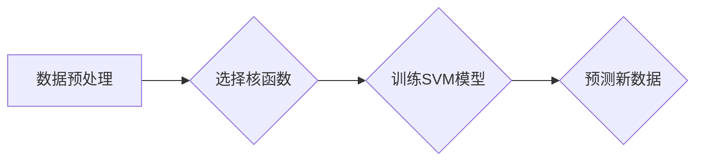

##  支持向量机 (Support Vector Machine)

作者：禅与计算机程序设计艺术

## 1. 背景介绍

### 1.1 从线性分类器到支持向量机

在机器学习领域，分类问题一直占据着举足轻重的地位。从简单的线性回归到复杂的深度神经网络，各种各样的分类算法层出不穷，而支持向量机（Support Vector Machine，简称 SVM）无疑是其中最为经典、应用最为广泛的算法之一。

故事要从线性分类器讲起。假设我们现在有一堆数据点，每个数据点都属于两个类别中的一个，我们的目标是找到一条直线（或超平面），能够将这两类数据点尽可能完美地分开。线性分类器就是为了解决这个问题而生的。它通过学习一个线性函数，将数据点映射到高维空间中，并试图找到一个超平面，使得不同类别的数据点分布在超平面的两侧。

然而，现实世界中的数据往往错综复杂，仅仅依靠线性分类器很难得到令人满意的结果。这是因为线性分类器对于噪声和异常点非常敏感，很容易出现过拟合的现象。为了克服这些问题，SVM 应运而生。

### 1.2 支持向量机的诞生

SVM 的核心思想是找到一个最优的超平面，使得该超平面不仅能够将不同类别的数据点分开，而且还要使得距离超平面最近的数据点（即支持向量）到超平面的距离最大化。这样做的好处是可以提高模型的泛化能力，即使面对新的、未知的数据，SVM 也能表现出良好的分类性能。

### 1.3 支持向量机的优势

相比于其他分类算法，SVM 具有以下几个显著的优势：

* **对高维数据具有很好的处理能力**:  即使面对高维数据，SVM 也能保持较高的分类精度。
* **对噪声和异常点不敏感**: SVM 只关注距离超平面最近的数据点，因此对噪声和异常点具有较强的鲁棒性。
* **泛化能力强**:  SVM 的目标是找到一个最优的超平面，因此具有较强的泛化能力，即使面对新的、未知的数据，也能表现出良好的分类性能。

## 2. 核心概念与联系

### 2.1 超平面

在几何中，超平面是指比所在空间维度少一个维度的一个子空间。例如，在二维平面中，超平面就是一条直线；在三维空间中，超平面就是一个平面。在机器学习中，超平面通常用来对数据进行分类。

### 2.2 支持向量

支持向量是指距离超平面最近的数据点。这些数据点对于确定超平面的位置至关重要。

### 2.3 间隙

间隙是指两个平行超平面之间的距离。在 SVM 中，我们希望找到一个间隙最大的超平面，以便最大化模型的泛化能力。

### 2.4 核函数

核函数是一种将低维空间中的数据映射到高维空间的方法。通过使用核函数，我们可以将线性不可分的数据转换为线性可分的数据。

## 3. 核心算法原理具体操作步骤

### 3.1 线性可分情况

对于线性可分的情况，SVM 的目标是找到一个超平面 $w^T x + b = 0$，使得该超平面能够将不同类别的数据点分开，并且使得距离超平面最近的数据点到超平面的距离最大化。

我们可以将这个问题转化为一个优化问题：

$$
\begin{aligned}
& \min_{w, b} \frac{1}{2} ||w||^2 \\
& \text{s.t.} \quad y_i (w^T x_i + b) \ge 1, \quad i = 1, 2, ..., m
\end{aligned}
$$

其中，$x_i$ 表示第 $i$ 个数据点，$y_i$ 表示第 $i$ 个数据点的类别标签（+1 或 -1），$w$ 表示超平面的法向量，$b$ 表示超平面的截距。

### 3.2 线性不可分情况

对于线性不可分的情况，我们可以使用核函数将数据映射到高维空间中，使其在高维空间中线性可分。

常用的核函数有：

* **线性核函数**: $K(x_i, x_j) = x_i^T x_j$
* **多项式核函数**: $K(x_i, x_j) = (x_i^T x_j + c)^d$
* **高斯核函数**: $K(x_i, x_j) = \exp(-\frac{||x_i - x_j||^2}{2\sigma^2})$

使用核函数后，优化问题变为：

$$
\begin{aligned}
& \min_{\alpha} \frac{1}{2} \sum_{i=1}^m \sum_{j=1}^m \alpha_i \alpha_j y_i y_j K(x_i, x_j) - \sum_{i=1}^m \alpha_i \\
& \text{s.t.} \quad 0 \le \alpha_i \le C, \quad i = 1, 2, ..., m \\
& \qquad \sum_{i=1}^m \alpha_i y_i = 0
\end{aligned}
$$

其中，$\alpha_i$ 是拉格朗日乘子，$C$ 是惩罚系数。

## 4. 数学模型和公式详细讲解举例说明

### 4.1 拉格朗日乘子法

拉格朗日乘子法是一种用于求解带约束条件的优化问题的方法。

对于一个带约束条件的优化问题：

$$
\begin{aligned}
& \min_{x} f(x) \\
& \text{s.t.} \quad g_i(x) \le 0, \quad i = 1, 2, ..., m \\
& \qquad h_j(x) = 0, \quad j = 1, 2, ..., l
\end{aligned}
$$

我们可以引入拉格朗日乘子 $\lambda_i$ 和 $\mu_j$，构造拉格朗日函数：

$$
L(x, \lambda, \mu) = f(x) + \sum_{i=1}^m \lambda_i g_i(x) + \sum_{j=1}^l \mu_j h_j(x)
$$

然后，我们可以通过求解拉格朗日函数的鞍点来求解原优化问题。

### 4.2 对偶问题

对于一个优化问题，我们可以通过引入拉格朗日乘子，将其转化为一个等价的对偶问题。

对于 SVM 的优化问题，其对偶问题为：

$$
\begin{aligned}
& \max_{\alpha} \sum_{i=1}^m \alpha_i - \frac{1}{2} \sum_{i=1}^m \sum_{j=1}^m \alpha_i \alpha_j y_i y_j x_i^T x_j \\
& \text{s.t.} \quad 0 \le \alpha_i \le C, \quad i = 1, 2, ..., m \\
& \qquad \sum_{i=1}^m \alpha_i y_i = 0
\end{aligned}
$$

### 4.3 KKT 条件

KKT 条件是拉格朗日乘子法的一个重要定理，它给出了优化问题解的必要条件。

对于 SVM 的优化问题，其 KKT 条件为：

$$
\begin{aligned}
& \alpha_i = 0 \quad \Rightarrow \quad y_i (w^T x_i + b) \ge 1 \\
& 0 < \alpha_i < C \quad \Rightarrow \quad y_i (w^T x_i + b) = 1 \\
& \alpha_i = C \quad \Rightarrow \quad y_i (w^T x_i + b) \le 1
\end{aligned}
$$

## 5. 项目实践：代码实例和详细解释说明

```python
import numpy as np
from sklearn import datasets
from sklearn.model_selection import train_test_split
from sklearn.svm import SVC
from sklearn.metrics import accuracy_score

# 加载数据集
iris = datasets.load_iris()
X = iris.data
y = iris.target

# 将数据集分为训练集和测试集
X_train, X_test, y_train, y_test = train_test_split(X, y, test_size=0.3)

# 创建 SVM 模型
svm = SVC(kernel='linear', C=1)

# 训练模型
svm.fit(X_train, y_train)

# 预测测试集
y_pred = svm.predict(X_test)

# 计算准确率
accuracy = accuracy_score(y_test, y_pred)
print("Accuracy:", accuracy)
```

代码解释：

* 首先，我们加载了 iris 数据集，并将其分为训练集和测试集。
* 然后，我们创建了一个 SVM 模型，并指定了核函数为线性核函数，惩罚系数为 1。
* 接下来，我们使用训练集训练了 SVM 模型。
* 最后，我们使用测试集评估了模型的性能，并计算了准确率。

## 6. 实际应用场景

SVM 是一种应用广泛的机器学习算法，可以用于解决各种分类问题，例如：

* **文本分类**:  将文本数据分类到不同的类别，例如垃圾邮件过滤、情感分析等。
* **图像识别**:  识别图像中的物体，例如人脸识别、车牌识别等。
* **生物信息学**:  分析生物数据，例如基因序列分析、蛋白质结构预测等。

## 7. 工具和资源推荐

* **scikit-learn**: Python 中的机器学习库，提供了 SVM 的实现。
* **LIBSVM**:  一个开源的 SVM 库，提供了多种语言的接口。
* **SVMlight**:  另一个开源的 SVM 库，以其速度和效率著称。

## 8. 总结：未来发展趋势与挑战

### 8.1 未来发展趋势

* **大规模数据**:  随着数据量的不断增长，如何高效地训练 SVM 模型是一个重要的研究方向。
* **多核学习**:  将多个核函数组合起来，可以提高 SVM 模型的性能。
* **深度学习**:  将 SVM 与深度学习相结合，可以构建更加强大的分类模型。

### 8.2 面临的挑战

* **参数选择**:  SVM 模型的性能对参数的选择非常敏感，如何自动选择最优的参数是一个挑战。
* **核函数选择**:  不同的核函数适用于不同的数据分布，如何选择合适的核函数也是一个挑战。
* **可解释性**:  SVM 模型是一个黑盒模型，如何解释其预测结果是一个挑战。

## 9. 附录：常见问题与解答

### 9.1 什么是支持向量？

支持向量是指距离超平面最近的数据点。这些数据点对于确定超平面的位置至关重要。

### 9.2 什么是核函数？

核函数是一种将低维空间中的数据映射到高维空间的方法。通过使用核函数，我们可以将线性不可分的数据转换为线性可分的数据。

### 9.3 如何选择 SVM 的参数？

SVM 模型的性能对参数的选择非常敏感。通常，我们可以使用交叉验证的方法来选择最优的参数。

### 9.4 SVM 和逻辑回归有什么区别？

SVM 和逻辑回归都是常用的分类算法，但它们之间有一些区别：

* SVM 的目标是找到一个最优的超平面，而逻辑回归的目标是找到一个最优的决策边界。
* SVM 对噪声和异常点不敏感，而逻辑回归对噪声和异常点比较敏感。
* SVM 可以使用核函数将数据映射到高维空间中，而逻辑回归不能。


## 10. Mermaid流程图



**图解：**

1. 首先，我们需要对数据进行预处理，例如数据清洗、特征缩放等。
2. 然后，我们需要选择一个合适的核函数，将数据映射到高维空间中。
3. 接下来，我们可以使用训练数据训练 SVM 模型。
4. 最后，我们可以使用训练好的 SVM 模型预测新数据。
