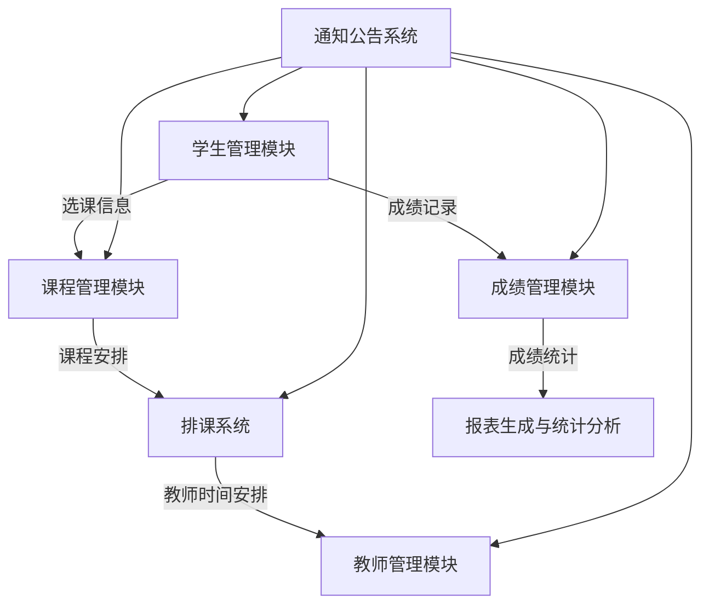

# 教务信息管理系统详细设计与具体代码实现

作者：禅与计算机程序设计艺术

## 1. 背景介绍

### 1.1 教务信息管理系统的意义

教务信息管理系统（Academic Information Management System, AIMS）在现代教育机构中扮演着至关重要的角色。它不仅简化了教务管理的流程，还提高了数据的准确性和处理效率。通过使用AIMS，学校可以更好地管理学生信息、课程安排、成绩记录以及教师资源，从而提升整体教学质量和管理水平。

### 1.2 发展历程与现状

随着信息技术的不断发展，教务信息管理系统经历了从手工管理到电子化管理，再到智能化管理的演变。早期的教务管理主要依赖纸质文件和手工记录，效率低下且易出错。随着计算机技术的普及，电子化管理逐渐成为主流，使用数据库和管理软件来处理教务信息。近年来，随着人工智能和大数据技术的兴起，智能化教务管理系统开始出现，能够提供更加智能和自动化的服务。

### 1.3 本文目的

本文旨在详细介绍教务信息管理系统的设计与实现过程，涵盖系统的核心概念、算法原理、数学模型、项目实践、实际应用场景、工具和资源推荐等内容。通过本文，读者将全面了解如何设计和实现一个高效的教务信息管理系统，并掌握相关的技术细节和最佳实践。

## 2. 核心概念与联系

### 2.1 教务信息管理系统的组成部分

一个完整的教务信息管理系统通常由以下几个主要模块组成：

- 学生管理模块
- 课程管理模块
- 成绩管理模块
- 教师管理模块
- 排课系统
- 通知公告系统
- 报表生成与统计分析

### 2.2 各模块之间的关系

这些模块之间存在紧密的联系和交互。例如，学生管理模块需要与课程管理模块和成绩管理模块进行数据交互，以便记录学生的选课信息和成绩情况。排课系统需要综合考虑教师管理模块和课程管理模块的数据，以合理安排课程时间和地点。通知公告系统则需要与所有模块进行交互，以便及时发布相关信息。

以下是系统各模块之间的关系图：



### 2.3 数据库设计与数据模型

教务信息管理系统的数据存储和管理是系统设计的核心。一个合理的数据库设计可以极大地提升系统的效率和稳定性。通常情况下，系统会使用关系型数据库来存储数据，并设计合理的表结构和关系。

以下是一个简单的数据库设计示例：

- 学生表（Students）：保存学生的基本信息（学号、姓名、性别、出生日期等）
- 课程表（Courses）：保存课程的基本信息（课程编号、课程名称、学分、课程描述等）
- 教师表（Teachers）：保存教师的基本信息（教师编号、姓名、职称、联系方式等）
- 成绩表（Grades）：保存学生的成绩信息（学号、课程编号、成绩等）
- 选课表（Enrollments）：保存学生的选课信息（学号、课程编号、选课时间等）

## 3. 核心算法原理具体操作步骤

### 3.1 排课算法

排课算法是教务信息管理系统中的关键算法之一。它需要综合考虑教师的时间安排、教室的使用情况、课程的冲突等多种因素，以合理安排课程的时间和地点。常见的排课算法包括贪心算法、遗传算法和模拟退火算法等。

### 3.2 成绩统计与分析算法

成绩统计与分析是教务信息管理系统的重要功能之一。通过对学生成绩数据的统计分析，可以帮助学校了解学生的学习情况和教学效果。常见的成绩统计与分析算法包括均值计算、标准差计算、回归分析等。

### 3.3 数据安全与隐私保护算法

在教务信息管理系统中，数据的安全与隐私保护至关重要。常见的数据安全与隐私保护算法包括数据加密算法（如AES、RSA）、访问控制算法（如RBAC）和数据脱敏算法等。

## 4. 数学模型和公式详细讲解举例说明

### 4.1 排课问题的数学模型

排课问题可以抽象为一个组合优化问题，其目标是找到一个最佳的课程安排方案，使得所有约束条件（如教师时间、教室使用、课程冲突等）都得到满足，同时优化某些目标（如最小化课程冲突、最大化教室利用率等）。

假设有 $n$ 门课程，$m$ 位教师，$k$ 间教室，我们可以定义以下变量：

- $x_{ijk}$：表示课程 $i$ 在时间段 $j$ 使用教室 $k$ 的安排情况。若 $x_{ijk} = 1$，则表示课程 $i$ 在时间段 $j$ 使用教室 $k$；否则 $x_{ijk} = 0$。

目标函数可以表示为：

$$
\min \sum_{i=1}^{n} \sum_{j=1}^{T} \sum_{k=1}^{k} C_{ijk} x_{ijk}
$$

其中，$C_{ijk}$ 表示课程 $i$ 在时间段 $j$ 使用教室 $k$ 的冲突代价。

约束条件可以表示为：

$$
\sum_{j=1}^{T} \sum_{k=1}^{k} x_{ijk} = 1 \quad \forall i \in \{1, \ldots, n\}
$$

$$
\sum_{i=1}^{n} x_{ijk} \leq 1 \quad \forall j \in \{1, \ldots, T\}, \forall k \in \{1, \ldots, k\}
$$

$$
x_{ijk} \in \{0, 1\} \quad \forall i \in \{1, \ldots, n\}, \forall j \in \{1, \ldots, T\}, \forall k \in \{1, \ldots, k\}
$$

### 4.2 成绩统计的数学公式

常见的成绩统计指标包括均值、标准差和回归分析等。假设有 $n$ 个学生的成绩数据 $\{x_1, x_2, \ldots, x_n\}$，其均值和标准差可以分别表示为：

$$
\mu = \frac{1}{n} \sum_{i=1}^{n} x_i
$$

$$
\sigma = \sqrt{\frac{1}{n} \sum_{i=1}^{n} (x_i - \mu)^2}
$$

回归分析可以用于分析成绩与其他变量（如学习时间、出勤率等）之间的关系。假设我们有一组数据 $(x_1, y_1), (x_2, y_2), \ldots, (x_n, y_n)$，其中 $x_i$ 表示自变量，$y_i$ 表示因变量。线性回归模型可以表示为：

$$
y = \beta_0 + \beta_1 x + \epsilon
$$

其中，$\beta_0$ 和 $\beta_1$ 是回归系数，$\epsilon$ 是误差项。回归系数可以通过最小二乘法估计：

$$
\hat{\beta}_1 = \frac{\sum_{i=1}^{n} (x_i - \bar{x})(y_i - \bar{y})}{\sum_{i=1}^{n} (x_i - \bar{x})^2}
$$

$$
\hat{\beta}_0 = \bar{y} - \hat{\beta}_1 \bar{x}
$$

## 5. 项目实践：代码实例和详细解释说明

### 5.1 环境搭建

在开始项目实践之前，我们需要搭建开发环境。本文将使用Python语言和Django框架来实现教务信息管理系统。

#### 5.1.1 安装Python和Django

首先，安装Python和Django：

```bash
# 安装Python
sudo apt-get update
sudo apt-get install python3

# 安装Django
pip install django
```

#### 5.1.2 创建Django项目

接下来，创建一个新的Django项目：

```bash
django-admin startproject AIMS
cd AIMS
```

#### 5.1.3 创建应用

在D