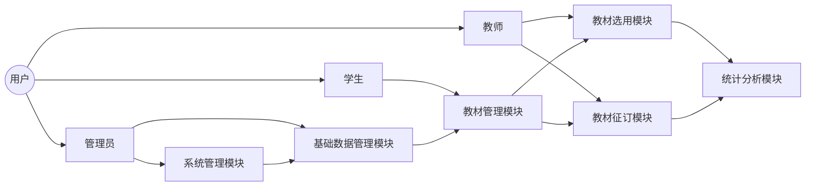

## 教材管理系统详细设计与具体代码实现

作者：禅与计算机程序设计艺术

## 1. 背景介绍

### 1.1 教材管理现状与挑战

随着信息技术的快速发展和教育信息化的不断推进，高校教材管理工作面临着新的机遇和挑战。传统的教材管理模式存在着效率低下、信息不透明、统计分析困难等问题，已经难以适应现代高校教学管理的需求。

### 1.2 教材管理系统建设目标

为了解决上述问题，提高教材管理效率和服务水平，构建一个功能完善、安全可靠、易于维护的教材管理系统势在必行。该系统应具备以下目标：

* **提高工作效率:**  实现教材信息自动化管理，减少人工操作，提高工作效率。
* **提升数据准确性:**  保证教材信息的准确性、完整性和一致性，为教学管理提供可靠的数据支持。
* **增强服务水平:**  为教师和学生提供便捷的教材查询、选用、订购等服务，提升用户满意度。
* **实现数据分析:**  对教材相关数据进行统计分析，为教学管理决策提供数据支撑。

### 1.3 本文研究内容

本文将详细介绍一个基于Web的高校教材管理系统的详细设计与具体代码实现，涵盖系统需求分析、系统设计、数据库设计、功能模块实现、系统测试等方面。并结合实际应用场景，探讨该系统在高校教材管理中的应用价值和未来发展趋势。

## 2. 核心概念与联系

### 2.1 系统用户角色

* **管理员:** 负责系统管理、用户管理、权限管理、数据维护等工作。
* **教师:**  负责教材选用、教材申报、教材征订等工作。
* **学生:**  负责教材查询、教材订购等工作。

### 2.2 系统功能模块

* **系统管理模块:** 包括用户管理、角色管理、权限管理、系统日志等功能。
* **基础数据管理模块:** 包括教材类别管理、出版社管理、课程管理等功能。
* **教材管理模块:** 包括教材信息管理、教材入库管理、教材出库管理、库存查询等功能。
* **教材选用模块:** 包括教材选用计划制定、教材选用申请、教材选用审核等功能。
* **教材征订模块:** 包括教材征订计划制定、教材征订申请、教材征订审核等功能。
* **统计分析模块:**  提供各种教材相关数据的统计分析报表，如教材库存报表、教材征订报表等。

### 2.3  系统核心概念联系图



## 3. 核心算法原理具体操作步骤

本系统核心算法主要体现在教材库存管理、教材选用推荐、教材征订计划制定等方面。

### 3.1 教材库存管理算法

教材库存管理采用先进先出(FIFO)的原则，即先入库的教材先出库。具体操作步骤如下：

1.  **入库操作:**  当新教材入库时，系统自动将新教材添加到库存列表的末尾。
2.  **出库操作:**  当需要出库教材时，系统从库存列表的头部开始查找符合条件的教材，并将找到的教材从库存列表中移除。
3.  **库存预警:**  当某种教材的库存数量低于预警值时，系统自动发出预警信息，提醒管理员及时补充库存。

### 3.2 教材选用推荐算法

教材选用推荐算法采用基于内容的推荐算法，根据教师所授课程、历史选用教材等信息，推荐相关度较高的教材。具体操作步骤如下：

1.  **构建教材特征向量:**  对每本教材提取关键词、主题词等特征，构建教材特征向量。
2.  **计算教材相似度:**  根据教材特征向量，计算两本教材之间的相似度。
3.  **生成推荐列表:**  根据教师所授课程、历史选用教材等信息，查找与之相似度较高的教材，生成推荐列表。

### 3.3 教材征订计划制定算法

教材征订计划制定算法采用基于预测的算法，根据历史教材使用情况、学生人数等信息，预测未来学期的教材需求量，制定教材征订计划。具体操作步骤如下：

1.  **收集历史数据:**  收集历史学期的教材使用情况、学生人数等数据。
2.  **建立预测模型:**  根据历史数据，建立教材需求量预测模型。
3.  **预测未来需求:**  根据预测模型，预测未来学期的教材需求量。
4.  **制定征订计划:**  根据预测的教材需求量，制定教材征订计划。

## 4. 数学模型和公式详细讲解举例说明

### 4.1 教材库存管理模型

教材库存管理模型可以使用队列来表示，教材入库操作对应队列的入队操作，教材出库操作对应队列的出队操作。

**队列定义:**

```
Queue<Textbook> textbookQueue = new LinkedList<>();
```

**入库操作:**

```java
textbookQueue.offer(newTextbook);
```

**出库操作:**

```java
Textbook textbook = textbookQueue.poll();
```

### 4.2 教材选用推荐模型

教材选用推荐模型可以使用余弦相似度来计算两本教材之间的相似度。

**余弦相似度公式:**

$$
similarity(A,B) = \frac{A \cdot B}{||A|| \times ||B||} = \frac{\sum_{i=1}^{n} A_i \times B_i}{\sqrt{\sum_{i=1}^{n} A_i^2} \times \sqrt{\sum_{i=1}^{n} B_i^2}}
$$

其中，$A$ 和 $B$ 分别表示两本教材的特征向量，$n$ 表示特征向量的维度。

**示例:**

假设有两本教材 A 和 B，它们的特征向量分别为:

*   A: (0.8, 0.6, 0.0)
*   B: (0.7, 0.5, 0.2)

则两本教材之间的相似度为:

```
similarity(A,B) = (0.8*0.7 + 0.6*0.5 + 0.0*0.2) / (sqrt(0.8^2 + 0.6^2 + 0.0^2) * sqrt(0.7^2 + 0.5^2 + 0.2^2)) = 0.96
```

### 4.3 教材征订计划制定模型

教材征订计划制定模型可以使用线性回归模型来预测未来学期的教材需求量。

**线性回归模型公式:**

$$
y = \beta_0 + \beta_1 x_1 + \beta_2 x_2 + ... + \beta_n x_n
$$

其中，$y$ 表示教材需求量，$x_1, x_2, ..., x_n$ 表示影响教材需求量的因素，例如历史教材使用情况、学生人数等，$\beta_0, \beta_1, \beta_2, ..., \beta_n$ 表示模型参数。

**示例:**

假设影响教材需求量的因素有两个：历史教材使用量和学生人数，历史数据如下表所示:

| 学期 | 历史教材使用量 | 学生人数 | 教材需求量 |
| :---: | :------------: | :------: | :--------: |
|   1   |      1000      |   200    |    1200    |
|   2   |      1200      |   220    |    1400    |
|   3   |      1400      |   250    |    1600    |

使用线性回归模型拟合上述数据，得到模型参数为:

*   $\beta_0 = 100$
*   $\beta_1 = 0.8$
*   $\beta_2 = 2$

则预测未来学期教材需求量的公式为:

```
y = 100 + 0.8 * 历史教材使用量 + 2 * 学生人数
```

例如，如果预测未来学期历史教材使用量为 1600，学生人数为 280，则预测教材需求量为:

```
y = 100 + 0.8 * 1600 + 2 * 280 = 2020
```

## 5. 项目实践：代码实例和详细解释说明

### 5.1 技术选型

* **开发语言:**  Java
* **开发框架:**  Spring Boot
* **数据库:**  MySQL
* **前端框架:**  Vue.js
* **缓存:**  Redis

### 5.2 代码实例

**教材实体类:**

```java
@Entity
@Table(name = "textbook")
public class Textbook {

    @Id
    @GeneratedValue(strategy = GenerationType.IDENTITY)
    private Long id;

    @Column(nullable = false)
    private String name;

    @Column(nullable = false)
    private String author;

    @Column(nullable = false)
    private String isbn;

    @Column(nullable = false)
    private Double price;

    @ManyToOne
    @JoinColumn(name = "category_id")
    private Category category;

    @ManyToOne
    @JoinColumn(name = "publisher_id")
    private Publisher publisher;

    // 省略 getter 和 setter 方法
}
```

**教材服务层接口:**

```java
public interface TextbookService {

    List<Textbook> findAll();

    Textbook findById(Long id);

    Textbook save(Textbook textbook);

    void deleteById(Long id);
}
```

**教材服务层实现类:**

```java
@Service
public class TextbookServiceImpl implements TextbookService {

    @Autowired
    private TextbookRepository textbookRepository;

    @Override
    public List<Textbook> findAll() {
        return textbookRepository.findAll();
    }

    @Override
    public Textbook findById(Long id) {
        return textbookRepository.findById(id)
                .orElseThrow(() -> new EntityNotFoundException("Textbook not found with id: " + id));
    }

    @Override
    public Textbook save(Textbook textbook) {
        return textbookRepository.save(textbook);
    }

    @Override
    public void deleteById(Long id) {
        textbookRepository.deleteById(id);
    }
}
```

### 5.3 代码解释

*   **教材实体类:** 定义了教材的基本信息，包括教材名称、作者、ISBN、价格、所属类别、所属出版社等。
*   **教材服务层接口:** 定义了教材服务的接口，包括查询所有教材、根据 ID 查询教材、保存教材、删除教材等。
*   **教材服务层实现类:** 实现了教材服务的接口，使用 Spring Data JPA 操作数据库。

## 6. 实际应用场景

该教材管理系统可以应用于各种类型的高校，例如：

*   **综合性大学:** 可以管理全校各个学院的教材信息，为全校师生提供教材服务。
*   **理工科大学:** 可以重点管理理工科专业的教材信息，为理工科师生提供更精准的教材服务。
*   **文科大学:** 可以重点管理文科专业的教材信息，为文科师生提供更精准的教材服务。

## 7. 工具和资源推荐

### 7.1 开发工具

*   IntelliJ IDEA: 一款功能强大的 Java 集成开发环境。
*   Visual Studio Code: 一款轻量级的代码编辑器，支持多种编程语言。
*   Navicat for MySQL: 一款 MySQL 数据库管理工具。
*   Postman: 一款 API 测试工具。

### 7.2 学习资源

*   Spring Boot 官方文档: https://spring.io/projects/spring-boot
*   Vue.js 官方文档: https://vuejs.org/
*   MySQL 官方文档: https://dev.mysql.com/doc/

## 8. 总结：未来发展趋势与挑战

### 8.1 未来发展趋势

*   **智能化:**  利用人工智能技术，实现教材选用推荐、教材征订计划制定等功能的智能化。
*   **移动化:**  开发移动端应用程序，方便师生随时随地进行教材相关操作。
*   **数据分析:**  加强数据分析功能，为教学管理决策提供更精准的数据支撑。

### 8.2 面临挑战

*   **数据安全:**  教材管理系统涉及到大量的敏感信息，需要加强数据安全防护措施。
*   **系统性能:**  随着数据量的不断增大，需要不断优化系统性能，保证系统稳定运行。
*   **用户体验:**  需要不断提升用户体验，提高用户满意度。

## 9. 附录：常见问题与解答

### 9.1 如何添加新教材？

1.  登录系统，进入教材管理模块。
2.  点击“添加教材”按钮。
3.  填写教材的基本信息，包括教材名称、作者、ISBN、价格、所属类别、所属出版社等。
4.  点击“保存”按钮。

### 9.2 如何修改教材信息？

1.  登录系统，进入教材管理模块。
2.  找到需要修改的教材，点击“编辑”按钮。
3.  修改教材信息。
4.  点击“保存”按钮。

### 9.3 如何删除教材？

1.  登录系统，进入教材管理模块。
2.  找到需要删除的教材，点击“删除”按钮。
3.  在弹出的确认框中点击“确定”。