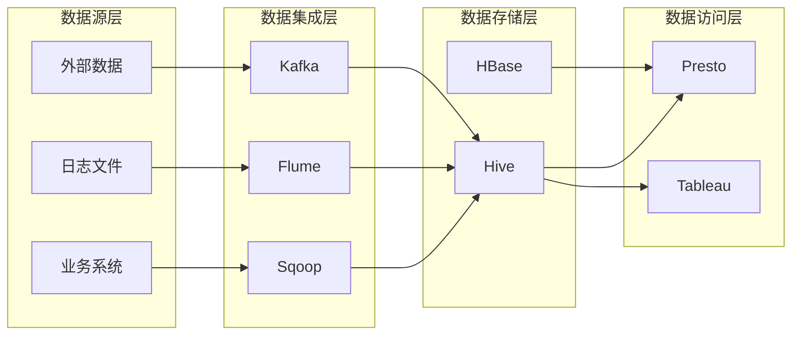

## 1. 背景介绍

### 1.1 数据仓库的起源与发展

随着信息技术的飞速发展，企业积累的数据量呈爆炸式增长。传统的数据库系统难以满足企业对海量数据的存储、管理和分析需求。为了解决这一问题，数据仓库（Data Warehouse）应运而生。

数据仓库的概念最早由Inmon于20世纪80年代提出，其定义为“面向主题的、集成的、相对稳定的、反映历史变化的数据集合，用于支持管理决策”。数据仓库技术经历了从简单到复杂、从单一到融合的发展历程，主要发展阶段如下：

* **第一阶段（20世纪80年代-90年代初）：** 以关系型数据库管理系统（RDBMS）为基础，构建面向主题的数据仓库，主要用于报表分析和决策支持。
* **第二阶段（20世纪90年代中期-21世纪初）：** 随着数据量的不断增加，出现多维数据库（MOLAP）、关系型在线分析处理（ROLAP）等技术，提高了数据仓库的查询性能。
* **第三阶段（21世纪初至今）：**  大数据技术的兴起，数据仓库架构向分布式、云化方向发展，Hadoop、Spark等大数据平台成为构建数据仓库的重要基础设施。

### 1.2 数据仓库的定义和特点

数据仓库是一个面向主题的、集成的、非易失的、随时间变化的数据集合，用于支持管理决策。其主要特点包括：

* **面向主题：**  数据仓库中的数据围绕企业特定的业务主题组织，例如客户、产品、销售等。
* **集成：** 数据仓库整合来自不同数据源的数据，消除数据孤岛，提供统一的数据视图。
* **非易失：** 数据仓库中的数据通常是历史数据，不会被修改或删除，保证数据的完整性和一致性。
* **随时间变化：**  数据仓库中的数据会随着时间的推移不断积累和更新，反映数据的历史变化趋势。

### 1.3 数据仓库的优势

* **提高数据质量和一致性：** 数据仓库通过数据清洗、转换和集成，提高了数据的质量和一致性，为企业提供可靠的数据基础。
* **支持复杂查询和分析：** 数据仓库采用多维数据模型，支持复杂查询和分析，帮助企业深入挖掘数据价值。
* **提高决策效率：** 数据仓库为企业提供及时、准确的数据支持，帮助企业做出更明智的决策。
* **优化业务流程：**  通过数据分析，企业可以识别业务瓶颈，优化业务流程，提高效率。

## 2. 核心概念与联系

### 2.1 数据仓库架构

数据仓库的架构通常采用分层架构，主要包括以下几层：

#### 2.1.1 数据源层

数据源层是数据仓库的数据来源，包括企业内部的业务系统、外部数据源以及传感器等。

#### 2.1.2 数据集成层

数据集成层负责从各个数据源获取数据，并对数据进行清洗、转换和集成，最终将数据加载到数据仓库中。

#### 2.1.3 数据存储层

数据存储层是数据仓库的核心，负责存储数据仓库中的数据。数据存储层可以使用关系型数据库、NoSQL数据库、 Hadoop分布式文件系统（HDFS）等技术。

#### 2.1.4 数据访问层

数据访问层提供用户访问数据仓库的接口，用户可以通过查询工具、报表工具、数据挖掘工具等访问数据仓库中的数据。

### 2.2 数据模型

数据仓库中常用的数据模型包括：

#### 2.2.1 星型模型

星型模型由一个事实表和多个维度表组成，事实表存储业务度量数据，维度表存储维度信息。星型模型结构简单，查询效率高，适用于报表分析和OLAP查询。

#### 2.2.2 雪花模型

雪花模型是对星型模型的扩展，将维度表进一步规范化，减少数据冗余。雪花模型查询效率低于星型模型，但数据一致性更好。

#### 2.2.3 星座模型

星座模型由多个事实表和多个维度表组成，适用于复杂的业务场景。

### 2.3 ETL过程

ETL（Extract, Transform, Load）是数据仓库建设的核心环节，包括数据抽取、数据转换和数据加载三个步骤。

#### 2.3.1 数据抽取

数据抽取是指从各个数据源获取数据，并将数据转换为数据仓库可以识别的格式。

#### 2.3.2 数据转换

数据转换是指对数据进行清洗、转换、集成等操作，将数据转换为符合数据仓库数据模型的格式。

#### 2.3.3 数据加载

数据加载是指将转换后的数据加载到数据仓库中。

## 3. 核心算法原理具体操作步骤

### 3.1 数据清洗

数据清洗是指识别和处理数据中的错误、不一致和缺失值，以提高数据质量。常用的数据清洗方法包括：

#### 3.1.1 数据去重

数据去重是指识别和删除数据集中重复的记录。

#### 3.1.2 数据格式转换

数据格式转换是指将数据从一种格式转换为另一种格式，例如将日期格式从“yyyy-MM-dd”转换为“MM/dd/yyyy”。

#### 3.1.3 缺失值处理

缺失值处理是指处理数据集中缺失的值，常用的方法包括删除缺失值、用平均值或中位数填充缺失值等。

### 3.2 数据转换

数据转换是指将数据从一种结构转换为另一种结构，以满足数据仓库数据模型的要求。常用的数据转换方法包括：

#### 3.2.1 数据规范化

数据规范化是指将数据分解成多个表，以减少数据冗余，提高数据一致性。

#### 3.2.2 数据聚合

数据聚合是指将多个记录合并成一个记录，例如将每天的销售数据聚合成每月的销售数据。

#### 3.2.3 数据派生

数据派生是指根据现有数据生成新的数据，例如根据客户的出生日期计算客户的年龄。

### 3.3 数据加载

数据加载是指将转换后的数据加载到数据仓库中。数据加载的方式取决于数据仓库的类型和数据量，常用的数据加载方式包括：

#### 3.3.1 全量加载

全量加载是指每次加载所有数据，适用于数据量较小的场景。

#### 3.3.2 增量加载

增量加载是指只加载自上次加载以来新增或修改的数据，适用于数据量较大的场景。

## 4. 数学模型和公式详细讲解举例说明

数据仓库中常用的数学模型和公式包括：

### 4.1 聚合函数

聚合函数用于对一组值进行计算，并返回一个单一的值。常用的聚合函数包括：

* **SUM(表达式)：** 返回表达式中所有值的总和。
* **AVG(表达式)：** 返回表达式中所有值的平均值。
* **COUNT(表达式)：** 返回表达式中非空值的个数。
* **MAX(表达式)：** 返回表达式中的最大值。
* **MIN(表达式)：** 返回表达式中的最小值。

**举例：**

假设有一个销售数据表，包含以下字段：

| 订单号 | 商品名称 | 销售数量 | 销售金额 |
|---|---|---|---|
| 1001 | 苹果 | 10 | 100 |
| 1002 | 香蕉 | 5 | 50 |
| 1003 | 苹果 | 20 | 200 |

可以使用以下SQL语句计算苹果的总销售数量：

```sql
SELECT SUM(销售数量)
FROM 销售数据表
WHERE 商品名称 = '苹果';
```

### 4.2 窗口函数

窗口函数用于对一组行执行计算，并为每一行返回一个值。窗口函数可以用于计算移动平均值、排名等。常用的窗口函数包括：

* **ROW_NUMBER()：**  为分区中的每一行分配一个唯一的行号。
* **RANK()：**  根据指定列的值对行进行排名。
* **DENSE_RANK()：** 类似于RANK()函数，但排名中不存在空隙。
* **LAG(表达式,偏移量)：** 返回当前行之前指定偏移量的行的表达式的值。
* **LEAD(表达式,偏移量)：** 返回当前行之后指定偏移量的行的表达式的值。

**举例：**

假设有一个股票价格表，包含以下字段：

| 日期 | 股票代码 | 收盘价 |
|---|---|---|
| 2023-05-01 | AAPL | 170 |
| 2023-05-02 | AAPL | 175 |
| 2023-05-03 | AAPL | 172 |
| 2023-05-01 | GOOG | 2500 |
| 2023-05-02 | GOOG | 2550 |
| 2023-05-03 | GOOG | 2520 |

可以使用以下SQL语句计算每只股票的3日移动平均收盘价：

```sql
SELECT
    日期,
    股票代码,
    收盘价,
    AVG(收盘价) OVER (PARTITION BY 股票代码 ORDER BY 日期 ASC ROWS BETWEEN 2 PRECEDING AND CURRENT ROW) AS 移动平均收盘价
FROM 股票价格表;
```

## 5. 项目实践：代码实例和详细解释说明

### 5.1 数据仓库项目架构

本项目使用以下架构构建数据仓库：



* **数据源层：**  数据源包括业务系统、日志文件和外部数据。
* **数据集成层：** 使用Sqoop将业务系统数据导入Hive，使用Flume收集日志文件数据并写入Kafka，使用Kafka Connect将外部数据导入Kafka。
* **数据存储层：**  使用Hive存储结构化数据，使用HBase存储半结构化和非结构化数据。
* **数据访问层：**  使用Presto进行交互式查询，使用Tableau进行数据可视化。

### 5.2 代码实例

#### 5.2.1 使用Sqoop将MySQL数据导入Hive

```bash
sqoop import \
  --connect jdbc:mysql://mysql_host:3306/mysql_database \
  --username mysql_user \
  --password mysql_password \
  --table mysql_table \
  --hive-import \
  --hive-table hive_database.hive_table \
  --hive-overwrite
```

#### 5.2.2 使用Flume收集日志文件数据并写入Kafka

```properties
# flume配置文件
agent.sources = source1
agent.sinks = sink1
agent.channels = channel1

# 数据源配置
agent.sources.source1.type = exec
agent.sources.source1.command = tail -F /var/log/messages

# 通道配置
agent.channels.channel1.type = memory
agent.channels.channel1.capacity = 10000

# 接收器配置
agent.sinks.sink1.type = org.apache.flume.sink.kafka.KafkaSink
agent.sinks.sink1.topic = test
agent.sinks.sink1.brokerList = kafka_host:9092
agent.sinks.sink1.requiredAcks = 1

# 绑定数据源、通道和接收器
agent.sources.source1.channels = channel1
agent.sinks.sink1.channel = channel1
```

#### 5.2.3 使用Hive创建数据仓库表

```sql
CREATE TABLE hive_database.hive_table (
  id INT,
  name STRING,
  age INT
)
ROW FORMAT DELIMITED
FIELDS TERMINATED BY ','
STORED AS TEXTFILE;
```

## 6. 实际应用场景

数据仓库在各个行业都有广泛的应用，以下是一些常见的应用场景：

* **电商行业：**  电商企业可以使用数据仓库分析用户行为、商品销售情况等，优化产品推荐、营销活动等。
* **金融行业：** 金融机构可以使用数据仓库进行风险控制、反欺诈、客户关系管理等。
* **医疗行业：** 医疗机构可以使用数据仓库进行疾病诊断、治疗方案制定、药物研发等。
* **制造业：** 制造企业可以使用数据仓库进行生产计划、质量控制、供应链管理等。

## 7. 工具和资源推荐

### 7.1 数据仓库工具

* **Apache Hadoop：** 开源的分布式计算平台，可以用于构建大规模数据仓库。
* **Apache Spark：** 开源的快速、通用的大数据处理引擎，可以用于数据仓库的数据处理和分析。
* **Amazon Redshift：**  亚马逊云上的云数据仓库服务，提供高性能、可扩展的数据仓库解决方案。
* **Google BigQuery：**  谷歌云上的无服务器、可扩展的数据仓库，提供快速、经济的数据分析服务。

### 7.2 学习资源

* **《数据仓库工具箱》：** 数据仓库领域的经典著作，全面介绍了数据仓库的概念、技术和应用。
* **《Hadoop权威指南》：** Hadoop平台的权威指南，详细介绍了Hadoop的架构、原理和应用。
* **《Spark权威指南》：** Spark平台的权威指南，详细介绍了Spark的架构、原理和应用。

## 8. 总结：未来发展趋势与挑战

### 8.1 未来发展趋势

* **云数据仓库：** 随着云计算技术的普及，云数据仓库将成为未来数据仓库发展的重要趋势。
* **人工智能与数据仓库：** 人工智能技术将与数据仓库深度融合，实现更智能的数据分析和决策支持。
* **实时数据仓库：**  企业对实时数据的需求越来越高，实时数据仓库将成为未来数据仓库发展的重要方向。

### 8.2 面临的挑战

* **数据安全与隐私保护：**  数据仓库存储了大量的敏感数据，数据安全与隐私保护是数据仓库面临的重要挑战。
* **数据治理：** 数据仓库需要建立完善的数据治理体系，确保数据的质量、一致性和安全性。
* **人才培养：**  数据仓库技术发展迅速，需要培养大量的专业人才。

## 9. 附录：常见问题与解答

### 9.1 什么是数据仓库？

数据仓库是一个面向主题的、集成的、非易失的、随时间变化的数据集合，用于支持管理决策。

### 9.2 数据仓库和数据库有什么区别？

| 特性 | 数据库 | 数据仓库 |
|---|---|---|
| 数据结构 | 面向应用 | 面向主题 |
| 数据更新 | 实时更新 | 定期更新 |
| 数据查询 | 简单查询 | 复杂查询 |
| 数据量 | 小规模数据 | 海量数据 |
| 应用场景 | 在线事务处理 | 数据分析和决策支持 |

### 9.3 数据仓库有哪些类型？

* **企业级数据仓库（EDW）：**  涵盖企业所有业务数据的集中式数据仓库。
* **部门级数据仓库（DW）：**  面向特定部门或业务领域的数据仓库。
* **操作型数据仓库（ODS）：**  用于支持实时决策的操作型数据仓库。

### 9.4 数据仓库建设需要注意哪些问题？

* **需求分析：**  明确数据仓库建设目标和需求。
* **数据治理：**  建立完善的数据治理体系。
* **技术选型：**  选择合适的技术平台和工具。
* **团队建设：**  组建专业的团队。
