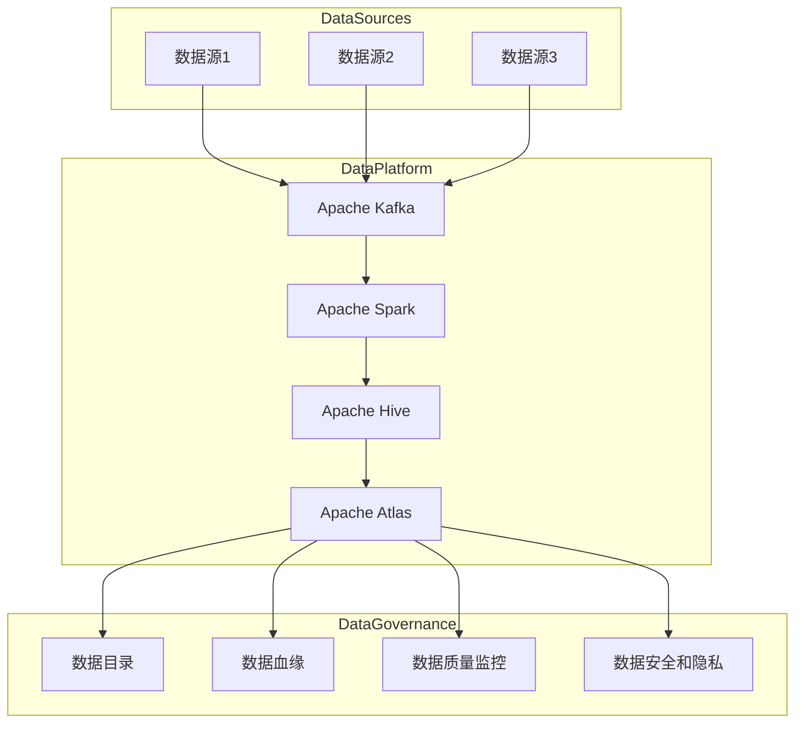

# 数据治理最佳实践：经验总结与案例分享

## 1. 背景介绍

### 1.1 数据治理的重要性

在当今数据驱动的时代，数据已经成为企业最宝贵的资产之一。然而,随着数据量的快速增长和复杂性的提高,有效管理和利用这些数据资产已经成为一个巨大的挑战。数据治理(Data Governance)应运而生,旨在为组织提供一个统一的框架,确保数据的可靠性、一致性、可访问性和安全性。

良好的数据治理实践可以带来诸多好处,包括:

- 提高数据质量和一致性,为业务决策提供可靠的数据支持
- 加强数据安全性和隐私保护,降低数据泄露和不当使用的风险
- 优化数据资产的利用率,提高数据的商业价值
- 促进跨部门和跨系统的数据共享和协作
- 确保组织遵守相关法规和标准

### 1.2 数据治理挑战

尽管数据治理的重要性不言而喻,但在实施过程中仍然面临着诸多挑战:

- 数据来源多样和异构,难以实现统一管理
- 组织内部缺乏数据所有权和责任意识
- 数据质量问题,如重复、不一致和缺失值
- 遗留系统和新兴技术之间的集成困难
- 数据隐私和安全合规性要求日益严格
- 缺乏有效的数据治理框架和流程

为了克服这些挑战,企业需要采用一种全面、系统化的方法来实施数据治理。

## 2. 核心概念与联系

### 2.1 数据治理框架

数据治理框架为整个数据生命周期提供了一个全面的管理模型,包括数据采集、存储、处理、交付和使用等各个环节。一个健全的数据治理框架通常包含以下几个关键组成部分:

1. **数据策略**:明确数据治理的目标、原则和优先级别。
2. **数据架构**:定义数据标准、模型和流程。
3. **数据质量管理**:监控和改进数据质量。
4. **数据安全和隐私保护**:确保数据安全性和隐私合规性。
5. **数据访问和使用管理**:控制数据访问权限和使用方式。
6. **元数据管理**:捕获和维护关于数据的元数据信息。
7. **数据治理组织**:建立明确的角色和责任制。
8. **数据治理技术**:利用适当的工具和技术来支持数据治理实践。

### 2.2 数据治理原则

为了确保数据治理的有效实施,应该坚持以下几个基本原则:

1. **以业务为中心**:数据治理应该紧密围绕业务目标和需求展开。
2. **端到端的生命周期管理**:覆盖数据从采集到使用的整个生命周期。
3. **明确的责任制**:对数据资产的所有权和管理职责进行明确划分。
4. **标准化和一致性**:建立统一的数据标准和规范,确保数据一致性。
5. **透明性和可追溯性**:数据的变更和使用应该是透明和可追溯的。
6. **持续改进**:采用迭代式方法,不断优化和完善数据治理实践。

### 2.3 数据治理与其他实践的关系

数据治理与企业其他实践密切相关,需要与它们紧密协作:

- **数据质量管理(DQM)**: 数据治理为DQM提供了政策和标准的支持。
- **主数据管理(MDM)**: MDM是数据治理的重要应用场景之一。
- **元数据管理**: 元数据管理为数据治理提供了关键的支撑信息。
- **数据架构**: 数据架构为数据治理提供了技术基础。
- **业务智能(BI)**: 数据治理确保BI系统使用高质量和一致的数据。
- **大数据管理**: 数据治理有助于确保大数据环境下的数据可靠性和安全性。

## 3. 核心算法原理具体操作步骤

数据治理的实施需要遵循一定的步骤和方法论,以确保各项工作的有序开展。这里介绍一种常见的数据治理实施方法:

### 3.1 确定数据治理驱动因素

首先需要明确实施数据治理的驱动因素,它可能来自于:

- 业务需求,如提高数据质量、实现数据共享等
- 合规性要求,如隐私法规、行业标准等
- 技术需求,如数据集成、数据迁移等
- 成本优化需求,如降低冗余存储、提高数据利用率等

### 3.2 制定数据治理战略

根据驱动因素制定数据治理战略,明确目标和范围,包括:

- 确定数据治理的目标和预期效益
- 确定数据治理的组织范围和优先领域
- 评估现有数据环境和差距
- 制定数据治理路线图和实施计划

### 3.3 建立数据治理组织架构

数据治理需要一个明确的组织架构来分配角色和职责:

- **数据治理委员会**: 最高决策机构,负责制定数据战略和政策。
- **数据管理办公室(DMO)**: 负责规划、协调和监督数据治理工作。
- **数据管理人员**: 包括数据架构师、数据质量经理、数据隐私官等角色。
- **数据管理小组**: 跨部门的工作小组,负责具体的数据治理实施工作。

### 3.4 制定数据政策、标准和流程

制定一系列的数据政策、标准和流程,作为数据治理的指导依据:

- **数据政策**: 如数据所有权、数据使用、数据质量、数据安全等政策。
- **数据标准**: 包括数据模型、数据定义、编码标准、命名约定等。
- **数据流程**: 如数据采集、存储、集成、交付、使用等流程。

### 3.5 实施数据治理技术解决方案

选择和部署适当的技术工具和平台,以支持数据治理的各项工作:

- 元数据管理工具
- 数据质量管理工具
- 数据安全和隐私保护工具
- 主数据管理(MDM)平台
- 数据湖/数据仓库
- 数据集成和ETL工具
- 数据目录和数据资产管理工具

### 3.6 培养数据文化和提高数据素养

数据治理的成功需要整个组织的支持和参与,因此需要:

- 开展数据治理意识培训
- 明确数据资产的所有权和责任制
- 鼓励数据驱动的决策文化
- 提高员工的数据素养和技能

### 3.7 监控和持续改进

数据治理是一个持续的过程,需要不断监控、评估和优化:

- 建立数据治理指标和评估机制
- 定期审计和评估数据治理效果
- 持续改进数据治理流程和实践
- 与业务需求和技术发展保持同步

## 4. 数学模型和公式详细讲解举例说明

在数据治理领域,有一些常用的数学模型和公式,可以帮助量化和评估数据质量、数据一致性等指标。

### 4.1 数据完整性评估

数据完整性是指数据记录是否完整、无缺失值。常用的评估指标包括:

- **缺失率(Missing Rate)**: 缺失值的比例,公式如下:

$$Missing\ Rate = \frac{Number\ of\ Missing\ Values}{Total\ Number\ of\ Values}$$

- **完整度(Completeness)**: 非缺失值的比例,公式如下:

$$Completeness = 1 - Missing\ Rate = \frac{Number\ of\ Non-Missing\ Values}{Total\ Number\ of\ Values}$$

例如,对于一个包含1000条记录的数据集,如果有50条记录缺失某个字段的值,则该字段的缺失率为5%,完整度为95%。

### 4.2 数据一致性评估

数据一致性是指数据在不同来源或不同时间点是否保持一致。常用的评估指标包括:

- **重复率(Duplication Rate)**: 重复记录的比例,公式如下:

$$Duplication\ Rate = \frac{Number\ of\ Duplicate\ Records}{Total\ Number\ of\ Records}$$

- **一致性分数(Consistency Score)**: 基于特定规则或约束条件,衡量数据满足一致性的程度。对于一个包含N条记录的数据集,如果有M条记录满足一致性规则,则一致性分数为:

$$Consistency\ Score = \frac{M}{N}$$

例如,对于一个客户数据集,如果规定"客户姓名"和"客户编号"必须唯一对应,则可以基于这一规则计算一致性分数。

### 4.3 数据准确性评估

数据准确性是指数据值是否正确、符合预期。常用的评估指标包括:

- **准确率(Accuracy)**: 正确值的比例,公式如下:

$$Accuracy = \frac{Number\ of\ Correct\ Values}{Total\ Number\ of\ Values}$$

- **错误率(Error Rate)**: 错误值的比例,公式如下:

$$Error\ Rate = 1 - Accuracy = \frac{Number\ of\ Incorrect\ Values}{Total\ Number\ of\ Values}$$

例如,对于一个产品价格数据集,如果手动审核发现其中100条记录的价格值存在错误,而整个数据集包含10000条记录,则该数据集的准确率为99%,错误率为1%。

需要注意的是,在实际应用中,准确性的评估往往需要依赖于可信的基准数据或领域知识,并结合数据的业务语义进行综合判断。

通过上述数学模型和公式,数据治理实践可以对数据质量进行量化评估,从而更好地发现问题、制定改进措施,并持续监控数据质量的变化趋势。

## 5. 项目实践:代码实例和详细解释说明

为了更好地理解数据治理的实践,我们可以通过一个具体的项目案例来演示相关的技术和工具。这里将介绍一个基于Python和Apache Atlas的数据治理解决方案。

### 5.1 项目概述

该项目旨在为一家电子商务公司实现数据治理,主要包括以下需求:

- 建立统一的数据目录,管理元数据和数据资产
- 实现数据线程和血缘跟踪,提高数据可追溯性
- 监控和评估数据质量,确保数据质量符合业务需求
- 加强数据安全性和隐私保护,满足合规性要求

### 5.2 技术架构

项目采用的技术架构如下:



主要技术组件包括:

- **Apache Kafka**: 用于实时数据采集和流式处理
- **Apache Spark**: 用于批量数据处理和ETL
- **Apache Hive**: 用于构建数据湖和数据仓库
- **Apache Atlas**: 作为元数据管理和数据治理的核心平台

### 5.3 代码实现

下面是一些关键代码片段,展示了如何利用Apache Atlas进行数据治理实践。

#### 5.3.1 创建数据源实体

首先,我们需要在Atlas中创建数据源实体,代表实际的数据源(如数据库、文件系统等)。以MySQL数据库为例:

```python
from apache_atlas.client import AtlasClient

# 创建Atlas客户端
atlas_client = AtlasClient(host='atlas_host', port=21000, username='admin', password='admin')

# 创建MySQL数据源实体
mysql_datasource = atlas_client.entity.create(
    entity_type='mysql_datasource',
    attributes={
        'name': 'MySQL数据源',
        'description': '电商项目MySQL数据库',
        'host': 'mysql.example.com',
        'port': 3306,
        'database': 'ecommerce'
    }
)
```

#### 5.3.2 创建数据集实体

接下来,我们