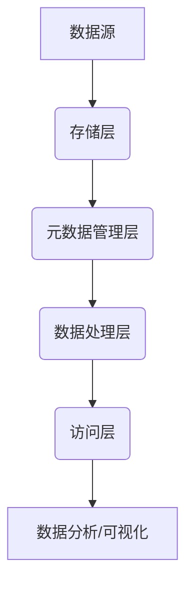
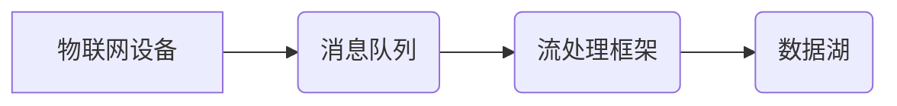
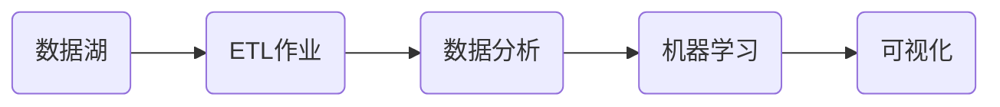
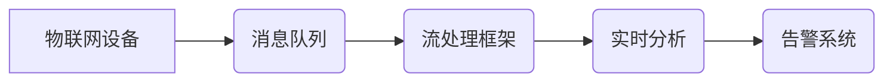

# 数据湖在物联网领域的应用：设备监控与预测性维护

## 1.背景介绍

### 1.1 物联网的兴起与挑战

随着科技的飞速发展,物联网(IoT)正在迅速渗透到我们生活和工作的各个领域。物联网通过将传感器和其他智能设备连接到互联网,使得数据的采集、传输和处理变得前所未有的容易。然而,与此同时,物联网设备的数量和种类也在急剧增加,这使得传统的数据处理系统难以应对海量异构数据的存储和分析需求。

### 1.2 传统数据存储系统的局限性

传统的关系型数据库系统虽然在结构化数据处理方面表现出色,但在处理物联网产生的半结构化和非结构化数据时却显得力不从心。这些数据通常包括日志文件、图像、视频等,数据量大、种类多、格式不统一,与关系型数据库的行列存储模型格格不入。此外,物联网数据的实时性要求也使得关系型数据库的批量处理模式难以满足需求。

### 1.3 数据湖的概念及优势

为了解决上述挑战,数据湖(Data Lake)应运而生。数据湖是一种存储各种格式数据的集中式存储库,能够高效、廉价地存储海量的结构化、半结构化和非结构化数据。与传统数据仓库强调数据结构化不同,数据湖采用扁平化存储,以原始格式保存数据,大大降低了数据预处理和转换的工作量。同时,数据湖与大数据处理框架(如Hadoop、Spark等)紧密集成,支持批处理和流处理,能够快速响应物联网设备产生的实时数据流。

### 1.4 数据湖在物联网领域的应用价值

物联网设备产生的数据种类繁多,包括设备状态数据、环境数据、操作数据等。通过将这些数据存储在数据湖中,企业可以利用大数据分析技术,从海量数据中发现隐藏的见解和规律,从而优化设备运行、提高生产效率、降低能耗、延长设备使用寿命等。特别是,基于数据湖的设备监控和预测性维护,为物联网设备的高效运维带来了全新的机遇。

## 2.核心概念与联系

### 2.1 数据湖的架构

数据湖通常由以下几个核心组件构成:

1. **存储层**: 负责存储各种格式的原始数据,通常使用分布式文件系统(如HDFS)或对象存储(如AWS S3)实现。
2. **元数据管理层**: 记录数据的元信息,如数据格式、schema、位置等,方便数据的检索和管理。常用的元数据管理工具有Apache Atlas、AWS Glue等。
3. **数据处理层**: 包括批处理框架(如Apache Spark)和流处理框架(如Apache Kafka),用于对数据进行清洗、转换、分析等操作。
4. **访问层**: 提供统一的API和工具,让数据分析师、数据科学家等访问和查询数据湖中的数据。常用工具有Apache Hive、AWS Athena等。

### 2.2 数据湖与数据仓库的区别

虽然数据湖和数据仓库都是用于存储和管理数据,但两者在设计理念和应用场景上有着本质的区别:

| 特性 | 数据湖 | 数据仓库 |
| --- | --- | --- |
| 存储数据类型 | 各种格式,原始数据 | 结构化数据 |
| 数据模式 | 晚绑定(Schema-on-Read) | 早绑定(Schema-on-Write) |
| 数据处理 | 批处理+流处理 | 批处理 |
| 使用场景 | 数据探索、数据科学 | 商业智能、决策支持 |
| 用户群体 | 数据科学家、数据工程师 | 业务分析师 |

数据湖适合存储各种格式的原始数据,支持数据探索和数据科学应用;而数据仓库则专注于存储经过ETL加工的结构化数据,为商业智能和决策支持系统提供数据支撑。

### 2.3 数据湖在物联网中的作用

在物联网场景中,数据湖可以高效存储来自各种设备和传感器的海量数据,并与大数据处理框架相结合,提供以下核心能力:

1. **实时数据接入**: 利用流处理框架(如Kafka),实现物联网设备数据的实时采集和存储。
2. **数据整合**: 将异构数据统一存储在数据湖中,打破数据孤岛,实现数据的集中管理和共享。
3. **数据分析**: 基于大数据分析框架(如Spark),对设备数据进行多维度的分析和建模,支持设备监控、预测性维护等应用。
4. **机器学习**: 利用数据湖中的历史数据,训练机器学习模型,实现设备故障预测、能耗优化等智能化应用。

通过数据湖,企业可以充分利用物联网设备产生的海量数据,提高资产利用效率,优化运维策略,降低运营成本。

## 3.核心算法原理具体操作步骤

### 3.1 实时数据采集与存储

实时采集物联网设备数据是构建设备监控和预测性维护系统的基础。常见的物联网数据采集架构如下:

1. **物联网设备**将状态数据、传感器数据等通过MQTT、HTTP等协议发送到**消息队列**(如Kafka)。
2. **流处理框架**(如Apache Spark Structured Streaming)从消息队列中消费数据,进行简单的数据清洗和转换。
3. 处理后的数据被持久化存储到**数据湖**中,为后续的批处理和分析做准备。

该架构能够实现设备数据的实时采集和存储,满足设备监控的低延迟要求。同时,通过消息队列的缓冲作用,能够应对数据洪峰,提高系统的可靠性和弹性。

### 3.2 离线数据处理与分析

对于存储在数据湖中的历史数据,我们可以利用大数据批处理框架(如Apache Spark)进行深入的数据处理和分析,为设备监控和预测性维护提供支持。典型的离线数据处理流程如下:

1. 从数据湖中读取原始数据,利用**ETL作业**进行数据清洗、转换和特征工程,生成适用于分析和建模的数据集。
2. 在清洗好的数据集上进行**数据分析**,包括描述性统计、异常检测、根因分析等,为设备状态提供全面的洞察。
3. 利用机器学习算法对设备数据进行**建模**,训练出用于故障预测、剩余寿命估计等的模型。
4. 将分析结果和模型预测结果通过**可视化**工具呈现给用户,辅助决策。

该流程能够充分挖掘数据湖中的价值,为设备运维提供数据支撑。同时,通过机器学习模型,还能实现设备故障的主动预测,支持预测性维护策略。

### 3.3 流式数据处理与实时分析

对于一些关键的实时监控场景,我们还需要利用流处理框架(如Apache Spark Structured Streaming、Apache Flink)对数据进行实时处理和分析,以便及时发现异常并触发相应的告警。

1. 物联网设备将实时数据发送到消息队列。
2. 流处理框架从消息队列中消费数据,进行窗口聚合、连续查询等**实时分析**操作。
3. 分析结果被发送到**告警系统**,根据预设的阈值规则触发相应的告警通知。

与离线分析相比,实时分析更侧重于对关键指标的持续监控,能够快速发现异常情况并触发人工干预,确保设备的稳定运行。同时,实时分析的结果也可以反馈到离线分析环节,为故障诊断和根因分析提供支持。

## 4.数学模型和公式详细讲解举例说明

在设备监控和预测性维护领域,数学模型和算法扮演着重要角色。以下是一些常见的模型和算法,以及相关的数学原理。

### 4.1 异常检测算法

异常检测是设备监控的核心任务之一,用于发现设备运行中的异常状态。常见的异常检测算法包括:

1. **基于统计的异常检测**

   假设正常数据服从某种概率分布(如高斯分布),那么偏离该分布的数据就被视为异常。常用的统计量包括均值、标准差、分位数等。

   设$X = \{x_1, x_2, \ldots, x_n\}$为正常数据集,其均值和标准差分别为$\mu$和$\sigma$,则一个新的观测值$x_0$被判定为异常的条件为:

   $$|x_0 - \mu| > k\sigma$$

   其中$k$是一个事先设定的阈值,通常取值为3。

2. **基于距离的异常检测**

   假设正常数据点在特征空间中相互靠近,而异常数据点则与正常数据点距离较远。可以使用$k$近邻算法或密度估计方法进行异常检测。

   设$D(x)$为样本$x$到其$k$近邻的平均距离,则$x$被判定为异常的条件为:

   $$D(x) > r$$

   其中$r$是一个事先设定的阈值。

3. **基于模型的异常检测**

   通过机器学习算法(如高斯混合模型、一类支持向量机等)对正常数据进行建模,将无法很好地被模型描述的数据视为异常。

   对于给定的数据$x$和模型$M$,我们可以计算$x$在$M$下的概率密度$p(x|M)$,若$p(x|M)$小于某个阈值,则将$x$判定为异常。

异常检测算法可以根据具体的应用场景和数据特征进行选择和优化,在设备监控中发挥重要作用。

### 4.2 剩余寿命预测模型

预测性维护的核心是对设备的剩余使用寿命(Remaining Useful Life, RUL)进行准确预测,从而安排维修保养,避免设备故障。常见的RUL预测模型包括:

1. **基于健康指标的经验模型**

   根据设备的健康指标(如温度、振动等)和历史故障数据,构建经验模型预测RUL。例如,可以使用多元线性回归模型:

   $$RUL = \beta_0 + \beta_1x_1 + \beta_2x_2 + \ldots + \beta_nx_n$$

   其中$x_i$为健康指标,$\beta_i$为回归系数。

2. **基于物理模型的预测**

   利用物理学定律和设备的理论模型,推导出设备性能退化的数学表达式,并基于当前状态预测RUL。

   以轴承为例,其性能退化可以用轴承径向间隙的增大来表征。假设径向间隙$d$随时间$t$的变化遵循指数模型:

   $$d(t) = d_0e^{\alpha t}$$

   其中$d_0$为初始间隙,$\alpha$为退化速率。当$d(t)$达到临界值$d_{crit}$时,轴承即将失效,从而可以估算出RUL。

3. **基于数据驱动的机器学习模型**

   利用历史运行数据训练机器学习模型(如神经网络、生存分析模型等)预测RUL。这类模型能够自动从数据中提取特征,捕获复杂的非线性关系,预测