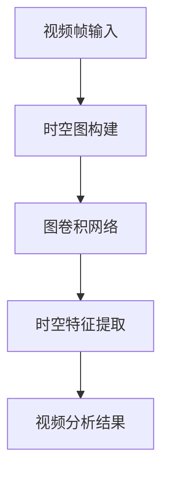

# 时空信息融合：捕捉视频帧之间的联系

作者：禅与计算机程序设计艺术

## 1.背景介绍

### 1.1 视频分析的重要性

在当今的数字时代，视频数据无处不在。从社交媒体上的短视频到监控摄像头的实时捕捉，视频数据已经成为我们日常生活和工作中不可或缺的一部分。视频分析技术的进步使得我们能够从这些数据中提取有价值的信息，应用于安全监控、自动驾驶、医疗诊断等多个领域。然而，视频数据的复杂性和庞大数据量也给分析带来了巨大的挑战。

### 1.2 时空信息融合的意义

在视频分析中，时空信息融合技术尤为关键。时空信息融合指的是将视频帧中的时间和空间信息有机结合，以捕捉视频帧之间的联系。这种技术不仅能够提高视频分析的准确性，还能提供更丰富的上下文信息，使得系统能够更好地理解和解释视频内容。

### 1.3 本文结构

本文将详细探讨时空信息融合技术，包括其核心概念、算法原理、数学模型、项目实践、实际应用场景、工具和资源推荐，以及未来发展趋势与挑战。通过这篇文章，读者将全面了解如何在视频分析中有效地应用时空信息融合技术。

## 2.核心概念与联系

### 2.1 时空信息的定义

时空信息指的是视频帧中的时间和空间维度的信息。时间维度的信息包括帧的顺序、时间戳等，而空间维度的信息则包括帧中的物体位置、形状、运动轨迹等。

### 2.2 时空信息融合的基本原理

时空信息融合的基本原理是通过结合时间和空间维度的信息，捕捉视频帧之间的联系。这种联系可以是物体的运动轨迹、事件的发生顺序、场景的变化等。通过时空信息融合，系统能够更全面地理解视频内容，提高分析的准确性和可靠性。

### 2.3 时空信息融合的应用场景

时空信息融合技术在多个领域有广泛的应用。例如，在安全监控中，可以通过时空信息融合技术检测异常行为；在自动驾驶中，可以通过时空信息融合技术识别道路上的障碍物和行人；在医疗诊断中，可以通过时空信息融合技术分析患者的行为和症状。

## 3.核心算法原理具体操作步骤

### 3.1 时空信息提取

#### 3.1.1 时间信息提取

时间信息提取的主要任务是获取每个视频帧的时间戳和帧序列。常用的方法包括帧间差分、光流法等。

#### 3.1.2 空间信息提取

空间信息提取的主要任务是获取每个视频帧中的物体位置、形状和运动轨迹。常用的方法包括目标检测、目标跟踪、图像分割等。

### 3.2 时空特征表示

#### 3.2.1 时空特征向量

时空特征向量是将时间和空间维度的信息结合起来，形成一个高维的特征向量。常用的方法包括卷积神经网络（CNN）、循环神经网络（RNN）、长短时记忆网络（LSTM）等。

#### 3.2.2 时空图卷积网络（ST-GCN）

时空图卷积网络（ST-GCN）是一种将时空信息融合的有效方法。它通过构建时空图，将视频帧中的时间和空间信息表示为图结构，并通过图卷积网络进行特征提取。



### 3.3 时空信息融合算法

#### 3.3.1 基于卷积神经网络的时空信息融合

卷积神经网络（CNN）是一种常用的时空信息融合方法。通过在时间和空间维度上进行卷积操作，可以提取视频帧中的时空特征。

#### 3.3.2 基于循环神经网络的时空信息融合

循环神经网络（RNN）是一种适用于处理时间序列数据的神经网络。通过在时间维度上进行递归操作，可以捕捉视频帧之间的时间联系。

#### 3.3.3 基于长短时记忆网络的时空信息融合

长短时记忆网络（LSTM）是一种改进的RNN，能够更好地捕捉长时间依赖关系。通过在时间维度上进行长短时记忆操作，可以更准确地捕捉视频帧之间的时间联系。

## 4.数学模型和公式详细讲解举例说明

### 4.1 卷积神经网络的数学模型

卷积神经网络的数学模型主要包括卷积操作、池化操作和全连接层。卷积操作的公式如下：

$$
\text{Conv}(x, w) = x * w + b
$$

其中，$x$ 是输入特征图，$w$ 是卷积核，$b$ 是偏置项，$*$ 表示卷积操作。

### 4.2 循环神经网络的数学模型

循环神经网络的数学模型主要包括输入门、遗忘门和输出门。RNN的公式如下：

$$
h_t = \sigma(W_h \cdot h_{t-1} + W_x \cdot x_t + b)
$$

其中，$h_t$ 是当前时刻的隐藏状态，$h_{t-1}$ 是前一时刻的隐藏状态，$x_t$ 是当前时刻的输入，$W_h$ 和 $W_x$ 是权重矩阵，$b$ 是偏置项，$\sigma$ 是激活函数。

### 4.3 长短时记忆网络的数学模型

长短时记忆网络的数学模型主要包括输入门、遗忘门和输出门。LSTM的公式如下：

$$
f_t = \sigma(W_f \cdot [h_{t-1}, x_t] + b_f)
$$

$$
i_t = \sigma(W_i \cdot [h_{t-1}, x_t] + b_i)
$$

$$
\tilde{C}_t = \tanh(W_C \cdot [h_{t-1}, x_t] + b_C)
$$

$$
C_t = f_t * C_{t-1} + i_t * \tilde{C}_t
$$

$$
o_t = \sigma(W_o \cdot [h_{t-1}, x_t] + b_o)
$$

$$
h_t = o_t * \tanh(C_t)
$$

其中，$f_t$ 是遗忘门，$i_t$ 是输入门，$\tilde{C}_t$ 是候选记忆状态，$C_t$ 是当前记忆状态，$o_t$ 是输出门，$h_t$ 是当前隐藏状态，$W_f$、$W_i$、$W_C$ 和 $W_o$ 是权重矩阵，$b_f$、$b_i$、$b_C$ 和 $b_o$ 是偏置项，$\sigma$ 是激活函数，$\tanh$ 是双曲正切函数。

### 4.4 时空图卷积网络的数学模型

时空图卷积网络的数学模型主要包括图卷积操作和时间卷积操作。图卷积操作的公式如下：

$$
H^{(l+1)} = \sigma(D^{-1}AH^{(l)}W^{(l)})
$$

其中，$H^{(l)}$ 是第$l$层的节点特征矩阵，$A$ 是邻接矩阵，$D$ 是度矩阵，$W^{(l)}$ 是第$l$层的权重矩阵，$\sigma$ 是激活函数。

## 5.项目实践：代码实例和详细解释说明

### 5.1 项目简介

在本节中，我们将通过一个实际项目实例，演示如何应用时空信息融合技术进行视频分析。该项目的目标是通过时空信息融合技术，检测视频中的异常行为。

### 5.2 环境配置

#### 5.2.1 安装必要的库

在开始项目之前，我们需要安装一些必要的Python库，如TensorFlow、Keras、OpenCV等。

```python
pip install tensorflow keras opencv-python
```

#### 5.2.2 数据集准备

我们将使用公开的UCF-Crime数据集，该数据集包含了各种异常行为的视频片段。可以从官方网站下载并解压数据集。

### 5.3 数据预处理

#### 5.3.1 视频帧提取

首先，我们需要从视频中提取帧，并