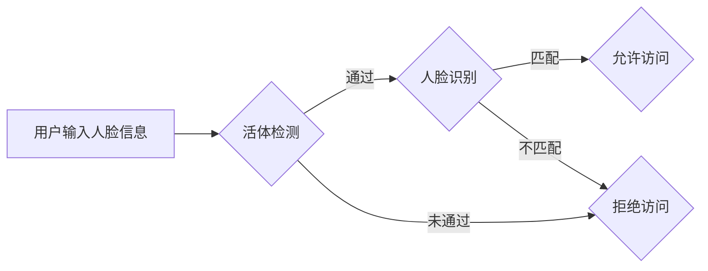

# 智能假冒人脸过滤的手机端用户身份鉴定算法研发及系统实现

作者：禅与计算机程序设计艺术

## 1. 背景介绍

### 1.1 人脸识别技术概述

人脸识别技术作为一种重要的生物特征识别技术，近年来取得了显著的进步。其原理是利用计算机视觉技术分析人脸图像，提取人脸特征，并与数据库中已知身份的人脸特征进行比对，从而实现身份识别。

### 1.2 假冒人脸攻击的挑战

随着人脸识别技术的广泛应用，其安全性也面临着越来越严峻的挑战。其中，假冒人脸攻击（Spoofing Attack）是指攻击者利用照片、视频、面具等方式伪造人脸信息，欺骗人脸识别系统，从而获取非法访问权限。

### 1.3 手机端身份鉴定的重要性

手机作为人们日常生活中不可或缺的工具，其安全性至关重要。手机端身份鉴定是保护用户隐私和数据安全的重要手段，而人脸识别技术则是手机端身份鉴定的重要方式之一。然而，假冒人脸攻击对手机端人脸识别的安全性构成了严重威胁。

### 1.4 本研究的目标和意义

本研究旨在研发一种智能假冒人脸过滤的手机端用户身份鉴定算法，以提高手机端人脸识别的安全性。该算法能够有效识别和过滤各种类型的假冒人脸攻击，从而保障用户隐私和数据安全。

## 2. 核心概念与联系

### 2.1 假冒人脸攻击类型

常见的假冒人脸攻击类型包括：

* 照片攻击：利用打印照片、电子屏幕显示照片等方式进行攻击。
* 视频攻击：利用播放预先录制的视频进行攻击。
* 面具攻击：利用3D打印面具、硅胶面具等方式进行攻击。

### 2.2 活体检测技术

活体检测技术是防御假冒人脸攻击的重要手段，其原理是通过分析人脸图像或视频中的动态特征，判断人脸是否为真实人脸。常用的活体检测技术包括：

* 基于动作的活体检测：要求用户完成眨眼、摇头、张嘴等指定动作。
* 基于纹理的活体检测：分析人脸皮肤纹理、光线反射等特征。
* 基于深度信息的活体检测：利用深度摄像头获取人脸三维信息，判断人脸是否为真实人脸。

### 2.3 深度学习技术

深度学习技术在计算机视觉领域取得了巨大的成功，其在人脸识别、活体检测等方面也具有广泛的应用。深度学习模型可以通过学习大量的训练数据，自动提取人脸特征和活体特征，从而实现高精度的识别和检测。

## 3. 核心算法原理具体操作步骤

### 3.1 数据集构建

为了训练高性能的深度学习模型，需要构建包含大量真实人脸和假冒人脸样本的数据集。

#### 3.1.1 真实人脸样本采集

采集真实人脸样本时，应尽量涵盖不同光照条件、不同角度、不同表情的人脸图像。

#### 3.1.2 假冒人脸样本生成

可以使用打印照片、电子屏幕显示照片、播放视频、佩戴面具等方式生成假冒人脸样本。

### 3.2 模型设计与训练

#### 3.2.1 模型选择

可以选择现有的深度学习模型，如VGG、ResNet、MobileNet等，也可以根据实际需求设计新的模型。

#### 3.2.2 模型训练

使用构建好的数据集对模型进行训练，调整模型参数，使模型能够准确地区分真实人脸和假冒人脸。

### 3.3 活体检测

在进行人脸识别之前，首先进行活体检测，判断人脸是否为真实人脸。

### 3.4 人脸识别

如果活体检测通过，则进行人脸识别，将提取的人脸特征与数据库中已知身份的人脸特征进行比对。

### 3.5 决策输出

根据人脸识别结果，判断用户身份是否合法。

## 4. 数学模型和公式详细讲解举例说明

### 4.1 卷积神经网络 (CNN)

卷积神经网络 (CNN) 是一种常用于图像识别的深度学习模型，其核心是卷积层和池化层。

#### 4.1.1 卷积层

卷积层利用卷积核对输入图像进行卷积运算，提取图像特征。

假设输入图像为 $I$，卷积核为 $K$，卷积运算可以表示为：

$$
S(i,j) = (I * K)(i,j) = \sum_{m} \sum_{n} I(i+m, j+n)K(m,n)
$$

其中，$S(i,j)$ 表示输出特征图中 $(i,j)$ 位置的值。

#### 4.1.2 池化层

池化层对卷积层输出的特征图进行降维操作，减少计算量和参数数量。

常用的池化操作包括最大池化和平均池化。

* 最大池化：选择池化窗口内的最大值作为输出。
* 平均池化：计算池化窗口内所有值的平均值作为输出。

### 4.2 Softmax 函数

Softmax 函数常用于多分类问题，将模型输出转换为概率分布。

假设模型输出为 $z_i$，则 Softmax 函数可以表示为：

$$
p_i = \frac{e^{z_i}}{\sum_{j=1}^{N} e^{z_j}}
$$

其中，$p_i$ 表示第 $i$ 个类别的概率。

## 5. 项目实践：代码实例和详细解释说明

### 5.1 开发环境搭建

* 操作系统：Android 
* 开发语言：Java
* 集成开发环境：Android Studio
* 人脸识别SDK：Face++

### 5.2 代码实例

```java
// 初始化人脸识别SDK
FaceEngine faceEngine = new FaceEngine();
faceEngine.init(this, FaceEngine.SDK_MODE_IMAGE, FaceEngine.DETECTION_MODE_TRACKING_ROBUST);

// 准备人脸图像
Bitmap bitmap = BitmapFactory.decodeResource(getResources(), R.drawable.face);

// 进行活体检测
LivenessControl.ControlResult livenessResult = faceEngine.livenessControl(bitmap);

// 如果活体检测通过
if (livenessResult.passed()) {
  // 进行人脸识别
  FaceEngine.Face[] faces = faceEngine.detectFaces(bitmap, FaceEngine.IMAGE_TYPE_RGB);
  if (faces != null && faces.length > 0) {
    FaceEngine.Face face = faces[0];
    // 提取人脸特征
    byte[] feature = faceEngine.extractFaceFeature(bitmap, face);
    // 与数据库中已知身份的人脸特征进行比对
    // ...
  }
}
```

### 5.3 代码解释

* 首先，初始化人脸识别SDK，设置SDK模式为图片模式，检测模式为鲁棒跟踪模式。
* 然后，准备人脸图像，可以使用BitmapFactory.decodeResource()方法从资源文件中加载图片。
* 接着，进行活体检测，使用faceEngine.livenessControl()方法进行活体检测，该方法返回一个LivenessControl.ControlResult对象，包含活体检测结果。
* 如果活体检测通过，则进行人脸识别，使用faceEngine.detectFaces()方法检测人脸，该方法返回一个FaceEngine.Face数组，包含检测到的人脸信息。
* 对于检测到的人脸，使用faceEngine.extractFaceFeature()方法提取人脸特征，该方法返回一个byte数组，表示人脸特征。
* 最后，将提取的人脸特征与数据库中已知身份的人脸特征进行比对，判断用户身份是否合法。

## 6. 实际应用场景

智能假冒人脸过滤的手机端用户身份鉴定算法可以应用于以下场景：

* 手机解锁：使用人脸识别技术进行手机解锁，防止他人使用照片、视频等方式解锁手机。
* 支付认证：在进行支付操作时，使用人脸识别技术进行身份验证，提高支付安全性。
* 身份验证：在需要进行身份验证的场景，如登录账号、访问敏感信息等，使用人脸识别技术进行身份验证，增强安全性。

## 7. 工具和资源推荐

* **人脸识别SDK:**
    * Face++: https://www.faceplusplus.com.cn/
    * 腾讯优图: https://cloud.tencent.com/product/yutu
    * 百度AI开放平台: https://ai.baidu.com/
* **深度学习框架:**
    * TensorFlow: https://www.tensorflow.org/
    * PyTorch: https://pytorch.org/
* **数据集:**
    * CASIA-WebFace: http://www.cbsr.ia.ac.cn/english/CASIA-WebFace-Database.html
    * LFW: http://vis-www.cs.umass.edu/lfw/
    * CelebA: http://mmlab.ie.cuhk.edu.hk/projects/CelebA.html

## 8. 总结：未来发展趋势与挑战

### 8.1 未来发展趋势

* **更高的精度和鲁棒性:** 随着深度学习技术的不断发展，人脸识别和活体检测的精度和鲁棒性将进一步提升。
* **更丰富的应用场景:** 智能假冒人脸过滤技术将应用于更广泛的场景，如安防监控、智慧城市、金融服务等。
* **与其他技术的融合:** 人脸识别技术将与其他生物特征识别技术、人工智能技术等融合，构建更加安全可靠的身份认证体系。

### 8.2 面临的挑战

* **对抗性攻击:** 攻击者可以通过研究人脸识别算法的漏洞，设计出能够绕过活体检测和人脸识别的攻击手段。
* **隐私保护:** 人脸信息属于个人敏感信息，如何保护用户隐私是人脸识别技术发展面临的重要挑战。
* **伦理问题:** 人脸识别技术的应用引发了一系列伦理问题，如种族歧视、社会控制等。

## 9. 附录：常见问题与解答

### 9.1  如何提高人脸识别的精度？

提高人脸识别精度可以从以下几个方面入手：

* 使用更大规模、更优质的训练数据集。
* 选择更先进的深度学习模型。
* 对模型进行精细化调参。
* 使用多模态信息，如人脸图像、语音、虹膜等。

### 9.2 如何防御对抗性攻击？

防御对抗性攻击可以采取以下措施：

* 对训练数据进行增强，提高模型的鲁棒性。
* 使用对抗训练，使模型更加健壮。
* 使用多模型融合，提高攻击的难度。
* 进行安全评估，及时发现和修复漏洞。


## 10. Mermaid 流程图


