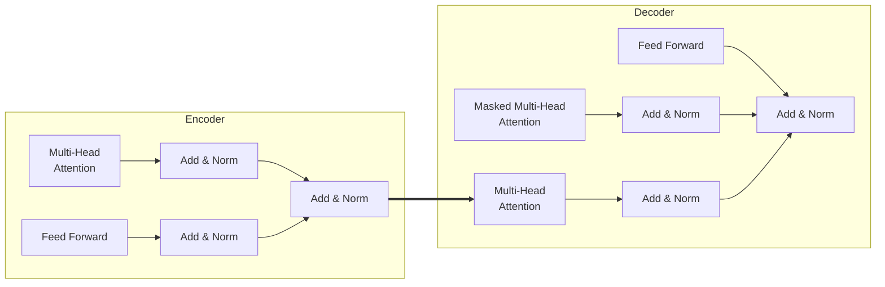

# 智能试卷生成系统详细设计与具体代码实现

## 1.背景介绍

### 1.1 传统试卷生成系统的挑战
传统的试卷生成系统通常依赖于人工编写题目,再通过某种算法组合成试卷。这种方式存在以下几个主要挑战:

- **题库规模有限**:人工编写题目的效率低下,导致题库规模难以满足大规模考试需求。
- **题目质量参差不齐**:人工编写的题目质量受编写者水平影响较大,缺乏统一的评判标准。
- **知识点覆盖不均衡**:人工编写题目容易出现知识点分布不均匀的情况,导致试卷设计缺乏全面性。
- **缺乏针对性**:人工难以根据考生的实际水平动态生成个性化试卷。

### 1.2 智能试卷生成系统的优势
相比传统方式,智能试卷生成系统可以有效解决上述挑战,主要优势包括:

- **题库规模可扩展**:利用人工智能技术,可以自动生成大量高质量的题目,题库规模可无限扩展。
- **题目质量可控**:通过设置生成规则和评分标准,可以保证生成题目的质量和难度。
- **知识点覆盖均衡**:系统可根据教学大纲要求,自动生成覆盖所有知识点的题目。
- **个性化试卷设计**:结合学生的历史成绩和知识掌握情况,可生成针对性强的个性化试卷。

## 2.核心概念与联系

### 2.1 自然语言处理(NLP)
自然语言处理(Natural Language Processing,NLP)是人工智能的一个重要分支,旨在使计算机能够"理解"人类语言。在智能试卷生成系统中,NLP技术可应用于:

- **题目语义理解**:准确提取题目中的关键信息,如知识点、题型、难度等。
- **问答生成**:根据知识点自动生成题干、选项和答案。
- **语言校对**:检测并纠正生成题目中的语法和语义错误。

### 2.2 知识图谱
知识图谱是一种结构化形式的知识库,用于表示实体之间的关系和属性。在本系统中,知识图谱可用于:

- **知识点建模**:将教学大纲中的知识点及其关系形式化表示。
- **语料库构建**:根据知识图谱,收集与各知识点相关的文本语料。
- **知识推理**:利用知识图谱进行逻辑推理,生成符合要求的题目。

### 2.3 深度学习模型
深度学习模型是指基于人工神经网络的机器学习模型,具有强大的特征学习和模式识别能力。本系统可采用多种深度学习模型,如:

- **序列到序列模型(Seq2Seq)**:用于自动生成题目文本。
- **知识图嵌入模型**:将知识图谱信息嵌入到连续向量空间,用于知识推理。
- **强化学习模型**:根据评分反馈,不断优化题目生成策略。

### 2.4 系统架构
智能试卷生成系统通常采用分布式架构,由多个模块协同工作:

- **数据存储模块**:存储知识图谱、语料库等原始数据。
- **数据处理模块**:对原始数据进行清洗、标注和特征提取。
- **模型训练模块**:使用处理后的数据训练深度学习模型。
- **题目生成模块**:调用训练好的模型生成题目和组卷。
- **评分反馈模块**:收集人工评分反馈,用于模型优化。

## 3.核心算法原理具体操作步骤

智能试卷生成系统的核心算法主要包括两个部分:题目生成算法和组卷算法。

### 3.1 题目生成算法

#### 3.1.1 基于Seq2Seq的生成算法
序列到序列(Sequence to Sequence,Seq2Seq)模型是一种广泛应用于自然语言生成任务的深度学习模型,能够根据输入序列生成对应的输出序列。在题目生成任务中,我们可以将知识点作为输入,目标题目文本作为输出,使用Seq2Seq模型进行端到端的题目生成。

具体操作步骤如下:

1. **数据预处理**:收集知识点及其对应的题目语料,构建训练数据集。
2. **模型训练**:使用Seq2Seq模型(如LSTM、Transformer等)在训练数据集上进行训练,学习从知识点到题目文本的映射。
3. **模型优化**:通过注意力机制、Beam Search等策略优化模型性能。
4. **在线生成**:将待生成的知识点输入训练好的模型,模型即可生成对应的题目文本。

基于Seq2Seq的生成算法优点是结构简单、易于训练,但缺点是生成质量参差不齐,需要人工把关。

#### 3.1.2 基于知识图谱的生成算法
知识图谱包含了知识点之间的丰富关系信息,可以为题目生成提供更多语义支持。基于知识图谱的生成算法通常包括以下步骤:

1. **知识图谱构建**:根据教学大纲,构建形式化的知识图谱。
2. **知识图谱嵌入**:将知识图谱中的实体和关系嵌入到低维连续向量空间。
3. **主题抽取**:根据要求,从知识图谱中抽取作为题目主题的实体和关系。
4. **问题生成**:基于抽取的主题,结合预定义的问题模板,生成题干和选项。
5. **答案生成**:利用知识图谱进行推理,生成题目的标准答案。

相比Seq2Seq模型,基于知识图谱的算法生成的题目更加符合教学逻辑,知识点覆盖更全面,但缺点是生成的自然语言质量较差,需要额外的语言模型进行优化。

#### 3.1.3 基于强化学习的生成算法
强化学习(Reinforcement Learning)是一种基于反馈的机器学习范式,可以应用于题目生成任务中的策略优化。基于强化学习的生成算法通常包括以下步骤:

1. **定义奖励函数**:根据题目质量的评判标准(如难度、区分度等),设计合理的奖励函数。
2. **初始化生成策略**:使用基于规则或其他方法初始化一个题目生成策略(如Seq2Seq、知识图谱等)。
3. **策略评估与优化**:
    - 使用当前策略生成一批题目
    - 人工或自动评分,获得每道题目的奖励值
    - 根据奖励值,使用策略梯度等算法优化生成策略
    - 重复上述过程,直至策略收敛
4. **在线生成**:使用优化后的策略进行在线题目生成。

基于强化学习的方法可以持续优化生成策略,提高题目质量,但训练过程计算开销大,需要大量的人工评分数据。

### 3.2 组卷算法
经过上述步骤生成了题目库之后,我们还需要根据特定要求从中选择题目组成完整的试卷。常用的组卷算法包括:

#### 3.2.1 基于整数规划的算法
整数规划(Integer Programming)是一种将目标函数和约束条件线性化的优化方法。在组卷任务中,我们可以将知识点覆盖率、题型分布、难度系数等作为优化目标,将题目选择情况用0-1变量表示,将各种组卷要求作为约束条件,从而将组卷问题转化为整数规划问题。

具体步骤如下:

1. **建立目标函数**:根据要求设置优化目标,如最大化知识点覆盖率、最小化平均难度等。
2. **设置约束条件**:包括题目总数、题型分布比例、难度区间等硬性要求。
3. **构建0-1决策变量**:用0-1变量表示每道题目是否被选入试卷。
4. **求解整数规划问题**:使用整数规划求解器(如CPLEX)求出最优解。

基于整数规划的算法可以精准控制试卷结构,但当约束变多时,求解复杂度会迅速增加。

#### 3.2.2 基于启发式搜索的算法
当组卷约束较为复杂时,整数规划方法可能难以高效求解。这种情况下,我们可以使用启发式搜索算法(如遗传算法、蚁群算法等)进行近似求解。

以遗传算法为例,具体步骤如下:

1. **染色体编码**:将试卷用一个二进制串编码,每个基因位代表一道题目是否选入。
2. **初始群体生成**:随机生成一定数量的个体(试卷)作为初始群体。
3. **个体评估**:计算每个个体的适应度,即它满足组卷要求的程度。
4. **选择、交叉、变异**:根据适应度对个体进行选择、交叉和变异操作,产生新一代群体。
5. **终止判断**:若满足终止条件(如进化代数达到上限),则停止;否则转3继续进化。

基于启发式搜索的算法可以处理约束复杂的组卷场景,但求解质量无法保证,需要合理设置算法超参数。

## 4.数学模型和公式详细讲解举例说明

在智能试卷生成系统中,涉及多种数学模型和公式,下面分别进行详细讲解。

### 4.1 Seq2Seq模型

Seq2Seq模型是一种将输入序列映射到输出序列的端到端模型,广泛应用于机器翻译、文本摘要等自然语言处理任务。在题目生成中,我们可以将知识点看作输入序列,目标题目文本作为输出序列,使用Seq2Seq模型进行建模。

Seq2Seq模型通常由编码器(Encoder)和解码器(Decoder)两部分组成。编码器将输入序列编码为向量表示,解码器根据该向量生成输出序列。常用的Seq2Seq模型包括:

- **RNN Seq2Seq**:使用RNN(如LSTM、GRU)作为编码器和解码器。
- **Transformer**:基于自注意力机制的Seq2Seq模型,避免了RNN的长期依赖问题。

以Transformer为例,其模型结构如下所示:

其中,编码器由多个相同的编码器层组成,每一层包含两个子层:多头自注意力(Multi-Head Attention)和前馈全连接网络(Feed Forward)。解码器的结构类似,不同之处在于:

1. 解码器中的第一个子层是带掩码的多头自注意力层,用于防止关注到后续的位置。
2. 解码器中的第二个子层是编码器-解码器注意力层,允许解码器关注编码器的输出。

在序列生成任务中,我们首先使用编码器对输入序列进行编码,得到其向量表示,然后使用解码器基于该向量按顺序生成输出序列的每个元素。

训练过程中,我们最小化输入序列与目标序列之间的交叉熵损失:

$$\operatorname{Loss}=-\sum_{t=1}^{T} y_{t} \log p\left(y_{t} | y_{<t}, \boldsymbol{x}\right)$$

其中,$y_t$是目标序列在时刻$t$的元素,$p(y_t|y_{<t},\boldsymbol{x})$是给定输入序列$\boldsymbol{x}$和之前的输出元素$y_{<t}$时,生成$y_t$的条件概率分布。

通