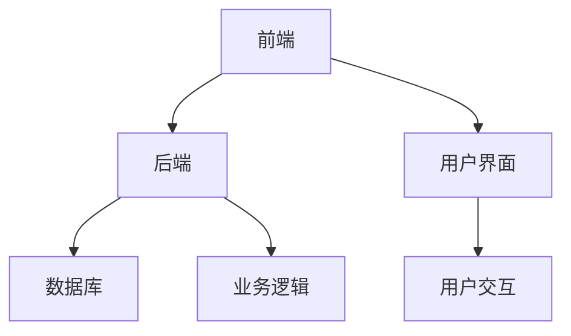

# 服装专卖店管理系统详细设计与具体代码实现

作者：禅与计算机程序设计艺术

## 1.背景介绍

### 1.1 行业背景

随着零售业的快速发展，服装专卖店作为零售业的重要组成部分，面临着日益激烈的市场竞争。为了提高运营效率和客户满意度，服装专卖店需要一个高效的管理系统来支持其日常运营。传统的手工管理方式已经无法满足现代服装专卖店的需求，因此，开发一个自动化、智能化的管理系统显得尤为重要。

### 1.2 项目背景

本项目旨在设计并实现一个服装专卖店管理系统，通过信息化手段提高服装专卖店的管理水平。系统涵盖库存管理、销售管理、客户管理、员工管理等多个模块，旨在为服装专卖店提供全面的业务支持。

### 1.3 目标与意义

本项目的目标是开发一个功能齐全、操作简便的服装专卖店管理系统，帮助店铺管理者高效地进行库存管理、销售分析、客户关系管理等工作。通过该系统，店铺管理者可以实时掌握库存情况、销售数据和客户信息，从而做出更加科学的经营决策。

## 2.核心概念与联系

### 2.1 系统架构

服装专卖店管理系统的整体架构可以分为前端、后端和数据库三部分。前端主要负责用户界面的展示和交互；后端负责业务逻辑的处理；数据库负责数据的存储和管理。



### 2.2 功能模块

系统的主要功能模块包括：

- 库存管理：管理商品的入库、出库、库存盘点等。
- 销售管理：管理销售订单、退货、销售统计等。
- 客户管理：管理客户信息、客户分级、客户关系维护等。
- 员工管理：管理员工信息、绩效考核、工资管理等。

### 2.3 数据流与交互

系统中的数据流主要包括前端与后端的数据交互、后端与数据库的数据读写。前端通过API与后端进行通信，后端通过SQL语句与数据库进行数据操作。

## 3.核心算法原理具体操作步骤

### 3.1 库存管理算法

库存管理是服装专卖店管理系统的核心功能之一，主要包括商品的入库、出库和库存盘点。以下是库存管理的核心算法步骤：

1. **商品入库**：
    - 接收入库请求，获取商品信息和数量。
    - 检查商品是否已经存在于库存中。
    - 如果存在，更新库存数量；如果不存在，新增商品记录。

2. **商品出库**：
    - 接收出库请求，获取商品信息和数量。
    - 检查库存数量是否满足出库要求。
    - 如果满足，更新库存数量；如果不满足，返回错误信息。

3. **库存盘点**：
    - 定期或不定期进行库存盘点，核对实际库存与系统库存是否一致。
    - 如果不一致，更新系统库存，并记录盘点结果。

### 3.2 销售管理算法

销售管理包括销售订单的处理、退货管理和销售统计。以下是销售管理的核心算法步骤：

1. **销售订单处理**：
    - 接收销售订单，获取订单详情。
    - 检查库存是否满足订单需求。
    - 如果满足，生成销售订单，更新库存数量；如果不满足，返回错误信息。

2. **退货管理**：
    - 接收退货请求，获取退货商品信息和数量。
    - 更新库存数量，记录退货信息。

3. **销售统计**：
    - 定期生成销售报表，统计销售数据。
    - 分析销售趋势，提供决策支持。

### 3.3 客户管理算法

客户管理包括客户信息的录入、客户分级和客户关系维护。以下是客户管理的核心算法步骤：

1. **客户信息录入**：
    - 接收客户信息，录入系统。
    - 检查客户是否已经存在，如果存在，更新客户信息；如果不存在，新增客户记录。

2. **客户分级**：
    - 根据客户的购买历史、消费金额等进行客户分级。
    - 不同级别的客户享受不同的优惠政策和服务。

3. **客户关系维护**：
    - 定期与客户进行沟通，了解客户需求。
    - 记录客户反馈，改进服务质量。

### 3.4 员工管理算法

员工管理包括员工信息的录入、绩效考核和工资管理。以下是员工管理的核心算法步骤：

1. **员工信息录入**：
    - 接收员工信息，录入系统。
    - 检查员工是否已经存在，如果存在，更新员工信息；如果不存在，新增员工记录。

2. **绩效考核**：
    - 根据员工的工作表现、销售业绩等进行绩效考核。
    - 记录考核结果，作为员工晋升和奖励的依据。

3. **工资管理**：
    - 根据员工的基本工资、绩效考核结果等计算员工工资。
    - 生成工资单，记录工资发放情况。

## 4.数学模型和公式详细讲解举例说明

### 4.1 库存管理模型

库存管理可以用数学模型来描述。假设某商品的初始库存量为 $I_0$，在时间 $t$ 内的入库量为 $R(t)$，出库量为 $S(t)$，则在时间 $t$ 的库存量 $I(t)$ 可以表示为：

$$
I(t) = I_0 + \int_0^t R(\tau) d\tau - \int_0^t S(\tau) d\tau
$$

### 4.2 销售管理模型

销售管理中的销售统计可以用时间序列模型来描述。假设时间 $t$ 内的销售量为 $S(t)$，则在时间 $t$ 内的累计销售量 $C(t)$ 可以表示为：

$$
C(t) = \int_0^t S(\tau) d\tau
$$

### 4.3 客户管理模型

客户管理中的客户分级可以用聚类算法来实现。假设有 $n$ 个客户，每个客户有 $m$ 个特征，可以用 $n \times m$ 的矩阵 $X$ 表示客户数据。通过聚类算法，可以将客户划分为 $k$ 个类别，每个类别的客户具有相似的特征。

### 4.4 员工管理模型

员工管理中的绩效考核可以用多指标综合评价模型来实现。假设有 $n$ 个员工，每个员工有 $m$ 个考核指标，可以用 $n \times m$ 的矩阵 $Y$ 表示员工考核数据。通过加权求和的方法，可以得到每个员工的综合考核得分：

$$
S_i = \sum_{j=1}^m w_j Y_{ij}
$$

其中，$w_j$ 为第 $j$ 个考核指标的权重，$Y_{ij}$ 为第 $i$ 个员工在第 $j$ 个考核指标上的得分。

## 5.项目实践：代码实例和详细解释说明

### 5.1 技术栈选择

本项目采用前后端分离的架构，前端使用React，后端使用Spring Boot，数据库使用MySQL。前端与后端通过RESTful API进行通信。

### 5.2 前端代码实现

以下是前端部分的代码示例：

```javascript
import React, { useState, useEffect } from 'react';
import axios from 'axios';

const Inventory = () => {
  const [items, setItems] = useState([]);

  useEffect(() => {
    axios.get('/api/inventory')
      .then(response => {
        setItems(response.data);
      })
      .catch(error => {
        console.error('There was an error fetching the inventory!', error);
      });
  }, []);

  return (
    <div>
      <h1>Inventory</h1>
      <ul>
        {items.map(item => (
          <li key={item.id}>{item.name} - {item.quantity}</li>
        ))}
      </ul>
    </div>
  );
};

export default Inventory;
```

### 5.3 后端代码实现

以下是后端部分的代码示例：

```java
import org.springframework.beans.factory.annotation.Autowired;
import org.springframework.web.bind.annotation.GetMapping;
import org.springframework.web.bind.annotation.RestController;

import java.util.List;

@RestController
public class InventoryController {

    @Autowired
    private InventoryService inventoryService;

    @GetMapping("/api/inventory")
    public List<InventoryItem> getInventory() {
        return inventoryService.getAllItems();
