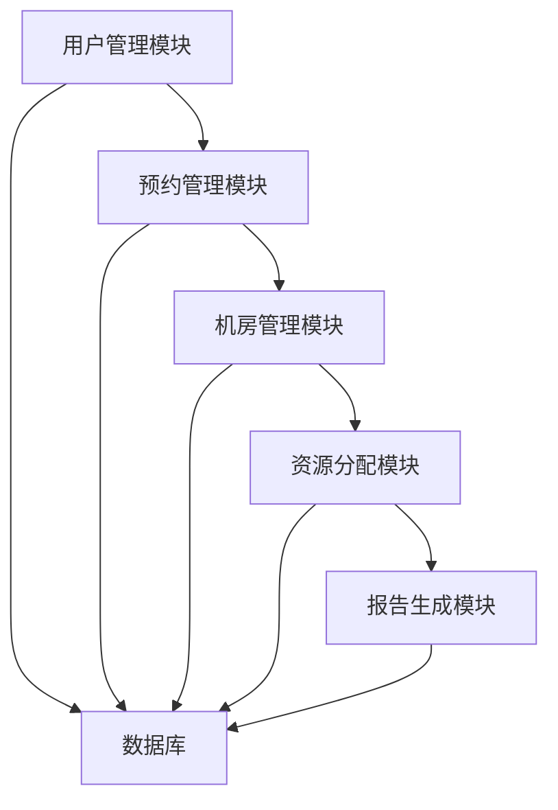

# 机房上机安排管理系统详细设计与具体代码实现

## 1.背景介绍

### 1.1 机房管理的挑战

在现代教育和科研环境中，计算机机房作为重要的教学和科研资源，承担着众多学生和研究人员的使用需求。然而，如何高效地安排和管理机房的使用时间，避免资源浪费和冲突，是一个长期存在的挑战。传统的人工管理方式不仅效率低下，还容易出现错误和遗漏，影响教学和科研的顺利进行。

### 1.2 机房上机安排管理系统的必要性

为了应对上述挑战，开发一个高效的机房上机安排管理系统显得尤为必要。该系统应能够自动化地处理机房使用申请，合理分配资源，提供实时的使用情况查询，并生成详细的使用报告，从而大幅提升管理效率，减少人为错误。

### 1.3 项目的目标

本项目的目标是设计并实现一个功能完备、易于使用的机房上机安排管理系统，具体包括以下几个方面：
- 自动化的机房使用申请和审批流程
- 实时的机房使用情况查询
- 智能的资源分配算法
- 详细的使用报告生成
- 用户友好的界面设计

## 2.核心概念与联系

### 2.1 系统架构

机房上机安排管理系统的整体架构可以分为以下几个模块：
- 用户管理模块
- 机房管理模块
- 预约管理模块
- 资源分配模块
- 报告生成模块

### 2.2 用户角色与权限

系统中的用户主要包括管理员、教师和学生。不同角色的用户具有不同的权限和功能：
- 管理员：负责系统的整体管理，包括用户管理、机房管理和预约审批等。
- 教师：可以申请机房使用、查询机房使用情况、查看使用报告等。
- 学生：可以查询机房使用情况、申请上机预约等。

### 2.3 数据库设计

系统需要一个高效的数据库来存储和管理各类数据，包括用户信息、机房信息、预约记录等。数据库的设计应考虑数据的完整性、一致性和查询效率。

## 3.核心算法原理具体操作步骤

### 3.1 预约冲突检测算法

在处理机房使用申请时，系统需要检测是否存在预约冲突。具体的操作步骤如下：
1. 获取当前申请的时间段和机房编号。
2. 查询数据库中该机房在该时间段的预约记录。
3. 检查是否存在时间重叠的预约记录。
4. 如果存在冲突，返回冲突提示；否则，允许预约。

### 3.2 资源分配算法

为了确保机房资源的合理利用，系统需要根据一定的规则进行资源分配。具体的操作步骤如下：
1. 获取所有申请记录，按申请时间排序。
2. 按照先到先得的原则，依次处理每个申请。
3. 对于每个申请，调用预约冲突检测算法，检查是否存在冲突。
4. 如果不存在冲突，更新数据库中的预约记录，确认预约成功。

### 3.3 报告生成算法

系统需要定期生成机房使用报告，供管理员和教师查看。具体的操作步骤如下：
1. 查询数据库中的所有预约记录。
2. 按机房编号和时间段对预约记录进行分类和统计。
3. 生成包含预约详情和统计数据的报告。

## 4.数学模型和公式详细讲解举例说明

### 4.1 预约冲突检测的数学模型

预约冲突检测可以看作是一个区间重叠问题。假设每个预约记录可以表示为一个时间区间 $[start_i, end_i]$，冲突检测的目标是判断新申请的时间区间 $[start_{new}, end_{new}]$ 是否与已有的时间区间重叠。

通过以下条件判断是否存在重叠：
$$
[start_{new}, end_{new}] \cap [start_i, end_i] \neq \emptyset
$$

具体的判断条件为：
$$
(start_{new} < end_i) \land (end_{new} > start_i)
$$

### 4.2 资源分配的优化模型

资源分配问题可以转化为一个优化问题，目标是最大化机房资源的利用率。假设有 $n$ 个申请记录，每个记录需要一个时间区间 $[start_i, end_i]$，我们需要找到一个最优的分配方案，使得机房的利用率最高。

可以通过动态规划的方法来解决这一问题。定义 $dp[i]$ 为前 $i$ 个申请记录中最大化机房利用率的最优解，则状态转移方程为：
$$
dp[i] = \max(dp[i-1], dp[j] + (end_i - start_i))
$$
其中，$j$ 是满足 $end_j \leq start_i$ 的最大索引。

## 4.项目实践：代码实例和详细解释说明

### 4.1 系统架构设计



### 4.2 数据库设计

```sql
CREATE TABLE Users (
    user_id INT PRIMARY KEY AUTO_INCREMENT,
    username VARCHAR(50) NOT NULL,
    password VARCHAR(50) NOT NULL,
    role ENUM('admin', 'teacher', 'student') NOT NULL
);

CREATE TABLE Rooms (
    room_id INT PRIMARY KEY AUTO_INCREMENT,
    room_name VARCHAR(50) NOT NULL,
    capacity INT NOT NULL
);

CREATE TABLE Reservations (
    reservation_id INT PRIMARY KEY AUTO_INCREMENT,
    user_id INT NOT NULL,
    room_id INT NOT NULL,
    start_time DATETIME NOT NULL,
    end_time DATETIME NOT NULL,
    FOREIGN KEY (user_id) REFERENCES Users(user_id),
    FOREIGN KEY (room_id) REFERENCES Rooms(room_id)
);
```

### 4.3 预约冲突检测算法实现

```python
def is_conflict(new_start, new_end, room_id):
    query = "SELECT start_time, end_time FROM Reservations WHERE room_id = %s"
    records = execute_query(query, (room_id,))
    for record in records:
        start, end = record
        if new_start < end and new_end > start:
            return True
    return False
```

### 4.4 资源分配算法实现

```python
def allocate_resources(reservations):
    reservations.sort(key=lambda x: x['start_time'])
    dp = [0] * len(reservations)
    for i in range(len(reservations)):
        dp[i] = reservations[i]['end_time'] - reservations[i]['start_time']
        for j in range(i):
            if reservations[j]['end_time'] <= reservations[i]['start_time']:
                dp[i] = max(dp[i], dp[j] + (reservations[i]['end_time'] - reservations[i]['start_time']))
    return max(dp)
```

### 4.5 报告生成算法实现

```python
def generate_report():
    query = "SELECT room_id, start_time, end_time FROM Reservations"
    records = execute_query(query)
    report = {}
    for record in records:
        room_id, start, end = record
        if room_id not in report:
            report[room_id] = []
        report[room_id].append((start, end))
    return report
```

## 5.实际应用场景

### 5.1 教学管理

在教学管理中，机房上机安排管理系统可以帮助教师和管理员高效地安排和管理机房的使用时间，确保教学活动的顺利进行。教师可以方便地申请机房使用，管理员可以实时查看机房的使用情况，并生成详细的使用报告。

### 5.2 科研管理

在科研管理中，机房上机安排管理系统可以帮助研究人员合理安排和管理机房的使用时间，提高科研效率。研究人员可以方便地申请机房使用，系统可以智能地分配资源，避免资源冲突和浪费。

### 5.3 企业培训

在企业培训中，机房上机安排管理系统可以帮助培训机构高效地安排和管理机房的使用时间，确保培训活动的顺利进行。培训师可以方便地申请机房使用，系统可以实时监控机房的使用情况，并生成详细的使用报告。

## 6.工具和资源推荐

### 6.1 开发工具

- **IDE**: 推荐使用 PyCharm 或 Visual Studio Code 进行开发。
- **数据库**: 推荐使用 MySQL 或 PostgreSQL 作为数据库管理系统。
- **前端框架**: 推荐使用 React 或 Vue.js 进行前端开发。
- **后端框架**: 推荐使用 Django 或 Flask 进行后端开发。

### 6.2 资源推荐

- **文档**: 推荐阅读官方文档和相关技术书