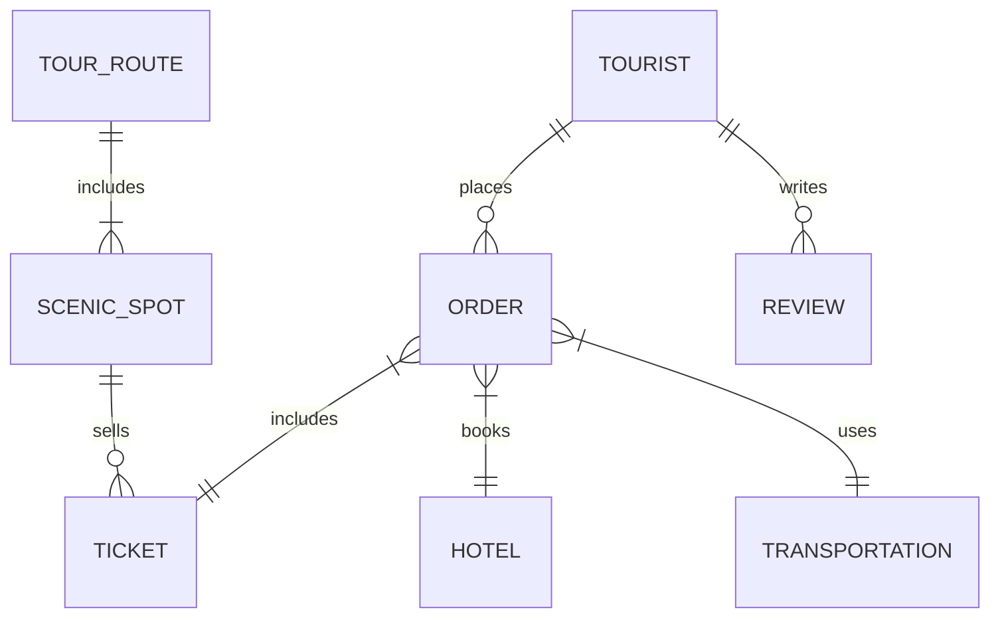
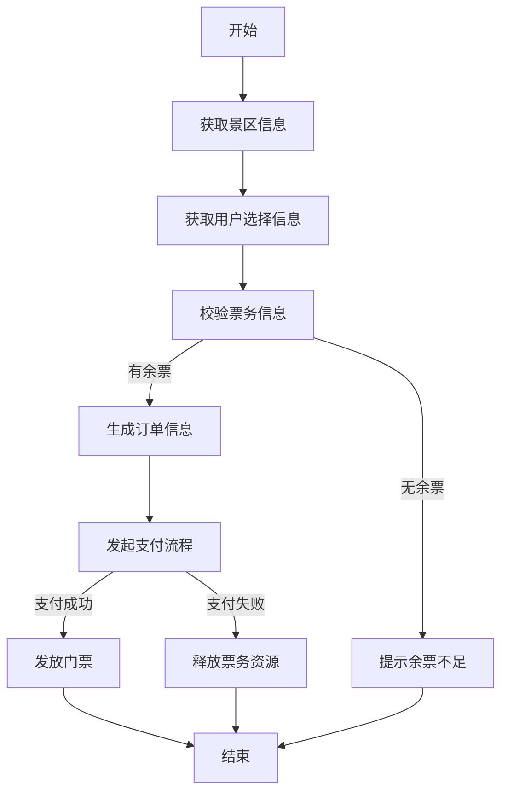
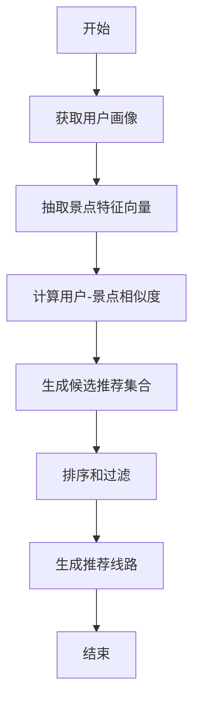

# 某旅游管理系统设计与实现

## 1. 背景介绍

### 1.1 旅游行业概况

旅游业是一个古老而又充满活力的产业。随着人们生活水平的提高和休闲时间的增加,旅游需求也在不断增长。旅游不仅能带来经济效益,还能促进文化交流、环境保护等。然而,传统的旅游管理模式已经无法满足现代旅游业的需求。

### 1.2 旅游管理系统的必要性

为了更好地管理旅游资源、提高服务质量、降低运营成本,构建一个高效的旅游管理系统势在必行。旅游管理系统可以实现景区门票预订、酒店入住、交通工具预订、旅游路线规划等功能,为游客提供一站式服务,同时也能帮助旅游企业优化资源配置、分析市场需求、制定营销策略等。

### 1.3 系统设计与实现的挑战

设计并实现一个高质量的旅游管理系统面临诸多挑战,例如:

- 需求复杂多变,涉及多方利益相关者
- 系统需要处理海量数据,具有高并发访问压力
- 需要实现多终端适配(PC、移动端等)
- 系统安全性和可靠性要求较高
- 需要与第三方系统(支付、地图等)对接

## 2. 核心概念与联系

### 2.1 系统架构

旅游管理系统通常采用分层架构设计,主要包括:

- 表现层(前端):负责展示界面和接收用户交互
- 业务逻辑层:实现系统的核心业务功能逻辑
- 数据访问层:负责对底层数据的持久化操作
- 基础设施层:提供系统运行所需的基础服务(消息队列、缓存等)

### 2.2 核心概念

- **旅游景点(Scenic Spot)**: 游客旅游观光的目的地,包括自然景观和人文景观。
- **旅游线路(Tour Route)**: 预先设计和安排的一系列旅游景点组合。
- **酒店(Hotel)**: 为游客提供住宿服务的场所。
- **交通工具(Transportation)**: 游客在旅游过程中使用的交通方式,如飞机、火车、汽车等。
- **门票(Ticket)**: 游客进入景区所需要购买的凭证。
- **订单(Order)**: 记录游客预订的旅游产品和服务的信息。

### 2.3 关系模型

## 3. 核心算法原理具体操作步骤

### 3.1 景区门票预订

#### 3.1.1 算法描述

景区门票预订功能需要解决以下几个核心问题:

1. 票务信息管理: 维护景区的开放时间、门票价格、余票数量等动态信息。
2. 并发控制: 防止同一张门票被多个用户重复预订。
3. 支付流程: 为用户预订门票提供安全可靠的支付渠道。
4. 防刷票策略: 限制单个用户的最大预订量,避免恶意行为。

#### 3.1.2 算法流程

1. 获取景区的开放时间、门票价格、余票数量等信息。
2. 获取用户选择的景区、日期、数量等预订信息。
3. 校验票务信息,检查是否有足够余票。
4. 如果有余票,生成订单信息,包括订单号、金额等。
5. 发起支付流程,调用第三方支付系统。
6. 如果支付成功,发放门票给用户;如果支付失败,释放票务资源。
7. 结束流程。

#### 3.1.3 并发控制

为了防止同一张门票被多个用户重复预订,可以采用乐观锁或悲观锁策略。

**乐观锁**:

1. 在查询景区票务信息时,获取一个版本号(version)。
2. 当用户下单时,将该版本号作为条件,更新票务信息(余票数量等)。
3. 如果更新成功,说明没有并发冲突;否则返回错误,让用户重试。

**悲观锁**:

1. 在查询景区票务信息时,对相关记录加排他锁。
2. 用户下单时,直接更新票务信息。
3. 下单完成后,释放锁。

### 3.2 旅游线路推荐

#### 3.2.1 算法描述

旅游线路推荐是一个典型的推荐系统问题,需要解决以下核心问题:

1. 景点特征抽取: 从景点的文本描述、图片、位置等信息中抽取特征向量。
2. 用户画像构建: 根据用户的历史行为数据(浏览记录、评分等)构建用户画像向量。
3. 相似度计算: 计算用户画像与景点特征向量的相似度,得到候选推荐集合。
4. 排序和过滤: 根据相似度对候选集合进行排序,并结合其他规则(如路线距离、时间等)过滤不合适的线路。

#### 3.2.2 算法流程

1. 从用户的浏览记录、评分等历史行为数据中构建用户画像向量。
2. 从景点的文本描述、图片、位置等信息中抽取景点特征向量。
3. 计算用户画像向量与景点特征向量的相似度,得到候选推荐集合。
4. 根据相似度对候选集合进行排序,结合路线距离、时间等规则过滤不合适的线路。
5. 从过滤后的集合中生成最终的推荐线路。

#### 3.2.3 相似度计算

相似度计算是推荐系统的核心环节,常用的方法有:

1. **余弦相似度**

$$\text{sim}(u, i) = \cos(\vec{u}, \vec{i}) = \frac{\vec{u} \cdot \vec{i}}{|\vec{u}||\vec{i}|}$$

其中 $\vec{u}$ 为用户画像向量, $\vec{i}$ 为景点特征向量。

2. **欧氏距离**

$$\text{dist}(u, i) = \sqrt{\sum_{j=1}^{n}{(u_j - i_j)^2}}$$

距离越小,相似度越高。

3. **皮尔逊相关系数**

$$\text{sim}(u, i) = \frac{\sum_{j=1}^{n}{(u_j - \overline{u})(i_j - \overline{i})}}{\sqrt{\sum_{j=1}^{n}{(u_j - \overline{u})^2}}\sqrt{\sum_{j=1}^{n}{(i_j - \overline{i})^2}}}$$

其中 $\overline{u}$ 和 $\overline{i}$ 分别为用户向量和景点向量的均值。

### 3.3 酒店推荐

酒店推荐算法的核心思想与旅游线路推荐类似,主要包括以下步骤:

1. 从酒店的文本描述、设施、价格、位置等信息中抽取特征向量。
2. 根据用户的历史预订记录、评分等构建用户画像向量。
3. 计算用户画像向量与酒店特征向量的相似度。
4. 根据相似度对酒店进行排序,同时结合目的地、价格区间等条件过滤。
5. 生成最终的推荐酒店列表。

在相似度计算方面,可以参考旅游线路推荐中介绍的余弦相似度、欧氏距离、皮尔逊相关系数等方法。

## 4. 数学模型和公式详细讲解举例说明

### 4.1 协同过滤算法

协同过滤(Collaborative Filtering)是推荐系统中常用的一种算法,基于这样一个假设:**喜好相似的用户对同一个项目也会有相似的评分**。根据基于用户还是基于项目的不同,协同过滤算法可以分为两类:

#### 4.1.1 基于用户的协同过滤

假设有 $m$ 个用户, $n$ 个项目,用 $r_{ui}$ 表示用户 $u$ 对项目 $i$ 的评分,则用户 $u$ 和用户 $v$ 的相似度可以用**余弦相似度**或**皮尔逊相关系数**来计算:

**余弦相似度**:

$$\text{sim}(u, v) = \cos(\vec{u}, \vec{v}) = \frac{\sum_{i \in I}{r_{ui}r_{vi}}}{\sqrt{\sum_{i \in I}{r_{ui}^2}}\sqrt{\sum_{i \in I}{r_{vi}^2}}}$$

其中 $I$ 为用户 $u$ 和用户 $v$ 都评分过的项目集合。

**皮尔逊相关系数**:

$$\text{sim}(u, v) = \frac{\sum_{i \in I}{(r_{ui} - \overline{r_u})(r_{vi} - \overline{r_v})}}{\sqrt{\sum_{i \in I}{(r_{ui} - \overline{r_u})^2}}\sqrt{\sum_{i \in I}{(r_{vi} - \overline{r_v})^2}}}$$

其中 $\overline{r_u}$ 和 $\overline{r_v}$ 分别为用户 $u$ 和用户 $v$ 的平均评分。

对于目标用户 $u$,可以根据与其他用户的相似度及其他用户对项目 $j$ 的评分,预测用户 $u$ 对项目 $j$ 的评分:

$$\hat{r}_{uj} = \overline{r_u} + \frac{\sum_{v \in U(j)}\text{sim}(u, v)(r_{vj} - \overline{r_v})}{\sum_{v \in U(j)}|\text{sim}(u, v)|}$$

其中 $U(j)$ 为对项目 $j$ 评分过的用户集合。

#### 4.1.2 基于项目的协同过滤

基于项目的协同过滤算法与基于用户的算法思路类似,不同之处在于计算相似度的对象是项目而不是用户。假设有 $m$ 个用户, $n$ 个项目,用 $r_{ui}$ 表示用户 $u$ 对项目 $i$ 的评分,则项目 $i$ 和项目 $j$ 的相似度可以用**余弦相似度**或**皮尔逊相关系数**来计算:

**余弦相似度**:

$$\text{sim}(i, j) = \cos(\vec{i}, \vec{j}) = \frac{\sum_{u \in U}{r_{ui}r_{uj}}}{\sqrt{\sum_{u \in U}{r_{ui}^2}}\sqrt{\sum_{u \in U}{r_{uj}^2}}}$$

其中 $U$ 为对项目 $i$ 和项目 $j$ 都评分过的用户集合。

**皮尔逊相关系数**:

$$\text{sim}(i, j) = \frac{\sum_{u \in U}{(r_{ui} - \overline{r_i})(r_{uj} - \overline{r_j})}}{\sqrt{\sum_{u \in U}{(r_{ui} - \overline{r_i})^2}}\sqrt{\sum_{u \in U}{(r_{uj} - \overline{r_j})^2}}}$$

其中 $\overline{r_i}$ 和 $\overline{r_j}$ 分别为项目 $i$ 和项目 $j$ 的平均评分。

对于目标用户 $u$,可以根据项目相似度及用户 $u$ 对其他相似项目的评分,预测用户 $u$ 对项目 $j$ 的评分:

$$\hat{r}_{uj} =