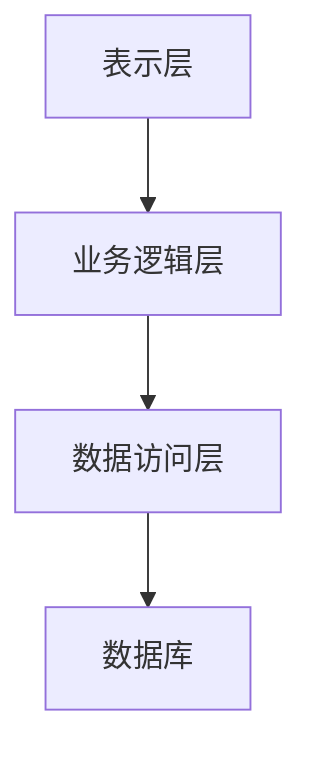

# 校园网站设计系统详细设计与具体代码实现

作者：禅与计算机程序设计艺术

## 1.背景介绍

### 1.1 项目背景

在当今数字化时代，校园网站已经成为学校与学生、教师、家长及社会公众之间沟通的重要桥梁。一个功能齐全、用户体验良好的校园网站不仅能够提升学校的形象，还能提高信息传递的效率，促进教育资源的共享。本文将详细介绍一个校园网站设计系统的详细设计与具体代码实现，旨在为读者提供一个完整的解决方案。

### 1.2 目标与意义

本项目的目标是设计并实现一个功能齐全、用户友好的校园网站系统。通过本项目的实施，能够实现以下目标：

- 提供一个信息发布的平台，方便学校发布公告、新闻等信息。
- 提供一个资源共享的平台，方便教师上传教学资源，学生下载学习资料。
- 提供一个互动交流的平台，方便师生之间的沟通交流。
- 提供一个管理平台，方便学校对网站内容进行管理和维护。

### 1.3 项目需求分析

在设计校园网站之前，首先需要进行详细的需求分析。主要包括以下几个方面：

- 用户需求：包括学生、教师、家长和管理员的需求。
- 功能需求：包括信息发布、资源共享、互动交流和管理功能。
- 性能需求：包括系统的响应速度、并发处理能力等。
- 安全需求：包括用户权限管理、数据加密等。

## 2.核心概念与联系

### 2.1 系统架构

一个典型的校园网站系统通常采用分层架构设计，包括表示层、业务逻辑层和数据访问层。各层之间通过接口进行通信，保证系统的模块化和可维护性。



### 2.2 模块划分

根据功能需求，系统可以划分为以下几个主要模块：

- 用户管理模块：实现用户的注册、登录、权限管理等功能。
- 信息发布模块：实现新闻、公告等信息的发布和管理功能。
- 资源共享模块：实现教学资源的上传、下载和管理功能。
- 互动交流模块：实现论坛、留言板等互动功能。
- 系统管理模块：实现网站内容的管理和维护功能。

### 2.3 技术选型

在技术选型方面，本文选用了以下技术栈：

- 前端技术：HTML5、CSS3、JavaScript、Vue.js
- 后端技术：Java、Spring Boot
- 数据库：MySQL
- 开发工具：IntelliJ IDEA、Visual Studio Code
- 版本控制：Git

## 3.核心算法原理具体操作步骤

### 3.1 用户注册与登录

用户注册与登录是校园网站的基本功能之一。其核心算法主要包括密码加密、用户身份验证等。

#### 3.1.1 密码加密

为了保证用户密码的安全性，通常使用哈希算法对密码进行加密。常用的哈希算法包括MD5、SHA-256等。

```java
import java.security.MessageDigest;
import java.security.NoSuchAlgorithmException;

public class PasswordUtil {
    public static String hashPassword(String password) throws NoSuchAlgorithmException {
        MessageDigest md = MessageDigest.getInstance("SHA-256");
        byte[] hash = md.digest(password.getBytes());
        StringBuilder hexString = new StringBuilder();
        for (byte b : hash) {
            hexString.append(Integer.toHexString(0xff & b));
        }
        return hexString.toString();
    }
}
```

#### 3.1.2 用户身份验证

用户登录时，需要对用户输入的用户名和密码进行验证。验证通过后，生成一个会话令牌（Session Token）并返回给客户端。

```java
@RestController
@RequestMapping("/auth")
public class AuthController {
    @Autowired
    private UserService userService;

    @PostMapping("/login")
    public ResponseEntity<String> login(@RequestBody LoginRequest loginRequest) {
        User user = userService.findByUsername(loginRequest.getUsername());
        if (user != null && PasswordUtil.hashPassword(loginRequest.getPassword()).equals(user.getPassword())) {
            String token = TokenUtil.generateToken(user);
            return ResponseEntity.ok(token);
        } else {
            return ResponseEntity.status(HttpStatus.UNAUTHORIZED).body("Invalid credentials");
        }
    }
}
```

### 3.2 信息发布

信息发布模块主要包括新闻、公告等信息的发布和管理功能。其核心算法主要包括信息的存储、检索和展示。

#### 3.2.1 信息存储

信息发布时，需要将信息存储到数据库中。可以使用ORM框架（如Hibernate）进行数据库操作。

```java
@Entity
public class News {
    @Id
    @GeneratedValue(strategy = GenerationType.IDENTITY)
    private Long id;
    private String title;
    private String content;
    private LocalDateTime publishDate;

    // getters and setters
}

@Repository
public interface NewsRepository extends JpaRepository<News, Long> {
}
```

#### 3.2.2 信息检索

信息检索时，可以根据关键词、发布时间等条件进行检索。可以使用JPA提供的查询方法进行数据库操作。

```java
@Service
public class NewsService {
    @Autowired
    private NewsRepository newsRepository;

    public List<News> searchNews(String keyword) {
        return newsRepository.findByTitleContainingOrContentContaining(keyword, keyword);
    }
}
```

#### 3.2.3 信息展示

信息展示时，可以使用前端框架（如Vue.js）进行页面渲染。

```html
<template>
  <div>
    <h1>News</h1>
    <div v-for="news in newsList" :key="news.id">
      <h2>{{ news.title }}</h2>
      <p>{{ news.content }}</p>
      <p>{{ news.publishDate }}</p>
    </div>
  </div>
</template>

<script>
export default {
  data() {
    return {
      newsList: []
    };
  },
  created() {
    this.fetchNews();
  },
  methods: {
    fetchNews() {
      this.$http.get('/api/news').then(response => {
        this.newsList = response.data;
      });
    }
  }
};
</script>
```

## 4.数学模型和公式详细讲解举例说明

### 4.1 用户行为分析

在校园网站中，可以通过分析用户的行为数据，了解用户的需求和偏好，从而优化网站的功能和内容。常用的用户行为分析方法包括点击流分析、热图分析等。

#### 4.1.1 点击流分析

点击流分析是通过记录用户在网站上的点击行为，分析用户的访问路径和行为习惯。可以使用马尔可夫链模型对用户的点击行为进行建模。

马尔可夫链模型的数学表示如下：

$$
P(X_{n+1} = x | X_1 = x_1, X_2 = x_2, \ldots, X_n = x_n) = P(X_{n+1} = x | X_n = x_n)
$$

其中，$X_n$ 表示用户在第$n$步的点击行为，$P$ 表示转移概率。

#### 4.1.2 热图分析

热图分析是通过记录用户在页面上的点击和滚动行为，生成热图，直观展示用户的关注区域和点击热点。可以使用二维高斯分布对用户的点击行为进行建模。

二维高斯分布的数学表示如下：

$$
f(x, y) = \frac{1}{2 \pi \sigma_x \sigma_y \sqrt{1 - \rho^2}} \exp \left( -\frac{1}{2(1 - \rho^2)} \left[ \frac{(x - \mu_x)^2}{\sigma_x^2} - 2\rho\frac{(x - \mu_x)(y - \mu_y)}{\sigma_x \sigma_y} + \frac{(y - \mu_y)^2}{\sigma_y^2} \right] \right)
$$

其中，$\mu_x$ 和 $\mu_y$ 分别表示$x$和$y$方向的均值，$\sigma_x$ 和 $\sigma_y$ 分别表示$x$和$y$方向的标准差，$\rho$ 表示相关系数。

### 4.2 数据挖掘

在校园网站中，可以通过数据挖掘技术，从大量的用户行为数据中挖掘出有价值的信息。常用的数据挖掘方法包括聚类分析、关联规则挖掘等。

#### 4.2.1 聚类分析

聚类分析是将相似的用户行为数据归为一类，从而发现用户的行为模式。常用的聚类算法包括K-means算法等。

K-means算法的数学表示如下：

$$
J = \sum_{i=1}^{k} \sum_{j=1}^{n} \| x_j^{(i)} - \mu_i \|^2
$$

其中，