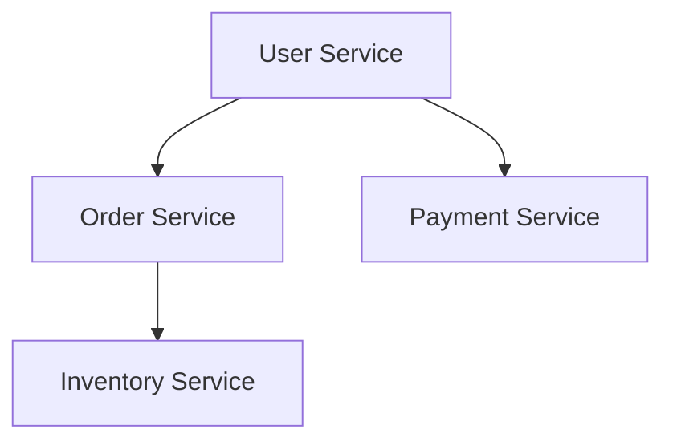

# 案例分析：学习借鉴优秀实践经验

作者：禅与计算机程序设计艺术

## 1. 背景介绍

### 1.1 引言

在当今快速发展的技术领域，学习和借鉴优秀的实践经验是提升自身技术水平和团队效率的关键。通过对成功案例的深入分析，我们可以发现隐藏在成功背后的逻辑和方法，从而将这些经验应用到自己的项目中。本文将通过对几个经典案例的详细解析，探讨这些项目在设计、开发、实施和维护过程中采用的最佳实践。

### 1.2 目的与意义

本文旨在通过对优秀实践案例的分析，帮助读者理解和掌握这些项目成功的核心因素。通过对这些案例的深入研究，读者不仅可以学习到具体的技术实现方法，还能了解项目管理和团队协作的技巧，为自己未来的项目提供有益的参考。

### 1.3 案例选择标准

为了确保案例的代表性和实用性，我们选择了在不同领域具有广泛影响力和成功经验的项目。这些案例涵盖了人工智能、云计算、大数据、软件开发等多个领域，具有很高的参考价值。

## 2. 核心概念与联系

### 2.1 最佳实践的定义

最佳实践（Best Practices）是指在特定领域内，被广泛认可和采用的最有效和高效的方法和技术。这些方法和技术通常是通过长期的实践和验证总结出来的，具有很高的参考价值。

### 2.2 核心概念

在分析案例时，我们将重点关注以下几个核心概念：

- **设计模式（Design Patterns）**：解决常见设计问题的通用解决方案。
- **敏捷开发（Agile Development）**：一种灵活的开发方法，强调快速迭代和持续改进。
- **持续集成（Continuous Integration，CI）**：一种软件开发实践，要求开发人员频繁地将代码集成到主干中。
- **持续交付（Continuous Delivery，CD）**：一种软件工程方法，确保软件可以随时发布到生产环境中。
- **微服务架构（Microservices Architecture）**：一种架构风格，将应用程序拆分为一系列小的、独立部署的服务。

### 2.3 概念之间的联系

这些核心概念之间存在着紧密的联系。例如，敏捷开发强调快速迭代和持续改进，而持续集成和持续交付正是实现这一目标的关键技术手段。微服务架构则提供了一种灵活的系统设计方式，使得敏捷开发和持续交付更加容易实现。

## 3. 核心算法原理具体操作步骤

### 3.1 设计模式

#### 3.1.1 单例模式（Singleton Pattern）

单例模式是一种创建型设计模式，确保一个类只有一个实例，并提供一个全局访问点。

```java
public class Singleton {
    private static Singleton instance;

    private Singleton() {}

    public static Singleton getInstance() {
        if (instance == null) {
            instance = new Singleton();
        }
        return instance;
    }
}
```

#### 3.1.2 工厂模式（Factory Pattern）

工厂模式是一种创建型设计模式，定义一个接口用于创建对象，但让子类决定实例化哪一个类。

```java
public interface Shape {
    void draw();
}

public class Circle implements Shape {
    public void draw() {
        System.out.println("Drawing Circle");
    }
}

public class ShapeFactory {
    public Shape getShape(String shapeType) {
        if (shapeType == null) {
            return null;
        }
        if (shapeType.equalsIgnoreCase("CIRCLE")) {
            return new Circle();
        }
        return null;
    }
}
```

### 3.2 敏捷开发

#### 3.2.1 Scrum 框架

Scrum 是一种敏捷开发框架，强调团队协作和快速迭代。

- **产品待办列表（Product Backlog）**：待开发的功能列表。
- **冲刺（Sprint）**：一个短周期的开发阶段，通常为 2-4 周。
- **每日站会（Daily Stand-up）**：团队每天进行的简短会议，分享进展和问题。

### 3.3 持续集成与持续交付

#### 3.3.1 持续集成

持续集成要求开发人员频繁地将代码集成到主干中，并通过自动化测试确保代码的质量。

```yaml
# .github/workflows/ci.yml
name: CI

on: [push, pull_request]

jobs:
  build:
    runs-on: ubuntu-latest
    steps:
      - name: Checkout code
        uses: actions/checkout@v2
      - name: Set up JDK 11
        uses: actions/setup-java@v1
        with:
          java-version: '11'
      - name: Build with Gradle
        run: ./gradlew build
```

#### 3.3.2 持续交付

持续交付确保软件可以随时发布到生产环境中，通常与持续集成结合使用。

```yaml
# .github/workflows/cd.yml
name: CD

on:
  push:
    branches:
      - main

jobs:
  deploy:
    runs-on: ubuntu-latest
    steps:
      - name: Checkout code
        uses: actions/checkout@v2
      - name: Deploy to production
        run: ./deploy.sh
```

### 3.4 微服务架构

#### 3.4.1 服务拆分

将应用程序拆分为多个独立的服务，每个服务都负责特定的功能。



#### 3.4.2 服务通信

微服务之间通常通过 REST API 或消息队列进行通信。

```java
@RestController
public class OrderController {
    @Autowired
    private PaymentService paymentService;

    @PostMapping("/order")
    public ResponseEntity<Order> createOrder(@RequestBody Order order) {
        paymentService.processPayment(order.getPayment());
        return new ResponseEntity<>(order, HttpStatus.CREATED);
    }
}
```

## 4. 数学模型和公式详细讲解举例说明

### 4.1 机器学习中的数学模型

#### 4.1.1 线性回归

线性回归是一种基本的机器学习算法，用于预测连续值。其基本公式为：

$$
y = \beta_0 + \beta_1 x + \epsilon
$$

其中，$y$ 是预测值，$\beta_0$ 是截距，$\beta_1$ 是斜率，$x$ 是自变量，$\epsilon$ 是误差项。

#### 4.1.2 梯度下降

梯度下降是一种优化算法，用于最小化损失函数。其更新公式为：

$$
\theta := \theta - \alpha \frac{\partial}{\partial \theta} J(\theta)
$$

其中，$\theta$ 是参数，$\alpha$ 是学习率，$J(\theta)$ 是损失函数。

### 4.2 示例：线性回归的实现

```python
import numpy as np

# 生成数据
X = 2 * np.random.rand(100, 1)
y = 4 + 3 * X + np.random.randn(100, 1)

# 添加截距项
X_b = np.c_[np.ones((100, 1)), X]

# 初始化参数
theta_best = np.linalg.inv(X_b.T.dot(X_b)).dot(X_b.T).dot(y)

# 预测
X_new = np.array([[0], [2]])
X_new_b = np.c_[np.ones((2, 1)), X_new]
y_predict = X_new_b.dot(theta_best)

print(y_predict)
```

## 5. 项目实践：代码实例和详细解释说明

### 5.1 项目背景

假设我们正在开发一个在线书店的系统，需要实现订单管理和支付处理功能。我们决定采用微服务架构，并使用持续集成和持续交付来确保代码的质量和部署的稳定性。

### 5.2 代码实例

#### 5.2.1 用户服务

```java
@RestController
@RequestMapping("/users")
public class UserController {
    @Autowired
    private UserService userService;

    @PostMapping
    public ResponseEntity<User> createUser(@RequestBody User user) {
        User createdUser = userService.createUser(user);
        return new ResponseEntity<>(createdUser, HttpStatus.CREATED);
    }

    @GetMapping("/{id}")
    public ResponseEntity<User> getUser(@PathVariable Long id) {
        User user = userService.getUserById(id);
        return new ResponseEntity<>(user, HttpStatus.OK);
    }
}
```

#### 5.2.2 订单服务

```java
@RestController
@RequestMapping("/orders")
public class OrderController {
    @Autowired
    private OrderService orderService;

    @PostMapping
    public ResponseEntity<Order> createOrder(@RequestBody Order order) {
        Order createdOrder = orderService