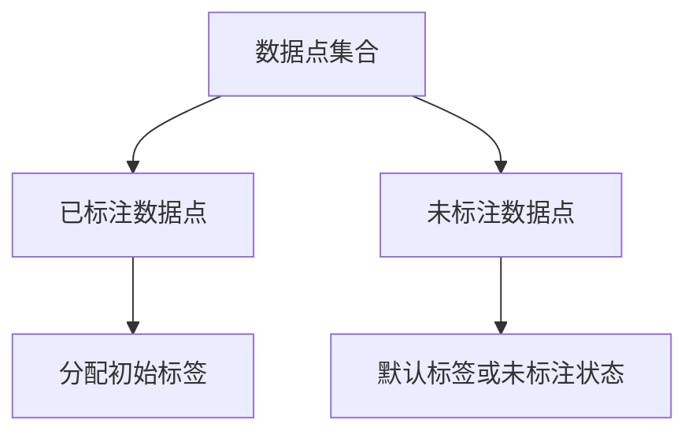
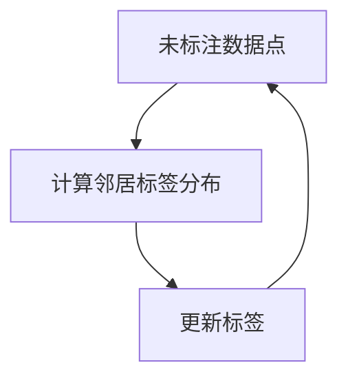
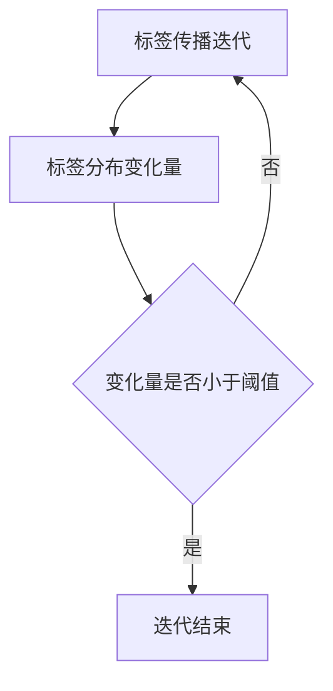
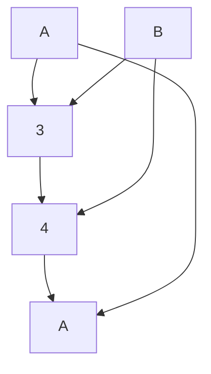

# 概率论与统计学：标签传播算法的数学支柱

作者：禅与计算机程序设计艺术

## 1. 背景介绍

### 1.1 标签传播算法的起源

标签传播算法（Label Propagation Algorithm, LPA）是一种基于图的半监督学习算法，用于解决分类问题。它的核心思想是通过图结构中的节点相互传播标签信息，最终达到标签分配的目的。LPA 最早由 Zhu 和 Ghahramani 在2002年提出，旨在利用图结构的连通性信息来提升分类效果。

### 1.2 概率论与统计学在算法中的作用

概率论与统计学是标签传播算法的数学基础。概率论为我们提供了处理不确定性和随机事件的工具，而统计学则帮助我们从数据中提取有用的信息。在 LPA 中，概率论用于描述标签传播过程中的不确定性，而统计学则用于评估和优化算法性能。

### 1.3 本文目的

本文旨在深入探讨标签传播算法的数学基础，详细解释其核心概念、算法原理、数学模型，并通过实际项目实践展示其应用。希望通过本文，读者能够全面了解标签传播算法的理论与实践，并能在实际项目中应用这一算法。

## 2. 核心概念与联系

### 2.1 图论基础

#### 2.1.1 图的定义

在数学中，图 $G = (V, E)$ 由一组顶点 $V$ 和一组边 $E$ 组成。顶点代表对象，边表示对象之间的关系。在标签传播算法中，顶点通常表示数据点，边表示数据点之间的相似性或连接关系。

#### 2.1.2 图的类型

图可以是有向图或无向图。无向图中的边没有方向性，而有向图中的边有方向性。在 LPA 中，通常使用无向图来表示数据点之间的对称关系。

### 2.2 标签传播的基本思想

#### 2.2.1 标签初始化

标签传播算法的第一步是标签初始化。初始标签可以根据已有的部分标注数据进行设置，未标注的数据点则被赋予一个默认标签或未标注状态。

#### 2.2.2 标签传播过程

标签传播过程是一个迭代过程。在每次迭代中，每个未标注的数据点会根据其邻居的数据点的标签信息更新自己的标签。这个过程会持续进行，直到标签分布稳定不再变化。

### 2.3 概率论与统计学在标签传播中的应用

#### 2.3.1 概率分布

在标签传播过程中，每个数据点的标签可以看作是一个随机变量，其值服从一定的概率分布。通过概率分布，我们可以描述标签传播过程中的不确定性。

#### 2.3.2 贝叶斯统计

贝叶斯统计为我们提供了一种更新标签信息的方法。通过贝叶斯公式，我们可以根据先验概率和观测数据计算后验概率，从而更新数据点的标签信息。

## 3. 核心算法原理具体操作步骤

### 3.1 算法流程概述

标签传播算法的核心流程可以概括为以下几个步骤：

1. 标签初始化
2. 标签传播迭代
3. 收敛判定

### 3.2 详细操作步骤

#### 3.2.1 标签初始化

首先，我们需要为部分数据点分配初始标签。初始标签可以根据已有的标注数据进行设置，未标注的数据点则被赋予一个默认标签或未标注状态。



#### 3.2.2 标签传播迭代

在每次迭代中，每个未标注的数据点会根据其邻居的数据点的标签信息更新自己的标签。具体步骤如下：

1. 对于每个未标注的数据点 $v_i$，计算其邻居 $N(v_i)$ 的标签分布。
2. 根据邻居的标签分布，更新 $v_i$ 的标签，使其标签与邻居的标签分布一致。



#### 3.2.3 收敛判定

标签传播过程会持续进行，直到标签分布稳定不再变化。收敛判定的标准可以是标签分布的变化量小于某个阈值，或者达到最大迭代次数。



## 4. 数学模型和公式详细讲解举例说明

### 4.1 标签传播的数学模型

#### 4.1.1 随机游走模型

标签传播可以看作是一个随机游走过程。在图 $G = (V, E)$ 上，随机游走模型描述了数据点在图上的移动过程。每个数据点的标签更新可以看作是从其邻居中随机选择一个标签的过程。

#### 4.1.2 概率转移矩阵

在随机游走模型中，概率转移矩阵 $P$ 描述了从一个数据点移动到另一个数据点的概率。对于无向图，概率转移矩阵 $P$ 可以表示为：

$$
P_{ij} = \begin{cases}
\frac{1}{d_i} & \text{如果 } (i, j) \in E \\
0 & \text{否则}
\end{cases}
$$

其中，$d_i$ 表示数据点 $i$ 的度，即与 $i$ 相连的边的数量。

### 4.2 标签更新公式

在标签传播过程中，每个数据点的标签更新可以表示为：

$$
L_i^{(t+1)} = \arg \max_{l \in \mathcal{L}} \sum_{j \in N(i)} P_{ij} \cdot \delta(L_j^{(t)}, l)
$$

其中，$L_i^{(t)}$ 表示数据点 $i$ 在第 $t$ 次迭代中的标签，$\mathcal{L}$ 表示标签集合，$\delta(a, b)$ 是 Kronecker delta 函数，当 $a = b$ 时取值为 1，否则为 0。

### 4.3 举例说明

假设我们有一个简单的图，包含 5 个数据点和 6 条边，初始标签如下：

```
节点 1: 标签 A
节点 2: 标签 B
节点 3: 未标注
节点 4: 未标注
节点 5: 标签 A
```

图结构如下：



在第一次迭代中，节点 3 的邻居是节点 1 和节点 2，其标签分布为 {A: 1, B: 1}，因此节点 3 的标签更新为 A 或 B。节点 4 的邻居是节点 3 和节点 5，其标签分布为 {A: 1}，因此节点 4 的标签更新为 A。

## 5. 项目实践：代码实例和详细解释说明

### 5.1 数据准备

首先，我们需要准备一个图数据结构，并初始化节点和边。以下是一个简单的 Python 实现：

```python
import networkx as nx

# 创建图
G = nx.Graph()

# 添加节点
G.add_nodes_from([1, 2, 3, 4, 5])

# 添加边
G.add_edges_from([(1, 3), (2, 3), (3, 4), (4, 5), (1, 5), (2, 4)])

# 初始化标签
labels = {1: 'A', 2: 'B', 3: None, 4: None, 5: 'A'}
```

### 5.2 标签传播算法实现

接下来，我们实现标签传播算法：

```python
def label_propagation(G, labels, max_iter=100):
    for _ in range(max_iter):
        new_labels = labels.copy()
        for node in G.nodes():
            if labels[node] is None:
                neighbor_labels = [labels[neighbor] for neighbor in G.neighbors(node) if labels[neighbor] is not None]
                if neighbor_labels:
                    new_labels[node] = max(set(neighbor_labels), key=neighbor_labels.count)
       