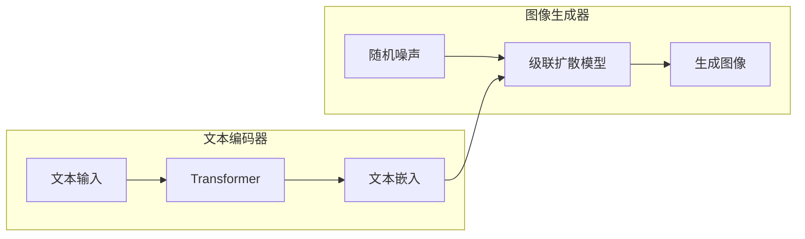

##  1. 背景介绍

### 1.1 文本到图像合成的兴起

近年来，人工智能领域取得了令人瞩目的进展，其中文本到图像合成技术成为了备受关注的研究热点。这项技术旨在将自然语言描述转换为逼真的图像，为艺术创作、设计、虚拟现实等领域带来了无限可能。从早期的基于检索的方法到如今的生成式模型，文本到图像合成技术经历了巨大的飞跃，而 Imagen 作为其中的佼佼者，凭借其卓越的生成质量和对复杂语义的理解能力，成为了该领域的里程碑。

### 1.2  Imagen 的突破与创新

Imagen 是 Google Research 推出的一种基于扩散模型的文本到图像生成模型，其最大特点是能够生成超高分辨率、细节丰富、语义准确的图像。相较于之前的模型，Imagen 在以下几个方面实现了突破：

* **超大规模预训练:** Imagen 基于 Transformer 架构，并在海量文本-图像数据上进行了预训练，使其具备强大的语言理解和图像生成能力。
* **高效的扩散模型:**  Imagen 采用了级联扩散模型，通过逐步降噪的方式生成图像，有效提升了生成质量和效率。
* **文本引导的生成过程:** Imagen 将文本信息融入到图像生成的每个阶段，从而保证了生成的图像与文本描述高度一致。

### 1.3 本文的写作目的

本文旨在深入解析 Imagen 的核心网络设计，帮助读者全面理解其工作原理和技术细节。文章将从模型的整体架构出发，逐步介绍各个模块的功能和实现方式，并结合代码实例和应用场景，帮助读者更好地理解和应用 Imagen。


## 2. 核心概念与联系

### 2.1 扩散模型

扩散模型 (Diffusion Models) 是一种生成式模型，其基本思想是通过逐步添加高斯噪声将真实数据转换为噪声分布，然后学习逆向过程，将噪声转换为真实数据。在图像生成领域，扩散模型通过学习将随机噪声图像逐步去噪，最终生成逼真的图像。

#### 2.1.1 前向扩散过程

前向扩散过程是指将真实图像 $x_0$ 逐步添加高斯噪声，最终得到一个纯噪声图像 $x_T$ 的过程。该过程可以表示为：

$$
x_t = \sqrt{1 - \beta_t} x_{t-1} + \beta_t \epsilon_t, \quad t = 1, 2, ..., T
$$

其中，$\beta_t$ 是预先定义的噪声方差，$\epsilon_t \sim \mathcal{N}(0, I)$ 是标准高斯噪声。

#### 2.1.2 反向扩散过程

反向扩散过程是指学习一个模型 $p_\theta(x_{t-1}|x_t)$，将带噪声的图像 $x_t$ 逐步去噪，最终得到真实图像 $x_0$。该过程可以表示为：

$$
x_{t-1} = \mu_\theta(x_t, t) + \sigma_t \epsilon_t, \quad t = T, T-1, ..., 1
$$

其中，$\mu_\theta(x_t, t)$ 和 $\sigma_t$ 分别是模型预测的均值和方差，$\epsilon_t \sim \mathcal{N}(0, I)$ 是标准高斯噪声。

### 2.2 Transformer

Transformer 是一种基于自注意力机制的深度学习模型，最初应用于自然语言处理领域，近年来在计算机视觉领域也取得了巨大成功。Transformer 的核心是自注意力机制，它能够捕捉序列数据中不同位置之间的依赖关系，从而更好地理解和处理序列数据。

#### 2.2.1 自注意力机制

自注意力机制的计算过程可以概括为三个步骤：

1. **计算查询向量、键向量和值向量:** 对于输入序列中的每个元素，分别计算其对应的查询向量 $q_i$、键向量 $k_i$ 和值向量 $v_i$。
2. **计算注意力权重:** 计算查询向量 $q_i$ 与所有键向量 $k_j$ 的点积，并通过 softmax 函数将其转换为注意力权重 $\alpha_{ij}$。
3. **加权求和:** 将所有值向量 $v_j$ 按照注意力权重 $\alpha_{ij}$ 加权求和，得到最终的输出向量 $h_i$。

### 2.3 Imagen 的核心网络设计

Imagen 的核心网络结构如下图所示：



* **文本编码器:** Imagen 使用预训练的 Transformer 模型作为文本编码器，将文本输入转换为语义丰富的文本嵌入向量。
* **图像生成器:** Imagen 采用级联扩散模型作为图像生成器，通过逐步降噪的方式生成图像。在每个去噪阶段，模型都会将文本嵌入向量作为条件信息输入，引导图像生成过程。

## 3. 核心算法原理具体操作步骤

### 3.1 文本编码阶段

1. **文本预处理:** 对输入文本进行分词、去除停用词等预处理操作，将其转换为模型可以处理的词序列。
2. **词嵌入:** 使用预训练的词嵌入模型将每个词转换为对应的词向量。
3. **Transformer 编码:** 将词向量序列输入到 Transformer 模型中，得到每个词的上下文表示。
4. **全局特征提取:**  对 Transformer 模型的输出进行全局平均池化操作，得到文本的全局特征向量。

### 3.2 图像生成阶段

1. **初始化噪声图像:** 生成一个与目标图像大小相同的随机噪声图像。
2. **级联去噪:**  将噪声图像和文本嵌入向量输入到级联扩散模型中，进行多阶段去噪。
3. **图像重建:**  将最后一阶段去噪后的图像作为最终的生成图像。

### 3.3 训练过程

Imagen 的训练过程主要包括两个阶段：

1. **文本-图像对齐预训练:**  使用海量文本-图像数据对模型进行预训练，使模型学习文本和图像之间的语义对应关系。
2. **图像生成微调:**  使用特定领域的图像数据对模型进行微调，进一步提升模型的生成质量和对特定领域的理解能力。


## 4. 数学模型和公式详细讲解举例说明

### 4.1 扩散模型的数学公式

#### 4.1.1 前向扩散过程

前向扩散过程的数学公式如下：

$$
q(x_t|x_{t-1}) = \mathcal{N}(x_t; \sqrt{1 - \beta_t} x_{t-1}, \beta_t I)
$$

其中，$x_t$ 表示时刻 $t$ 的带噪声图像，$x_{t-1}$ 表示时刻 $t-1$ 的带噪声图像，$\beta_t$ 表示时刻 $t$ 的噪声方差，$I$ 表示单位矩阵。

#### 4.1.2 反向扩散过程

反向扩散过程的数学公式如下：

$$
p_\theta(x_{t-1}|x_t) = \mathcal{N}(x_{t-1}; \mu_\theta(x_t, t), \sigma_t^2 I)
$$

其中，$\mu_\theta(x_t, t)$ 表示模型预测的均值，$\sigma_t$ 表示模型预测的方差。

### 4.2 Transformer 的数学公式

#### 4.2.1 自注意力机制

自注意力机制的数学公式如下：

$$
\begin{aligned}
q_i &= W_q x_i \\
k_i &= W_k x_i \\
v_i &= W_v x_i \\
\alpha_{ij} &= \text{softmax}(q_i^T k_j) \\
h_i &= \sum_{j=1}^n \alpha_{ij} v_j
\end{aligned}
$$

其中，$x_i$ 表示输入序列中的第 $i$ 个元素，$W_q$、$W_k$、$W_v$ 分别是查询矩阵、键矩阵和值矩阵。

### 4.3 Imagen 中的公式举例

#### 4.3.1 文本嵌入向量的计算

Imagen 使用预训练的 Transformer 模型计算文本嵌入向量，其数学公式如下：

$$
\text{TextEmbedding} = \text{Transformer}(\text{TextInput})
$$

其中，$\text{TextInput}$ 表示输入文本，$\text{Transformer}$ 表示预训练的 Transformer 模型。

#### 4.3.2 图像生成过程

Imagen 的图像生成过程可以表示为：

$$
\begin{aligned}
x_T &\sim \mathcal{N}(0, I) \\
x_{t-1} &\sim p_\theta(x_{t-1}|x_t, \text{TextEmbedding}), \quad t = T, T-1, ..., 1 \\
\text{Image} &= x_0
\end{aligned}
$$

其中，$x_T$ 表示初始噪声图像，$\text{TextEmbedding}$ 表示文本嵌入向量。


## 5. 项目实践：代码实例和详细解释说明

### 5.1 使用 Hugging Face Transformers 库实现文本编码器

```python
from transformers import AutoTokenizer, AutoModel

# 加载预训练的 Transformer 模型和分词器
model_name = "google/t5-v1_1-base"
tokenizer = AutoTokenizer.from_pretrained(model_name)
model = AutoModel.from_pretrained(model_name)

# 输入文本
text = "一只可爱的猫咪"

# 文本编码
inputs = tokenizer(text, return_tensors="pt")
outputs = model(**inputs)

# 获取文本嵌入向量
text_embedding = outputs.last_hidden_state[:, 0, :]
```

### 5.2 使用 PyTorch 实现简单的扩散模型

```python
import torch
import torch.nn as nn

class DiffusionModel(nn.Module):
    def __init__(self, in_channels, out_channels, hidden_channels):
        super().__init__()
        self.layers = nn.Sequential(
            nn.Conv2d(in_channels, hidden_channels, 3, padding=1),
            nn.ReLU(),
            nn.Conv2d(hidden_channels, hidden_channels, 3, padding=1),
            nn.ReLU(),
            nn.Conv2d(hidden_channels, out_channels, 3, padding=1),
        )

    def forward(self, x, t):
        return self.layers(x)

# 定义模型参数
in_channels = 3  # 输入图像通道数
out_channels = 3  # 输出图像通道数
hidden_channels = 64  # 隐藏层通道数

# 创建模型实例
model = DiffusionModel(in_channels, out_channels, hidden_channels)
```

## 6. 实际应用场景

### 6.1 艺术创作

Imagen 可以帮助艺术家创作全新的艺术作品。艺术家可以输入文本描述，例如“一只戴着皇冠的猫咪在星空下弹奏钢琴”，Imagen 就可以根据描述生成相应的图像。

### 6.2 设计

Imagen 可以用于产品设计、logo 设计等领域。设计师可以输入文本描述，例如“一款未来科技感十足的手机”，Imagen 就可以生成符合描述的手机设计图。

### 6.3 虚拟现实

Imagen 可以用于生成虚拟现实场景。用户可以输入文本描述，例如“一片茂密的森林，阳光透过树叶洒下斑驳的光影”，Imagen 就可以生成逼真的森林场景。

## 7. 总结：未来发展趋势与挑战

### 7.1 未来发展趋势

* **更高质量的图像生成:**  随着模型规模的不断扩大和训练数据的不断丰富，文本到图像合成技术的生成质量将会越来越高，生成的图像将会更加逼真、细腻。
* **更强的语义理解能力:**  未来的模型将会具备更强的语义理解能力，能够理解更加复杂、抽象的文本描述，并生成更加符合语义的图像。
* **更广泛的应用场景:**  随着技术的不断成熟，文本到图像合成技术将会应用到更多的领域，例如游戏开发、电影制作、医疗影像等。

### 7.2 面临的挑战

* **模型的可控性:**  目前的文本到图像合成模型的可控性还比较有限，用户难以精确控制生成的图像细节。
* **伦理和社会影响:**  随着技术的不断发展，文本到图像合成技术可能会被滥用于生成虚假信息、色情内容等，因此需要关注其伦理和社会影响。

## 8. 附录：常见问题与解答

### 8.1  Imagen 和 DALL-E 2 有什么区别？

Imagen 和 DALL-E 2 都是基于扩散模型的文本到图像生成模型，但它们在网络架构、训练数据、生成质量等方面存在一些差异。

* **网络架构:** Imagen 基于 Transformer 架构，而 DALL-E 2 基于 CLIP 架构。
* **训练数据:** Imagen 的训练数据规模更大，涵盖了更多类型的图像。
* **生成质量:** Imagen 的生成质量更高，生成的图像更加逼真、细腻。

### 8.2  如何使用 Imagen 生成图像？

目前，Imagen 尚未对外开放 API 或开源代码。如果想要体验 Imagen 的强大功能，可以关注 Google Research 的官方网站或相关研究论文。


## 总结

本文详细介绍了 Imagen 的核心网络设计、算法原理、应用场景以及未来发展趋势。相信读者通过阅读本文，能够对 Imagen 有更加深入的了解，并能够将其应用到自己的实际项目中。