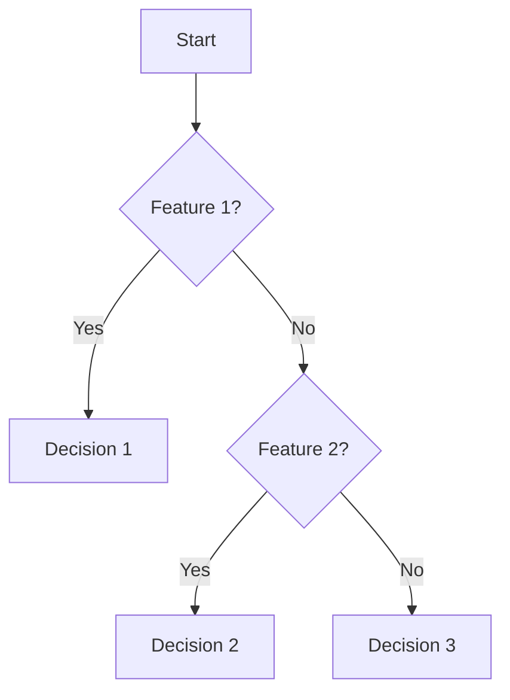

# 模型解释与人工智能公平性

作者：禅与计算机程序设计艺术

## 1. 背景介绍

### 1.1 人工智能的崛起

在过去的十年中，人工智能（AI）技术迅猛发展，已经成为各个行业中的核心技术。从医疗诊断到自动驾驶，从金融预测到智能推荐系统，AI无处不在。然而，随着AI系统的广泛应用，关于其透明性和公平性的讨论也日益增加。AI模型通常是复杂的“黑箱”，其决策过程难以理解和解释，这引发了对其决策公平性和可信度的质疑。

### 1.2 模型解释的重要性

模型解释（Model Interpretability）指的是理解和解释AI模型决策过程和结果的能力。一个可解释的模型不仅能增加用户的信任，还能帮助开发者发现和纠正模型中的偏差和错误。尤其在涉及人类健康、安全和隐私的领域，模型解释变得尤为重要。

### 1.3 公平性问题的提出

AI系统的公平性（Fairness）问题是指AI决策是否对所有群体公平。由于训练数据中的偏差和模型设计的不完善，AI系统可能会对某些群体产生不公平的影响。例如，招聘系统可能会偏向某一性别，信贷评分系统可能会歧视某一种族。这些问题不仅影响了AI系统的公正性，也对社会产生了负面影响。

## 2. 核心概念与联系

### 2.1 模型解释性

模型解释性可以分为全局解释和局部解释。全局解释关注的是模型整体的行为和决策规则，而局部解释则关注特定决策的原因。常见的解释方法包括：

- **线性模型**：通过权重来解释输入特征对输出的影响。
- **决策树**：通过树结构展示决策路径。
- **SHAP值**：通过分配特征对预测结果的贡献值来解释模型。

### 2.2 公平性

公平性可以从多个维度来衡量，包括：

- **统计公平性**：如均衡误差率（Equalized Odds），要求不同群体的错误率相同。
- **个体公平性**：相似个体应得到相似的决策结果。
- **群体公平性**：不同群体在整体上应得到公平的待遇。

### 2.3 模型解释与公平性的联系

模型解释与公平性紧密相关。通过解释模型，我们可以识别和纠正模型中的偏见，从而提高模型的公平性。解释性技术可以帮助我们理解模型的决策机制，发现不公平的决策，并采取措施进行调整。

## 3. 核心算法原理具体操作步骤

### 3.1 线性回归模型解释

线性回归模型是一种简单且易解释的模型。其基本公式为：

$$
y = \beta_0 + \beta_1 x_1 + \beta_2 x_2 + \cdots + \beta_n x_n + \epsilon
$$

其中，$y$ 是预测值，$x_i$ 是输入特征，$\beta_i$ 是特征的权重，$\epsilon$ 是误差项。通过观察权重 $\beta_i$ 的大小和符号，我们可以解释每个特征对预测结果的影响。

### 3.2 决策树模型解释

决策树模型通过树状结构进行决策。每个节点表示一个特征的判断条件，每个叶子节点表示一个决策结果。通过观察决策路径，我们可以解释模型的决策逻辑。



### 3.3 SHAP值解释

SHAP（SHapley Additive exPlanations）值是一种基于博弈论的方法，用于解释复杂模型的决策。其基本思想是计算每个特征对预测结果的贡献值。SHAP值的计算公式为：

$$
\phi_i = \sum_{S \subseteq N \setminus \{i\}} \frac{|S|! (|N| - |S| - 1)!}{|N|!} [f(S \cup \{i\}) - f(S)]
$$

其中，$N$ 是所有特征的集合，$S$ 是特征子集，$f(S)$ 是子集 $S$ 的预测值。通过计算每个特征的 SHAP 值，我们可以解释其对预测结果的贡献。

## 4. 数学模型和公式详细讲解举例说明

### 4.1 线性回归模型公式详解

线性回归模型的基本公式为：

$$
y = \beta_0 + \beta_1 x_1 + \beta_2 x_2 + \cdots + \beta_n x_n + \epsilon
$$

其中，$\beta_i$ 表示特征 $x_i$ 的权重，$\epsilon$ 表示误差项。通过最小二乘法，我们可以估计权重 $\beta_i$ 的值。最小二乘法的目标是最小化以下损失函数：

$$
L(\beta) = \sum_{i=1}^m (y_i - \hat{y}_i)^2 = \sum_{i=1}^m (y_i - (\beta_0 + \beta_1 x_{i1} + \cdots + \beta_n x_{in}))^2
$$

通过求解该损失函数的最小值，我们可以得到最佳的权重估计值。

### 4.2 决策树模型公式详解

决策树模型通过递归地分割数据集来构建树结构。分割的标准是最大化信息增益或最小化基尼指数。信息增益的计算公式为：

$$
IG(D, A) = H(D) - \sum_{v \in \text{Values}(A)} \frac{|D_v|}{|D|} H(D_v)
$$

其中，$H(D)$ 是数据集 $D$ 的熵，$A$ 是特征，$D_v$ 是特征 $A$ 取值为 $v$ 的子集。通过最大化信息增益，我们可以选择最佳的分割特征。

### 4.3 SHAP值公式详解

SHAP值的计算公式为：

$$
\phi_i = \sum_{S \subseteq N \setminus \{i\}} \frac{|S|! (|N| - |S| - 1)!}{|N|!} [f(S \cup \{i\}) - f(S)]
$$

该公式基于博弈论中的Shapley值，计算每个特征对预测结果的边际贡献。通过计算每个特征的SHAP值，我们可以解释其对预测结果的贡献。

## 5. 项目实践：代码实例和详细解释说明

### 5.1 线性回归模型解释代码实例

```python
import numpy as np
import pandas as pd
from sklearn.linear_model import LinearRegression
import matplotlib.pyplot as plt

# 生成示例数据
np.random.seed(0)
X = np.random.rand(100, 2)
y = 3 * X[:, 0] + 5 * X[:, 1] + np.random.randn(100)

# 训练线性回归模型
model = LinearRegression()
model.fit(X, y)

# 输出权重
print(f'Intercept: {model.intercept_}')
print(f'Coefficients: {model.coef_}')

# 可视化权重
features = ['Feature 1', 'Feature 2']
coefficients = model.coef_
plt.bar(features, coefficients)
plt.xlabel('Features')
plt.ylabel('Coefficients')
plt.title('Linear Regression Coefficients')
plt.show()
```

### 5.2 决策树模型解释代码实例

```python
import numpy as np
import pandas as pd
from sklearn.tree import DecisionTreeClassifier
from sklearn import tree
import matplotlib.pyplot as plt

# 生成示例数据
np.random.seed(0)
X = np.random.rand(100, 2)
y = (X[:, 0] + X[:, 1] > 1).astype(int)

# 训练决策树模型
model = DecisionTreeClassifier()
model.fit(X, y)

# 可视化决策树
plt.figure(figsize=(10, 8))
tree.plot_tree(model, feature_names=['Feature 1', 'Feature 2'], class_names=['Class 0', 'Class 1'], filled=True)
plt.show()
```

### 5.3 SHAP值解释代码实例

```python
import numpy as np
import pandas as pd
import shap
import xgboost as xgb

# 生成示例数据
np.random.seed(0)
X = pd.DataFrame(np.random.rand(100, 2), columns