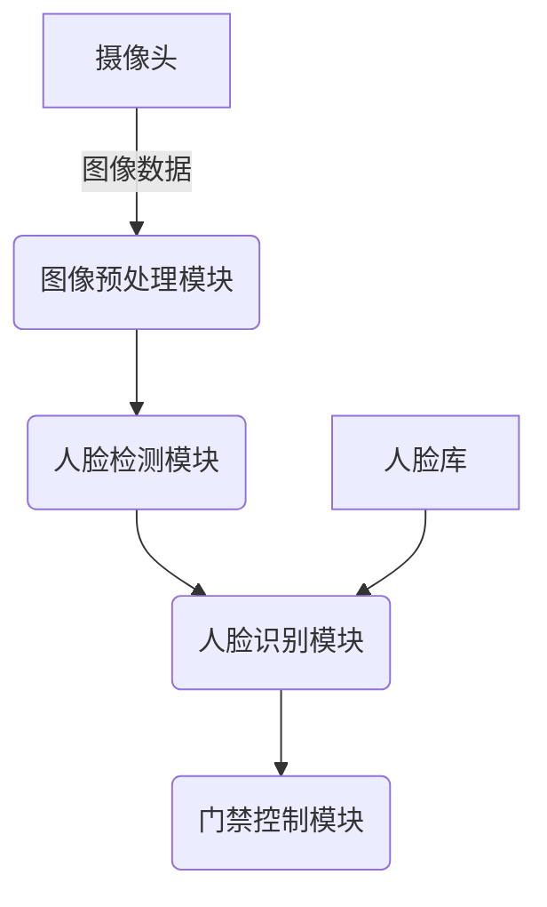

# 模式识别与物联网：构建智能感知网络

## 1. 背景介绍

### 1.1 物联网的兴起

随着信息技术的不断发展,物联网(Internet of Things, IoT)的概念逐渐兴起并被广泛应用。物联网旨在将各种物体与互联网相连接,实现物与物、物与人之间的智能交互,从而构建一个智能化的感知网络。在这个网络中,每个连接的设备都可以收集和交换数据,为我们提供更加智能、高效和便捷的服务。

### 1.2 模式识别在物联网中的重要性

模式识别是人工智能领域的一个重要分支,旨在从复杂的数据中发现有价值的模式和规律。在物联网环境下,海量异构的数据源不断产生大量数据,这为模式识别技术的应用带来了巨大的机遇和挑战。通过模式识别,我们可以从物联网设备采集的大量数据中提取有意义的信息,从而实现智能决策和控制。

### 1.3 智能感知网络的构建

结合模式识别与物联网技术,我们可以构建智能感知网络。这种网络不仅能够感知周围环境的变化,还能够基于模式识别算法进行智能分析和决策,从而实现自动化和智能化操作。智能感知网络在多个领域都有广泛的应用前景,如智能家居、智能城市、智能农业等。

## 2. 核心概念与联系  

### 2.1 物联网体系架构

物联网体系架构通常包括以下几个层次:

1. 感知层: 由各种传感器设备组成,用于采集环境数据。
2. 网络层: 负责数据的传输和路由,常用的技术包括蜂窝网络、WiFi、低功耗蓝牙等。
3. 中间层: 进行数据的存储、处理和管理,通常采用云计算和边缘计算技术。
4. 应用层: 为用户提供各种智能化服务和应用程序。

### 2.2 模式识别技术

模式识别技术包括以下几个核心部分:

1. 数据预处理: 对原始数据进行清洗、标准化、降噪等预处理,以提高后续分析的质量。
2. 特征提取: 从预处理后的数据中提取出具有代表性的特征,这是模式识别的关键步骤。
3. 模式学习: 基于提取的特征,通过机器学习算法构建模式识别模型。
4. 模式识别: 将新的数据输入到模型中,对其进行分类或预测。

### 2.3 物联网与模式识别的结合

物联网和模式识别技术的结合,可以实现智能感知网络的构建:

1. 物联网设备采集环境数据,作为模式识别的输入。
2. 通过模式识别算法对数据进行分析,发现隐藏的模式和规律。
3. 基于识别出的模式,对物联网设备进行智能控制和决策。
4. 形成closed-loop,持续优化模式识别模型,提高系统的智能化水平。

## 3. 核心算法原理具体操作步骤

在模式识别与物联网应用中,常见的核心算法包括监督学习、无监督学习和深度学习等。下面我们以监督学习算法为例,介绍其具体的操作步骤。

### 3.1 数据采集与预处理

1. 从物联网设备中采集原始数据,如传感器数据、图像数据、语音数据等。
2. 对原始数据进行清洗,剔除异常值和缺失值。
3. 进行数据标准化或归一化,将数据映射到统一的数值范围。
4. 可选步骤:进行数据增强,如对图像进行旋转、平移等变换,以扩充数据集。

### 3.2 特征提取与选择

1. 从预处理后的数据中提取特征,特征可以是手工设计的,也可以是自动学习的。
2. 对提取的特征进行选择,剔除冗余和无关的特征,以降低模型复杂度。
3. 常用的特征选择方法包括过滤式(Filter)、包裹式(Wrapper)和嵌入式(Embedded)等。

### 3.3 模型训练

1. 将特征和对应的标签数据分为训练集和测试集。
2. 选择合适的监督学习算法,如决策树、支持向量机、逻辑回归等。
3. 在训练集上训练模型,通过优化算法调整模型参数,使之能够很好地拟合训练数据。
4. 在测试集上评估模型的性能,如准确率、精确率、召回率等指标。

### 3.4 模型优化与部署

1. 根据模型评估结果,通过调整算法参数、特征工程等方式优化模型性能。
2. 对优化后的模型进行模型压缩,降低模型的计算复杂度和存储开销。
3. 将优化后的模型部署到物联网设备或云端服务器上,用于实时的模式识别任务。
4. 持续监控模型性能,根据新的数据进行模型更新和迭代。

## 4. 数学模型和公式详细讲解举例说明

在模式识别算法中,常常需要借助数学模型和公式来描述和求解问题。下面我们以一个经典的监督学习算法 -- 线性回归为例,介绍其相关的数学模型和公式。

### 4.1 线性回归模型

线性回归试图学习一个由自变量(特征)线性组合来预测因变量(标签)的函数模型,模型的数学表达式为:

$$y = w_0 + w_1x_1 + w_2x_2 + ... + w_nx_n$$

其中:
- $y$是因变量,也就是我们要预测的目标值
- $x_1, x_2, ..., x_n$是自变量,也就是影响因变量的特征
- $w_0, w_1, w_2, ..., w_n$是模型参数,需要通过训练数据来学习得到

我们的目标是找到一组最优参数$w$,使得模型在训练数据上的预测值与真实值之间的误差最小化。

### 4.2 损失函数

为了量化预测值与真实值之间的误差,我们引入损失函数(Loss Function)的概念。对于线性回归问题,通常采用平方损失函数:

$$L(w) = \frac{1}{2n}\sum_{i=1}^n(y_i - (w_0 + w_1x_{i1} + ... + w_nx_{in}))^2$$

其中:
- $n$是训练样本的数量
- $y_i$是第$i$个样本的真实标签值
- $x_{i1}, x_{i2}, ..., x_{in}$是第$i$个样本的特征值

我们需要找到一组参数$w$,使得损失函数$L(w)$的值最小,也就是模型预测值与真实值之间的误差最小。

### 4.3 优化算法

为了找到最优参数$w$,我们需要使用优化算法来最小化损失函数。常用的优化算法有梯度下降法(Gradient Descent)、牛顿法(Newton's Method)等。以梯度下降法为例,其更新规则为:

$$w_{j} = w_{j} - \eta\frac{\partial L(w)}{\partial w_{j}}$$

其中:
- $\eta$是学习率,控制每次更新的步长
- $\frac{\partial L(w)}{\partial w_{j}}$是损失函数关于参数$w_j$的偏导数,表示损失函数在该参数方向上的梯度

通过不断迭代更新参数,直到损失函数收敛到一个局部最小值,我们就得到了模型的最优参数。

### 4.4 实例解析

假设我们有一个线性回归问题,需要根据房屋面积(单位:平方米)来预测房屋价格(单位:万元)。我们有如下5个训练样本:

| 面积($x_1$) | 价格($y$) |
|--------------|------------|
| 50           | 50         |
| 80           | 80         |
| 100          | 90         |
| 120          | 110        |
| 150          | 130        |

我们的线性回归模型为:

$$y = w_0 + w_1x_1$$

其中$w_0$和$w_1$是需要学习的参数。

首先,我们可以构造损失函数:

$$L(w_0, w_1) = \frac{1}{10}\sum_{i=1}^5(y_i - (w_0 + w_1x_{i1}))^2$$

接下来,我们使用梯度下降法来优化参数:

$$\begin{align*}
w_0 &= w_0 - \eta\frac{\partial L}{\partial w_0} \\
w_1 &= w_1 - \eta\frac{\partial L}{\partial w_1}
\end{align*}$$

其中$\frac{\partial L}{\partial w_0}$和$\frac{\partial L}{\partial w_1}$分别为:

$$\begin{align*}
\frac{\partial L}{\partial w_0} &= \frac{1}{5}\sum_{i=1}^5(w_0 + w_1x_{i1} - y_i) \\
\frac{\partial L}{\partial w_1} &= \frac{1}{5}\sum_{i=1}^5(w_0 + w_1x_{i1} - y_i)x_{i1}
\end{align*}$$

通过不断迭代更新$w_0$和$w_1$,直到损失函数收敛,我们就可以得到模型的最优参数。假设最终学习到的参数为$w_0 = 10, w_1 = 0.8$,那么我们的线性回归模型就是:

$$y = 10 + 0.8x_1$$

也就是说,当房屋面积为$x_1$平方米时,预测的房屋价格为$10 + 0.8x_1$万元。

通过上述实例,我们可以看到数学模型和公式在模式识别算法中的重要作用,它们为我们提供了清晰的问题描述和求解方法。

## 5. 项目实践:代码实例和详细解释说明  

为了更好地理解模式识别与物联网的结合应用,我们将通过一个具体的项目实践来解释相关的代码和实现细节。在这个项目中,我们将构建一个基于图像识别的智能门禁系统。

### 5.1 项目概述

智能门禁系统是一种应用于物业管理、企业办公等场景的安全系统。传统的门禁系统通常需要刷卡或者输入密码才能进入,存在一定的不便性。而基于图像识别的智能门禁系统则可以自动识别来访者的人脸,从而实现无需其他操作即可自动开门的功能,大大提高了便捷性和安全性。

### 5.2 系统架构

我们的智能门禁系统主要包括以下几个模块:

1. **数据采集模块**: 使用摄像头采集来访者的图像数据。
2. **图像预处理模块**: 对采集的图像进行预处理,如裁剪、降噪等,以提高后续识别的准确性。
3. **人脸检测模块**: 从预处理后的图像中检测出人脸区域。
4. **人脸识别模块**: 将检测到的人脸与预先注册的人脸库进行比对,识别出来访者的身份。
5. **门禁控制模块**: 根据人脸识别的结果,决定是否开启门禁,并记录相关日志。

下面是系统架构的示意图:



### 5.3 代码实现

接下来,我们将介绍系统中几个关键模块的代码实现细节。

#### 5.3.1 图像预处理模块

在这个模块中,我们需要对原始图像进行一些预处理操作,以提高后续人脸检测和识别的准确性。常见的预处理操作包括:

- 图像裁剪: 去除图像中不相关的背景区域,只保留感兴趣的部分。
- 图像resize: 将图像调整到适合模型输入的尺寸。
- 图像增强: 通过一些变换(如旋转、平移等)生成更多的训练样本,提高模型的泛化能力。

下面是使用OpenCV库进行图像预处理的Python代码示例:

```python
import cv2

def preprocess_image(image):
    # 裁剪图