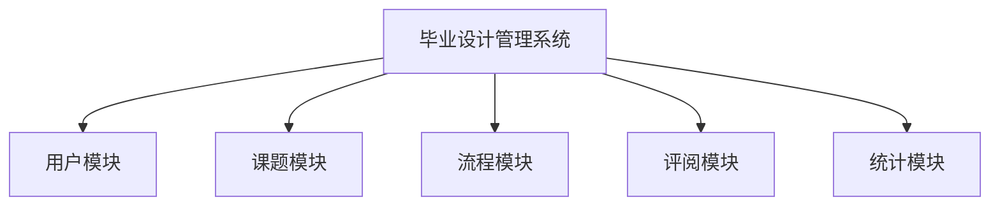

# 毕业设计管理系统详细设计与具体代码实现

## 1. 背景介绍

### 1.1 毕业设计的重要性

毕业设计是高等教育中非常重要的一个环节,是学生在完成理论学习后,将所学知识综合运用于实践,并进行创新性工作的一个重要机会。对于学生来说,毕业设计不仅能够巩固和加深对所学专业知识的理解,而且还能培养独立分析问题和解决问题的能力,以及团队合作精神。对于教师和学校而言,毕业设计的质量也是衡量人才培养水平的重要标准之一。

### 1.2 毕业设计管理的挑战

随着高等教育规模的不断扩大,毕业设计的管理工作变得日益复杂。传统的纸质管理模式已经难以满足高效、准确的要求。常见的问题包括:

- 信息沟通不畅
- 进度管控困难
- 资源分配不合理
- 评阅工作繁重
- 数据统计分析缺乏

因此,构建一个科学、高效的毕业设计管理系统,对于规范化管理、提高工作效率、保证教学质量等方面都具有重要意义。

## 2. 核心概念与联系

### 2.1 系统主要角色

毕业设计管理系统主要涉及以下几个角色:

- **学生**: 选择课题、填写申请、上传文档等
- **教师**: 发布课题、指导学生、评阅文档等 
- **管理员**: 管理用户、分配任务、统计数据等
- **领导**: 审核总结、分析报表等

### 2.2 系统核心流程

系统的核心流程包括:

1. **选题流程**
    - 教师发布课题信息
    - 学生根据意向选择课题
    - 系统自动分配指导教师
2. **开题流程** 
    - 学生填写开题报告
    - 指导教师审核开题报告
3. **中期检查流程**
    - 学生按时间节点填写中期报告
    - 指导教师审核中期报告
4. **答辩流程**
    - 学生按时间节点上传毕业论文
    - 系统自动分配评阅老师
    - 评阅老师按时进行论文评阅
    - 答辩委员会组织答辩会
5. **成绩录入流程**
    - 答辩委员会录入最终成绩
    - 系统自动生成总结报告

## 3. 核心算法原理具体操作步骤  

### 3.1 自动分配算法

自动分配指导教师和评阅老师是系统的一个核心功能。这里采用了加权圆Robin赫夫曼算法,具体步骤如下:

1. 计算每位教师的可用指导名额
2. 根据学生选题意向,为每个课题构建一个候选教师列表
3. 遍历课题列表,按照教师可用名额权重,分配课题给教师
4. 若分配不均匀,进行一次Robin赫夫曼压缩调整
5. 返回最终的分配结果

该算法的时间复杂度为O(n*log(n)),能较好地实现自动化分配。

### 3.2 时间管理算法 

对于整个毕业设计流程,需要科学管理每个时间节点,做到任务及时分派、提醒、追踪和检查。这里借鉴了基于Ａ*算法的时间管理思路:

1. 构建一个全局事件队列,包含所有流程事件节点
2. 针对每个事件,计算其最早发生时间、最晚发生时间和优先级权重值
3. 根据事件权重值对全局队列进行排序
4. 实时检查当前事件是否已经可以开启
5. 对已开启事件进行通知、监控、跟踪
6. 及时更新事件状态到全局队列

通过这种方式,可以实现全流程的闭环式时间管控。

## 4. 数学模型和公式详细讲解举例说明

### 4.1 自动分配算法模型

设有 $n$ 个课题 $T=\{t_1,t_2,...,t_n\}$, $m$ 个教师 $P=\{p_1,p_2,...,p_m\}$。每个课题 $t_i$ 有一个候选教师集合 $C_i\subseteq P$。每个教师 $p_j$ 有一个可用名额 $q_j$。我们的目标是为每个课题分配一个教师,使得:

$$
\begin{align}
&\text{minimize}\ \max\limits_{1\leq j\leq m}|A_j|\\
&\text{subject to}\\
&\bigcup\limits_{j=1}^m A_j = T\\
&A_j\cap A_k=\emptyset,\quad \forall j\neq k\\
&|A_j|\leq q_j,\quad \forall j\\
&t_i\in A_j \Rightarrow p_j\in C_i,\quad \forall i,j
\end{align}
$$

其中 $A_j$ 表示分配给教师 $p_j$ 的课题集合。该模型旨在实现课题分配的均衡性,并满足教师可用名额和课题意向的约束条件。

### 4.2 时间管理模型

设有一个全局事件队列 $Q$,包含所有待处理事件 $e_1,e_2,...,e_n$。对于每个事件 $e_i$,定义:

- $r_i$: 事件最早发生时间
- $d_i$: 事件最晚发生时间  
- $w_i$: 事件优先级权重

我们的目标是按照事件权重对队列 $Q$ 进行排序,并实时检查已开启的事件,即:

$$
\begin{align}
&\text{sort}\ Q\ \text{by}\ w_i\\
&\text{for each}\ e_i\in Q:\\
&\qquad\text{if}\ \text{currentTime} \in [r_i,d_i]:\\
&\qquad\qquad \text{trigger}(e_i)
\end{align}
$$

其中 $w_i$ 可以根据事件重要性、紧迫程度等因素计算得到。通过这种方式,可以确保每个事件都能够及时高效地得到处理。

## 4. 项目实践:代码实例和详细解释说明

### 4.1 系统架构

整个系统采用前后端分离的架构模式,后端使用 Spring Boot 框架,前端使用 Vue.js 框架。系统主要包括以下几个模块:



#### 用户模块

用户模块负责管理系统用户,包括学生、教师、管理员等角色,提供用户注册、登录、权限管理等功能。

```java
// UserController.java
@RestController
@RequestMapping("/users")
public class UserController {
    
    @Autowired
    private UserService userService;

    @PostMapping("/register")
    public ResponseEntity<?> registerUser(@RequestBody UserDto userDto) {
        // 注册新用户
    }

    @PostMapping("/login")
    public ResponseEntity<?> loginUser(@RequestBody LoginDto loginDto) {
        // 用户登录
    }

    // 其他用户管理接口...
}
```

#### 课题模块

课题模块负责管理选题信息,包括课题发布、学生选择、教师分配等功能。

```java
// TopicController.java
@RestController
@RequestMapping("/topics")
public class TopicController {
    
    @Autowired
    private TopicService topicService;

    @PostMapping
    public ResponseEntity<?> createTopic(@RequestBody TopicDto topicDto) {
        // 创建新课题
    }

    @PutMapping("/{id}/select")
    public ResponseEntity<?> selectTopic(@PathVariable Long id, @RequestBody StudentDto studentDto) {
        // 学生选择课题
    }

    // 其他课题管理接口...
}
```

#### 流程模块

流程模块负责管理整个毕业设计流程,包括开题报告、中期报告、论文提交、答辩安排等功能。

```java
// ProcessController.java
@RestController
@RequestMapping("/process")
public class ProcessController {
    
    @Autowired
    private ProcessService processService;

    @PostMapping("/proposal")
    public ResponseEntity<?> submitProposal(@RequestBody ProposalDto proposalDto) {
        // 提交开题报告
    }

    @PostMapping("/interim")
    public ResponseEntity<?> submitInterim(@RequestBody InterimDto interimDto) {
        // 提交中期报告
    }

    // 其他流程管理接口...
}
```

#### 评阅模块

评阅模块负责管理论文评阅工作,包括分配评阅老师、录入评审结果等功能。

```java
// ReviewController.java
@RestController
@RequestMapping("/reviews")
public class ReviewController {
    
    @Autowired
    private ReviewService reviewService;

    @PostMapping
    public ResponseEntity<?> createReview(@RequestBody ReviewDto reviewDto) {
        // 创建新的评阅任务
    }

    @PutMapping("/{id}")
    public ResponseEntity<?> updateReview(@PathVariable Long id, @RequestBody ReviewDto reviewDto) {
        // 更新评阅结果
    }

    // 其他评阅管理接口...
}
```

#### 统计模块

统计模块负责生成各种统计报表,为决策提供数据支持。

```java
// StatisticsController.java
@RestController
@RequestMapping("/statistics")
public class StatisticsController {
    
    @Autowired
    private StatisticsService statisticsService;

    @GetMapping("/topics")
    public ResponseEntity<?> getTopicStatistics() {
        // 获取课题选择统计
    }

    @GetMapping("/grades")
    public ResponseEntity<?> getGradeStatistics() {
        // 获取成绩统计
    }

    // 其他统计接口...
}
```

### 4.2 关键代码实现

#### 自动分配算法实现

```java
// DistributionService.java
@Service
public class DistributionService {

    public Map<Teacher, List<Topic>> distributeTopic(List<Topic> topics, List<Teacher> teachers) {
        // 计算每位教师的可用名额
        Map<Teacher, Integer> quotas = calculateQuotas(teachers);

        // 构建候选教师列表
        Map<Topic, List<Teacher>> candidates = buildCandidates(topics, teachers);

        // 初始分配
        Map<Teacher, List<Topic>> distribution = initDistribution(quotas, candidates);

        // 压缩调整
        distribution = compressDistribution(distribution, quotas);

        return distribution;
    }

    // 其他辅助方法...
}
```

#### 时间管理算法实现

```java
// EventService.java
@Service
public class EventService {

    private PriorityQueue<Event> eventQueue;

    public EventService() {
        this.eventQueue = new PriorityQueue<>((a, b) -> a.getWeight() - b.getWeight());
        // 初始化全局事件队列
    }

    public void scheduleEvent(Event event) {
        eventQueue.offer(event);
    }

    @Scheduled(fixedRate = 60000) // 每分钟检查一次
    public void checkEvents() {
        long currentTime = System.currentTimeMillis();
        while (!eventQueue.isEmpty()) {
            Event event = eventQueue.peek();
            if (currentTime >= event.getEarliestTime() && currentTime <= event.getLatestTime()) {
                // 触发事件处理
                triggerEvent(event);
                eventQueue.poll();
            } else {
                break;
            }
        }
    }

    // 其他辅助方法...
}
```

## 5. 实际应用场景

毕业设计管理系统可以广泛应用于高等院校的教学管理工作中,具体包括但不限于:

- 本科生毕业设计管理
- 研究生论文管理
- 课程设计管理
- 实习实训管理
- 竞赛项目管理

同时,该系统也可以作为企业内部的项目管理系统,用于管理公司的各类研发项目。总的来说,任何需要流程化管理的工作场景,都可以借鉴该系统的设计思路和技术方案。

## 6. 工具和资源推荐

在开发和使用毕业设计管理系统的过程中,以下工具和资源可以给您一些帮助:

- **开发工具**
    - IntelliJ IDEA / Visual Studio Code
    - Git 版本控制
    - Docker 容器化
    - Postman / Swagger 接口测试
- **框架和库**
    - Spring Boot / Spring Cloud
    - Vue.js / Element UI
    - MyBatis / Hibernate
    - Redis / RabbitMQ
- **云服务**
    - 阿里云 / 腾讯云 / 华为云
    - 对象存储 / 关系型数据库 / 消息队列
- **社区和文档**
    - Spring 官方文档
    - Vue.js 官方文档
    - StackOverflow 问答社区

## 7. 总结:未来发展趋势与挑战

毕业设计管理系统的建设是