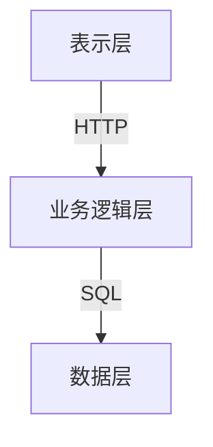
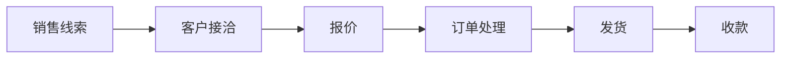
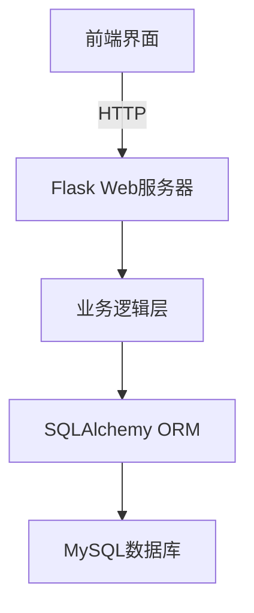

# 汽车销售管理信息系统详细设计与具体代码实现

## 1. 背景介绍

### 1.1 汽车销售行业现状

在当今快节奏的商业环境中,汽车销售行业面临着激烈的竞争和日益增长的客户需求。有效的销售管理对于提高企业的盈利能力、优化业务流程和提升客户满意度至关重要。传统的手工记录和纸质文件管理方式已经无法满足现代汽车销售公司的需求,因此开发一个高效、易用的信息化销售管理系统就成为了当务之急。

### 1.2 系统开发的必要性

一个完善的汽车销售管理信息系统可以实现以下目标:

- 集中管理车辆信息、客户信息、销售记录等关键数据
- 自动化销售流程,提高工作效率
- 生成详细报表,为决策提供数据支持
- 改善客户体验,增强品牌形象

通过信息系统的支持,销售人员可以更高效地管理销售活动,同时公司也可以获得更准确的业务数据,从而制定更明智的经营策略。

## 2. 核心概念与联系  

### 2.1 系统架构概览

汽车销售管理信息系统通常采用三层架构,包括表示层(前端界面)、业务逻辑层(应用服务器)和数据层(数据库服务器)。各层之间通过网络通信,实现了职责分离和松耦合的设计。



### 2.2 核心概念解析

1. **车辆管理**: 维护所有在售和已售车辆的详细信息,包括车型、配置、价格等。

2. **客户管理**: 记录客户的个人信息、购车意向和购买历史,为销售人员提供重要参考。

3. **销售管理**: 跟踪销售流程的各个环节,包括销售线索、客户接洽、报价、订单、发货和收款等。

4. **库存管理**: 实时监控车辆库存量,并根据销售情况及时补货。

5. **财务管理**: 记录收支明细,完成应收应付的核算工作。

6. **报表统计**: 基于销售数据生成多维度的统计分析报表,支持决策制定。

这些核心概念相互关联、环环相扣,共同构建了一个完整的汽车销售管理体系。接下来我们将详细探讨它们的实现原理和具体操作。

## 3. 核心算法原理和具体操作步骤

### 3.1 车辆信息管理

#### 3.1.1 数据库设计

我们使用关系数据库来存储车辆信息,其中`车辆`表是核心表。表结构如下:

```sql
CREATE TABLE 车辆 (
    车辆ID INT PRIMARY KEY AUTO_INCREMENT,
    车型 VARCHAR(50) NOT NULL,
    品牌 VARCHAR(30) NOT NULL,
    颜色 VARCHAR(20) NOT NULL,
    发动机 VARCHAR(50) NOT NULL,
    排量 DECIMAL(4,1) NOT NULL,
    变速箱 VARCHAR(20) NOT NULL,
    价格 DECIMAL(10,2) NOT NULL,
    库存量 INT NOT NULL
);
```

其他相关表包括`配置`、`选装件`等,通过外键与`车辆`表建立关联。

#### 3.1.2 车辆信息录入

当有新车型上市时,我们需要将其详细信息录入系统。具体操作步骤如下:

1. 在`车辆`表中插入一条新记录
2. 在`配置`表中为该车型添加标准配置
3. 在`选装件`表中为该车型添加可选装配件
4. 更新该车型的库存量

以上步骤可以通过系统界面或数据库脚本完成。

#### 3.1.3 车辆查询与统计

系统需要提供多种查询方式,以满足不同的业务需求:

- 关键字搜索:根据车型名称、品牌等关键词快速查找车辆
- 高级查询:组合使用多个查询条件,如价格区间、发动机型号等
- 车型配对比:并列展示两个或多个车型的配置信息,方便比较
- 销量排行:按销量从高到低列出所有车型

此外,系统还应当提供统计分析功能,例如按品牌、车型等维度统计销量和库存量。

### 3.2 客户信息管理

#### 3.2.1 数据库设计  

客户信息管理模块的核心是`客户`表,表结构如下:

```sql
CREATE TABLE 客户 (
    客户ID INT PRIMARY KEY AUTO_INCREMENT,
    姓名 VARCHAR(20) NOT NULL,
    联系电话 VARCHAR(20) UNIQUE NOT NULL,
    电子邮件 VARCHAR(50) UNIQUE,
    居住地址 VARCHAR(100) NOT NULL,
    购车意向 VARCHAR(200)
);
```

此外,还需要`购车记录`表来记录客户的购买历史:

```sql
CREATE TABLE 购车记录 (
    记录ID INT PRIMARY KEY AUTO_INCREMENT,
    客户ID INT NOT NULL,
    车辆ID INT NOT NULL,
    购买日期 DATE NOT NULL,
    FOREIGN KEY (客户ID) REFERENCES 客户(客户ID),
    FOREIGN KEY (车辆ID) REFERENCES 车辆(车辆ID)
);
```

#### 3.2.2 客户信息采集

客户信息可以通过多种渠道获取,包括:

- 展厅来访登记
- 网站在线预约
- 营销活动登记
- 电话咨询记录

无论通过何种方式,将客户信息录入系统都是销售工作的第一步。

#### 3.2.3 客户分类与跟踪

根据客户的购车意向和购买历史,系统可以自动将客户划分为不同级别,并为销售人员提供有针对性的服务建议。例如:

- 重点客户:有明确购车计划的客户
- 潜在客户:仅表达过购车意向的客户 
- 老客户:曾经购车且有更换车辆需求的客户

系统应当为每一类客户设置合理的跟踪规则和时间节点,确保销售人员能够及时、有效地开展客户维护工作。

### 3.3 销售流程管理

#### 3.3.1 流程概览

汽车销售的完整流程通常包括以下环节:



每个环节都有对应的操作数据,系统需要全程跟踪并记录这些信息。

#### 3.3.2 线索管理

销售线索是指潜在的销售机会,可能来自各种渠道,如广告投放、活动推广等。系统应当提供线索登记功能,并对线索进行分类和优先级排序,以便销售人员高效跟进。

#### 3.3.3 客户接洽

在获取销售线索后,销售人员需要主动与客户取得联系,了解其需求并提供产品咨询服务。系统应当记录每次接洽的内容摘要、联系人、时间等关键信息,以备后续跟进。

#### 3.3.4 报价与订单处理

根据客户的具体需求,销售人员需要制定个性化的报价方案,并在系统中生成正式报价单。如果客户接受报价,则可以转为订单并提交相关付款。

订单处理环节包括:

1. 生成订单详情
2. 安排提车时间
3. 更新车辆库存
4. 记录收款信息

#### 3.3.5 发货与收款

订单生成后,系统需要与物流模块对接,安排车辆发货。发货后,客户付清购车尾款,销售流程最终结束。

所有环节的关键信息都需要保存在系统中,以备后续查询和统计分析。

## 4. 数学模型和公式详细讲解

在汽车销售管理系统中,数学模型和公式主要应用于以下几个方面:

### 4.1 库存管理

#### 4.1.1 经济订货量模型(EOQ)

为了确定最优库存水平,我们可以使用经典的经济订货量模型。该模型的目标是最小化每年的总成本,包括订货成本和库存持有成本。

设:
- $D$ 为年度需求量
- $S$ 为每次订货的固定成本
- $H$ 为每单位产品的年库存持有成本
- $Q$ 为订购量

则每年的总成本 $TC(Q)$ 由下式给出:

$$TC(Q) = \frac{DS}{Q} + \frac{HQ}{2}$$

上式第一项是年订货成本,第二项是年库存持有成本。

通过求导数并令其等于0,我们可以得到经济订货量的公式:

$$EOQ = \sqrt{\frac{2DS}{H}}$$

这个公式可以帮助我们确定最优库存水平,从而降低总成本。

#### 4.1.2 安全库存量计算

为了应对需求波动和供应延迟,我们需要保持一定的安全库存量。常用的计算公式为:

$$安全库存量 = 安全系数 \times 标准差 \times \sqrt{审核期}$$

其中:

- 安全系数通常取1.65或2.33,对应95%或99%的服务水平
- 标准差为过去一段时间内需求量的标准差
- 审核期为从下订单到收货的平均时间

通过这个公式,我们可以合理确定安全库存量,在保证供应的同时避免库存积压。

### 4.2 价格策略分析

#### 4.2.1 价格弹性模型

价格是影响销量的重要因素。我们可以应用价格弹性理论来分析价格变动对销量的影响,并制定合理的定价策略。

设市场需求函数为 $Q = a - bp$,其中:

- $Q$ 为需求量
- $p$ 为单价
- $a$ 和 $b$ 为常数

则价格弹性 $E$ 可以表示为:

$$E = \frac{\partial Q}{\partial p} \cdot \frac{p}{Q} = -b \cdot \frac{p}{a-bp}$$

当 $|E| > 1$ 时,需求对价格变化较为敏感,此时适当降低价格可能会增加总收入。而当 $|E| < 1$ 时,需求对价格变化不太敏感,可以考虑适度提高价格以获取更多利润。

通过预测并分析价格弹性,公司可以制定出合理的定价方案,实现销售额和利润的最大化。

#### 4.2.2 线性回归分析

除了价格,影响销量的因素还包括广告投入、促销力度等。我们可以使用线性回归模型来综合分析多个变量对销量的影响。

假设销量 $y$ 可以表示为自变量 $x_1,x_2,...,x_n$ 的线性组合,即:

$$y = \beta_0 + \beta_1 x_1 + \beta_2 x_2 + ... + \beta_n x_n + \epsilon$$

其中 $\epsilon$ 为随机误差项。

我们可以利用最小二乘法来估计各个系数 $\beta_i$,从而得到最佳拟合直线方程。根据该方程,我们可以预测在给定自变量值的情况下,销量的期望值是多少。

线性回归分析为我们提供了一种量化影响因素、优化营销策略的强有力工具。

## 5. 项目实践:代码实例和详细解释

为了更好地理解系统的实现细节,我们将通过一个基于Python的项目实例来演示核心功能的代码实现。

### 5.1 系统架构

我们采用了广为人知的三层架构模式,将表示层(前端界面)、业务逻辑层和数据访问层妥善分离,以提高代码的可维护性和可扩展性。



- 前端界面: 基于HTML/CSS/JavaScript开发,使用Bootstrap框架提供现代化的UI体验
- Flask Web服务器: 使用Python Flask轻量级Web框架快速构建RESTful API
- 业务逻辑层: 使用面向对象编程实现各种业务实体和操作逻辑
- SQLAlchemy ORM: 对象关系映射层,将对象与数据库表建立映射关系
- MySQL数据库: 持久化存储系统的核心数据

### 5.2 数据库