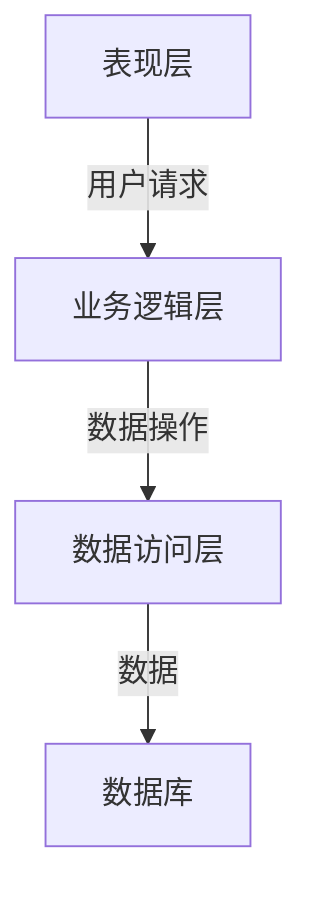
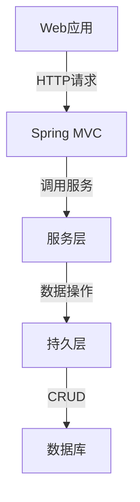

# 洗衣店管理系统详细设计与具体代码实现

## 1.背景介绍

### 1.1 洗衣店行业概况

随着生活节奏的加快和人们生活水平的不断提高,洗衣店作为一种方便快捷的服务,在日常生活中扮演着越来越重要的角色。洗衣店不仅为客户提供了干净整洁的衣物,还节省了大量的时间和精力。

然而,传统的洗衣店管理方式存在诸多问题:

- 繁琐的人工记录和票据管理,容易出现错误和遗漏。
- 缺乏对设备运行状态和用户订单的实时监控。
- 难以及时掌握库存和财务状况等关键数据。
- 无法实现在线预约、支付和跟踪等增值服务。

### 1.2 管理系统的必要性

为了解决上述问题,实现洗衣店的高效、智能化运营,构建一套完善的洗衣店管理系统势在必行。这种系统可以将洗衣店的各项业务流程数字化、自动化和信息化,从而提高运营效率,优化用户体验,降低人力成本。

## 2.核心概念与联系

### 2.1 系统架构

洗衣店管理系统通常采用三层架构(Three-Tier Architecture),包括:

1. **表现层(Presentation Tier)**: 提供用户界面,负责与用户交互,接收用户输入并显示处理结果。常见的实现方式包括Web应用、移动APP等。

2. **业务逻辑层(Business Logic Tier)**: 负责处理业务规则和数据操作,是系统的核心部分。它接收来自表现层的请求,执行相应的业务逻辑操作,并与数据访问层交互以获取或存储数据。

3. **数据访问层(Data Access Tier)**: 负责与数据库进行交互,执行数据的增删改查操作。它屏蔽了底层数据存储的细节,为业务逻辑层提供统一的数据访问接口。

### 2.2 核心模块

洗衣店管理系统的核心模块包括:

1. **订单管理**: 处理客户订单的创建、修改、查询、取消等操作,并跟踪订单状态。

2. **客户管理**: 维护客户信息,包括基本资料、消费记录、积分等。

3. **库存管理**: 管理洗涤用品、设备零件等物资的库存水平,进行采购、入库、出库等操作。

4. **设备管理**: 监控洗衣机、烘干机等设备的运行状态,记录故障信息,安排维修保养。

5. **财务管理**: 记录收支明细,生成财务报表,实现收款、付款等功能。

6. **人员管理**: 管理员工信息、工作安排、考勤记录等。

7. **统计分析**: 基于历史数据生成各类报表,分析业务趋势,支持决策。

### 2.3 关键技术

洗衣店管理系统的开发和运行需要涉及多种关键技术,包括但不限于:

- **Web开发技术**: HTML、CSS、JavaScript、React/Angular/Vue等前端框架。
- **后端开发技术**: Java、Python、Node.js、.NET等编程语言及相关框架。
- **数据库技术**: 关系型数据库(MySQL、PostgreSQL)、NoSQL数据库(MongoDB)等。
- **缓存技术**: Redis、Memcached等,用于提高系统性能。
- **消息队列技术**: RabbitMQ、Kafka等,实现异步通信和解耦。
- **安全技术**: 身份认证、授权、加密、防火墙等,保障系统安全。
- **DevOps技术**: 容器技术(Docker)、持续集成与交付(CI/CD)等。

## 3.核心算法原理具体操作步骤

### 3.1 订单处理算法

订单处理是洗衣店管理系统的核心功能之一,它需要高效、准确地处理大量订单数据。以下是一种常见的订单处理算法流程:

1. **订单创建**: 客户通过网页、移动应用或柜台提交新订单,系统生成唯一订单编号。

2. **订单验证**: 检查订单信息的完整性和有效性,如客户信息、服务项目、支付方式等。

3. **库存检查**: 检查所需洗涤用品和设备零件的库存量是否足够。如果库存不足,则需要触发采购流程。

4. **价格计算**: 根据订单中的服务项目和数量,计算总价格。可能涉及折扣、优惠券等策略。

5. **付款处理**: 调用第三方支付平台(如微信支付、支付宝等)进行付款。

6. **订单分配**: 根据订单类型、紧急程度、地理位置等因素,将订单分配给相应的洗衣店或工作人员。

7. **订单执行**: 洗衣店工作人员接收订单,执行洗涤、烘干等服务。

8. **订单跟踪**: 客户可以通过网页或移动应用实时跟踪订单状态。

9. **订单完成**: 服务完成后,系统更新订单状态,并通知客户取件。

10. **评价反馈**: 客户可以对服务质量进行评价,系统记录反馈信息用于改进。

该算法的时间复杂度主要取决于订单验证、库存检查和价格计算等步骤。通过使用高效的数据结构(如哈希表)和缓存技术,可以将这些步骤的时间复杂度控制在 O(1) 或 O(logn) 的水平。

### 3.2 库存管理算法

库存管理对于洗衣店的正常运营至关重要。以下是一种常见的库存管理算法:

1. **设置库存阈值**: 为每种物资(洗涤用品、设备零件等)设置最低库存阈值和最高库存阈值。

2. **实时监控**: 实时监控每种物资的库存水平,一旦低于最低阈值,则触发采购流程。

3. **采购计划**: 根据历史销售数据、季节性因素等,使用时间序列分析或其他预测模型,制定采购计划。

4. **供应商选择**: 根据价格、质量、交货时间等因素,选择最优供应商。

5. **入库处理**: 物资到货后,进行验收、登记,更新库存记录。

6. **出库处理**: 当有订单需要使用物资时,从库存中扣减相应数量。

7. **库存盘点**: 定期进行实际库存盘点,与系统记录进行核对,发现差异后进行调整。

8. **报废处理**: 对于过期、损坏的物资,执行报废流程,从库存中扣除。

该算法的时间复杂度主要取决于实时监控、采购计划和盘点等步骤。通过使用高效的数据结构(如红黑树)和索引技术,可以将这些步骤的时间复杂度控制在 O(logn) 的水平。

### 3.3 设备维护算法

洗衣店的设备(如洗衣机、烘干机等)是核心资产,需要及时维护以保证正常运行。以下是一种常见的设备维护算法:

1. **设备注册**: 将新设备的详细信息(型号、购买日期、供应商等)录入系统。

2. **运行状态监控**: 实时监控设备的运行状态,包括使用时长、故障代码等。

3. **预防性维护**: 根据设备使用手册和经验,制定预防性维护计划,定期进行检查和保养。

4. **故障诊断**: 当设备出现故障时,根据故障代码和现象,诊断故障原因。

5. **维修派单**: 为故障设备生成维修工单,分配给维修人员。

6. **备件管理**: 维护常用备件的库存,并及时补充。

7. **维修执行**: 维修人员根据工单信息,更换损坏部件,进行调试。

8. **维修记录**: 记录维修详情,包括故障原因、更换部件、维修时长等。

9. **设备报废**: 对于无法维修或不经济维修的旧设备,执行报废流程。

该算法的时间复杂度主要取决于运行状态监控、故障诊断和维修派单等步骤。通过使用高效的数据结构(如队列)和优化算法(如故障树分析),可以将这些步骤的时间复杂度控制在 O(1) 或 O(logn) 的水平。

## 4.数学模型和公式详细讲解举例说明

在洗衣店管理系统中,数学模型和公式主要应用于以下几个方面:

### 4.1 需求预测模型

为了优化库存管理和供应链效率,需要预测未来一段时间内的需求量。常用的需求预测模型包括:

1. **简单移动平均模型(SMA)**:

$$
F_{t+1} = \frac{1}{n}\sum_{i=t-n+1}^{t}D_i
$$

其中 $F_{t+1}$ 是下一个时间段的需求预测值, $D_i$ 是过去 $n$ 个时间段的实际需求值。

2. **加权移动平均模型(WMA)**:

$$
F_{t+1} = \sum_{i=1}^{n}w_iD_{t-n+i}, \sum_{i=1}^{n}w_i=1
$$

其中 $w_i$ 是相应时间段的权重,近期时间段的权重较大。

3. **指数平滑模型(ETS)**:

$$
F_{t+1} = \alpha D_t + (1-\alpha)F_t, 0\leq\alpha\leq1
$$

其中 $\alpha$ 是平滑系数,决定了新数据对预测值的影响程度。

这些模型的优缺点不同,需要根据具体情况选择合适的模型。通过对历史数据的拟合,可以确定模型参数的最优值。

### 4.2 供应商选择模型

在采购决策时,需要综合考虑多个因素(如价格、质量、交货时间等)来选择最优供应商。可以使用多准则决策模型,如:

1. **加权评分模型(WSM)**:

$$
S_i = \sum_{j=1}^{n}w_jr_{ij}
$$

其中 $S_i$ 是第 $i$ 个供应商的总分, $w_j$ 是第 $j$ 个标准的权重, $r_{ij}$ 是第 $i$ 个供应商在第 $j$ 个标准上的评分。

2. **分层分析模型(AHP)**:

通过构建标准层次结构,计算各标准的权重,然后进行综合评分。

这些模型需要专家或决策者对各标准的重要性进行主观评估和打分。

### 4.3 设备维护成本模型

对于老旧设备,需要决定是继续维修还是直接更换新设备。可以使用成本模型进行分析:

1. **维修成本模型**:

$$
C_r = C_p + C_l + C_e
$$

其中 $C_r$ 是维修成本, $C_p$ 是零件成本, $C_l$ 是人工成本, $C_e$ 是能源成本。

2. **更换成本模型**:

$$
C_n = C_p + C_i + C_t + C_d - C_s
$$

其中 $C_n$ 是更换新设备的成本, $C_p$ 是设备购置成本, $C_i$ 是安装成本, $C_t$ 是培训成本, $C_d$ 是旧设备残值, $C_s$ 是节省的运营成本。

通过比较 $C_r$ 和 $C_n$,可以做出维修或更换的决策。

此外,还可以使用复杂的优化模型(如整数规划模型)来解决设备维护调度等问题。

## 4.项目实践:代码实例和详细解释说明

接下来,我们将通过一个简化的示例项目,展示如何使用 Java 和 Spring Boot 框架开发洗衣店管理系统的核心功能。

### 4.1 项目架构

该示例项目采用经典的三层架构:

- **Web层**: 使用 Spring MVC 处理 HTTP 请求