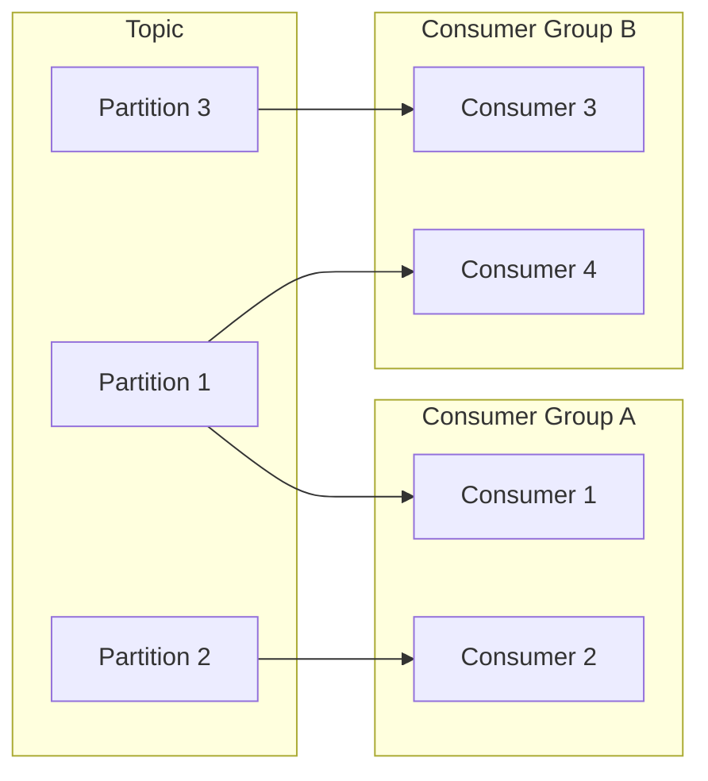

# 消费者组 原理与代码实例讲解

作者：禅与计算机程序设计艺术

## 1. 背景介绍

### 1.1 消息队列与消息消费

在现代分布式系统中，消息队列已成为不可或缺的基础组件。它提供了一种可靠的异步通信机制，允许不同的应用程序之间进行解耦和数据交换。消息队列的基本模型包括生产者、消息队列和消费者。生产者将消息发送到消息队列，消费者从消息队列中接收并处理消息。

### 1.2 传统消息消费模式的局限性

传统的点对点消息消费模式存在一些局限性，例如：

* **单点故障：** 如果只有一个消费者，一旦消费者出现故障，就会导致消息积压和服务不可用。
* **负载均衡问题：** 当消息量很大时，单个消费者可能无法及时处理所有消息，导致消息处理延迟增加。
* **消息顺序性难以保证：** 传统的消费模式无法保证消息的顺序性，这在某些场景下是不可接受的。

### 1.3 消费者组的引入

为了解决上述问题，消息队列引入了消费者组的概念。消费者组是一组消费者的逻辑集合，它们共享同一个 Group ID。消息队列会将消息均匀地分发给同一个消费者组内的所有消费者，从而实现负载均衡和消息消费的高可用性。

## 2. 核心概念与联系

### 2.1 消费者组 (Consumer Group)

消费者组是 Kafka 提供的可扩展且容错的消费者机制。消费者组保障了每个分区只能被一个消费者实例消费，同时也能在一个消费者组内实现消息消费的负载均衡。

### 2.2 分区 (Partition)

为了提高消息系统的吞吐量和并发处理能力，Kafka 将 Topic 的消息划分为多个 Partition。每个 Partition 都是一个有序的消息队列，消息按照顺序追加到 Partition 的尾部。

### 2.3 消费者 (Consumer)

消费者是消息的接收者，它从 Kafka 的 Broker 中拉取消息并进行处理。一个消费者可以属于多个消费者组。

### 2.4 偏移量 (Offset)

偏移量是消费者在 Partition 中的位置标识。每个消费者在每个 Partition 中都维护着自己的偏移量，用于记录已经消费的消息的位置。

### 2.5 关系图



## 3. 核心算法原理具体操作步骤

### 3.1 消费者组的创建

消费者组的创建可以通过 KafkaConsumer 的 `subscribe()` 方法来实现，例如：

```java
properties.setProperty("group.id", "my-group");
KafkaConsumer<String, String> consumer = new KafkaConsumer<>(properties);
consumer.subscribe(Arrays.asList("my-topic"));
```

### 3.2 分区的分配

当一个消费者组创建后，Kafka 会将 Topic 的所有 Partition 分配给消费者组内的消费者。Kafka 提供了多种分区分配策略，例如：

* **RangeAssignor：** 按照 Partition 的范围进行分配，例如，如果一个 Topic 有 3 个 Partition，消费者组内有 2 个消费者，则第一个消费者会分配到 Partition 1 和 Partition 2，第二个消费者会分配到 Partition 3。
* **RoundRobinAssignor：** 按照轮询的方式进行分配，例如，如果一个 Topic 有 3 个 Partition，消费者组内有 2 个消费者，则第一个消费者会分配到 Partition 1，第二个消费者会分配到 Partition 2，第一个消费者会分配到 Partition 3。

### 3.3 消息的消费

消费者通过 `poll()` 方法从 Kafka 中拉取消息，例如：

```java
ConsumerRecords<String, String> records = consumer.poll(Duration.ofMillis(100));
for (ConsumerRecord<String, String> record : records) {
    // 处理消息
}
```

### 3.4 偏移量的提交

消费者在消费完消息后，需要将偏移量提交到 Kafka，以便 Kafka 能够记录消费进度。Kafka 提供了两种偏移量提交方式：

* **自动提交：** 消费者可以通过设置 `enable.auto.commit` 属性为 `true` 来启用自动提交。自动提交的频率由 `auto.commit.interval.ms` 属性控制。
* **手动提交：** 消费者可以通过调用 `commitSync()` 或 `commitAsync()` 方法来手动提交偏移量。

## 4. 数学模型和公式详细讲解举例说明

### 4.1 消息消费速率

消息消费速率是指消费者每秒钟消费的消息数量，可以使用以下公式计算：

```
消息消费速率 = 消费的消息数量 / 消费时间
```

例如，如果一个消费者在 10 秒钟内消费了 100 条消息，则消息消费速率为 10 条/秒。

### 4.2 消费者滞后量

消费者滞后量是指消费者当前消费的偏移量与 Partition 的最新偏移量之间的差值，可以使用以下公式计算：

```
消费者滞后量 = Partition 最新偏移量 - 消费者当前偏移量
```

例如，如果一个 Partition 的最新偏移量为 1000，消费者的当前偏移量为 900，则消费者滞后量为 100。

## 5. 项目实践：代码实例和详细解释说明

### 5.1 生产者代码示例

```java
import org.apache.kafka.clients.producer.KafkaProducer;
import org.apache.kafka.clients.producer.ProducerConfig;
import org.apache.kafka.clients.producer.ProducerRecord;
import org.apache.kafka.common.serialization.StringSerializer;

import java.util.Properties;

public class ProducerDemo {

    public static void main(String[] args) {
        // 设置 Kafka 集群地址
        Properties properties = new Properties();
        properties.setProperty(ProducerConfig.BOOT