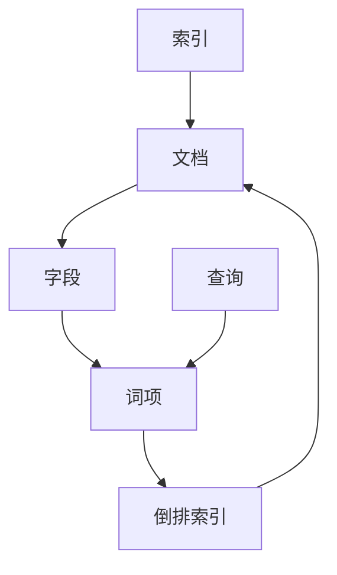

# 深入理解Lucene的打分机制

作者：禅与计算机程序设计艺术

## 1. 背景介绍

Apache Lucene 是一个高性能、全功能的文本搜索引擎库。自从诞生以来，Lucene 已成为许多搜索应用的核心组件。搜索引擎的核心任务之一是根据用户查询返回相关的文档，打分机制（Scoring）在这个过程中起着至关重要的作用。打分机制决定了每个文档与查询的匹配程度，从而影响搜索结果的排序和质量。

### 1.1 Lucene 的发展历程

Lucene 由 Doug Cutting 于 1999 年创建，最初是一个简单的文本搜索引擎。随着时间的推移，Lucene 逐渐演变为一个强大的搜索库，支持复杂的查询和高效的索引机制。Lucene 的打分机制也在不断发展，以应对多样化的搜索需求和复杂的查询模式。

### 1.2 打分机制的重要性

在搜索引擎中，打分机制直接影响用户体验。一个高效、准确的打分机制可以确保用户在最短的时间内找到最相关的信息。反之，一个不准确的打分机制可能会导致用户无法找到所需的信息，从而影响搜索引擎的整体效果。

### 1.3 本文的目标

本文旨在深入探讨 Lucene 的打分机制，包括其核心概念、算法原理、数学模型、实际应用场景以及未来的发展趋势。通过本文，读者将能够全面理解 Lucene 的打分机制，并能够在实际项目中应用这些知识。

## 2. 核心概念与联系

在深入探讨 Lucene 的打分机制之前，我们需要了解一些核心概念和它们之间的联系。这些概念包括索引、查询、文档、字段、词项、倒排索引等。

### 2.1 索引

索引是搜索引擎的基础结构，用于加速查询操作。在 Lucene 中，索引是一个包含多个文档的集合。每个文档由多个字段组成，每个字段包含一个或多个词项。

### 2.2 查询

查询是用户输入的搜索条件，Lucene 支持多种查询类型，如布尔查询、短语查询、范围查询等。查询的目的是从索引中找到与之匹配的文档。

### 2.3 文档

文档是索引的基本单位，每个文档由多个字段组成。字段可以包含文本、数字、日期等多种类型的数据。

### 2.4 字段

字段是文档的组成部分，每个字段包含一个或多个词项。字段可以是可索引的、可存储的、可分析的等。

### 2.5 词项

词项是字段中的基本单位，通常是经过分词处理后的单词或短语。词项是 Lucene 打分机制的核心元素。

### 2.6 倒排索引

倒排索引是一种高效的数据结构，用于存储词项和文档的对应关系。在倒排索引中，每个词项对应一个文档列表，表示该词项出现的所有文档。

### 2.7 核心概念之间的联系

这些核心概念之间的联系可以用以下 Mermaid 图表示：

## 3. 核心算法原理具体操作步骤

Lucene 的打分机制基于向量空间模型（Vector Space Model）和布尔模型（Boolean Model）。在这些模型的基础上，Lucene 采用了一系列复杂的算法来计算文档与查询的匹配度。

### 3.1 向量空间模型

向量空间模型是一种常用的文本表示方法，将文档和查询表示为向量。每个向量的维度对应一个词项，向量的值表示词项的重要性。向量空间模型的核心思想是通过计算向量之间的相似度来评估文档与查询的匹配度。

### 3.2 布尔模型

布尔模型是一种基于布尔代数的文本检索方法，将文档和查询表示为布尔表达式。布尔模型的核心思想是通过布尔运算（如 AND、OR、NOT）来评估文档与查询的匹配度。

### 3.3 TF-IDF 算法

TF-IDF（Term Frequency-Inverse Document Frequency）是 Lucene 打分机制的核心算法之一。TF-IDF 算法通过计算词项在文档中的频率（TF）和词项在整个索引中的逆文档频率（IDF）来评估词项的重要性。

#### 3.3.1 词频（Term Frequency, TF）

词频表示词项在文档中的出现频率。词频越高，词项的重要性越大。

$$
TF(t, d) = \frac{f_{t,d}}{\sum_{t' \in d} f_{t',d}}
$$

其中，$f_{t,d}$ 表示词项 $t$ 在文档 $d$ 中的出现次数，$\sum_{t' \in d} f_{t',d}$ 表示所有词项在文档 $d$ 中的出现总次数。

#### 3.3.2 逆文档频率（Inverse Document Frequency, IDF）

逆文档频率表示词项在整个索引中的稀有程度。词项越稀有，逆文档频率越高，词项的重要性越大。

$$
IDF(t) = \log \frac{N}{n_t}
$$

其中，$N$ 表示索引中的文档总数，$n_t$ 表示包含词项 $t$ 的文档数。

#### 3.3.3 TF-IDF 计算公式

TF-IDF 值表示词项在文档中的重要性，通过词频和逆文档频率的乘积计算得到。

$$
TF\text{-}IDF(t, d) = TF(t, d) \times IDF(t)
$$

### 3.4 BM25 算法

BM25（Best Matching 25）是 Lucene 中另一种常用的打分算法，基于概率检索模型。BM25 算法通过调整词频和文档长度的影响，进一步优化了 TF-IDF 算法。

#### 3.4.1 BM25 计算公式

BM25 值表示词项在文档中的重要性，通过以下公式计算得到：

$$
BM25(t, d) = IDF(t) \times \frac{f_{t,d} \times (k_1 + 1)}{f_{t,d} + k_1 \times (1 - b + b \times \frac{|d|}{avg|d|})}
$$

其中，$k_1$ 和 $b$ 是调节参数，$|d|$ 表示文档 $d$ 的长度，$avg|d|$ 表示所有文档的平均长度。

### 3.5 实际操作步骤

#### 3.5.1 创建索引

在 Lucene 中创建索引的步骤如下：

1. 初始化索引写入器（IndexWriter）。
2. 创建文档并添加字段。
3. 将文档添加到索引中。
4. 关闭索引写入器。

#### 3.5.2 执行查询

在 Lucene 中执行查询的步骤如下：

1. 初始化索引读取器（IndexReader）和索引搜索器（IndexSearcher）。
2. 构建查询对象。
3. 使用索引搜索器执行查询。
4. 获取查询结果并计算打分。

## 4. 数学模型和公式详细讲解举例说明

在本节中，我们将详细讲解 TF-IDF 和 BM25 算法的数学模型，并通过具体例子说明这些公式的计算过程。

### 4.1 TF-IDF 数学模型

TF-IDF 算法的数学模型由词频和逆文档频率两个部分组成。我们通过一个具体例子来说明这些公式的计算过程。

#### 4.1.1 示例数据

假设我们有以下三个文档：

- 文档 1（d1）："Lucene is a search library"
- 文档 2（d2）："Lucene is an indexing library"
- 文档 3（d3）："Lucene provides powerful search capabilities"

#### 4.1.2 词频计算

我们首先计算每个词项在文档中的词频：

$$
TF(t, d1) = \frac{f_{t,d1}}{\sum_{t' \in d1} f_{t',d1}}
$$

| 词项 | 文档 1 词频 | 文档 2 词频 | 文档 3 词频 |
|------|-------------|-------------|-------------|
|