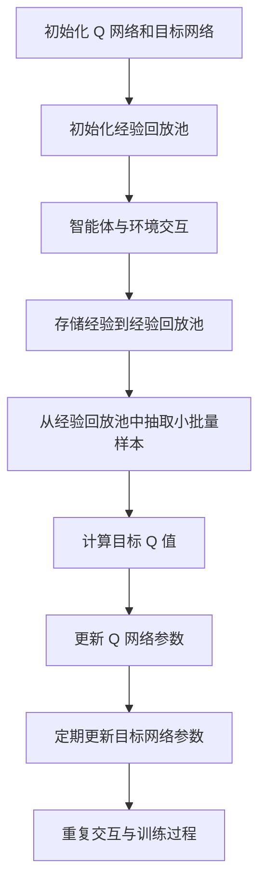

# 深度 Q-learning：在新闻推荐中的应用

作者：禅与计算机程序设计艺术

## 1. 背景介绍

### 1.1 新闻推荐系统的现状

随着互联网的迅猛发展，新闻推荐系统已经成为各大新闻门户和社交媒体平台的重要组成部分。这些系统通过分析用户的行为和兴趣，为用户推荐个性化的新闻内容，极大地提高了用户的阅读体验。然而，传统的新闻推荐系统通常依赖于协同过滤、内容过滤和混合推荐等方法，这些方法在处理动态变化的用户兴趣和实时更新的新闻内容时，存在一定的局限性。

### 1.2 深度 Q-learning 的引入

近年来，深度学习和强化学习的结合，即深度强化学习（Deep Reinforcement Learning, DRL），在解决复杂的决策问题上展现出了强大的能力。深度 Q-learning 作为深度强化学习中的一种重要算法，通过结合 Q-learning 和深度神经网络，能够有效地处理高维状态空间的问题。因此，将深度 Q-learning 应用于新闻推荐系统，能够更好地捕捉用户的动态兴趣变化，提高推荐的精准度和用户满意度。

### 1.3 本文的目标

本文旨在详细介绍深度 Q-learning 在新闻推荐中的应用。我们将从核心概念、算法原理、数学模型、项目实践、实际应用场景、工具和资源推荐、未来发展趋势与挑战等方面进行深入探讨，帮助读者全面理解和掌握这一技术。

## 2. 核心概念与联系

### 2.1 强化学习基础

强化学习（Reinforcement Learning, RL）是一种通过与环境交互学习策略的机器学习方法。其核心思想是智能体（Agent）在环境（Environment）中通过试错获得经验，并根据奖励（Reward）调整策略（Policy），以实现最大化累积奖励的目标。

#### 2.1.1 强化学习的基本要素

- **状态（State, S）**: 描述智能体在某一时刻所处的环境信息。
- **动作（Action, A）**: 智能体在某一状态下可以采取的行为。
- **奖励（Reward, R）**: 智能体采取某一动作后，环境给予的反馈。
- **策略（Policy, π）**: 决定智能体在某一状态下选择何种动作的规则。
- **值函数（Value Function, V）**: 评估某一状态的长远价值。
- **Q 函数（Q Function, Q）**: 评估在某一状态下采取某一动作的长远价值。

### 2.2 Q-learning 算法

Q-learning 是一种基于值函数的强化学习算法，通过学习状态-动作值函数（Q 函数）来指导智能体的决策。其目标是找到最优的 Q 函数，从而确定最优策略。

#### 2.2.1 Q-learning 的更新公式

Q-learning 的核心是利用贝尔曼方程（Bellman Equation）更新 Q 函数：

$$
Q(s, a) \leftarrow Q(s, a) + \alpha [r + \gamma \max_{a'} Q(s', a') - Q(s, a)]
$$

其中：
- $s$ 和 $a$ 分别表示当前状态和动作；
- $r$ 表示当前奖励；
- $s'$ 和 $a'$ 分别表示下一状态和下一动作；
- $\alpha$ 是学习率；
- $\gamma$ 是折扣因子。

### 2.3 深度 Q-learning

深度 Q-learning 通过深度神经网络（Deep Neural Network, DNN）近似 Q 函数，解决了传统 Q-learning 在高维状态空间中的应用问题。其核心思想是使用神经网络参数 $\theta$ 近似 Q 函数，即 $Q(s, a; \theta)$。

#### 2.3.1 深度 Q-learning 的更新公式

深度 Q-learning 的更新公式与 Q-learning 类似，只是将 Q 函数替换为神经网络的输出：

$$
Q(s, a; \theta) \leftarrow Q(s, a; \theta) + \alpha [r + \gamma \max_{a'} Q(s', a'; \theta^{-}) - Q(s, a; \theta)]
$$

其中 $\theta^{-}$ 表示目标网络的参数，用于稳定训练过程。

### 2.4 新闻推荐系统中的深度 Q-learning

在新闻推荐系统中，深度 Q-learning 可以用来动态调整推荐策略，以适应用户兴趣的变化。具体来说，系统将用户的历史行为和当前环境作为状态，推荐的新闻作为动作，用户的点击反馈作为奖励，通过不断学习和调整策略，最大化用户的长期满意度。

## 3. 核心算法原理具体操作步骤

### 3.1 环境建模

在新闻推荐系统中，环境建模是关键的一步。环境包括用户的历史行为、当前新闻内容、用户的实时反馈等。我们需要将这些信息转化为适合深度 Q-learning 处理的状态表示。

#### 3.1.1 状态表示

状态表示可以包括以下信息：
- 用户的历史点击记录：用来捕捉用户的兴趣偏好。
- 当前新闻的特征：包括新闻的类别、发布时间、作者等。
- 用户的实时反馈：如点击、停留时间、点赞、评论等。

### 3.2 动作空间设计

动作空间即系统可以推荐的新闻集合。由于新闻内容的多样性，动作空间通常非常大。我们可以通过降维和特征选择的方法，简化动作空间。

#### 3.2.1 动作表示

动作表示可以包括以下信息：
- 新闻的 ID：唯一标识每一篇新闻。
- 新闻的特征向量：如词向量、主题分布等。

### 3.3 奖励设计

奖励设计是深度 Q-learning 成功应用的关键。在新闻推荐系统中，奖励通常基于用户的反馈，如点击、停留时间、点赞、评论等。

#### 3.3.1 奖励函数

奖励函数可以设计为：
- 点击奖励：用户点击推荐新闻时，给予正奖励。
- 停留时间奖励：根据用户在新闻页面停留的时间，给予不同的奖励。
- 互动奖励：用户点赞、评论等互动行为，给予额外奖励。

### 3.4 深度 Q-learning 训练过程

深度 Q-learning 的训练过程包括以下步骤：

#### 3.4.1 初始化

- 初始化 Q 网络和目标网络的参数 $\theta$ 和 $\theta^{-}$。
- 初始化经验回放池（Experience Replay Buffer）。

#### 3.4.2 交互与存储

- 智能体在环境中进行交互，存储经验 $(s, a, r, s')$ 到经验回放池。

#### 3.4.3 经验回放

- 从经验回放池中随机抽取小批量样本，计算目标 Q 值：
  $$
  y = r + \gamma \max_{a'} Q(s', a'; \theta^{-})
  $$
- 使用均方误差（Mean Squared Error, MSE）损失函数更新 Q 网络的参数：
  $$
  L(\theta) = \mathbb{E}[(y - Q(s, a; \theta))^2]
  $$

#### 3.4.4 参数更新

- 定期将 Q 网络的参数 $\theta$ 复制到目标网络的参数 $\theta^{-}$。

### 3.5 算法流程图

## 4. 数学模型和公式详细讲解举例说明

### 4.1 贝尔曼方程

贝尔曼方程是 Q-learning 的核心，其表达了当前状态-动作值与下一状态-动作值之间的关系：

$$
Q(s, a) = \mathbb{E}[r + \gamma \max_{a'} Q(s', a')]
$$

### 4.2 Q-learning 更新公式

Q-learning 通过以下公式更新 Q 值：

$$
Q(s, a) \leftarrow Q(s, a) + \alpha [r + \gamma \max_{a'} Q(s', a') - Q(s, a)]
$$

### 4.3 深度 Q-learning 更新公式

深度 Q-learning 通过神经网络近似 Q 函数，其更新公式为：

$$
Q(s, a; \theta) \leftarrow Q(s, a; \theta) + \alpha [r + \gamma \max_{a'} Q(s', a'; \theta^{-}) - Q(s,