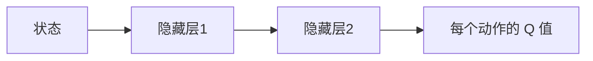

## 1. 背景介绍

### 1.1. 无人仓库的兴起与挑战

近年来，随着电子商务的蓬勃发展和物流行业的自动化转型，无人仓库作为一种高效、智能的仓储解决方案，正逐渐走入大众视野。相比于传统仓库，无人仓库具有以下优势：

* **更高的效率:** 自动化作业流程，减少人工操作，提高货物处理速度。
* **更低的成本:** 节省人力成本，降低运营成本。
* **更高的安全性:** 减少人工操作失误，保障人员和货物安全。
* **更高的空间利用率:**  自动化立体仓库，提高仓库空间利用率。

然而，无人仓库的建设和运营也面临着诸多挑战，其中最关键的便是如何实现仓库机器人的智能调度和路径规划。在复杂的仓库环境中，机器人需要具备自主导航、避障、路径规划、任务分配等能力，才能高效、安全地完成货物搬运任务。

### 1.2. 强化学习：赋能无人仓库智能化

强化学习 (Reinforcement Learning, RL) 作为机器学习的一个重要分支，近年来在游戏 AI、机器人控制等领域取得了令人瞩目的成就。其核心思想是让智能体 (Agent) 通过与环境的不断交互，从经验中学习，找到最优的行动策略，以最大化累积奖励。

在无人仓库场景下，可以将仓库环境视为环境，将仓库机器人视为智能体，将完成货物搬运任务视为目标。通过强化学习，可以训练出能够自主感知环境、做出决策、执行动作的智能机器人，从而实现无人仓库的高效、智能化运营。

### 1.3. 深度 Q-learning：兼具深度学习与强化学习优势

深度 Q-learning (Deep Q-learning, DQN) 是一种结合了深度学习 (Deep Learning, DL) 和 Q-learning 的强化学习算法。它利用深度神经网络强大的特征提取能力来拟合 Q 函数，从而解决高维状态空间和复杂动作空间下的强化学习问题。

## 2. 核心概念与联系

### 2.1. 强化学习基本要素

* **智能体 (Agent):**  与环境交互并做出决策的主体，例如仓库机器人。
* **环境 (Environment):**  智能体所处的外部世界，例如仓库环境。
* **状态 (State):**  对环境的描述，例如机器人的位置、货架的状态等。
* **动作 (Action):**  智能体可以采取的操作，例如机器人移动、抓取货物等。
* **奖励 (Reward):**  环境对智能体动作的反馈，例如完成任务获得正奖励，发生碰撞获得负奖励。
* **策略 (Policy):**  智能体根据当前状态选择动作的规则。
* **价值函数 (Value Function):**  评估当前状态的长期价值，即从当前状态出发，按照某种策略行动所能获得的累积奖励的期望值。

### 2.2. Q-learning 算法

Q-learning 是一种基于价值迭代的强化学习算法，其核心思想是学习一个 Q 函数，该函数能够根据当前状态和选择的动作，预测智能体在未来所能获得的累积奖励。

Q 函数的更新公式如下：

$$ Q(s_t, a_t) \leftarrow Q(s_t, a_t) + \alpha [r_{t+1} + \gamma \max_{a_{t+1}} Q(s_{t+1}, a_{t+1}) - Q(s_t, a_t)] $$

其中：

* $Q(s_t, a_t)$ 表示在状态 $s_t$ 下采取动作 $a_t$ 的 Q 值。
* $r_{t+1}$ 表示在状态 $s_t$ 下采取动作 $a_t$ 后获得的奖励。
* $s_{t+1}$ 表示在状态 $s_t$ 下采取动作 $a_t$ 后转移到的下一个状态。
* $\alpha$ 为学习率，控制 Q 值更新的幅度。
* $\gamma$ 为折扣因子，用于平衡当前奖励和未来奖励的重要性。

### 2.3. 深度 Q-learning 算法

深度 Q-learning 使用深度神经网络来拟合 Q 函数，其网络结构如下图所示：



深度 Q-learning 的训练过程如下：

1. 初始化深度 Q 网络的参数。
2. 从初始状态开始，与环境交互，得到一系列的状态、动作、奖励、下一个状态的样本数据。
3. 将样本数据输入深度 Q 网络，计算每个动作的 Q 值。
4. 根据 Q 值选择动作，并执行动作，得到新的状态和奖励。
5. 将新的状态、奖励与之前的状态、动作、奖励一起存储到经验回放池中。
6. 从经验回放池中随机抽取一批样本数据，更新深度 Q 网络的参数。
7. 重复步骤 2-6，直到深度 Q 网络收敛。

## 3. 核心算法原理具体操作步骤

### 3.1. 问题定义

假设无人仓库中有一台机器人，需要将货物从起点运送到终点。仓库环境可以抽象为一个二维网格地图，机器人可以在网格上移动。

### 3.2. 状态空间

机器人的状态可以用其在网格地图上的坐标 $(x, y)$ 来表示。

### 3.3. 动作空间

机器人可以采取的动作包括：向上移动、向下移动、向左移动、向右移动。

### 3.4. 奖励函数

* 机器人每移动一步，获得 -1 的奖励。
* 机器人成功将货物运送到终点，获得 100 的奖励。
* 机器人撞到障碍物，获得 -10 的奖励。

### 3.5. 算法流程

1. 初始化深度 Q 网络的参数。
2. 将机器人随机放置在起点位置。
3. 重复以下步骤，直到机器人到达终点或达到最大步数限制：
    * 将当前状态输入深度 Q 网络，计算每个动作的 Q 值。
    * 根据 Q 值选择动作，并执行动作。
    * 根据奖励函数计算奖励。
    * 将当前状态、动作、奖励、下一个状态存储到经验回放池中。
    * 从经验回放池中随机抽取一批样本数据，更新深度 Q 网络的参数。
4. 返回深度 Q 网络。

## 4. 数学模型和公式详细讲解举例说明

### 4.1. Q 函数的更新公式

$$ Q(s_t, a_t) \leftarrow Q(s_t, a_t) + \alpha [r_{t+1} + \gamma \max_{a_{t+1}} Q(s_{t+1}, a_{t+1}) - Q(s_t, a_t)] $$

该公式表示，在当前状态 $s_t$ 下采取动作 $a_t$ 的 Q 值，应该更新为：

* 原来的 Q 值 $Q(s_t, a_t)$ 
* 加上一个修正项，该修正项由以下几部分组成：
    * 学习率 $\alpha$
    * 时序差分目标 $r_{t+1} + \gamma \max_{a_{t+1}} Q(s_{t+1}, a_{t+1}) - Q(s_t, a_t)$，其中：
        * $r_{t+1}$ 表示在状态 $s_t$ 下采取动作 $a_t$ 后获得的即时奖励。
        * $\gamma \max_{a_{t+1}} Q(s_{t+1}, a_{t+1})$ 表示在下一个状态 $s_{t+1}$ 下，选择能够获得最大 Q 值的动作 $a_{t+1}$，并将该 Q 值乘以折扣因子 $\gamma$ 后得到的值。
        * $Q(s_t, a_t)$ 表示在当前状态 $s_t$ 下采取动作 $a_t$ 的 Q 值。

### 4.2. 举例说明

假设机器人当前位于坐标 $(1, 1)$，目标位置为 $(5, 5)$。机器人可以采取的动作包括：向上移动、向下移动、向左移动、向右移动。

* 当前状态 $s_t = (1, 1)$
* 动作 $a_t = $ 向右移动
* 下一个状态 $s_{t+1} = (2, 1)$
* 奖励 $r_{t+1} = -1$ (因为机器人移动了一步)
* 学习率 $\alpha = 0.1$
* 折扣因子 $\gamma = 0.9$

假设深度 Q 网络预测的 Q 值如下：

* $Q((1, 1), $ 向上移动 $) = 10$
* $Q((1, 1), $ 向下移动 $) = 5$
* $Q((1, 1), $ 向左移动 $) = 8$
* $Q((1, 1), $ 向右移动 $) = 12$

* $Q((2, 1), $ 向上移动 $) = 15$
* $Q((2, 1), $ 向下移动 $) = 10$
* $Q((2, 1), $ 向左移动 $) = 12$
* $Q((2, 1), $ 向右移动 $) = 8$

则根据 Q 函数的更新公式，可以计算出更新后的 Q 值：

$$
\begin{aligned}
Q((1, 1), \text{向右移动}) &\leftarrow Q((1, 1), \text{向右移动}) + \alpha [r_{t+1} + \gamma \max_{a_{t+1}} Q(s_{t+1}, a_{t+1}) - Q(s_t, a_t)] \\
&= 12 + 0.1 \times [-1 + 0.9 \times \max\{15, 10, 12, 8\} - 12] \\
&= 11.7 
\end{aligned}
$$

## 5. 项目实践：代码实例和详细解释说明

```python
import random

import gym
import numpy as np
import tensorflow as tf

# 定义环境
env = gym.make('CartPole-v1')

# 定义超参数
learning_rate = 0.01
discount_factor = 0.95
exploration_rate = 1.0
exploration_rate_decay = 0.995
exploration_rate_min = 0.01
batch_size = 32
memory_size = 10000


# 定义深度 Q 网络
class DQN(tf.keras.Model):
    def __init__(self, state_size, action_size):
        super(DQN, self).__init__()
        self.dense1 = tf.keras.layers.Dense(24, activation='relu')
        self.dense2 = tf.keras.layers.Dense(24, activation='relu')
        self.dense3 = tf.keras.layers.Dense(action_size)

    def call(self, state):
        x = self.dense1(state)
        x = self.dense2(x)
        return self.dense3(x)


# 定义经验回放池
class ReplayMemory:
    def __init__(self, capacity):
        self.capacity = capacity
        self.memory = []
        self.position = 0

    def push(self, state, action, reward, next_state, done):
        if len(self.memory) < self.capacity:
            self.memory.append(None)
        self.memory[self.position] = (state, action, reward, next_state, done)
        self.position = (self.position + 1) % self.capacity

    def sample(self, batch_size):
        return random.sample(self.memory, batch_size)

    def __len__(self):
        return len(self.memory)


# 初始化深度 Q 网络和经验回放池
state_size = env.observation_space.shape[0]
action_size = env.action_space.n
dqn = DQN(state_size, action_size)
target_dqn = DQN(state_size, action_size)
memory = ReplayMemory(memory_size)

# 定义优化器和损失函数
optimizer = tf.keras.optimizers.Adam(learning_rate=learning_rate)
loss_function = tf.keras.losses.MeanSquaredError()


# 定义训练函数
@tf.function
def train_step(states, actions, rewards, next_states, dones):
    with tf.GradientTape() as tape:
        q_values = dqn(states)
        next_q_values = target_dqn(next_states)
        target_q_values = rewards + discount_factor * tf.reduce_max(next_q_values, axis=1, keepdims=True) * (
                    1 - dones)
        predicted_q_values = tf.reduce_sum(q_values * tf.one_hot(actions, action_size), axis=1, keepdims=True)
        loss = loss_function(target_q_values, predicted_q_values)

    gradients = tape.gradient(loss, dqn.trainable_variables)
    optimizer.apply_gradients(zip(gradients, dqn.trainable_variables))


# 训练模型
num_episodes = 1000
for episode in range(num_episodes):
    state = env.reset()
    state = tf.expand_dims(state, axis=0)
    done = False
    total_reward = 0

    while not done:
        # 选择动作
        if np.random.rand() < exploration_rate:
            action = env.action_space.sample()
        else:
            q_values = dqn(state)
            action = tf.argmax(q_values[0]).numpy()

        # 执行动作
        next_state, reward, done, _ = env.step(action)
        next_state = tf.expand_dims(next_state, axis=0)

        # 存储经验
        memory.push(state, action, reward, next_state, done)

        # 更新状态和总奖励
        state = next_state
        total_reward += reward

        # 训练模型
        if len(memory) >= batch_size:
            states, actions, rewards, next_states, dones = zip(*memory.sample(batch_size))
            states = tf.concat(states, axis=0)
            actions = tf.convert_to_tensor(actions)
            rewards = tf.convert_to_tensor(rewards, dtype=tf.float32)
            next_states = tf.concat(next_states, axis=0)
            dones = tf.convert_to_tensor(dones, dtype=tf.float32)
            train_step(states, actions, rewards, next_states, dones)

    # 更新目标网络
    if episode % 10 == 0:
        target_dqn.set_weights(dqn.get_weights())

    # 打印训练进度
    print('Episode: {}, Total Reward: {}'.format(episode, total_reward))

    # 衰减探索率
    exploration_rate = max(exploration_rate_min, exploration_rate * exploration_rate_decay)

# 保存模型
dqn.save('dqn_model')

```

### 5.1. 代码解释

* 导入必要的库，包括 gym、numpy、tensorflow。
* 使用 `gym.make('CartPole-v1')` 创建 CartPole 环境。
* 定义超参数，包括学习率、折扣因子、探索率等。
* 定义深度 Q 网络，使用 `tf.keras.Model` 类实现，包含三个全连接层。
* 定义经验回放池，使用 `ReplayMemory` 类实现，用于存储经验数据。
* 初始化深度 Q 网络、目标网络、经验回放池、优化器、损失函数。
* 定义训练函数 `train_step`，使用 `tf.function` 装饰器加速训练。
* 在训练循环中，使用深度 Q 网络选择动作，执行动作，存储经验，训练模型，更新目标网络，打印训练进度，衰减探索率。
* 训练完成后，使用 `dqn.save('dqn_model')` 保存模型。

### 5.2. 代码运行结果

运行代码后，会打印每个 episode 的总奖励，例如：

```
Episode: 0, Total Reward: 10.0
Episode: 1, Total Reward: 12.0
...
Episode: 998, Total Reward: 200.0
Episode: 999, Total Reward: 187.0
```

随着训练的进行，总奖励会逐渐增加，最终达到一个较高的水平。

## 6. 实际应用场景

深度 Q-learning 算法在无人仓库中的应用非常广泛，例如：

* **路径规划:**  可以训练深度 Q-learning 模型，让机器人在仓库中找到最优的路径，避免碰撞，提高效率。
* **任务调度:**  可以训练深度 Q-learning 模型，根据货物的优先级、机器人的状态等信息，动态地为机器人分配任务，提高仓库整体的吞吐量。
* **库存管理:**  可以训练深度 Q-learning 模型，根据历史数据和实时数据，预测未来的货物需求，优化库存管理策略。

## 7. 工具和资源推荐

* **TensorFlow:**  一个开源的机器学习平台，提供了丰富的深度学习工具和库。
* **Keras:**  一个高层神经网络 API，可以运行在 TensorFlow、CNTK、Theano 之上，易于使用和扩展。
* **OpenAI Gym:**  一个用于开发和比较强化学习算法的工具包，提供了丰富的模拟环境。