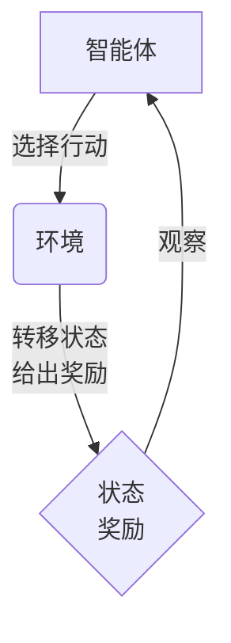
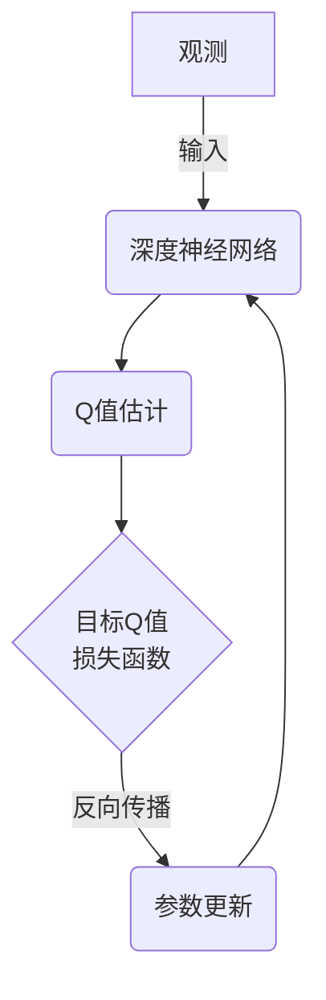

# 深度 Q-learning：在智能交通系统中的应用

## 1.背景介绍

### 1.1 交通拥堵问题

随着城市化进程的不断加快,交通拥堵已经成为了一个全球性的挑战。根据最新的交通数据显示,在全球主要城市中,司机每年平均在交通堵塞中浪费约97个小时。交通拥堵不仅造成了大量的时间和金钱损失,而且还导致了能源浪费、环境污染和生活质量下降等一系列问题。

### 1.2 智能交通系统的重要性

为了解决日益严重的交通拥堵问题,智能交通系统(Intelligent Transportation Systems, ITS)应运而生。ITS是一种利用先进的信息和通信技术来提高道路交通效率、安全性、舒适性和节能环保的综合性交通管理和控制系统。它通过采集实时交通信息、建模和优化算法,对交通流量进行实时管理和调控,从而实现交通网络的高效运行。

### 1.3 强化学习在智能交通系统中的应用

在智能交通系统中,决策过程往往涉及复杂的动态环境和大量的不确定因素。传统的规则库方法和数学建模方法难以充分适应这种复杂环境。强化学习作为一种基于试错学习的方法,具有很强的自适应能力,可以根据环境的反馈不断优化决策策略,从而在复杂动态环境中获得最优决策。其中,深度Q学习(Deep Q-Learning)作为一种结合深度神经网络和Q学习的强化学习算法,已经成为智能交通系统中一种非常有前景的决策方法。

## 2.核心概念与联系

### 2.1 强化学习基本概念

强化学习是一种基于试错学习的机器学习方法,其目标是通过与环境的交互,获得一个在给定情况下能够产生最佳行为序列的策略或价值函数。强化学习系统通常由四个基本元素组成:

- 智能体(Agent)
- 环境(Environment) 
- 状态(State)
- 奖励(Reward)

在每一个时间步,智能体根据当前状态选择一个行动,并将其应用于环境。环境会根据这个行动转移到新的状态,同时给出对应的奖励值。智能体的目标是最大化在一个序列中获得的累积奖励。

### 2.2 Q学习算法

Q学习是强化学习中一种基于价值的算法,用于寻找在给定的马尔可夫决策过程(Markov Decision Process, MDP)中的最优策略。Q值函数$Q(s,a)$定义为在状态$s$下选择行动$a$后,能够获得的期望累积奖励。Q学习算法通过不断更新Q值函数,逐步逼近最优Q值函数,从而获得最优策略。

Q值函数的更新规则如下:

$$Q(s_t,a_t) \leftarrow Q(s_t,a_t) + \alpha \big(r_t + \gamma \max_{a}Q(s_{t+1},a) - Q(s_t,a_t)\big)$$

其中:
- $\alpha$是学习率
- $\gamma$是折扣因子
- $r_t$是在时间步$t$获得的即时奖励
- $\max_{a}Q(s_{t+1},a)$是在下一状态$s_{t+1}$下可获得的最大期望累积奖励

### 2.3 深度Q网络(Deep Q-Network, DQN)

传统的Q学习算法在处理高维观测数据和连续状态空间时存在一些局限性。深度Q网络(DQN)通过将深度神经网络引入Q学习,使得智能体能够直接从高维原始输入(如图像、视频等)中学习出最优策略,从而显著提高了Q学习在复杂问题上的应用能力。

DQN的核心思想是使用一个深度神经网络来近似Q值函数,即$Q(s,a;\theta) \approx Q^*(s,a)$,其中$\theta$是网络的参数。在训练过程中,通过最小化损失函数:

$$L_i(\theta_i) = \mathbb{E}_{(s,a,r,s')\sim U(D)}\big[\big(r + \gamma \max_{a'} Q(s',a';\theta^-_i) - Q(s,a;\theta_i)\big)^2\big]$$

来更新网络参数$\theta$,逐步逼近最优Q值函数。其中$U(D)$是从经验回放池$D$中均匀采样的转换元组$(s,a,r,s')$,而$\theta^-$是目标网络的参数,用于估计下一状态的最大Q值,以提高训练稳定性。

## 3.核心算法原理具体操作步骤

DQN算法的核心步骤如下:

1. **初始化**:
    - 初始化深度Q网络及其参数$\theta$
    - 初始化目标网络参数$\theta^-$,令$\theta^- \leftarrow \theta$
    - 初始化经验回放池$D$为空集

2. **观测环境状态**$s_t$

3. **选择行动**:
    - 以$\epsilon$的概率选择随机行动,以$1-\epsilon$的概率选择$\arg\max_a Q(s_t,a;\theta)$
    - 执行所选的行动$a_t$,获得奖励$r_t$和新的状态$s_{t+1}$
    - 将转换$(s_t,a_t,r_t,s_{t+1})$存入经验回放池$D$

4. **采样并学习**:
    - 从经验回放池$D$中随机采样一个批次的转换$(s_j,a_j,r_j,s_{j+1})$
    - 计算目标Q值:
      $$y_j = r_j + \gamma \max_{a'} Q(s_{j+1}, a';\theta^-)$$
    - 计算损失函数:
      $$L = \frac{1}{N}\sum_{j=1}^{N}\big(y_j - Q(s_j,a_j;\theta)\big)^2$$
    - 通过反向传播和优化算法(如RMSProp、Adam等)更新网络参数$\theta$
    - 每隔一定步数后,将网络参数$\theta$复制到目标网络$\theta^-$

5. **重复步骤2-4**,直到达到预期收敛条件

需要注意的是,在实际应用中还需要考虑一些技巧和优化策略,如$\epsilon$-greedy策略、Double DQN、Prioritized Experience Replay等,以提高算法的性能和稳定性。

## 4.数学模型和公式详细讲解举例说明

在深度Q学习中,我们需要学习一个能够近似最优Q值函数$Q^*(s,a)$的参数化函数$Q(s,a;\theta)$,其中$\theta$是需要学习的参数。通常,我们使用一个深度神经网络来表示这个Q值函数近似器。

### 4.1 Q值函数近似

给定一个状态$s$和一个可选行动$a$,我们希望能够估计在当前状态下执行行动$a$之后,能够获得的最大期望累积奖励。这个期望累积奖励就是Q值函数$Q^*(s,a)$的定义:

$$Q^*(s,a) = \mathbb{E}\Big[r_t + \gamma r_{t+1} + \gamma^2 r_{t+2} + \cdots | s_t = s, a_t = a, \pi^*\Big]$$

其中:
- $r_t$是在时间步$t$获得的即时奖励
- $\gamma \in [0,1]$是折扣因子,用于权衡当前奖励和未来奖励的重要性
- $\pi^*$是最优策略

由于状态空间和行动空间通常是高维的,难以直接表示和存储Q值函数。因此,我们使用一个参数化的函数$Q(s,a;\theta)$来近似真实的Q值函数,其中$\theta$是需要学习的参数。在深度Q学习中,这个参数化函数通常是一个深度神经网络。

例如,对于一个简单的栅格世界(Gridworld)环境,我们可以使用一个多层感知机(MLP)来近似Q值函数:

$$Q(s,a;\theta) = \text{MLP}(s,a;\theta)$$

其中$s$是状态输入,经过一系列的仿射变换和非线性激活函数,最终输出一个标量值,代表在状态$s$下执行行动$a$的Q值估计。

### 4.2 损失函数和优化

为了找到最优的参数$\theta^*$,使得$Q(s,a;\theta^*) \approx Q^*(s,a)$,我们需要定义一个损失函数,并通过优化算法来最小化这个损失函数。

在DQN算法中,我们定义如下均方差损失函数:

$$L_i(\theta_i) = \mathbb{E}_{(s,a,r,s')\sim U(D)}\big[\big(y_i - Q(s,a;\theta_i)\big)^2\big]$$

其中:
- $y_i = r + \gamma \max_{a'} Q(s',a';\theta^-_i)$是目标Q值,使用一个延迟更新的目标网络$\theta^-$来估计
- $U(D)$表示从经验回放池$D$中均匀采样的转换$(s,a,r,s')$

通过最小化这个损失函数,我们可以使Q网络的输出值$Q(s,a;\theta)$逐渐逼近目标Q值$y_i$,从而学习到最优的Q值函数近似。

在实践中,我们通常使用小批量梯度下降(Mini-Batch Gradient Descent)和反向传播算法来优化网络参数$\theta$。具体地,在每一个训练迭代中,我们从经验回放池$D$中采样一个小批量的转换$(s_j,a_j,r_j,s_{j+1})$,计算相应的目标Q值$y_j$和损失函数$L$:

$$L = \frac{1}{N}\sum_{j=1}^{N}\big(y_j - Q(s_j,a_j;\theta)\big)^2$$

然后,通过反向传播计算损失函数相对于网络参数$\theta$的梯度$\nabla_\theta L$,并使用优化算法(如RMSProp、Adam等)根据梯度更新参数$\theta$。

### 4.3 示例:Gridworld环境

为了更好地理解深度Q学习的数学模型,我们可以通过一个简单的Gridworld环境来举例说明。

在Gridworld环境中,智能体位于一个$n \times n$的二维栅格世界中,可以执行上下左右四个基本行动。智能体的目标是从起始位置到达终止位置,同时尽可能获得更多的奖励。

我们定义状态$s$为智能体在栅格世界中的位置坐标$(x,y)$,行动$a$为四个基本方向移动。对于每一个状态-行动对$(s,a)$,我们使用一个双层神经网络来估计其Q值:

$$Q(s,a;\theta) = W_2^{\top}\text{ReLU}(W_1^{\top}[s;a] + b_1) + b_2$$

其中:
- $[s;a]$是状态$s$和行动$a$的一维向量表示的拼接
- $W_1,b_1,W_2,b_2$分别是第一层和第二层的权重和偏置参数
- $\text{ReLU}$是整流线性单元激活函数

在训练过程中,我们从经验回放池$D$中采样一个小批量的转换$(s_j,a_j,r_j,s_{j+1})$,计算目标Q值$y_j$和损失函数$L$:

$$y_j = r_j + \gamma \max_{a'} Q(s_{j+1}, a';\theta^-)$$
$$L = \frac{1}{N}\sum_{j=1}^{N}\big(y_j - Q(s_j,a_j;\theta)\big)^2$$

然后,通过反向传播算法计算损失函数相对于网络参数$\theta$的梯度$\nabla_\theta L$,并使用优化算法(如RMSProp)根据梯度更新参数$\theta$。

在训练过程中,我们还需要定期将Q网络的参数$\theta$复制到目标网络$\theta^-$,以提高训练稳定性。经