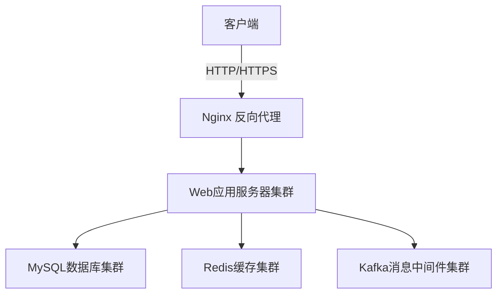
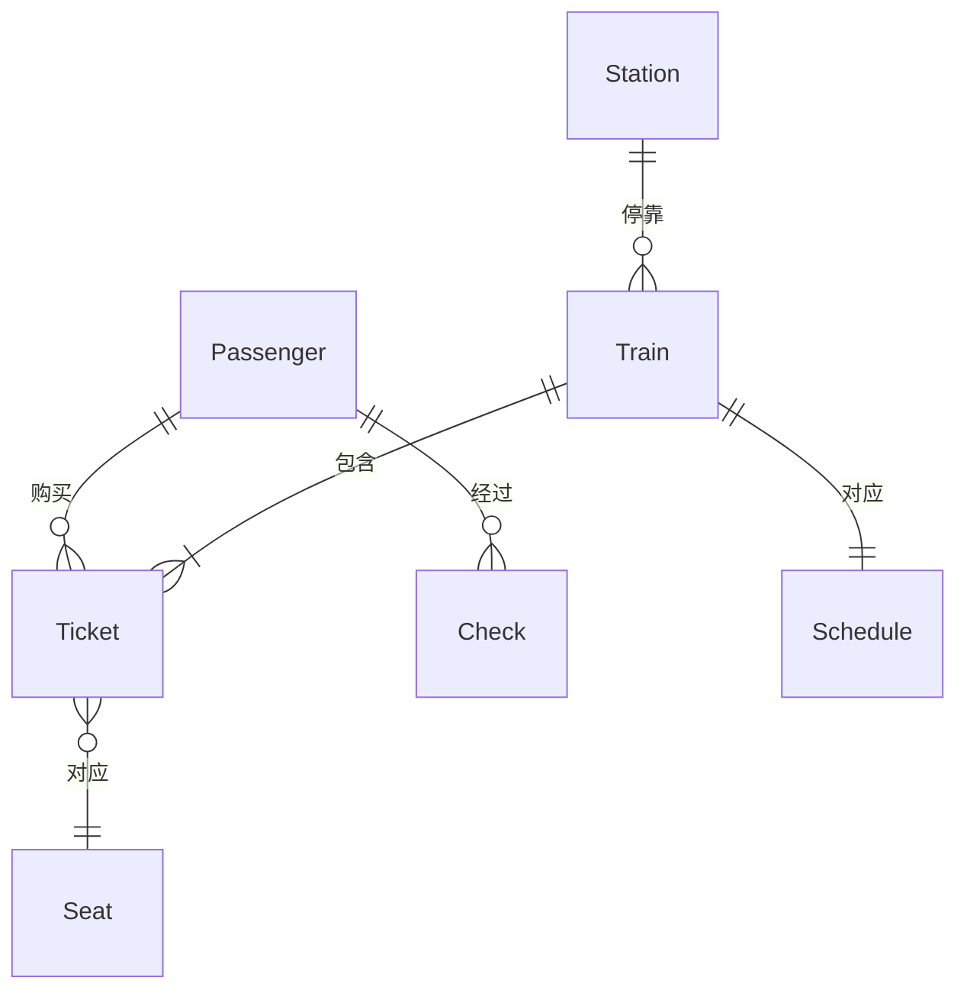

# 火车站管理系统详细设计与具体代码实现

作者:禅与计算机程序设计艺术

## 1. 背景介绍

随着社会经济的快速发展和人口流动性的增强,火车站作为重要的交通枢纽,在现代化管理中面临着越来越大的挑战。传统的人工管理模式已经难以满足日益增长的客流量和复杂的业务需求。因此,开发一套高效、智能、安全的火车站管理系统势在必行。

本文将从需求分析入手,详细阐述火车站管理系统的架构设计、数据库设计、核心算法、关键代码实现等方面,并探讨该系统在实际应用中的场景和未来发展趋势。

### 1.1 火车站管理现状
#### 1.1.1 人工管理的局限性
#### 1.1.2 信息化管理的必要性
#### 1.1.3 智能化管理的趋势

### 1.2 系统开发目标
#### 1.2.1 提高管理效率
#### 1.2.2 优化旅客体验
#### 1.2.3 增强安全保障

## 2. 核心概念与联系

### 2.1 实体关系分析
#### 2.1.1 旅客
#### 2.1.2 车次
#### 2.1.3 车站
#### 2.1.4 售票
#### 2.1.5 安检

### 2.2 业务流程梳理  
#### 2.2.1 购票流程
#### 2.2.2 进站流程
#### 2.2.3 安检流程
#### 2.2.4 乘车流程

### 2.3 系统功能模块划分
#### 2.3.1 售票管理
#### 2.3.2 进站管理
#### 2.3.3 安检管理 
#### 2.3.4 客流统计分析
#### 2.3.5 信息发布管理
#### 2.3.6 系统管理

## 3. 架构设计

### 3.1 技术选型
#### 3.1.1 编程语言:Java
#### 3.1.2 Web框架:Spring Boot
#### 3.1.3 数据库:MySQL
#### 3.1.4 缓存:Redis
#### 3.1.5 消息队列:Kafka

### 3.2 系统架构 
#### 3.2.1 架构图

#### 3.2.2 架构说明
整个系统采用微服务架构,使用Spring Boot构建RESTful API。Nginx作为反向代理和负载均衡,将请求分发到Web后端应用服务器集群。使用MySQL作为主数据存储,搭建高可用的数据库集群。使用Redis作为高速缓存,加速数据读取。使用Kafka处理海量数据,实现异步解耦。

### 3.3 数据库设计
#### 3.3.1 概念模型

#### 3.3.2 物理模型
```sql
CREATE TABLE `passenger` (
  `id` int(11) PRIMARY KEY AUTO_INCREMENT COMMENT '旅客id',
  `name` varchar(20) NOT NULL COMMENT '姓名',
  `id_card` varchar(18) NOT NULL UNIQUE COMMENT '身份证号',
  `phone` varchar(11) NOT NULL COMMENT '电话'
) ENGINE=InnoDB DEFAULT CHARSET=utf8mb4;

CREATE TABLE `ticket` (
  `id` int(11) PRIMARY KEY AUTO_INCREMENT COMMENT '车票id',
  `train_no` varchar(10) NOT NULL COMMENT '车次',
  `departure_station` varchar(20) NOT NULL COMMENT '出发站',  
  `arrival_station` varchar(20) NOT NULL COMMENT '到达站',
  `departure_time` datetime NOT NULL COMMENT '发车时间',
  `arrival_time` datetime NOT NULL COMMENT '到达时间',
  `seat_no` varchar(5) NOT NULL COMMENT '座位号',
  `passenger_id` int(11) NOT NULL COMMENT '旅客id',
  FOREIGN KEY (`passenger_id`) REFERENCES `passenger` (`id`)
) ENGINE=InnoDB DEFAULT CHARSET=utf8mb4;

CREATE TABLE `check` (
  `id` int(11) PRIMARY KEY AUTO_INCREMENT COMMENT '检票id',
  `ticket_id` int(11) NOT NULL COMMENT '车票id',
  `passenger_id` int(11) NOT NULL COMMENT '旅客id',
  `check_time` datetime NOT NULL COMMENT '检票时间',
  FOREIGN KEY (`passenger_id`) REFERENCES `passenger` (`id`),
  FOREIGN KEY (`ticket_id`) REFERENCES `ticket` (`id`) 
) ENGINE=InnoDB DEFAULT CHARSET=utf8mb4;

-- 其他表结构省略
```

## 4. 核心算法原理与实现

### 4.1 最短路径算法
#### 4.1.1 问题描述
在火车运行线路图中,站点之间的距离不同。为了缩短旅客出行时间,需要计算出两个站点之间的最短路径。可以将站点抽象为图的节点,站点间的距离作为边的权重,构建一个加权有向图模型。
#### 4.1.2 Dijkstra算法
Dijkstra算法是求解单源最短路径问题的经典算法。基本思想是,初始时选择起点为已访问结点,待访问结点包括起点外所有结点,迭代地找到从起点到其他各节点的最短路径。
##### 1) 算法步骤
1. 初始化源点s的距离为0,其他顶点距离为正无穷大。
2. 将s加入已访问顶点集合S。
3. 遍历与s直接相邻的所有 未加入S的顶点 u,若 `dist[u] > dist[s] + edge[s,u]`,则更新 `dist[u] = dist[s] + edge[s,u]`。
4. 在未访问顶点集合V-S中选择dist最小的顶点t,加入S。  
5. 重复步骤3和4,直到所有顶点都包含在S中。

##### 2) 代码实现
```java
public Map<String, Integer> dijkstra(String start) {
    // 初始化距离表
    Map<String, Integer> distMap = new HashMap<>();
    for (String station : stations) {
        distMap.put(station, Integer.MAX_VALUE);
    }
    distMap.put(start, 0);
    
    // 已访问站点集合
    Set<String> visited = new HashSet<>();
    visited.add(start);
    
    while (visited.size() < stations.size()) {
        String minStation = null;
        int minDist = Integer.MAX_VALUE;
        // 在未访问顶点中找到距离最小的
        for (String station : stations) {
            if (!visited.contains(station) && distMap.get(station) < minDist) {
                minStation = station;
                minDist = distMap.get(station);
            }            
        }
        
        visited.add(minStation);
        
        // 更新minStation的邻接点距离
        for (String adj : graph.get(minStation).keySet()) {
            int newDist = distMap.get(minStation) + graph.get(minStation).get(adj);
            if (newDist < distMap.get(adj)) {
                distMap.put(adj, newDist);
            }
        }
    }
    
    return distMap; 
}
```

### 4.2 客流统计分析
#### 4.2.1 需求描述  
对火车站不同时段的客流量进行统计分析,包括进站人数、出站人数等,通过大数据分析算法挖掘客流模式,合理调配运力资源。
#### 4.2.2 Hadoop MapReduce
Hadoop MapReduce是一个分布式计算框架,可以将大规模数据集切分成若干个小数据块,由多个节点并行处理,从而实现海量数据的高效分析。
##### 1) 词频统计 
以进站刷票记录日志为例,统计不同时段进站人数。

Mapper:
```java
public class FlowCountMapper extends Mapper<LongWritable, Text, Text, IntWritable> {
    @Override
    protected void map(LongWritable key, Text value, Context context) throws IOException, InterruptedException {
        String line = value.toString();
        String[] fields = line.split(",");
        String time = fields[0].substring(0, 13); // 提取年月日时
        context.write(new Text(time), new IntWritable(1));
    }
}
```

Reducer:
```java
public class FlowCountReducer extends Reducer<Text, IntWritable, Text, IntWritable> {
    @Override
    protected void reduce(Text key, Iterable<IntWritable> values, Context context) throws IOException, InterruptedException {
        int count = 0;
        for (IntWritable value : values) {
            count += value.get();
        }
        context.write(key, new IntWritable(count));
    }
}
```

## 5. 数学模型与问题求解

### 5.1 旅客出行优化模型
#### 5.1.1 问题描述
旅客出行涉及多个环节,包括购票、安检、候车、乘车等,每个环节都有相应的时间成本和费用成本。如何合理安排出行计划,使总成本最小化,是一个值得探讨的优化问题。
#### 5.1.2 多目标规划模型
设计两个优化目标:总时间最小,总费用最小。
##### 1) 参数说明
- $x_{ij}$:旅客选择第i趟列车的第j种舱位,取值为0或1
- $t_i$:第i趟列车的运行时间
- $c_{ij}$:第i趟列车第j种舱位的票价
- $t_s$:安检耗时
- $t_w$:候车耗时
- $n$:可选列车趟数
- $m$:每趟列车的舱位种类数
  
##### 2) 目标函数
$$
min \sum_{i=1}^{n}\sum_{j=1}^{m}t_ix_{ij} + t_s + t_w \\
min \sum_{i=1}^{n}\sum_{j=1}^{m}c_{ij}x_{ij}
$$

##### 3) 约束条件
- 只能选择一趟列车的一种舱位:$\sum_{i=1}^{n}\sum_{j=1}^{m}x_{ij}=1$
- 变量取值限制:$x_{ij} \in \{0,1\},\forall i,j$

##### 4) 算法求解
可以使用NSGA-II等多目标优化算法求解Pareto最优解集。
```matlab
% NSGA-II算法伪代码
population = initialize(); % 初始化种群
while (!terminate) 
    for i = 1:popsize
        parent1, parent2 = select(population); % 选择父代个体
        offspring1, offspring2 = crossover(parent1, parent2); % 交叉
        offspring1, offspring2 = mutate(offspring1, offspring2); % 变异
        population.add(offspring1, offspring2);    
    end
    fronts = nonDominatedSort(population); % 非支配排序
    for f = 1:fronts.size
        crowdingDistanceAssignment(fronts[f]); % 拥挤度计算
    end
    population = selectElite(population, fronts); % 精英选择
end
```
通过NSGA-II算法迭代搜索,最终得到效率和成本的Pareto前沿,为旅客出行方案选择提供参考。

## 6. 项目实践:代码实现 

### 6.1 购票模块
#### 6.1.1 接口设计
```java
@RestController
@RequestMapping("/ticket")
public class TicketController {
    
    @Autowired
    private TicketService ticketService;
    
    @PostMapping("/book")
    public Result bookTicket(@RequestBody Ticket ticket) {
        boolean success = ticketService.bookTicket(ticket);
        return success ? Result.ok() : Result.error();
    }
    
    @GetMapping("/query")
    public Result queryTicket(@RequestParam String trainNo, 
                              @RequestParam String departure,
                              @RequestParam String arrival,
                              @RequestParam String date) {        
        List<Ticket> tickets = ticketService.queryTickets(trainNo, departure, arrival, date);
        return Result.ok(tickets);
    }
}
```
#### 6.1.2 业务逻辑
```java
@Service
public class TicketServiceImpl implements TicketService {
    
    @Autowired
    private TicketMapper ticketMapper;
    
    @Transactional
    @Override
    public boolean bookTicket(Ticket ticket) {
        // 检查座位是否已被预定
        if (ticketMapper.isBooked(ticket.getTrainNo(), ticket.getSeatNo(), ticket.getDepartureTime())) {
            return false;
        }
        // 预定座位
        int count = ticketMapper.insertTicket(ticket);
        return count == 1;
    }
    
    @Override
    public List<Ticket> queryTickets(String trainNo, String departure, String arrival, String date) {
        return ticketMapper.selectTickets(trainNo, departure, arrival, date);
    } 
}
```

### 6.2 安检模块
#### 6.2.1 人脸识别 
使用OpenCV进行人脸检测和比对。
```python
import cv2

# 加载人脸检测分类器
face_cascade = cv2.C