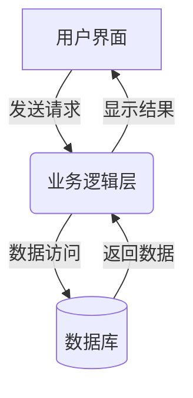

# 火车站订票系统详细设计与具体代码实现

## 1.背景介绍

### 1.1 火车订票系统的必要性

随着人们出行需求的不断增长,火车作为一种安全、高效、经济的交通工具,受到越来越多人的青睐。然而,传统的火车站售票窗口往往面临着排队时间长、效率低下等问题,给乘客带来了不便。因此,开发一个高效、便捷的火车订票系统,能够极大地改善乘客的购票体验,提高火车公司的运营效率。

### 1.2 火车订票系统的挑战

设计和实现一个完善的火车订票系统并非一件易事,需要解决诸多技术挑战:

- 高并发处理能力:在节假日期间,大量用户同时购票,系统需要具备足够的并发处理能力,防止系统瘫痪。
- 数据一致性:票务信息涉及金钱交易,数据必须保持准确、一致,防止出现超卖等情况。
- 复杂的业务规则:票价计算、座位分配、订单管理等都有复杂的业务规则需要处理。
- 高可用性:作为关键系统,需要提供7*24小时不间断的服务,任何停机都会带来巨大损失。

### 1.3 相关技术概览

设计火车订票系统需要运用多种技术,包括但不限于:

- 分布式系统:利用多台服务器组建集群,提供高并发、高可用的服务
- 消息队列:异步处理、应用解耦、流量削峰等
- 缓存技术:减少数据库压力,提高系统响应速度
- 数据库技术:存储持久化数据,如MySQL等关系型数据库
- 安全技术:保护系统免受攻击,如用户认证、数据加密等

## 2.核心概念与联系 

### 2.1 系统架构概览

火车订票系统通常采用经典的三层架构,包括:

1. **表现层(Presentation Layer)**:提供友好的用户界面,如网站、手机APP等,接收用户请求并显示结果。
2. **业务逻辑层(Business Logic Layer)**:处理用户请求的核心逻辑,如查询车票、下单购买等。
3. **数据访问层(Data Access Layer)**:与数据库进行交互,执行数据的增删改查操作。

这三层通过接口相互调用,遵循单一职责原则,有利于代码解耦和可维护性。



### 2.2 关键模块分析

火车订票系统包含多个关键模块,它们相互协作,共同完成订票流程:

1. **用户模块**:处理用户注册、登录、个人信息管理等。
2. **查询模块**:提供车次查询、余票查询等功能。
3. **订单模块**:创建订单、处理支付、发送电子票等。
4. **检票模块**:提供电子检票、座位调整等功能。
5. **财务模块**:票款分成、报表统计等。
6. **监控模块**:监视系统运行状态,预警异常情况。

这些模块有机地协作,为用户提供完整的订票体验。

### 2.3 关键概念

- **订单(Order)**: 记录乘客的行程信息、联系方式、支付状态等,是系统的核心数据对象。
- **余票(Remaining Tickets)**: 系统需实时掌握每个车次的余票信息,作为订票的前置条件。
- **票务数据(Ticket Data)**: 包括车次、席别、票价等静态票务数据,是计算余票的基础数据。
- **并发控制(Concurrency Control)**: 采用乐观锁、悲观锁等机制,确保并发订票时数据的准确性。
- **分布式事务(Distributed Transaction)**: 跨多个服务器的事务,需保证事务的原子性。

## 3.核心算法原理具体操作步骤

### 3.1 余票计算算法

准确计算余票数量是订票系统的核心算法之一,具体步骤如下:

1. 从票务数据中获取该车次的总座位数 $totalSeats$。
2. 从订单数据中统计该车次已售出的票数 $soldTickets$。
3. 计算余票数量:$remainingTickets = totalSeats - soldTickets$

为提高效率,可以使用缓存存储余票数据,并在有订单时实时更新。

### 3.2 订单处理算法

创建订单是订票系统的核心流程,需要执行以下步骤:

1. 检查用户是否登录。
2. 获取用户选择的行程信息、座位类型等。
3. 检查该行程的余票是否足够。
4. 计算票价。
5. 锁定余票,防止超卖。
6. 创建订单对象,保存到数据库。
7. 发送订单信息到消息队列,异步处理后续流程(如支付、发票等)。
8. 释放余票锁。
9. 返回订单号给用户。

为保证数据一致性,需要使用事务将多个步骤作为一个原子操作执行。

### 3.3 检票算法 

检票模块需要执行以下步骤:

1. 获取乘客的电子票信息。
2. 从订单数据库查询该电子票对应的订单信息。
3. 校验订单是否有效(如已支付、未过期等)。
4. 比对乘客身份信息。
5. 如果验证通过,允许乘客进站乘车。
6. 更新订单状态为"已检票"。

此外,检票系统还需要支持座位调整、补票等功能。

### 3.4 分布式事务处理

对于跨多个服务器的操作,如创建订单需要更新订单数据和余票数据,需要采用分布式事务保证数据一致性:

1. 引入分布式事务协调者(如二阶段提交协议)。
2. 协调者向多个服务器发起事务操作请求。
3. 各服务器本地执行事务,并向协调者反馈执行结果。
4. 协调者根据反馈结果,发出事务提交或回滚指令。
5. 各服务器执行最终指令,完成事务。

常见的分布式事务方案有XA协议、TCC等。

## 4. 数学模型和公式详细讲解举例说明

### 4.1 票价计算模型

火车票价计算较为复杂,需要考虑多种因素,如里程、座位类型、临时加价等。我们可以使用如下公式计算票价:

$$
fare = baseFare \times distanceFactor \times seatTypeFactor \times temporaryPricingFactor
$$

其中:

- $baseFare$是该线路的起步价
- $distanceFactor$是根据里程计算的系数 
- $seatTypeFactor$是根据座位类型的系数
- $temporaryPricingFactor$是临时浮动加价系数,如节假日期间会增加

例如,某线路的起步价为50元,乘客购买了一张300公里的二等座票,不考虑临时加价,票价计算如下:

$$
\begin{aligned}
distanceFactor &= 1 + \frac{300}{500} = 1.6\\
seatTypeFactor &= 1.2 \qquad \text{(二等座系数)}\\
fare &= 50 \times 1.6 \times 1.2 \times 1 = 96
\end{aligned}
$$

因此,该票价为96元。

### 4.2 余票分布算法

为了提高系统的并发处理能力,我们可以将余票数据分布存储到多个缓存节点上,降低单点压力。具体做法是:

1. 将余票数据按某种算法(如哈希)分散到 $n$ 个节点上。
2. 对于某个车次的余票查询,先计算它应该落在第几个节点: $node = hash(trainNumber) \% n$
3. 查询该节点上的余票数据

这样单个节点的压力就降低为全部压力的 $\frac{1}{n}$。当然,如果单个节点故障,相应的余票数据也会失效。

### 4.3 服务器负载均衡算法

为了实现高可用,我们通常会在前端配置负载均衡器,将请求分发到后端的多个服务器上。常用的负载均衡算法有:

1. **轮询(Round Robin)算法**:按顺序将请求均匀分发到各个服务器。
2. **最小连接(Least Connections)算法**:将请求发送到当前连接数最小的服务器。
3. **源地址哈希(Source Hash)算法**:根据客户端IP地址计算哈希值,将同一IP的请求发送到同一台服务器,保持会话粘性。

假设有 $m$ 台服务器,第 $i$ 台服务器当前连接数为 $c_i$,可以使用带权重的最小连接算法:

$$
server = \min\limits_i\left\{\frac{c_i}{w_i}\right\}
$$

其中 $w_i$ 是第 $i$ 台服务器的权重,反映了它的处理能力。这样可以将更多请求分发到高性能的服务器上。

## 4. 项目实践:代码实例和详细解释说明

为了更好地理解火车订票系统的实现,我们将给出一些关键代码示例。这些示例使用Java语言编写,并采用Spring Boot框架进行开发。

### 4.1 订单创建示例

```java
@Service
public class OrderService {
    @Autowired
    private TicketRepository ticketRepo;
    
    @Autowired 
    private OrderRepository orderRepo;

    @Transactional
    public String createOrder(OrderRequest request) {
        // 1. 检查余票
        Train train = ticketRepo.findTrain(request.getTrainNumber());
        int remainingTickets = train.getRemainingTickets(request.getSeatType());
        if (remainingTickets < request.getNumTickets()) {
            throw new NoEnoughTicketsException();
        }
        
        // 2. 计算票价
        double fare = calculateFare(train, request.getSeatType());
        double totalFare = fare * request.getNumTickets();
        
        // 3. 锁定余票
        train.lockRemainingTickets(request.getSeatType(), request.getNumTickets());
        
        // 4. 创建订单对象并保存
        Order order = new Order(request, totalFare);
        orderRepo.save(order);
        
        // 5. 发送订单消息做异步处理
        sendOrderMessage(order);
        
        // 6. 解锁余票
        train.unlockRemainingTickets(request.getSeatType(), request.getNumTickets());
        
        return order.getOrderNumber();
    }
    
    // 其他方法...
}
```

上面的 `createOrder` 方法是创建订单的核心逻辑。首先检查余票,计算票价,然后锁定余票,创建订单对象并保存到数据库。接着将订单信息发送到消息队列做异步处理,最后解锁余票。

注意该方法使用 `@Transactional` 注解,将整个过程作为一个事务执行,以保证数据一致性。

### 4.2 余票缓存示例

```java
@Service
public class TicketCacheService {
    private static final int CACHE_NODES = 8;
    private List<TicketCache> cacheNodes;

    public TicketCacheService() {
        cacheNodes = new ArrayList<>(CACHE_NODES);
        for (int i = 0; i < CACHE_NODES; i++) {
            cacheNodes.add(new TicketCache());
        }
    }

    public int getRemainingTickets(String trainNumber, SeatType seatType) {
        int nodeIndex = getNodeIndex(trainNumber);
        return cacheNodes.get(nodeIndex).getRemainingTickets(trainNumber, seatType);
    }

    public void updateRemainingTickets(String trainNumber, SeatType seatType, int numTickets) {
        int nodeIndex = getNodeIndex(trainNumber);
        cacheNodes.get(nodeIndex).updateRemainingTickets(trainNumber, seatType, numTickets);
    }

    private int getNodeIndex(String trainNumber) {
        return Math.abs(trainNumber.hashCode() % CACHE_NODES);
    }
}
```

这个示例实现了一个简单的余票缓存服务。我们将余票数据分散存储在8个缓存节点中,使用训号的哈希值对8取余来确定落在哪个节点。`getRemainingTickets` 方法用于查询某车次某席别的余票数量,`updateRemainingTickets` 方法用于更新余票数据。

在实际项目中,这些缓存节点可以部署在不同的服务器上,并使用分布式缓存工具如Redis来实现,以提高可靠性和性能。

### 4.3 检票示例

```java
@Service
public class CheckInService