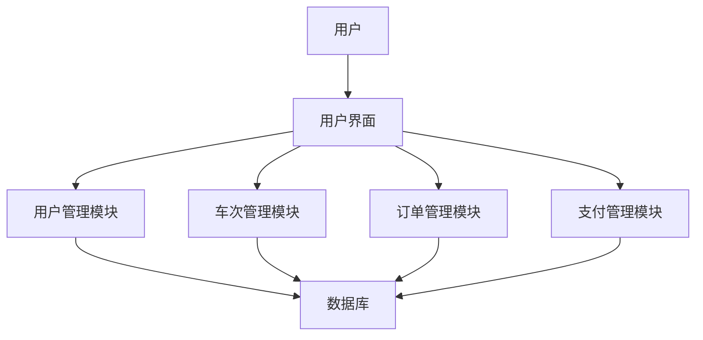

# 火车订票系统详细设计与具体代码实现

作者：禅与计算机程序设计艺术

## 1. 背景介绍

### 1.1 火车订票系统的需求背景

火车订票系统是现代交通运输系统中的关键组成部分。随着人们出行频率的增加和铁路网络的扩展，传统的人工售票方式已经无法满足日益增长的需求。一个高效、可靠的火车订票系统不仅可以提高乘客的购票体验，还能优化铁路公司的运营效率。

### 1.2 系统设计目标

设计一个火车订票系统的主要目标包括：

- **高可用性**：系统必须能够处理高并发的用户请求，确保在高峰期也能正常运行。
- **高可靠性**：数据的准确性和一致性是系统的核心要求，任何错误的数据处理都可能导致严重的后果。
- **扩展性**：系统设计应支持未来的扩展和功能升级，能够适应不断变化的需求。
- **安全性**：保护用户的个人信息和支付数据，防止数据泄露和非法访问。

### 1.3 系统架构概述

火车订票系统的架构设计需要考虑多个方面，包括用户界面、业务逻辑、数据存储和网络通信等。我们将采用微服务架构，以实现系统的高可用性和扩展性。主要组件包括：

- **用户界面（UI）**：提供用户友好的购票界面。
- **业务逻辑层**：处理购票、退票、查询等业务逻辑。
- **数据存储层**：存储用户信息、车次信息、订单信息等。
- **网络通信层**：实现不同组件之间的通信。

## 2. 核心概念与联系

### 2.1 用户角色与权限

在火车订票系统中，不同的用户角色具有不同的权限和操作范围。主要用户角色包括：

- **普通用户**：可以查询车次信息、购买车票、退票、查看订单历史等。
- **管理员**：可以管理车次信息、查看系统日志、处理异常订单等。

### 2.2 系统模块划分

系统主要分为以下几个模块：

- **用户管理模块**：处理用户注册、登录、权限管理等。
- **车次管理模块**：管理车次信息，包括车次的添加、修改、删除等。
- **订单管理模块**：处理用户的购票、退票、订单查询等操作。
- **支付管理模块**：集成第三方支付接口，处理支付和退款操作。

### 2.3 数据流与控制流

系统的数据流和控制流如下图所示：



## 3. 核心算法原理具体操作步骤

### 3.1 购票流程

购票流程是火车订票系统的核心功能之一。主要操作步骤如下：

1. **用户登录**：用户通过用户名和密码登录系统。
2. **查询车次**：用户输入出发地、目的地、出发日期，系统返回符合条件的车次列表。
3. **选择车次**：用户选择具体的车次和座位类型。
4. **填写乘客信息**：用户填写乘客的个人信息。
5. **确认订单**：系统生成订单，用户确认订单信息。
6. **支付订单**：用户通过第三方支付平台完成支付。
7. **生成车票**：支付成功后，系统生成电子车票，并发送给用户。

### 3.2 退票流程

退票流程主要操作步骤如下：

1. **用户登录**：用户通过用户名和密码登录系统。
2. **查询订单**：用户查询已购买的车票订单。
3. **选择退票**：用户选择需要退票的订单。
4. **确认退票**：系统计算退票费用，用户确认退票。
5. **退款处理**：系统通过第三方支付平台处理退款。
6. **更新订单状态**：系统更新订单状态为已退票，并通知用户。

### 3.3 座位分配算法

座位分配是购票过程中一个重要的环节。我们采用简单的优先级队列算法来实现座位的分配。具体步骤如下：

1. **初始化座位队列**：根据车次信息初始化座位队列。
2. **用户选择座位类型**：用户选择座位类型（如硬座、软座、卧铺等）。
3. **分配座位**：从队列中取出一个空闲座位分配给用户。
4. **更新座位状态**：将分配的座位状态更新为已占用。

## 4. 数学模型和公式详细讲解举例说明

### 4.1 购票成功率计算

购票成功率是衡量系统性能的重要指标。假设在一个时间窗口内，系统接收到 $N$ 个购票请求，其中成功处理的请求数为 $S$，则购票成功率 $P$ 计算公式为：

$$
P = \frac{S}{N} \times 100\%
$$

### 4.2 座位分配模型

座位分配可以看作是一个二分图匹配问题。假设 $G = (U, V, E)$ 是一个二分图，其中 $U$ 表示乘客集合，$V$ 表示座位集合，$E$ 表示乘客与座位之间的匹配关系。我们的目标是找到一个最大匹配，使得每个乘客都能分配到一个座位。

最大匹配问题可以通过匈牙利算法求解，其时间复杂度为 $O(VE)$。算法步骤如下：

1. 初始化匹配结果 $M = \emptyset$。
2. 对每个乘客 $u \in U$，尝试找到一个未被匹配的座位 $v \in V$。
3. 如果找到，则将 $(u, v)$ 加入匹配结果 $M$，并标记 $v$ 为已匹配。
4. 重复步骤 2 和 3，直到所有乘客都被处理完毕。

## 5. 项目实践：代码实例和详细解释说明

### 5.1 用户管理模块

以下是用户管理模块的代码示例，包括用户注册、登录和权限管理功能。

```python
from flask import Flask, request, jsonify
from werkzeug.security import generate_password_hash, check_password_hash
import sqlite3

app = Flask(__name__)

# 创建数据库连接
def get_db_connection():
    conn = sqlite3.connect('database.db')
    conn.row_factory = sqlite3.Row
    return conn

# 用户注册
@app.route('/register', methods=['POST'])
def register():
    data = request.get_json()
    username = data['username']
    password = generate_password_hash(data['password'])
    
    conn = get_db_connection()
    cursor = conn.cursor()
    cursor.execute('INSERT INTO users (username, password) VALUES (?, ?)', (username, password))
    conn.commit()
    conn.close()
    
    return jsonify({'message': 'User registered successfully'}), 201

# 用户登录
@app.route('/login', methods=['POST'])
def login():
    data = request.get_json()
    username = data['username']
    password = data['password']
    
    conn = get_db_connection()
    cursor = conn.cursor()
    cursor.execute('SELECT * FROM users WHERE username = ?', (username,))
    user = cursor.fetchone()
    conn.close()
    
    if user and check_password_hash(user['password'], password):
        return jsonify({'message': 'Login successful'}), 200
    else:
        return jsonify({'message': 'Invalid credentials'}), 401

if __name__ == '__main__':
    app.run(debug=True)
```

### 5.2 车次管理模块

以下是车次管理模块的代码示例，包括车次的添加、修改和删除功能。

```python
from flask import Flask, request, jsonify
import sqlite3

app = Flask(__name__)

# 创建数据库连接
def get_db_connection():
    conn = sqlite3.connect('database.db')
    conn.row_factory = sqlite3.Row
    return conn

# 添加车次
@app.route('/add_train', methods=['POST'])
def add_train():
    data = request.get_json()
    train_number = data['train_number']
    departure = data['departure']
    destination = data['destination']
    departure_time = data['departure_time']
    
    conn = get_db_connection()
    cursor = conn.cursor()
    cursor.execute('INSERT INTO trains (train_number, departure, destination, departure_time) VALUES (?, ?, ?, ?)', 
                   (train_number, departure, destination, departure_time))
    conn.commit()
    conn.close()
    
    return jsonify({'message': 'Train added successfully'}), 201

# 修改车次
@app.route('/update_train/<int:id>', methods=['PUT'])
def update_train(id