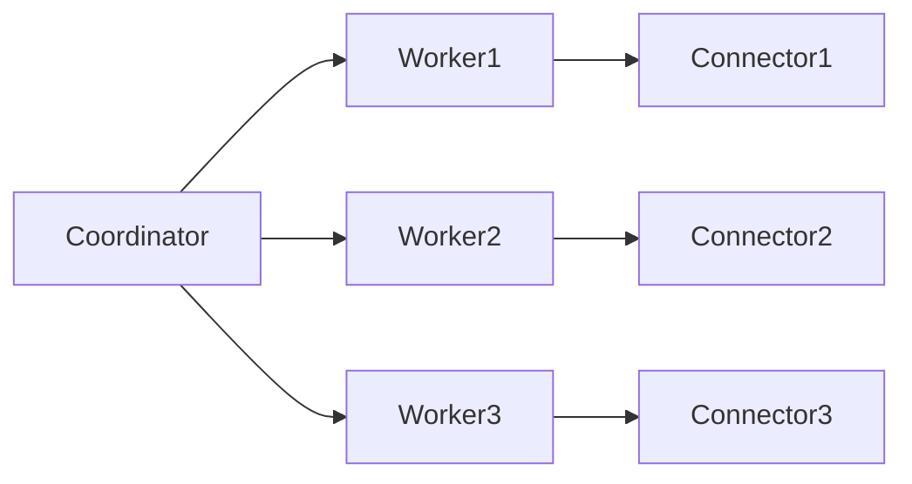
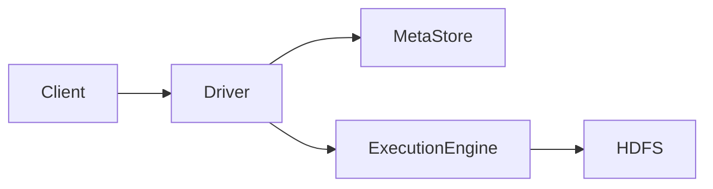

# 版本兼容性：Presto与Hive版本兼容性问题

作者：禅与计算机程序设计艺术

## 1. 背景介绍

### 1.1 大数据分析的兴起

随着大数据时代的到来，数据分析成为了企业决策的重要组成部分。企业在处理海量数据时，往往需要借助分布式计算框架和查询引擎，以便能够快速、高效地处理和分析数据。Presto和Hive就是其中的两种广泛应用的工具。

### 1.2 Presto与Hive简介

Presto是一种分布式SQL查询引擎，专为高速查询海量数据而设计。它支持从多个数据源中检索数据，包括HDFS、S3、Cassandra等。Presto的设计目标是提供低延迟、高吞吐量的查询能力。

Hive则是一个基于Hadoop的数仓工具，它将传统的SQL查询转换为MapReduce任务来处理大规模数据。Hive的优势在于其强大的数据仓库能力和丰富的SQL支持。

### 1.3 版本兼容性问题的重要性

在实际应用中，企业往往需要同时使用Presto和Hive来满足不同的需求。然而，不同版本的Presto和Hive之间可能存在兼容性问题，导致查询失败或性能下降。因此，理解和解决版本兼容性问题对于确保系统的稳定性和高效性至关重要。

## 2. 核心概念与联系

### 2.1 版本兼容性的定义

版本兼容性是指软件的不同版本之间能够无缝协作的能力。在分布式系统中，不同组件之间的版本兼容性尤为重要，因为它直接影响到系统的整体性能和稳定性。

### 2.2 Presto与Hive的架构概述

#### 2.2.1 Presto架构

Presto的架构主要包括以下几个组件：

- **Coordinator**：负责解析SQL查询、生成查询计划并协调各个Worker节点的执行。
- **Worker**：执行查询计划中的具体任务，处理数据并返回结果。
- **Connector**：连接不同的数据源，提供数据访问接口。



#### 2.2.2 Hive架构

Hive的架构主要包括以下几个组件：

- **MetaStore**：存储数据表的元数据。
- **Driver**：解析SQL查询并生成执行计划。
- **Execution Engine**：执行查询计划，通常是MapReduce任务。
- **HDFS**：存储数据文件。



### 2.3 Presto与Hive的联系

Presto和Hive虽然是独立的系统，但它们可以通过Hive Connector进行集成。Presto可以直接查询Hive的数据仓库，从而利用Hive的存储和数据管理能力，同时提供更高效的查询性能。

## 3. 核心算法原理具体操作步骤

### 3.1 Presto查询执行流程

#### 3.1.1 查询解析

Presto的Coordinator接收到SQL查询后，会首先进行语法解析，生成抽象语法树（AST）。

#### 3.1.2 查询优化

接下来，Coordinator会对查询进行优化，包括逻辑优化和物理优化。逻辑优化包括谓词下推、列裁剪等，物理优化则包括任务调度、数据分片等。

#### 3.1.3 查询执行

优化后的查询计划会被分发到各个Worker节点，由它们并行执行查询任务，并将结果返回给Coordinator，最终返回给客户端。

### 3.2 Hive查询执行流程

#### 3.2.1 查询解析

Hive的Driver接收到SQL查询后，会进行语法解析，生成抽象语法树（AST）。

#### 3.2.2 查询优化

Driver会对查询进行优化，包括谓词下推、列裁剪等。优化后的查询计划会被转换为MapReduce任务。

#### 3.2.3 查询执行

MapReduce任务会被提交到Hadoop集群执行，处理数据并将结果存储到HDFS中，最终返回给客户端。

## 4. 数学模型和公式详细讲解举例说明

### 4.1 查询优化中的代价模型

查询优化器在选择最优查询计划时，会使用代价模型来评估不同计划的代价。代价模型通常包括以下几个方面：

- **I/O代价**：数据读取和写入的代价。
- **CPU代价**：数据处理的计算代价。
- **网络代价**：数据传输的代价。

$$
\text{Total Cost} = \text{I/O Cost} + \text{CPU Cost} + \text{Network Cost}
$$

### 4.2 各种代价的计算

#### 4.2.1 I/O代价

I/O代价通常与数据的读取和写入量成正比。假设数据量为 $D$，每次I/O操作的代价为 $C_{IO}$，则I/O代价为：

$$
\text{I/O Cost} = D \times C_{IO}
$$

#### 4.2.2 CPU代价

CPU代价通常与数据处理的复杂度成正比。假设数据量为 $D$，处理复杂度为 $C_{CPU}$，则CPU代价为：

$$
\text{CPU Cost} = D \times C_{CPU}
$$

#### 4.2.3 网络代价

网络代价通常与数据传输量成正比。假设数据量为 $D$，每次传输的代价为 $C_{Network}$，则网络代价为：

$$
\text{Network Cost} = D \times C_{Network}
$$

### 4.3 代价模型在查询优化中的应用

优化器会根据代价模型评估不同查询计划的代价，并选择代价最低的计划进行执行。这样可以有效提高查询的执行效率。

## 5. 项目实践：代码实例和详细解释说明

### 5.1 Presto查询Hive数据的示例

以下是一个使用Presto查询Hive数据的示例：

```sql
-- 使用Presto查询Hive中的数据
SELECT *
FROM hive.default.my_table
WHERE column1 = 'value1';
```

#### 5.1.1 代码解释

上述SQL查询使用Presto连接到Hive的默认数据库，并查询名为`my_table`的表，其中`column1`的值为`value1`。

### 5.2 Hive查询优化的示例

以下是一个使用Hive进行查询优化的示例：

```sql
-- 使用Hive进行查询优化
SET hive.optimize.ppd = true;
SET hive.vectorized.execution.enabled = true;

SELECT column1, COUNT(*)
FROM my_table
WHERE column2 = 'value2'
GROUP BY column1;
```

#### 5.2.1 代码解释

上述SQL查询首先设置了两个优化参数：`hive.optimize.ppd`启用谓词下推优化，`hive.vectorized.execution.enabled`启用矢量化执行。然后查询`my_table`表中`column2`的值为`value2`的记录，并按`column1`进行分组统计。

## 6. 实际应用场景

### 6.1 数据分析

在数据分析场景中，企业往往需要对海量数据进行复杂的查询和分析。Presto的高性能查询能力和Hive的强大数据管理能力可以结合使用，为企业提供高效的数据分析解决方案。

### 6.2 数据仓库

在数据仓库场景中，Hive可以用来存储和管理大规模数据，而Presto可以用来快速查询和分析这些数据。通过Hive Connector，Presto可以直接访问Hive的数据仓库，实现高效的数据查询和分析。

### 6.3 实时数据处理

在实时数据处理场景中，Presto可以用来处理和分析实时数据流，而Hive可以用来存储和管理历史数据。通过结合使用Presto和Hive，企业可以实现实时数据处理和历史数据分析的统一。

## 7. 工具和资源推荐

### 7.1 工具

#### 7.1.1 Presto

- **Presto CLI**：用于执行Presto查询的命令行工具。
- **Presto UI**：用于管理和监控Presto集群的图形界面工具。

#### 7.1.2 Hive

- **Hive CLI**：用于执行Hive查询的命令行工具。
- **Hive UI**：用于管理和监控Hive集群的图形界面工具。

### 7.2 资源

#### 7.2.1 官方文档

- **Presto官方文档**：提供了Presto的详细使用指南和API文档。
- **Hive官方文档**：提供了Hive的详细使用指南和API