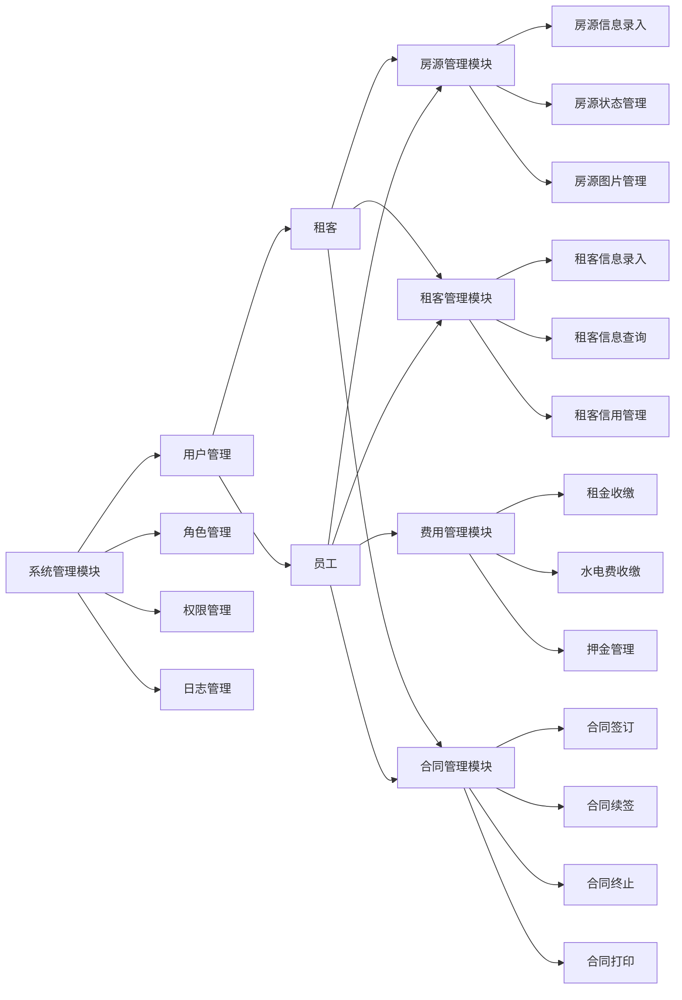

##  物业租赁管理系统详细设计与具体代码实现

作者：禅与计算机程序设计艺术

## 1. 背景介绍

### 1.1 物业租赁行业现状与痛点

随着城市化进程的加快和人们生活水平的提高，房屋租赁市场规模不断扩大，传统的物业租赁管理模式已经难以满足日益增长的市场需求。传统的物业租赁管理模式主要依赖于人工操作，存在着效率低下、信息不透明、易出错等诸多问题。具体来说，主要体现在以下几个方面：

* **信息管理混乱:** 房源信息、租客信息、合同信息等分散存储，难以进行统一管理和查询。
* **工作效率低下:** 手动录入信息、计算租金、打印合同等工作繁琐，效率低下。
* **服务质量难以保障:** 缺乏有效的沟通渠道和服务评价机制，服务质量难以得到保障。
* **数据分析能力薄弱:** 难以对租赁数据进行深度挖掘和分析，无法为经营决策提供数据支持。

### 1.2  物业租赁管理系统的必要性

为了解决上述问题，提高物业租赁管理效率和服务质量，开发一套功能完善、操作便捷、安全可靠的物业租赁管理系统势在必行。物业租赁管理系统可以帮助物业公司实现以下目标：

* **提高工作效率:**  自动化处理繁琐的业务流程，例如房源发布、合同签订、租金收缴等，提高工作效率。
* **降低运营成本:**  减少人工成本和管理成本，提高企业利润。
* **提升服务质量:**  为租客提供更加便捷、高效、优质的服务。
* **增强数据分析能力:**  对租赁数据进行深度挖掘和分析，为经营决策提供数据支持。

## 2. 核心概念与联系

### 2.1 系统用户角色

物业租赁管理系统涉及的用户角色主要包括：

* **管理员:**  负责系统管理、权限管理、数据统计等工作。
* **员工:**  负责房源管理、租客管理、合同管理、费用管理等日常业务操作。
* **租客:**  可以通过系统查看房源信息、提交租赁申请、在线缴纳租金等。

### 2.2  核心功能模块

物业租赁管理系统主要包括以下功能模块：

* **系统管理模块:**  包括用户管理、角色管理、权限管理、日志管理等功能。
* **房源管理模块:**  包括房源信息录入、房源状态管理、房源图片管理等功能。
* **租客管理模块:**  包括租客信息录入、租客信息查询、租客信用管理等功能。
* **合同管理模块:**  包括合同签订、合同续签、合同终止、合同打印等功能。
* **费用管理模块:**  包括租金收缴、水电费收缴、押金管理等功能。
* **统计报表模块:**  提供各种统计报表，例如房源出租率统计、租金收入统计等。

### 2.3  模块间联系



## 3. 核心算法原理具体操作步骤

### 3.1 房屋出租率统计算法

#### 3.1.1 算法描述

房屋出租率是衡量物业公司经营状况的重要指标之一，其计算公式如下：

```
房屋出租率 = 已出租房屋数量 / 可出租房屋数量 * 100%
```

#### 3.1.2 具体操作步骤

1. 获取指定时间段内可出租房屋数量。
2. 获取指定时间段内已出租房屋数量。
3. 根据公式计算房屋出租率。

### 3.2 租金催缴算法

#### 3.2.1 算法描述

租金催缴是物业公司日常工作的重要内容之一，为了提高租金催缴效率，可以采用自动化的租金催缴算法。

#### 3.2.2  具体操作步骤

1. 获取所有未缴纳租金的租客信息。
2. 根据租金缴纳日期和催缴规则，判断是否需要进行催缴。
3. 如果需要催缴，则通过短信、邮件等方式向租客发送催缴信息。

## 4. 数学模型和公式详细讲解举例说明

### 4.1  租金计算模型

#### 4.1.1 模型描述

租金计算模型是指根据房屋面积、租期、租金单价等因素计算租金的数学模型。

#### 4.1.2  公式

```
租金 = 房屋面积 * 租期 * 租金单价
```

#### 4.1.3  举例说明

例如，一套房屋面积为 100 平方米，租期为 1 年，租金单价为 50 元/平方米/月，则该房屋的租金为：

```
租金 = 100 * 12 * 50 = 60000 元
```

### 4.2  投资回报率计算模型

#### 4.2.1  模型描述

投资回报率是指投资收益与投资成本的比率，是衡量投资效益的重要指标之一。

#### 4.2.2  公式

```
投资回报率 = (投资收益 - 投资成本) / 投资成本 * 100%
```

#### 4.2.3  举例说明

例如，投资购买一套房屋的成本为 100 万元，出租 1 年的租金收入为 6 万元，则该房屋的投资回报率为：

```
投资回报率 = (6 - 100) / 100 * 100% = -94%
```

## 5. 项目实践：代码实例和详细解释说明

### 5.1 技术选型

本项目采用 Spring Boot 框架进行开发，数据库采用 MySQL，前端采用 Vue.js 框架。

### 5.2 代码实例

#### 5.2.1  房源实体类

```java
@Entity
@Table(name = "house")
public class House {

    @Id
    @GeneratedValue(strategy = GenerationType.IDENTITY)
    private Long id;

    @Column(nullable = false)
    private String name;

    @Column(nullable = false)
    private Double area;

    @Column(nullable = false)
    private String address;

    @Column(nullable = false)
    private Double price;

    // 省略 getter 和 setter 方法
}
```

#### 5.2.2  房源服务层接口

```java
public interface HouseService {

    List<House> findAll();

    House findById(Long id);

    House save(House house);

    void deleteById(Long id);
}
```

#### 5.2.3  房源服务层实现类

```java
@Service
public class HouseServiceImpl implements HouseService {

    @Autowired
    private HouseRepository houseRepository;

    @Override
    public List<House> findAll() {
        return houseRepository.findAll();
    }

    @Override
    public House findById(Long id) {
        return houseRepository.findById(id).orElse(null);
    }

    @Override
    public House save(House house) {
        return houseRepository.save(house);
    }

    @Override
    public void deleteById(Long id) {
        houseRepository.deleteById(id);
    }
}
```

### 5.3 代码解释

* `@Entity` 注解表示该类是一个实体类。
* `@Table` 注解指定该实体类映射到数据库中的表名。
* `@Id` 注解指定该字段是主键。
* `@GeneratedValue` 注解指定主键的生成策略。
* `@Column` 注解指定该字段映射到数据库中的列名、是否可以为空等信息。
* `@Service` 注解表示该类是一个服务层类。
* `@Autowired` 注解用于自动注入依赖。

## 6. 实际应用场景

### 6.1  大型住宅小区

大型住宅小区的物业公司可以利用物业租赁管理系统对小区内的房屋租赁信息进行统一管理，提高工作效率和服务质量。

### 6.2  商业地产

商业地产的物业公司可以利用物业租赁管理系统对商铺、写字楼等商业地产的租赁信息进行管理，提高招商效率和租金收益。

### 6.3  长租公寓

长租公寓运营商可以利用物业租赁管理系统对公寓的房源信息、租客信息、租金信息等进行管理，提高运营效率和盈利能力。

## 7. 总结：未来发展趋势与挑战

### 7.1 未来发展趋势

* **智能化:**  随着人工智能技术的不断发展，物业租赁管理系统将会更加智能化，例如智能推荐房源、智能客服等。
* **移动化:**  随着移动互联网的普及，物业租赁管理系统将会更加移动化，例如手机 APP、微信小程序等。
* **数据化:**  随着大数据技术的不断发展，物业租赁管理系统将会更加数据化，例如数据分析、数据挖掘等。

### 7.2  挑战

* **数据安全:**  物业租赁管理系统存储着大量的租客信息和房屋信息，如何保障数据安全是一个重要的挑战。
* **用户体验:**  物业租赁管理系统的用户群体广泛，如何提升用户体验是一个重要的挑战。
* **市场竞争:**  随着越来越多的企业进入物业租赁管理系统市场，市场竞争将会更加激烈。

## 8. 附录：常见问题与解答

### 8.1  如何保障系统数据安全？

为了保障系统数据安全，可以采取以下措施：

* **数据加密:**  对敏感数据进行加密存储，例如租客身份证号码、银行卡号等。
* **访问控制:**  设置严格的访问控制权限，例如只有管理员才能访问敏感数据。
* **安全审计:**  定期进行安全审计，及时发现和修复安全漏洞。

### 8.2  如何提升用户体验？

为了提升用户体验，可以采取以下措施：

* **界面简洁易用:**  系统界面设计要简洁易用，方便用户操作。
* **功能完善实用:**  系统功能要完善实用，满足用户不同的需求。
* **性能稳定可靠:**  系统性能要稳定可靠，保证用户正常使用。
