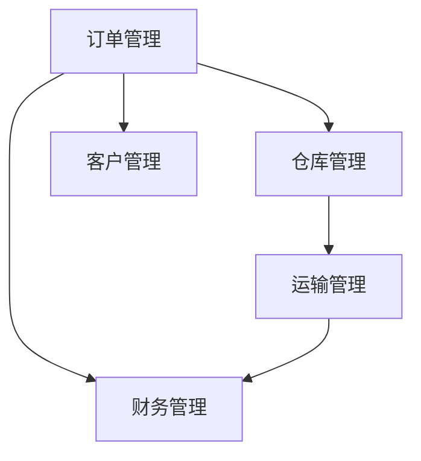

# 物流公司信息管理系统详细设计与具体代码实现

作者：禅与计算机程序设计艺术

## 1. 背景介绍

### 1.1 物流行业的现状与挑战

物流行业在全球经济中扮演着至关重要的角色。随着电子商务的迅猛发展，物流需求急剧增加，物流公司的运营效率和管理能力面临巨大挑战。传统的物流管理模式已经无法满足现代物流业务的需求，信息管理系统的引入成为必然趋势。

### 1.2 信息管理系统在物流中的重要性

信息管理系统在物流行业中的应用可以极大地提升运营效率、降低成本、提高服务质量。通过信息系统的集成，物流公司可以实现对货物、车辆、仓库等资源的高效管理，实时监控物流过程，提供精准的数据支持决策。

### 1.3 本文的目标与结构

本文旨在详细介绍一个物流公司信息管理系统的设计与实现，涵盖系统的核心概念、算法原理、数学模型、代码实例、实际应用场景、工具和资源推荐，并探讨其未来发展趋势与挑战。

## 2. 核心概念与联系

### 2.1 系统架构概述

物流公司信息管理系统的架构通常包括以下几个核心模块：

- **订单管理模块**：负责订单的创建、修改、查询和删除。
- **仓库管理模块**：负责仓库的库存管理、入库、出库操作。
- **运输管理模块**：负责运输车辆的调度、路线规划、运输状态跟踪。
- **客户管理模块**：负责客户信息的管理和维护。
- **财务管理模块**：负责费用结算、账单生成和财务报表。

### 2.2 各模块之间的联系

各模块之间通过数据接口进行交互，形成一个完整的物流信息管理体系。例如，订单管理模块生成的订单信息需要传递给仓库管理模块进行备货和出库操作；运输管理模块需要根据订单信息进行车辆调度和路线规划。



### 2.3 数据库设计

数据库设计是物流公司信息管理系统的基础，通常包括以下几个主要表：

- **订单表**：存储订单的基本信息。
- **客户表**：存储客户的基本信息。
- **仓库表**：存储仓库的基本信息。
- **库存表**：存储库存的详细信息。
- **运输表**：存储运输的详细信息。
- **财务表**：存储财务的详细信息。

## 3. 核心算法原理具体操作步骤

### 3.1 订单管理算法

订单管理是物流信息管理系统的核心之一，其主要操作包括订单的创建、修改、查询和删除。以下是订单管理的具体操作步骤：

1. **订单创建**：
    - 接收客户订单请求，验证订单信息的完整性和有效性。
    - 生成订单编号，记录订单的基本信息（如客户信息、商品信息、数量、价格等）。
    - 将订单信息存储到数据库中。

2. **订单修改**：
    - 接收订单修改请求，验证修改信息的有效性。
    - 更新数据库中的订单信息。

3. **订单查询**：
    - 接收订单查询请求，根据查询条件从数据库中检索订单信息。
    - 返回查询结果。

4. **订单删除**：
    - 接收订单删除请求，验证删除操作的合法性。
    - 从数据库中删除订单信息。

### 3.2 仓库管理算法

仓库管理主要包括库存管理、入库和出库操作。以下是仓库管理的具体操作步骤：

1. **库存管理**：
    - 定期盘点库存，记录实际库存数量。
    - 更新数据库中的库存信息。

2. **入库操作**：
    - 接收入库请求，验证入库信息的有效性。
    - 更新库存信息，将入库商品添加到库存中。

3. **出库操作**：
    - 接收出库请求，验证出库信息的有效性。
    - 更新库存信息，将出库商品从库存中扣除。

### 3.3 运输管理算法

运输管理主要包括车辆调度、路线规划和运输状态跟踪。以下是运输管理的具体操作步骤：

1. **车辆调度**：
    - 接收运输请求，确定运输车辆。
    - 分配运输任务，生成运输计划。

2. **路线规划**：
    - 根据运输任务，规划最优运输路线。
    - 生成路线规划图。

3. **运输状态跟踪**：
    - 实时监控运输车辆的状态，记录运输过程中的事件。
    - 更新运输状态信息，提供运输状态查询服务。

## 4. 数学模型和公式详细讲解举例说明

### 4.1 车辆路径优化模型

车辆路径优化（Vehicle Routing Problem, VRP）是物流运输管理中的一个经典问题，其目标是找到一组最优路径，使得运输成本最小化。VRP的数学模型可以描述如下：

设 $G = (V, E)$ 是一个图，其中 $V$ 是节点集合，$E$ 是边集合。节点 $V$ 表示客户和仓库，边 $E$ 表示节点之间的路径。$c_{ij}$ 表示从节点 $i$ 到节点 $j$ 的运输成本。

目标函数：
$$
\min \sum_{i \in V} \sum_{j \in V} c_{ij} x_{ij}
$$

约束条件：
$$
\sum_{j \in V} x_{ij} = 1, \forall i \in V
$$
$$
\sum_{i \in V} x_{ij} = 1, \forall j \in V
$$
$$
x_{ij} \in \{0, 1\}, \forall i, j \in V
$$

其中，$x_{ij}$ 表示是否选择从节点 $i$ 到节点 $j$ 的路径。

### 4.2 库存管理模型

库存管理的目标是保证库存水平在合理范围内，既不造成库存过多的浪费，又不影响正常的业务运营。常用的库存管理模型有经济订货量模型（Economic Order Quantity, EOQ）。

EOQ模型的公式如下：
$$
EOQ = \sqrt{\frac{2DS}{H}}
$$

其中：
- $D$ 表示年需求量
- $S$ 表示每次订货的固定成本
- $H$ 表示每单位库存的年持有成本

### 4.3 运输成本模型

运输成本模型用于计算运输过程中的成本，包括固定成本和变动成本。运输成本的公式如下：
$$
TC = FC + VC
$$

其中：
- $TC$ 表示总运输成本
- $FC$ 表示固定成本
- $VC$ 表示变动成本

变动成本的计算公式为：
$$
VC = \sum_{i=1}^{n} c_i d_i
$$

其中：
- $n$ 表示运输的总次数
- $c_i$ 表示第 $i$ 次运输的单位成本
- $d_i$ 表示第 $i$ 次运输的距离

## 5. 项目实践：代码实例和详细解释说明

### 5.1 订单管理模块代码实例

以下是一个简单的订单管理模块的代码实例，使用Python和SQLite实现。

```python
import sqlite3

# 连接到SQLite数据库
conn = sqlite3.connect('logistics.db')
c = conn.cursor()

# 创建订单表
c.execute('''
CREATE TABLE IF NOT EXISTS orders (
    order_id INTEGER PRIMARY KEY AUTOINCREMENT,
    customer_name TEXT NOT NULL,
    product_name TEXT NOT NULL,
    quantity INTEGER NOT NULL,
    price REAL NOT NULL
)
''')

# 插入订单
def create_order(customer_name, product_name, quantity, price):
    c.execute('''
    INSERT INTO orders (customer_name, product_name, quantity, price)
    VALUES (?, ?, ?, ?)
    ''', (customer_name, product_name, quantity, price))
    conn.commit()

# 查询订单
def get_orders():
    c.execute('SELECT * FROM orders')
    return c.fetchall()

# 更新订单
def update_order(order_id, customer_name, product_name, quantity, price):
    c.execute('''
    UPDATE orders
    SET customer_name = ?, product_name = ?, quantity = ?, price = ?
    WHERE order_id = ?
    ''', (customer_name, product_name, quantity, price, order_id))
    conn.commit()

# 删除订单
def delete_order(order_id):
    c.execute('DELETE FROM orders WHERE order_id = ?', (order_id,))
    conn.commit()

# 示例操作
create_order('Alice', 'Laptop', 1, 1000.0)
create_order('Bob', 'Smartphone', 2, 500.0)
print(get_orders())
update_order(1, 'Alice', 'Laptop', 2, 2000.0)
print(get_orders())
delete