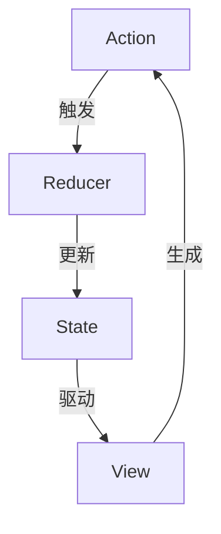
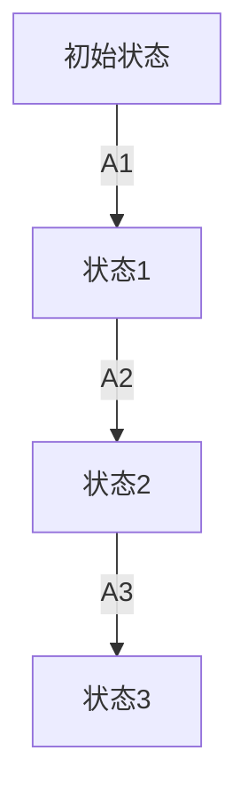

# 《状态管理原理与代码实例讲解》

作者：禅与计算机程序设计艺术

## 1.背景介绍

在现代软件开发中，随着应用程序复杂度的增加，状态管理成为了一个不可忽视的重要问题。无论是前端开发中的用户界面状态，还是后端开发中的应用状态，都需要有效的管理和维护。状态管理不仅影响应用的性能，还直接关系到用户体验和开发效率。

### 1.1 状态管理的定义

状态管理是指在软件系统中对应用状态进行定义、存储、更新和同步的过程。应用状态可以是用户界面的状态、应用逻辑的状态、数据的状态等。良好的状态管理可以帮助开发者更清晰地理解和控制应用的行为。

### 1.2 状态管理的重要性

随着单页应用（SPA）的流行，前端开发中的状态管理变得尤为重要。复杂的用户交互和动态数据更新需要一个高效的状态管理方案来保持应用的一致性和可维护性。在后端开发中，状态管理同样关键，尤其是在分布式系统中，状态的一致性和同步是保证系统可靠性的基础。

### 1.3 发展历程

状态管理的概念并不是新兴的，它随着软件开发的进化逐渐演变。从早期的全局变量和单例模式，到现代的状态管理库和框架，如Redux、Vuex、MobX等，状态管理方法不断优化以适应不断变化的开发需求。

## 2.核心概念与联系

在深入探讨状态管理的具体实现之前，我们需要了解一些核心概念，这些概念构成了状态管理的基础。

### 2.1 状态（State）

状态是指应用在某一时刻的所有数据和信息的集合。它可以包括用户输入、服务器响应、UI组件的状态等。

### 2.2 状态容器（State Container）

状态容器是用于存储和管理状态的对象或数据结构。它提供了访问和修改状态的方法，确保状态的集中管理和一致性。

### 2.3 动作（Action）

动作是描述状态变化的事件或指令。每个动作通常包含一个类型（type）和相关数据（payload），用来指示状态应该如何变化。

### 2.4 处理器（Reducer）

处理器是一个纯函数，接收当前状态和动作，返回新的状态。它定义了状态如何根据动作进行更新。

### 2.5 中间件（Middleware）

中间件是位于动作和处理器之间的逻辑层，用于扩展状态管理的功能，如异步操作、日志记录等。

### 2.6 视图（View）

视图是状态的表现形式，即用户界面。视图根据状态渲染，并在状态变化时进行更新。

### 2.7 单向数据流（Unidirectional Data Flow）

单向数据流是一种设计模式，强调数据在应用中的流动方向是单向的。即动作触发状态变化，状态变化驱动视图更新。这种模式有助于保持应用的一致性和可预测性。



## 3.核心算法原理具体操作步骤

为了更好地理解状态管理的原理，我们将以Redux为例，详细讲解其核心算法和具体操作步骤。

### 3.1 创建状态容器

首先，我们需要创建一个状态容器，用于存储应用的状态。在Redux中，状态容器由`createStore`函数创建。

```javascript
import { createStore } from 'redux';

const initialState = {
    count: 0
};

const reducer = (state = initialState, action) => {
    switch (action.type) {
        case 'INCREMENT':
            return { ...state, count: state.count + 1 };
        case 'DECREMENT':
            return { ...state, count: state.count - 1 };
        default:
            return state;
    }
};

const store = createStore(reducer);
```

### 3.2 定义动作

动作是描述状态变化的事件。我们需要定义动作类型和动作创建函数。

```javascript
const increment = () => ({
    type: 'INCREMENT'
});

const decrement = () => ({
    type: 'DECREMENT'
});
```

### 3.3 触发动作

通过`store.dispatch`方法触发动作，通知状态容器进行状态更新。

```javascript
store.dispatch(increment());
store.dispatch(decrement());
```

### 3.4 订阅状态变化

通过`store.subscribe`方法订阅状态变化，当状态发生变化时执行回调函数。

```javascript
store.subscribe(() => {
    console.log(store.getState());
});
```

### 3.5 结合视图

在React应用中，我们可以使用`react-redux`库将状态和视图结合起来，实现状态驱动的视图更新。

```javascript
import React from 'react';
import { Provider, connect } from 'react-redux';

const Counter = ({ count, increment, decrement }) => (
    <div>
        <h1>{count}</h1>
        <button onClick={increment}>Increment</button>
        <button onClick={decrement}>Decrement</button>
    </div>
);

const mapStateToProps = state => ({
    count: state.count
});

const mapDispatchToProps = {
    increment,
    decrement
};

const ConnectedCounter = connect(mapStateToProps, mapDispatchToProps)(Counter);

const App = () => (
    <Provider store={store}>
        <ConnectedCounter />
    </Provider>
);
```

## 4.数学模型和公式详细讲解举例说明

状态管理的核心在于如何有效地描述和控制状态的变化。我们可以使用数学模型来更好地理解这一过程。

### 4.1 状态转换函数

状态转换函数是描述状态变化的核心。它接收当前状态 $S$ 和动作 $A$，返回新的状态 $S'$。我们可以用数学公式表示：

$$
S' = f(S, A)
$$

其中，$f$ 是状态转换函数，$S$ 是当前状态，$A$ 是动作，$S'$ 是新的状态。

### 4.2 状态容器模型

状态容器可以看作是一个状态机，其状态转换由一组动作驱动。我们可以用状态转移图描述这种关系。



### 4.3 示例：计数器状态转换

以计数器为例，初始状态为 $S_0 = \{ count: 0 \}$，动作为 $A_1 = \{ type: 'INCREMENT' \}$ 和 $A_2 = \{ type: 'DECREMENT' \}$，状态转换函数为：

$$
f(S, A) = \begin{cases} 
\{ count: S.count + 1 \} & \text{if } A.type = 'INCREMENT' \\
\{ count: S.count - 1 \} & \text{if } A.type = 'DECREMENT' \\
S & \text{otherwise}
\end{cases}
$$

## 5.项目实践：代码实例和详细解释说明

在这一部分，我们将通过一个完整的项目实例，详细说明如何在实际开发中应用状态管理。

### 5.1 项目简介

我们将实现一个简单的待办事项（To-Do List）应用，通过Redux进行状态管理。应用包括添加任务、删除任务和标记任务完成等功能。

### 5.2 项目结构

项目结构如下：

```
my-todo-app/
├── src/
│   ├── components/
│   │   ├── AddTodo.js
│   │   ├── TodoList.js
│   │   ├── TodoItem.js
│   ├── actions/
│   │   ├── index.js
│   ├── reducers/
│   │   ├── index.js
│   │   ├── todos.js
│   ├── store/
│   │   ├── index.js
│   ├── App.js
│   ├── index.js
```

### 5.3 代码实现

#### 5.3.1 定义动作

首先，我们定义动作类型和动作创建函数。

```javascript
// src/actions/index.js
export const ADD_TODO = 'ADD_TODO';
export const TOGGLE_TODO = 'TOGGLE_TODO';
export const REMOVE_TODO = 'REMOVE_TODO';

export const addTodo = text => ({
    type: ADD_TODO,
    payload: text
});

export const toggleTodo = id => ({
    type: TOGGLE_TODO,
    payload: id
});

export const removeTodo = id => ({
    type: REMOVE_TODO,
    payload: id
});
```

#### 5.3.2 定义处理器

接下来，我们定义处理器，描述状态如何根据