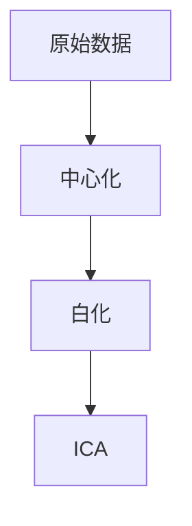

# 独立成分分析(ICA)原理与应用场景分析

作者：禅与计算机程序设计艺术

## 1. 背景介绍

### 1.1 独立成分分析的起源

独立成分分析（Independent Component Analysis, ICA）是一种统计和计算技术，用于将多变量信号分解为彼此独立的非高斯信号。它最初由Jean-Francois Cardoso和Pierre Comon在20世纪90年代提出，旨在解决盲源分离（Blind Source Separation, BSS）问题。BSS的经典例子是鸡尾酒会问题：在一个嘈杂的环境中，如何从多个混合的声音中分离出单个的声音源。

### 1.2 ICA的发展与应用

随着计算能力和算法的进步，ICA已经在许多领域得到了广泛应用，如生物医学信号处理（如脑电图分析）、金融数据分析、图像处理和通信系统等。ICA的核心思想是通过假设信号的统计独立性，找到能够最大化独立性的线性变换，从而实现信号分离。

### 1.3 文章结构

本文将详细介绍ICA的核心概念、算法原理、数学模型、实际应用及未来发展趋势。通过具体的代码实例和详细解释，帮助读者深入理解ICA的工作机制和应用场景。

## 2. 核心概念与联系

### 2.1 独立成分

独立成分是指一组彼此统计独立的信号。假设我们有一个观测信号矩阵 $\mathbf{X}$，其中每一列代表一个观测信号，每一行代表一个时间点。ICA的目标是找到一个线性变换 $\mathbf{W}$，使得 $\mathbf{S} = \mathbf{W} \mathbf{X}$ 中的每一列 $\mathbf{s}_i$ 是统计独立的。

### 2.2 盲源分离

盲源分离是指在没有任何先验知识的情况下，从观测信号中分离出源信号。ICA是一种常用的BSS方法，通过假设源信号的统计独立性，来实现信号分离。

### 2.3 非高斯性

ICA的一个重要假设是源信号是非高斯的。根据中心极限定理，混合信号往往趋于高斯分布。通过最大化非高斯性，可以有效地分离出独立成分。

### 2.4 对比PCA和ICA

主成分分析（Principal Component Analysis, PCA）和ICA都是数据降维和特征提取的方法，但它们有本质区别。PCA通过最大化方差来找到正交的主成分，而ICA则通过最大化非高斯性来找到独立成分。PCA的结果是正交的，但不一定独立，而ICA的结果是独立的，但不一定正交。

## 3. 核心算法原理具体操作步骤

### 3.1 数据中心化和白化

在进行ICA之前，首先需要对数据进行中心化和白化处理。中心化是指将数据的均值调整为零，而白化是指将数据变换为具有单位方差的形式。



### 3.2 非高斯性度量

常用的非高斯性度量包括负熵（Negentropy）和高阶累积量（如峰度）。负熵是基于信息熵的非高斯性度量，而峰度是基于高阶统计量的度量。

### 3.3 FastICA算法

FastICA是ICA的一种快速实现算法，主要步骤如下：

1. **初始化**：随机初始化分离矩阵 $\mathbf{W}$。
2. **迭代**：通过固定点迭代法，更新 $\mathbf{W}$。
3. **正交化**：确保 $\mathbf{W}$ 的正交性。
4. **收敛判断**：判断 $\mathbf{W}$ 是否收敛。

### 3.4 FastICA的具体步骤

1. **初始化**：随机初始化 $\mathbf{w}_i$。
2. **迭代更新**：
   $$
   \mathbf{w}_i \leftarrow \mathbb{E}\{\mathbf{X}g(\mathbf{w}_i^T\mathbf{X})\} - \mathbb{E}\{g'(\mathbf{w}_i^T\mathbf{X})\}\mathbf{w}_i
   $$
   其中，$g$ 是非线性函数，如 $g(u) = \tanh(u)$。
3. **正交化**：确保 $\mathbf{w}_i$ 的正交性：
   $$
   \mathbf{w}_i \leftarrow \mathbf{w}_i - \sum_{j=1}^{i-1} (\mathbf{w}_i^T\mathbf{w}_j)\mathbf{w}_j
   $$
4. **归一化**：
   $$
   \mathbf{w}_i \leftarrow \frac{\mathbf{w}_i}{\|\mathbf{w}_i\|}
   $$
5. **收敛判断**：判断 $\mathbf{w}_i$ 是否收敛，如果没有收敛，回到步骤2。

## 4. 数学模型和公式详细讲解举例说明

### 4.1 独立成分模型

假设观测信号 $\mathbf{X}$ 是由独立成分 $\mathbf{S}$ 通过线性混合矩阵 $\mathbf{A}$ 生成的，即：
$$
\mathbf{X} = \mathbf{A}\mathbf{S}
$$
ICA的目标是找到一个分离矩阵 $\mathbf{W}$，使得：
$$
\mathbf{S} = \mathbf{W}\mathbf{X}
$$
其中，$\mathbf{S}$ 是估计的独立成分。

### 4.2 负熵的定义

负熵是信息熵的非高斯性度量，定义为：
$$
J(\mathbf{y}) = H(\mathbf{y}_{\text{gauss}}) - H(\mathbf{y})
$$
其中，$H(\mathbf{y})$ 是信号 $\mathbf{y}$ 的熵，$\mathbf{y}_{\text{gauss}}$ 是与 $\mathbf{y}$ 具有相同协方差矩阵的高斯信号。

### 4.3 FastICA的对比函数

FastICA常用的对比函数包括：

1. **对数-余弦函数**：
   $$
   g(u) = \tanh(u), \quad g'(u) = 1 - \tanh^2(u)
   $$
2. **指数函数**：
   $$
   g(u) = u \exp(-u^2/2), \quad g'(u) = (1 - u^2)\exp(-u^2/2)
   $$
3. **多项式函数**：
   $$
   g(u) = u^3, \quad g'(u) = 3u^2
   $$

### 4.4 数学推导示例

假设我们有一个观测信号矩阵 $\mathbf{X}$，通过中心化和白化处理后，得到 $\mathbf{X}_{\text{whitened}}$。我们使用FastICA算法来分离独立成分。

1. **初始化**：随机初始化 $\mathbf{w}_i$。
2. **迭代更新**：
   $$
   \mathbf{w}_i \leftarrow \mathbb{E}\{\mathbf{X}_{\text{whitened}} g(\mathbf{w}_i^T \mathbf{X}_{\text{whitened}})\} - \mathbb{E}\{g'(\mathbf{w}_i^T \mathbf{X}_{\text{whitened}})\} \mathbf{w}_i
   $$
3. **正交化**：
   $$
   \mathbf{w}_i \leftarrow \mathbf{w}_i - \sum_{j=1}^{i-1} (\mathbf{w}_i^T \mathbf{w}_j) \mathbf{w}_j
   $$
4. **归一化**：
   $$
   \mathbf{w}_i \leftarrow \frac{\mathbf{w}_i}{\|\mathbf{w}_i\|}
   $$
5. **收敛判断**：如果 $\mathbf{w}_i$ 收敛，则停止迭代，否则回到步骤2。

## 5. 项目实践：代码实例和详细解释说明

### 5.1 数据准备

我们将使用Python的`scikit-learn`库来实现FastICA算法。首先，导入必要的库并生成混合信号。

```python
import numpy as np
import matplotlib.pyplot as plt
from