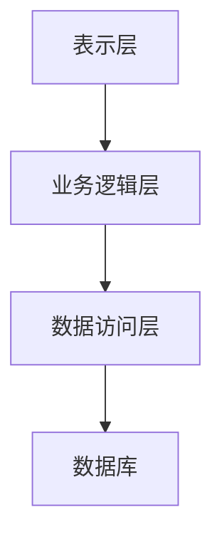
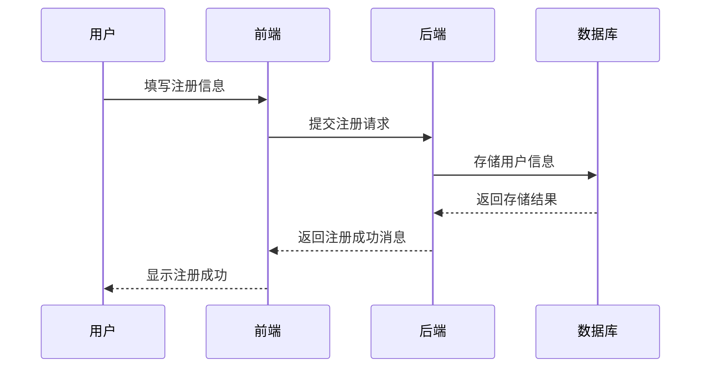
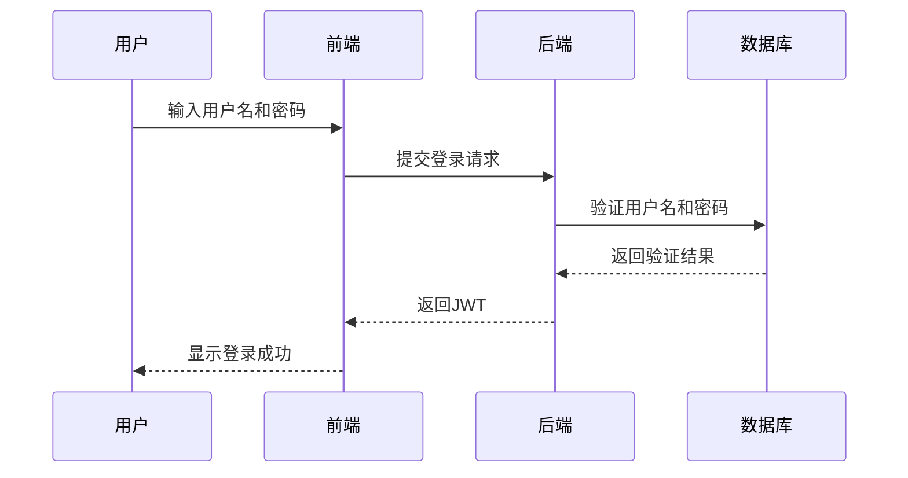
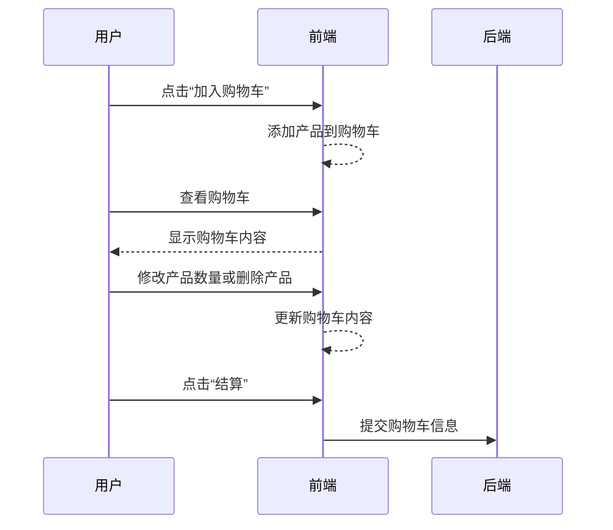
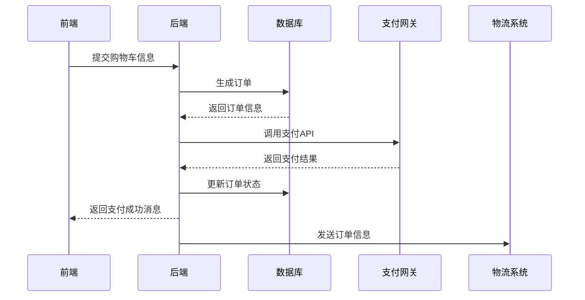

# 玩具公司网站设计系统详细设计与具体代码实现

作者：禅与计算机程序设计艺术

## 1. 背景介绍

### 1.1 项目背景

随着电子商务的迅猛发展，越来越多的传统企业开始转向线上销售。玩具公司作为一个典型的传统行业，也需要通过建立现代化的网站来提升品牌形象、增加销售渠道、提供更好的客户服务。一个功能完善、用户体验良好的网站不仅可以吸引更多的潜在客户，还能有效地提升客户满意度和忠诚度。

### 1.2 项目目标

本项目的主要目标是设计并实现一个玩具公司的网站系统。该系统需要具备以下功能：

- 产品展示：提供详细的产品信息，包括图片、描述、价格等。
- 在线购物：用户可以方便地浏览、选择和购买产品。
- 用户管理：支持用户注册、登录和个人信息管理。
- 订单管理：用户可以查看订单状态，管理员可以管理订单。
- 客户服务：提供在线客服和常见问题解答。

### 1.3 项目需求分析

在进行系统设计之前，我们需要对项目需求进行详细分析。主要包括功能需求、性能需求和安全需求。

#### 1.3.1 功能需求

- **产品管理**：包括产品的添加、修改、删除和查询。
- **用户管理**：用户注册、登录、个人信息修改、密码找回等。
- **购物车**：用户可以将选中的产品添加到购物车，并进行结算。
- **订单管理**：用户可以查看订单状态，管理员可以处理订单。
- **支付功能**：支持多种支付方式，如信用卡、支付宝、微信支付等。
- **客户服务**：提供在线客服和常见问题解答。

#### 1.3.2 性能需求

- **响应速度**：页面加载时间不超过3秒。
- **并发处理**：支持至少1000个并发用户访问。
- **数据存储**：支持大规模数据存储和快速查询。

#### 1.3.3 安全需求

- **数据安全**：保护用户的个人信息和交易数据。
- **访问控制**：不同角色具有不同的访问权限。
- **防攻击**：防止SQL注入、XSS攻击等常见Web攻击。

## 2. 核心概念与联系

### 2.1 系统架构

玩具公司网站系统采用三层架构设计，分别是表示层、业务逻辑层和数据访问层。这种架构能够很好地分离各层的职责，降低系统的耦合度，提高系统的可维护性和可扩展性。

### 2.2 技术选型

在系统设计中，我们选择了一些主流且成熟的技术来实现各个功能模块：

- **前端技术**：HTML5、CSS3、JavaScript、React.js
- **后端技术**：Node.js、Express.js
- **数据库**：MySQL
- **缓存**：Redis
- **支付网关**：Stripe、PayPal
- **部署**：Docker、Kubernetes

### 2.3 设计模式

在系统设计中，我们将使用一些常见的设计模式来提高代码的可维护性和可扩展性：

- **单例模式**：用于管理数据库连接池等全局唯一实例。
- **工厂模式**：用于创建复杂对象，避免直接使用new关键字。
- **观察者模式**：用于实现事件驱动的功能，如订单状态变化通知。

## 3. 核心算法原理具体操作步骤

### 3.1 用户注册与登录

用户注册与登录是网站的基本功能之一。我们将采用JWT（JSON Web Token）来实现用户认证与授权。

#### 3.1.1 用户注册流程

1. 用户在注册页面填写个人信息。
2. 前端将用户信息通过HTTP POST请求发送到后端API。
3. 后端验证用户信息的合法性。
4. 将用户信息存储到数据库中，并返回注册成功的消息。

#### 3.1.2 用户登录流程

1. 用户在登录页面输入用户名和密码。
2. 前端将用户名和密码通过HTTP POST请求发送到后端API。
3. 后端验证用户名和密码的正确性。
4. 生成JWT并返回给前端。
5. 前端将JWT存储在本地存储中，以便后续请求中使用。

### 3.2 购物车与订单处理

购物车与订单处理是电子商务网站的核心功能。我们将详细介绍购物车的实现和订单处理的流程。

#### 3.2.1 购物车实现

1. 用户在产品页面点击“加入购物车”按钮。
2. 前端将产品信息添加到本地的购物车数据结构中。
3. 用户可以在购物车页面查看已添加的产品，并进行数量修改或删除操作。
4. 用户点击“结算”按钮，前端将购物车信息通过HTTP POST请求发送到后端API。

#### 3.2.2 订单处理流程

1. 后端接收到购物车信息后，生成订单并存储到数据库中。
2. 后端调用支付网关API，处理用户支付。
3. 支付成功后，更新订单状态并通知用户。
4. 后端将订单信息发送到物流系统，处理发货。

## 4. 数学模型和公式详细讲解举例说明

在电子商务网站中，推荐系统是一个非常重要的功能。我们将使用协同过滤算法来实现个性化推荐。协同过滤算法主要分为基于用户的协同过滤和基于物品的协同过滤。

### 4.1 基于用户的协同过滤

基于用户的协同过滤通过计算用户之间的相似度来进行推荐。相似度计算可以采用余弦相似度、皮尔逊相关系数等方法。

#### 4.1.1 余弦相似度

余弦相似度通过计算两个用户评分向量的夹角余弦值来衡量相似度。公式如下：

$$
\text{cosine}(A, B) = \frac{\sum_{i=1}^{n} A_i \cdot B_i}{\sqrt{\sum_{i=1}^{n} A_i^2} \cdot \sqrt{\sum_{i=1}^{n} B_i^2}}
$$

其中，$A_i$ 和 $B_i$ 分别表示用户A和用户B对第$i$个物品的评分。

#### 4.1.2 皮尔逊相关系数

皮尔逊相关系数通过计算两个用户评分向量的线性相关性来衡量相似度。公式如下：

$$
\text{pearson}(A, B) = \frac{\sum_{i=1}^{n} (A_i - \bar{A}) \cdot (B_i - \bar{B