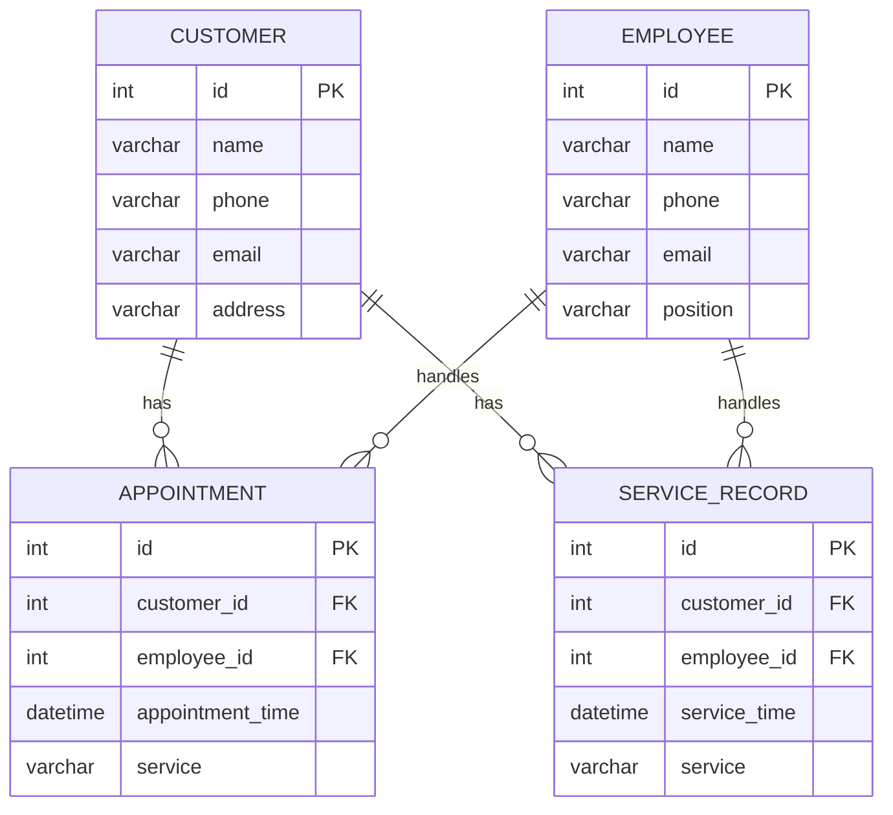

# 理发管理系统详细设计与具体代码实现

作者：禅与计算机程序设计艺术

## 1. 背景介绍

### 1.1 行业背景

理发行业作为服务业的重要组成部分，涉及到大量的客户管理、预约安排、服务记录等复杂的业务流程。传统的管理模式依赖于手工记录，容易出现数据丢失、预约冲突等问题，严重影响了客户体验和店铺运营效率。

### 1.2 项目背景

为了解决上述问题，开发一套理发管理系统显得尤为必要。该系统旨在通过信息化手段，实现客户信息管理、预约管理、服务记录、员工管理等功能，从而提升店铺的运营效率和客户满意度。

### 1.3 目标与意义

本项目的目标是设计并实现一套高效、易用的理发管理系统，具体包括以下几方面：
- 客户信息管理
- 预约管理
- 服务记录管理
- 员工管理
- 数据统计与分析

通过该系统的实施，可以大幅度提升店铺的管理效率，减少人为错误，提高客户满意度，从而增强店铺的竞争力。

## 2. 核心概念与联系

### 2.1 客户信息管理

客户信息管理是理发管理系统的核心模块之一，主要包括客户基本信息的录入、修改、删除和查询功能。客户信息的准确管理是实现后续预约和服务记录的基础。

### 2.2 预约管理

预约管理模块主要负责处理客户的预约请求，包括预约的创建、修改、取消和查询功能。该模块需要与客户信息管理和员工管理模块紧密结合，确保预约的准确性和及时性。

### 2.3 服务记录管理

服务记录管理模块用于记录客户的每次服务详情，包括服务项目、服务时间、服务人员等信息。该模块可以帮助店铺了解客户的服务偏好，为提供个性化服务打下基础。

### 2.4 员工管理

员工管理模块主要负责员工信息的管理，包括员工的基本信息、工作安排、绩效考核等。该模块需要与预约管理和服务记录管理模块结合，确保员工工作安排的合理性和服务质量的提升。

### 2.5 数据统计与分析

数据统计与分析模块用于对系统中的各类数据进行统计和分析，生成各类报表，为店铺的运营决策提供数据支持。

## 3. 核心算法原理具体操作步骤

### 3.1 客户信息管理算法

客户信息管理算法主要包括客户信息的录入、查询、修改和删除操作。其核心操作步骤如下：

1. 客户信息录入：通过表单收集客户的基本信息，验证信息的完整性和正确性，将信息存储到数据库中。
2. 客户信息查询：根据客户的姓名、电话等关键字查询客户信息，支持模糊查询和精确查询。
3. 客户信息修改：根据客户的ID查找客户信息，允许修改客户的部分或全部信息，更新数据库中的记录。
4. 客户信息删除：根据客户的ID删除客户信息，确保数据的一致性和完整性。

### 3.2 预约管理算法

预约管理算法主要包括预约的创建、查询、修改和取消操作。其核心操作步骤如下：

1. 预约创建：根据客户的需求，选择预约时间和服务项目，验证预约时间的可用性，生成预约记录并存储到数据库中。
2. 预约查询：根据客户的姓名、电话、预约时间等关键字查询预约信息，支持模糊查询和精确查询。
3. 预约修改：根据预约的ID查找预约信息，允许修改预约的时间和服务项目，更新数据库中的记录。
4. 预约取消：根据预约的ID删除预约信息，确保数据的一致性和完整性。

### 3.3 服务记录管理算法

服务记录管理算法主要包括服务记录的创建、查询、修改和删除操作。其核心操作步骤如下：

1. 服务记录创建：根据客户的服务情况，记录服务项目、服务时间、服务人员等信息，将记录存储到数据库中。
2. 服务记录查询：根据客户的姓名、电话、服务时间等关键字查询服务记录，支持模糊查询和精确查询。
3. 服务记录修改：根据服务记录的ID查找服务记录，允许修改服务项目、服务时间等信息，更新数据库中的记录。
4. 服务记录删除：根据服务记录的ID删除服务记录，确保数据的一致性和完整性。

### 3.4 员工管理算法

员工管理算法主要包括员工信息的录入、查询、修改和删除操作。其核心操作步骤如下：

1. 员工信息录入：通过表单收集员工的基本信息，验证信息的完整性和正确性，将信息存储到数据库中。
2. 员工信息查询：根据员工的姓名、工号等关键字查询员工信息，支持模糊查询和精确查询。
3. 员工信息修改：根据员工的ID查找员工信息，允许修改员工的部分或全部信息，更新数据库中的记录。
4. 员工信息删除：根据员工的ID删除员工信息，确保数据的一致性和完整性。

### 3.5 数据统计与分析算法

数据统计与分析算法主要包括数据的收集、整理、统计和分析操作。其核心操作步骤如下：

1. 数据收集：从数据库中提取相关数据，确保数据的完整性和准确性。
2. 数据整理：对收集到的数据进行清洗、转换和整理，确保数据的一致性和规范性。
3. 数据统计：对整理后的数据进行统计分析，生成各类统计报表和图表。
4. 数据分析：对统计结果进行深入分析，发现数据中的规律和趋势，为店铺的运营决策提供数据支持。

## 4. 数学模型和公式详细讲解举例说明

### 4.1 数据库设计

理发管理系统的数据库设计是整个系统的基础，合理的数据库设计可以提高系统的性能和数据的准确性。以下是数据库的核心表结构设计：



### 4.2 数据统计与分析公式

在数据统计与分析过程中，我们常常需要用到一些基本的统计公式，例如平均值、标准差等。以下是这些公式的详细讲解：

#### 4.2.1 平均值

平均值是数据集中所有数据的总和除以数据的数量，其公式如下：

$$
\bar{x} = \frac{1}{n} \sum_{i=1}^{n} x_i
$$

其中，$\bar{x}$ 表示平均值，$x_i$ 表示第 $i$ 个数据，$n$ 表示数据的数量。

#### 4.2.2 标准差

标准差是数据集中每个数据与平均值之间差异的平方和的平均值的平方根，其公式如下：

$$
\sigma = \sqrt{\frac{1}{n} \sum_{i=1}^{n} (x_i - \bar{x})^2}
$$

其中，$\sigma$ 表示标准差，$x_i$ 表示第 $i$ 个数据，$\bar{x}$ 表示平均值，$n$ 表示数据的数量。

### 4.3 数据分析举例

假设我们需要分析某个理发店一个月内的预约情况，统计每天的预约数量并计算平均预约数量和标准差。以下是具体的操作步骤：

1. 从数据库中提取一个月内的预约数据，按天统计预约数量。
2. 计算每天的预约数量的平均值和标准差。
3. 根据平均值和标准差分析预约的波动情况，发现高峰期和低谷期。

## 5. 项目实践：代码实例和详细解释说明

### 5.1 环境搭建

在开始编码之前，我们需要搭建开发环境。本文以Python和Flask框架为例，详细介绍理发管理系统的实现过程。

#### 5.1.1 安装Python和Flask

首先，确保系统中已安装Python。然后，通过pip安装Flask：

```bash
pip install Flask
```

#### 5.1.2 创建项目结构

创建项目目录，并在目录中创建必要的文件和文件夹：

```
barber_management_system/
├── app.py
├