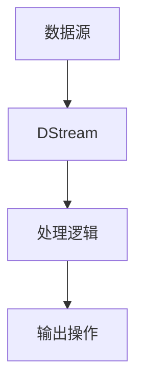

# 理解SparkStreaming架构及核心概念

作者：禅与计算机程序设计艺术

## 1. 背景介绍

### 1.1 大数据时代的挑战

在大数据时代，数据的生成速度和规模都在不断增加。传统的数据处理方式无法应对海量实时数据的处理需求。实时数据处理成为了企业获取竞争优势的关键因素之一，能够帮助企业迅速响应市场变化，优化业务流程。

### 1.2 实时数据处理的需求

实时数据处理系统需要具备以下几个特点：
- **低延迟**：能够在数据生成后迅速处理并反馈结果。
- **高吞吐量**：能够处理大量并发数据流。
- **容错性**：系统能够在出现故障时自动恢复。
- **可扩展性**：系统能够根据数据量的变化动态扩展。

### 1.3 SparkStreaming的出现

为了应对上述挑战，Apache Spark推出了Spark Streaming，一个强大的实时数据处理框架。Spark Streaming基于Spark核心，提供了高效、可扩展的实时数据处理能力。它能够将实时数据流分割成小批次进行处理，从而实现准实时的数据处理效果。

## 2. 核心概念与联系

### 2.1 微批处理架构

Spark Streaming采用微批处理（Micro-Batching）架构，将实时数据流分割成小批次（Batch），每个批次的数据在短时间内进行处理。这样既保留了批处理的高效性，又能够实现准实时的数据处理。

### 2.2 DStream

在Spark Streaming中，数据流被抽象为离散流（Discretized Stream，简称DStream）。DStream是一个连续的数据集序列，每个数据集代表一个时间间隔内的数据批次。DStream的操作类似于RDD（Resilient Distributed Dataset），支持各种转换和输出操作。

### 2.3 组件架构

Spark Streaming的架构由多个组件组成，包括数据源、DStream、处理逻辑、输出操作等。下图展示了Spark Streaming的基本架构：



### 2.4 容错机制

Spark Streaming通过WAL（Write-Ahead Log）机制实现容错性。所有接收到的数据都会先写入日志，确保在处理过程中即使发生故障，也能够从日志中恢复数据。

## 3. 核心算法原理具体操作步骤

### 3.1 数据接入

Spark Streaming支持多种数据源，如Kafka、Flume、Socket、HDFS等。通过Spark Streaming提供的API，可以方便地将这些数据源接入到DStream中。

### 3.2 数据处理

DStream支持多种转换操作，如map、flatMap、filter、reduceByKey等。这些操作类似于RDD的操作，用户可以通过这些操作定义数据处理逻辑。

### 3.3 数据输出

处理完成的数据可以输出到多种存储系统，如HDFS、数据库、实时仪表盘等。Spark Streaming提供了多种输出操作，如saveAsTextFiles、saveAsObjectFiles、saveAsHadoopFiles等。

### 3.4 示例代码

以下是一个简单的Spark Streaming应用示例，展示了如何从Socket接收数据，进行处理并输出结果：

```scala
import org.apache.spark.SparkConf
import org.apache.spark.streaming.{Seconds, StreamingContext}

object SimpleStreamingApp {
  def main(args: Array[String]): Unit = {
    val conf = new SparkConf().setAppName("SimpleStreamingApp").setMaster("local[*]")
    val ssc = new StreamingContext(conf, Seconds(1))

    val lines = ssc.socketTextStream("localhost", 9999)
    val words = lines.flatMap(_.split(" "))
    val wordCounts = words.map(word => (word, 1)).reduceByKey(_ + _)

    wordCounts.print()

    ssc.start()
    ssc.awaitTermination()
  }
}
```

## 4. 数学模型和公式详细讲解举例说明

### 4.1 微批处理模型

微批处理模型的核心思想是将实时数据流分割成一系列小的时间间隔（Batch Interval），每个时间间隔内的数据作为一个批次进行处理。假设时间间隔为 $\Delta t$，则整个数据流可以表示为：

$$
D = \{D_1, D_2, \ldots, D_n\}
$$

其中 $D_i$ 表示第 $i$ 个时间间隔内的数据批次。

### 4.2 DStream的转换操作

DStream的转换操作类似于RDD的转换操作。假设 $D$ 是一个DStream，$f$ 是一个转换函数，则转换后的DStream可以表示为：

$$
D' = D.map(f)
$$

如果 $D$ 包含多个批次数据，则转换后的每个批次数据可以表示为：

$$
D'_i = D_i.map(f)
$$

### 4.3 容错机制

容错机制通过WAL（Write-Ahead Log）实现。假设接收到的数据为 $d$，则数据首先写入日志：

$$
\text{log} \leftarrow d
$$

在处理过程中，如果发生故障，系统可以从日志中恢复数据：

$$
d \leftarrow \text{log}
$$

### 4.4 示例公式

假设我们要计算每个批次中的单词频率，数据流 $D$ 包含多个批次数据，每个批次数据 $D_i$ 包含多个单词 $w_{ij}$，则每个批次中的单词频率可以表示为：

$$
f(w_{ij}) = \frac{\text{count}(w_{ij})}{\sum_{k=1}^{n} \text{count}(w_{ik})}
$$

## 5. 项目实践：代码实例和详细解释说明

### 5.1 项目概述

我们将实现一个简单的实时词频统计应用，从Kafka接收数据，进行词频统计，并将结果输出到控制台。

### 5.2 环境配置

首先，确保安装了以下软件：
- Apache Kafka
- Apache Spark
- Scala

### 5.3 编写代码

以下是完整的代码示例：

```scala
import org.apache.spark.SparkConf
import org.apache.spark.streaming.{Seconds, StreamingContext}
import org.apache.spark.streaming.kafka010._
import org.apache.kafka.common.serialization.StringDeserializer

object KafkaStreamingApp {
  def main(args: Array[String]): Unit = {
    val conf = new SparkConf().setAppName("KafkaStreamingApp").setMaster("local[*]")
    val ssc = new StreamingContext(conf, Seconds(1))

    val kafkaParams = Map[String, Object](
      "bootstrap.servers" -> "localhost:9092",
      "key.deserializer" -> classOf[StringDeserializer],
      "value.deserializer" -> classOf[StringDeserializer],
      "group.id" -> "kafka_streaming_group",
      "auto.offset.reset" -> "latest",
      "enable.auto.commit" -> (false: java.lang.Boolean)
    )

    val topics = Array("test_topic")
    val stream = KafkaUtils.createDirectStream[String, String](
      ssc,
      LocationStrategies.PreferConsistent,
      ConsumerStrategies.Subscribe[String, String](topics, kafkaParams)
    )

    val lines = stream.map(record => record.value)
    val words = lines.flatMap(_.split(" "))
    val wordCounts = words.map(word => (word, 1)).reduceByKey(_ + _)

    wordCounts.print()

    ssc.start()
    ssc.awaitTermination()
  }
}
```

### 5.4 代码解释

- **Kafka参数配置**：配置Kafka连接参数，包括Kafka服务器地址、反序列化器、消费组ID等。
- **创建DStream**：从Kafka接收数据，创建DStream。
- **数据处理**：对接收到的数据进行词频统计。
- **输出结果**：将词频统计结果输出到控制台。

### 5.5 运行项目

启动Kafka服务器和创建主题，然后运行上述代码，即可看到实时的词频统计结果。

## 6. 实际应用场景

### 6.1 实时监控

Spark Streaming可以用于实时监控系统，如实时日志分析、异常检测等。通过实时处理日志数据，能够及时发现系统异常并采取措施。

### 6.2 实时推荐系统

在电商平台中，Spark Streaming可以用于实时推荐系统。通过实时分析用户行为数据，能够为用户推荐个性化的商品，提高用户体验和销售额。

### 6.3 实时金融数据分析

在金融领域，Spark Streaming可以用于实时金融数据分析，如股票价格预测、风险管理等。通过实时处理金融数据，能够帮助金融机构做出更及时和准确的决策。

## 7. 工具和资源推荐

### 7.1 开发工具

- **IntelliJ IDEA**：流行的Scala开发工具，支持Spark开发。
- **SBT**：Scala的构建工具，用于管理项目依赖和构建项目。

### 7.2 数据源

-