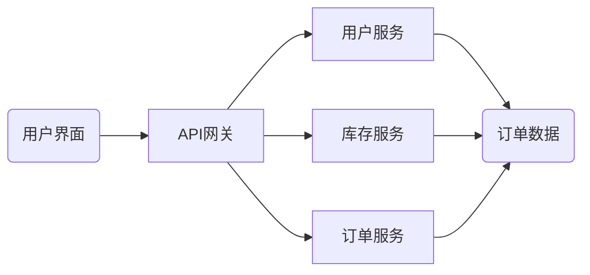

# 生产资料管理系统详细设计与具体代码实现

作者：禅与计算机程序设计艺术

## 1. 背景介绍

### 1.1 生产资料管理的重要性

在现代企业生产经营中，生产资料作为企业生产活动的物质基础，其重要性不言而喻。有效的生产资料管理可以帮助企业：

* **降低生产成本**: 通过优化库存、减少浪费和提高效率来降低生产资料的采购、存储和使用成本。
* **提高生产效率**: 及时准确地提供生产所需的物料，避免生产中断，提高生产效率。
* **保证产品质量**: 对生产资料进行严格的质量控制，确保生产出符合质量标准的产品。
* **增强企业竞争力**:  高效的生产资料管理可以帮助企业快速响应市场需求，提高企业的市场竞争力。

### 1.2 传统生产资料管理面临的挑战

传统的生产资料管理模式主要依靠人工操作和纸质记录，存在着许多弊端：

* **信息化程度低**: 数据记录分散，难以进行统计分析，无法实时掌握生产资料的库存、使用情况。
* **效率低下**: 各种流程审批复杂，操作繁琐，效率低下。
* **容易出错**: 人工操作容易出现错误，导致数据不准确，影响生产计划和决策。
* **缺乏可追溯性**:  难以追溯生产资料的来源、去向和使用情况，不利于质量控制和问题排查。

### 1.3  生产资料管理系统应运而生

为了解决传统生产资料管理模式的弊端，越来越多的企业开始采用信息化的手段，开发和应用生产资料管理系统。生产资料管理系统利用计算机技术、网络技术和数据库技术，对企业的生产资料进行全面的管理，包括：

* **采购管理**:  制定采购计划，选择供应商，生成采购订单，跟踪采购进度，进行供应商评估等。
* **库存管理**:  对仓库、货架、物料进行编码管理，实时监控库存数量、库存预警、物料出入库等。
* **领用管理**:  根据生产计划，进行物料领用，并进行领用记录和跟踪。
* **成本管理**:  对生产资料的采购成本、存储成本、使用成本进行核算，为企业决策提供数据支持。

## 2. 核心概念与联系

### 2.1 生产资料

生产资料是指在生产过程中被消耗或使用的劳动资料和劳动对象。 

* **劳动资料**: 指用来影响或改变劳动对象，使之发生预期变化的物质资料，例如机器设备、工具、厂房等。
* **劳动对象**: 指人们在生产活动中加工的对象，例如原材料、辅助材料、半成品等。

### 2.2 库存

库存是指企业为了保证生产经营活动的正常进行，而储备的生产资料。

* **安全库存**: 为防止不可预见的因素(如供应中断、需求突增)而设置的最低库存量。
* **周转库存**: 为满足日常生产经营活动的需要而储备的库存量。
* **在途库存**: 指已发出但尚未到达企业的货物。

### 2.3 物料编码

物料编码是唯一标识一种物料的代码，用于对物料进行分类、标识和管理。

* **层次编码**:  将物料按照一定的层次结构进行编码，例如：产品类别-产品系列-产品型号。
* **顺序编码**:  按照一定的顺序规则对物料进行编码，例如：流水号编码。

## 3. 核心算法原理具体操作步骤

### 3.1  库存管理算法

#### 3.1.1  先进先出法(FIFO)

先进先出法是指先入库的物料先发出，后入库的物料后发出。

**操作步骤:**

1. 当物料入库时，记录入库时间和数量。
2. 当物料出库时，优先选择最早入库的物料发出。
3. 更新库存数量。

#### 3.1.2  后进先出法(LIFO)

后进先出法是指后入库的物料先发出，先入库的物料后发出。

**操作步骤:**

1. 当物料入库时，记录入库时间和数量。
2. 当物料出库时，优先选择最晚入库的物料发出。
3. 更新库存数量。

### 3.2  物料需求计划(MRP)算法

物料需求计划(MRP)是一种根据产品结构、BOM(物料清单)和主生产计划(MPS)来计算物料需求量和需求时间的一种算法。

**操作步骤:**

1.  根据主生产计划(MPS)确定最终产品的需求量和需求时间。
2.  根据产品的BOM(物料清单)确定构成产品的各级子组件和原材料的需求量。
3.  根据各级子组件和原材料的提前期，计算出各级物料的需求时间。
4.  根据库存信息和已下达的采购订单，计算出净需求量。
5.  生成采购计划和生产计划。

## 4. 数学模型和公式详细讲解举例说明

### 4.1 经济订货批量(EOQ)模型

经济订货批量(EOQ)模型用于确定每次订货的最佳数量，以使总库存成本最小。

**公式:**

$$EOQ = \sqrt{\frac{2DS}{H}}$$

**其中:**

* D:  年需求量
* S:  每次订货成本
* H:  单位物料的年持有成本

**举例说明:**

假设某公司每年需要采购10000件A产品，每次订货成本为100元，单位A产品的年持有成本为2元。则该公司的经济订货批量为：

$$EOQ = \sqrt{\frac{2 * 10000 * 100}{2}} = 1000$$

**结论:**

该公司每次应该订购1000件A产品，以使总库存成本最小。

### 4.2  安全库存模型

安全库存模型用于确定安全库存的数量，以应对需求波动和供应不确定性。

**公式:**

$$SS = z\sigma\sqrt{L}$$

**其中:**

* SS:  安全库存
* z:  服务水平对应的标准正态分布分位数
* σ:  需求的标准差
* L:  提前期

**举例说明:**

假设某公司A产品的需求服从正态分布，标准差为100件，提前期为2周，该公司希望达到95%的服务水平。则该公司的安全库存为：

$$SS = 1.645 * 100 * \sqrt{2} ≈ 233$$

**结论:**

该公司应该设置233件A产品的安全库存，以应对需求波动和供应不确定性。

## 5. 项目实践：代码实例和详细解释说明

### 5.1 系统架构

本系统采用前后端分离的架构，前端使用Vue.js框架，后端使用Spring Boot框架，数据库使用MySQL。



### 5.2 代码实例

#### 5.2.1  库存管理模块

**代码功能:**

实现物料入库、出库、库存查询等功能。

**代码实现(Java):**

```java
@Service
public class InventoryService {

    @Autowired
    private InventoryRepository inventoryRepository;

    public void stockIn(StockInDto stockInDto) {
        // 校验参数
        // ...

        // 创建入库单
        Inventory inventory = new Inventory();
        // ...

        // 保存入库单
        inventoryRepository.save(inventory);
    }

    public void stockOut(StockOutDto stockOutDto) {
        // 校验参数
        // ...

        // 查询库存
        Inventory inventory = inventoryRepository.findById(stockOutDto.getInventoryId())
                .orElseThrow(() -> new BusinessException("库存不存在"));

        // 判断库存是否充足
        if (inventory.getQuantity() < stockOutDto.getQuantity()) {
            throw new BusinessException("库存不足");
        }

        // 更新库存
        inventory.setQuantity(inventory.getQuantity() - stockOutDto.getQuantity());
        inventoryRepository.save(inventory);

        // 创建出库单
        // ...
    }

    public Inventory getInventory(Long inventoryId) {
        // 查询库存
        return inventoryRepository.findById(inventoryId)
                .orElseThrow(() -> new BusinessException("库存不存在"));
    }
}
```

#### 5.2.2  物料需求计划模块

**代码功能:**

根据主生产计划(MPS)和BOM(物料清单)计算物料需求量和需求时间。

**代码实现(Java):**

```java
@Service
public class MrpService {

    @Autowired
    private BomRepository bomRepository;

    @Autowired
    private MpsRepository mpsRepository;

    public List<MaterialRequirement> calculateMaterialRequirements(Long productId, Date startDate, Date endDate) {
        // 查询产品BOM
        List<Bom> bomList = bomRepository.findByProductId(productId);

        // 查询主生产计划
        List<Mps> mpsList = mpsRepository.findByProductIdAndDateBetween(productId, startDate, endDate);

        // 计算物料需求量和需求时间
        // ...

        return materialRequirements;
    }
}
```

## 6. 实际应用场景

### 6.1 制造业

生产资料管理系统可以应用于各种类型的制造企业，例如：

* **机械制造**: 管理各种机械设备、零部件、原材料等。
* **电子产品制造**: 管理各种电子元器件、电路板、芯片等。
* **服装制造**: 管理各种面料、辅料、成衣等。

### 6.2  零售业

生产资料管理系统也可以应用于零售企业，例如：

* **超市**: 管理各种商品、货架、仓库等。
* **电商**: 管理各种商品、仓库、物流等。

## 7. 工具和资源推荐

### 7.1  开源软件

* **Odoo**:  一款开源的ERP系统，包含了生产资料管理模块。
* **Dolibarr**: 一款开源的ERP&CRM系统，包含了生产资料管理模块。

### 7.2  商业软件

* **SAP**: 全球领先的ERP软件供应商，其产品包含了强大的生产资料管理模块。
* **Oracle**: 全球领先的数据库软件供应商，其产品也包含了生产资料管理模块。

## 8. 总结：未来发展趋势与挑战

### 8.1  未来发展趋势

* **云计算**:  越来越多的企业将生产资料管理系统部署到云平台，享受云计算带来的便利性和灵活性。
* **大数据**:  利用大数据技术对生产资料数据进行分析，可以帮助企业优化库存、提高效率、降低成本。
* **物联网**:  将物联网技术应用于生产资料管理，可以实现物料的实时跟踪和监控，提高管理效率。
* **人工智能**:  将人工智能技术应用于生产资料管理，可以实现智能化的需求预测、库存优化、供应商选择等。

### 8.2  面临的挑战

* **数据安全**:  生产资料数据是企业的核心资产，如何保证数据的安全性和可靠性是一个重要的挑战。
* **系统集成**:  生产资料管理系统需要与企业的其他系统进行集成，例如ERP系统、MES系统等，如何实现无缝集成是一个挑战。
* **人才培养**:  生产资料管理系统需要专业的人才来进行开发、维护和使用，如何培养 qualified 的人才是企业的挑战。

## 9. 附录：常见问题与解答

### 9.1  如何选择合适的生产资料管理系统？

选择合适的生产资料管理系统需要考虑以下因素：

* **企业规模**:  不同规模的企业对系统的功能需求不同。
* **行业特点**:  不同行业的企业对系统的功能需求也不同。
* **预算**:  不同系统的价格差异较大。
* **实施周期**:  不同系统的实施周期也不同。

### 9.2  如何保证生产资料数据的准确性？

保证生产资料数据的准确性可以采取以下措施：

* **建立健全的制度**:  制定严格的物料编码制度、出入库制度等。
* **加强人员培训**:  对相关人员进行系统操作培训，提高数据录入的准确性。
* **定期盘点**:  定期对库存进行盘点，核实数据的准确性。
* **利用技术手段**:  利用条码技术、RFID技术等，提高数据采集的效率和准确性。