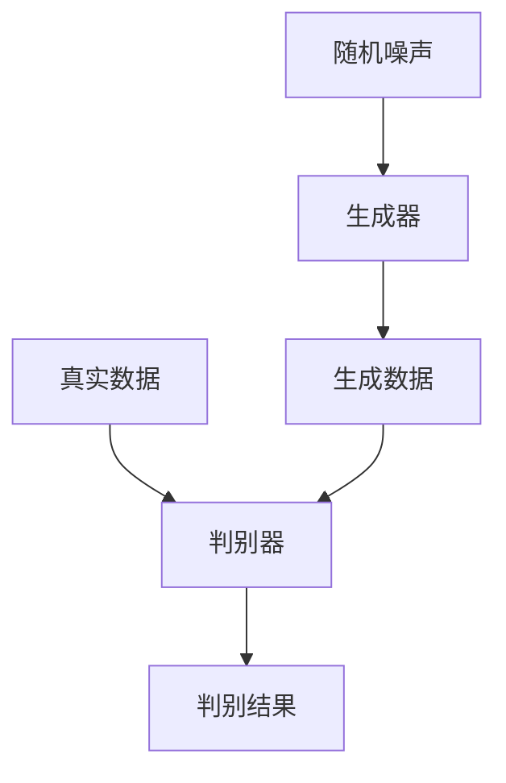

# 生成对抗网络 (GAN) 原理与代码实例讲解

作者：禅与计算机程序设计艺术

## 1. 背景介绍

生成对抗网络（Generative Adversarial Networks，简称GAN）自2014年由Ian Goodfellow等人提出以来，迅速成为机器学习和人工智能领域的热门研究方向。GAN的独特之处在于其通过两个神经网络——生成器（Generator）和判别器（Discriminator）之间的对抗训练，能够生成高质量的、与真实数据难以区分的伪造数据。GAN在图像生成、数据增强、风格迁移等多个领域展现了强大的应用潜力。

### 1.1 GAN的起源与发展

GAN的概念起源于生成模型的研究。传统的生成模型如高斯混合模型（Gaussian Mixture Model，GMM）和隐马尔可夫模型（Hidden Markov Model，HMM）在生成数据方面存在一定的局限性。Ian Goodfellow等人提出的GAN通过对抗训练的方式，克服了传统生成模型的缺点，使得生成数据的质量和多样性得到了显著提升。

### 1.2 GAN的基本原理

GAN的基本思想是通过两个神经网络的博弈过程来实现数据生成。生成器试图生成逼真的数据以欺骗判别器，而判别器则试图区分真实数据和生成数据。这个过程可以形象地比喻为伪钞制造者（生成器）和警察（判别器）之间的对抗。

## 2. 核心概念与联系

在深入探讨GAN的具体实现之前，我们需要理解其核心概念及其相互联系。

### 2.1 生成器（Generator）

生成器是一个神经网络，它接受一个随机噪声向量作为输入，并生成一个数据样本。生成器的目标是生成尽可能逼真的数据，以便欺骗判别器。

### 2.2 判别器（Discriminator）

判别器是另一个神经网络，它接受一个数据样本作为输入，并输出该样本是真实数据还是生成数据的概率。判别器的目标是尽可能准确地区分真实数据和生成数据。

### 2.3 对抗训练

GAN的训练过程是一个对抗过程，生成器和判别器分别优化各自的目标函数。生成器试图最大化判别器的错误率，而判别器则试图最小化其错误率。这个过程可以用一个最小化-最大化（minimax）游戏来描述。

### 2.4 损失函数

GAN的损失函数由生成器和判别器的损失函数组成。生成器的损失函数是判别器对生成数据的分类错误率，而判别器的损失函数是对真实数据和生成数据的分类错误率之和。



## 3. 核心算法原理具体操作步骤

GAN的训练过程可以分为以下几个具体步骤：

### 3.1 初始化

首先，初始化生成器和判别器的参数。生成器的输入是一个随机噪声向量，判别器的输入是真实数据和生成数据。

### 3.2 判别器训练

在每次迭代中，首先使用真实数据和生成数据训练判别器。判别器的目标是最大化对真实数据的分类准确率，同时最小化对生成数据的分类准确率。

### 3.3 生成器训练

然后，使用生成数据训练生成器。生成器的目标是最大化判别器对生成数据的分类错误率，即生成器希望判别器将生成数据误分类为真实数据。

### 3.4 迭代优化

重复上述步骤，交替优化生成器和判别器，直到生成数据的质量达到预期。

### 3.5 算法伪代码

```markdown
**GAN训练伪代码**

```
1. 初始化生成器 $G$ 和判别器 $D$ 的参数
2. 重复直到收敛：
    1. 使用真实数据 $x$ 和随机噪声 $z$ 生成的伪数据 $G(z)$
    2. 更新判别器 $D$ 的参数，使得 $D$ 能够最大化区分真实数据和伪数据的准确率
    3. 更新生成器 $G$ 的参数，使得 $G$ 能够最小化判别器 $D$ 对伪数据的分类准确率
```

## 4. 数学模型和公式详细讲解举例说明

GAN的数学模型可以用一个最小化-最大化（minimax）游戏来描述。生成器 $G$ 和判别器 $D$ 的目标函数分别为：

$$
\begin{aligned}
&\min_G \max_D V(D, G) = \mathbb{E}_{x \sim p_{\text{data}}(x)} [\log D(x)] \\
&+ \mathbb{E}_{z \sim p_z(z)} [\log (1 - D(G(z)))]
\end{aligned}
$$

其中，$p_{\text{data}}(x)$ 是真实数据的分布，$p_z(z)$ 是生成器的输入噪声分布。

### 4.1 判别器的损失函数

判别器的损失函数可以表示为：

$$
L_D = -\mathbb{E}_{x \sim p_{\text{data}}(x)} [\log D(x)] - \mathbb{E}_{z \sim p_z(z)} [\log (1 - D(G(z)))]
$$

### 4.2 生成器的损失函数

生成器的损失函数可以表示为：

$$
L_G = -\mathbb{E}_{z \sim p_z(z)} [\log D(G(z))]
$$

### 4.3 优化过程

在训练过程中，我们交替优化生成器和判别器的损失函数。具体来说，在每次迭代中，我们首先固定生成器的参数，优化判别器的损失函数；然后固定判别器的参数，优化生成器的损失函数。

## 5. 项目实践：代码实例和详细解释说明

在这一部分，我们将通过一个具体的代码实例来展示如何实现和训练一个简单的GAN。

### 5.1 环境准备

首先，我们需要安装必要的库。这里我们使用Python和TensorFlow来实现GAN。

```python
import tensorflow as tf
from tensorflow.keras import layers
import numpy as np
import matplotlib.pyplot as plt

# 设置随机种子以确保结果的可重复性
np.random.seed(42)
tf.random.set_seed(42)
```

### 5.2 数据准备

我们使用MNIST数据集作为训练数据。MNIST数据集包含60000张28x28的手写数字图像。

```python
# 加载MNIST数据集
(train_images, _), (_, _) = tf.keras.datasets.mnist.load_data()
train_images = train_images.reshape(train_images.shape[0], 28, 28, 1).astype('float32')
train_images = (train_images - 127.5) / 127.5  # 归一化到[-1, 1]之间
BUFFER_SIZE = 60000
BATCH_SIZE = 256

# 创建数据集
train_dataset = tf.data.Dataset.from_tensor_slices(train_images).shuffle(BUFFER_SIZE).batch(BATCH_SIZE)
```

### 5.3 构建生成器

生成器是一个简单的卷积神经网络，它接受一个随机噪声向量作为输入，并生成一个28x28x1的图像。

```python
def make_generator_model():
    model = tf.keras.Sequential()
    model.add(layers.Dense(7*7*256, use_bias=False, input_shape=(100,)))
    model.add(layers.BatchNormalization())
    model.add(layers.LeakyReLU())
    
    model.add(layers.Reshape((7, 7, 256)))
    assert model.output_shape == (None, 7, 7, 256)  # 注意：batch size未指定
    
    model.add(layers.Conv2DTranspose(128, (5, 5), strides=(1, 1), padding='same', use_bias=False))
    model.add(layers.BatchNormalization())
    model.add(layers.LeakyReLU())
    
    model.add(layers.Conv2DTranspose(64, (5, 5), strides=(2, 2), padding='same', use_bias=False))
    model.add(layers.BatchNormalization())
    model.add(layers.LeakyReLU())
    
    model.add(layers.Conv2DTranspose(1, (5, 5), strides=(2, 2), padding='same', use_bias=False, activation='tanh'))
    assert model.output_shape == (None, 28, 28, 1)
    
    return model

generator = make_generator