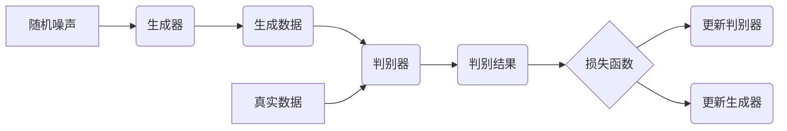

##  1. 背景介绍

### 1.1 从图像生成到生成对抗网络

近年来，随着深度学习技术的飞速发展，图像生成领域取得了显著的成果。从最初的像素级别生成，到如今能够生成以假乱真的高清图像，技术的进步令人惊叹。在众多图像生成模型中，生成对抗网络（Generative Adversarial Networks，GANs）无疑是最具代表性、应用最广泛的一种。

GAN 的核心思想是通过对抗训练的方式，让两个神经网络相互博弈，最终达到生成逼真图像的目的。这两个网络分别是：

* **生成器（Generator）：** 接收随机噪声作为输入，通过学习真实数据的分布，尝试生成以假乱真的数据。
* **判别器（Discriminator）：** 接收真实数据和生成器生成的数据，判断输入数据是真实的还是伪造的。

### 1.2 GAN 的发展历程

自 2014 年 Ian Goodfellow 提出 GAN 以来，该领域经历了快速的发展，各种改进和变体层出不穷。以下是 GAN 发展历程中的一些重要里程碑：

* **2014 年：** Ian Goodfellow 等人提出 GAN 的基本框架。
* **2015 年：** DCGAN（Deep Convolutional GAN）将卷积神经网络引入 GAN，显著提高了生成图像的质量。
* **2016 年：** WGAN（Wasserstein GAN）使用 Wasserstein 距离代替 JS 散度，有效解决了 GAN 训练不稳定等问题。
* **2017 年：** CycleGAN 利用循环一致性损失函数，实现了不同图像域之间的转换。
* **2018 年：** StyleGAN 通过引入 AdaIN（Adaptive Instance Normalization）层，实现了对生成图像风格的精细控制。

## 2. 核心概念与联系

### 2.1 生成器和判别器

如前所述，GAN 由生成器和判别器两部分组成。生成器和判别器之间存在着一种“道高一尺，魔高一丈”的对抗关系：

* 生成器努力生成更加逼真的数据，试图欺骗判别器。
* 判别器则不断提升自身的判别能力，力求将真实数据和生成数据区分开来。

### 2.2 对抗训练

GAN 的训练过程就是一个对抗训练的过程。具体来说，训练过程可以分为以下两个步骤：

1. **训练判别器：** 固定生成器，将真实数据和生成数据输入判别器，根据判别结果更新判别器的参数，使其能够更好地区分真实数据和生成数据。
2. **训练生成器：** 固定判别器，将随机噪声输入生成器，根据判别器的反馈更新生成器的参数，使其能够生成更逼真的数据。

这两个步骤交替进行，直到达到预设的训练轮数或满足特定的停止条件。

### 2.3  损失函数

GAN 的损失函数用于衡量生成器和判别器的性能。常见的 GAN 损失函数包括：

* **Minimax 损失函数：** 最初的 GAN 论文中使用的损失函数，其目标是最小化判别器的最大误差。
* **非饱和 GAN 损失函数：** 对 Minimax 损失函数的改进，解决了训练过程中生成器梯度消失的问题。
* **最小二乘 GAN 损失函数：** 使用最小二乘误差代替二元交叉熵损失，提高了训练的稳定性。
* **Wasserstein 距离：** WGAN 中使用的损失函数，能够更好地衡量真实数据分布和生成数据分布之间的距离。

## 3. 核心算法原理具体操作步骤

### 3.1 算法流程图



### 3.2 算法步骤

1. **初始化：** 初始化生成器和判别器的参数。
2. **训练迭代：** 
   * **训练判别器：** 
      * 从真实数据集中采样一批真实数据。
      * 从随机噪声中采样一批数据，输入生成器，得到一批生成数据。
      * 将真实数据和生成数据输入判别器，计算判别器的损失。
      * 根据判别器的损失更新判别器的参数。
   * **训练生成器：**
      * 从随机噪声中采样一批数据，输入生成器，得到一批生成数据。
      * 将生成数据输入判别器，计算生成器的损失。
      * 根据生成器的损失更新生成器的参数。
3. **重复步骤 2，** 直到达到预设的训练轮数或满足特定的停止条件。

## 4. 数学模型和公式详细讲解举例说明

### 4.1 Minimax 损失函数

Minimax 损失函数是 GAN 最初使用的损失函数，其表达式如下：

$$
\min_G \max_D V(D, G) = \mathbb{E}_{x \sim p_{data}(x)}[\log D(x)] + \mathbb{E}_{z \sim p_z(z)}[\log(1 - D(G(z)))]
$$

其中：

* $D(x)$ 表示判别器对真实数据 $x$ 的判别结果，取值范围为 $[0, 1]$，越接近 1 表示判别器认为 $x$ 越真实。
* $G(z)$ 表示生成器根据随机噪声 $z$ 生成的伪造数据。
* $p_{data}(x)$ 表示真实数据的分布。
* $p_z(z)$ 表示随机噪声的分布。

该损失函数的目标是最小化判别器的最大误差。具体来说，对于判别器 $D$，其目标是最大化 $V(D, G)$，即尽可能地将真实数据和生成数据区分开来；对于生成器 $G$，其目标是最小化 $V(D, G)$，即尽可能地生成能够欺骗判别器的伪造数据。

### 4.2 非饱和 GAN 损失函数

非饱和 GAN 损失函数是对 Minimax 损失函数的改进，其表达式如下：

**判别器损失函数：**

$$
L_D = - \mathbb{E}_{x \sim p_{data}(x)}[\log D(x)] - \mathbb{E}_{z \sim p_z(z)}[\log(1 - D(G(z)))]
$$

**生成器损失函数：**

$$
L_G = - \mathbb{E}_{z \sim p_z(z)}[\log D(G(z))] 
$$

与 Minimax 损失函数相比，非饱和 GAN 损失函数将生成器的损失函数从 $\log(1 - D(G(z)))$ 改为 $\log D(G(z))$，这样可以解决训练过程中生成器梯度消失的问题。

### 4.3 最小二乘 GAN 损失函数

最小二乘 GAN 损失函数使用最小二乘误差代替二元交叉熵损失，其表达式如下：

**判别器损失函数：**

$$
L_D = \frac{1}{2} \mathbb{E}_{x \sim p_{data}(x)}[(D(x) - 1)^2] + \frac{1}{2} \mathbb{E}_{z \sim p_z(z)}[D(G(z))^2]
$$

**生成器损失函数：**

$$
L_G = \frac{1}{2} \mathbb{E}_{z \sim p_z(z)}[(D(G(z)) - 1)^2]
$$

最小二乘 GAN 损失函数可以提高训练的稳定性，并生成更高质量的图像。

### 4.4 Wasserstein 距离

Wasserstein 距离也称为 Earth Mover's Distance（EMD），用于衡量两个概率分布之间的距离。WGAN 使用 Wasserstein 距离代替 JS 散度作为损失函数，其表达式如下：

$$
W(p_{data}, p_G) = \inf_{\gamma \in \Pi(p_{data}, p_G)} \mathbb{E}_{(x, y) \sim \gamma}[||x - y||]
$$

其中：

* $p_{data}$ 表示真实数据的分布。
* $p_G$ 表示生成数据的分布。
* $\Pi(p_{data}, p_G)$ 表示所有以 $p_{data}$ 和 $p_G$ 为边缘分布的联合分布集合。

WGAN 通过最小化 Wasserstein 距离来训练生成器，使其能够生成与真实数据分布相似的样本。

## 5. 项目实践：代码实例和详细解释说明

### 5.1 MNIST 手写数字生成

本节以 MNIST 手写数字生成为例，演示如何使用 PyTorch 框架构建一个简单的 GAN 模型。

**1. 导入必要的库**

```python
import torch
import torch.nn as nn
import torch.optim as optim
from torchvision import datasets, transforms
import matplotlib.pyplot as plt
```

**2. 定义生成器网络**

```python
class Generator(nn.Module):
    def __init__(self, input_dim, output_dim):
        super(Generator, self).__init__()
        self.model = nn.Sequential(
            nn.Linear(input_dim, 256),
            nn.ReLU(),
            nn.Linear(256, 512),
            nn.ReLU(),
            nn.Linear(512, output_dim),
            nn.Tanh()
        )

    def forward(self, x):
        return self.model(x)
```

**3. 定义判别器网络**

```python
class Discriminator(nn.Module):
    def __init__(self, input_dim):
        super(Discriminator, self).__init__()
        self.model = nn.Sequential(
            nn.Linear(input_dim, 512),
            nn.LeakyReLU(0.2),
            nn.Linear(512, 256),
            nn.LeakyReLU(0.2),
            nn.Linear(256, 1),
            nn.Sigmoid()
        )

    def forward(self, x):
        return self.model(x)
```

**4. 初始化模型和优化器**

```python
# 设置超参数
input_dim = 100  # 随机噪声维度
output_dim = 28 * 28  # MNIST 图像维度
learning_rate = 0.0002
batch_size = 128
epochs = 200

# 初始化模型
generator = Generator(input_dim, output_dim)
discriminator = Discriminator(output_dim)

# 初始化优化器
optimizer_G = optim.Adam(generator.parameters(), lr=learning_rate)
optimizer_D = optim.Adam(discriminator.parameters(), lr=learning_rate)

# 定义损失函数
criterion = nn.BCELoss()
```

**5. 训练 GAN 模型**

```python
# 加载 MNIST 数据集
train_dataset = datasets.MNIST(
    root="./data", train=True, download=True, transform=transforms.ToTensor()
)
train_loader = torch.utils.data.DataLoader(
    train_dataset, batch_size=batch_size, shuffle=True
)

# 开始训练
for epoch in range(epochs):
    for i, (images, _) in enumerate(train_loader):
        # 训练判别器
        real_images = images.view(-1, output_dim)
        fake_images = generator(torch.randn(batch_size, input_dim))

        # 计算判别器损失
        real_loss = criterion(discriminator(real_images), torch.ones(batch_size, 1))
        fake_loss = criterion(discriminator(fake_images.detach()), torch.zeros(batch_size, 1))
        discriminator_loss = (real_loss + fake_loss) / 2

        # 更新判别器参数
        optimizer_D.zero_grad()
        discriminator_loss.backward()
        optimizer_D.step()

        # 训练生成器
        fake_images = generator(torch.randn(batch_size, input_dim))

        # 计算生成器损失
        generator_loss = criterion(discriminator(fake_images), torch.ones(batch_size, 1))

        # 更新生成器参数
        optimizer_G.zero_grad()
        generator_loss.backward()
        optimizer_G.step()

    # 打印训练信息
    print(f"Epoch [{epoch+1}/{epochs}], Discriminator Loss: {discriminator_loss.item():.4f}, Generator Loss: {generator_loss.item():.4f}")

    # 保存生成图像
    if (epoch + 1) % 10 == 0:
        with torch.no_grad():
            fake_images = generator(torch.randn(64, input_dim)).view(-1, 1, 28, 28)
            img = fake_images.detach().cpu().numpy()
            fig, axs = plt.subplots(8, 8, figsize=(8, 8))
            for i in range(8):
                for j in range(8):
                    axs[i, j].imshow(img[i * 8 + j, 0], cmap="gray")
                    axs[i, j].axis("off")
            plt.savefig(f"generated_images/epoch_{epoch+1}.png")
            plt.close(fig)
```

**6.  运行结果**

经过 200 轮训练后，GAN 模型可以生成较为逼真的 MNIST 手写数字图像：


## 6. 实际应用场景

GAN 在各个领域都有着广泛的应用，以下列举一些常见的应用场景：

* **图像生成：** 生成逼真的人脸、风景、物体等图像。
* **图像编辑：** 对图像进行风格迁移、图像修复、超分辨率重建等操作。
* **文本生成：** 生成逼真的文章、对话、代码等文本。
* **语音合成：** 生成逼真的人声语音。
* **药物发现：** 生成具有特定性质的分子结构。

## 7. 工具和资源推荐

* **PyTorch：** 深度学习框架，提供了丰富的 GAN 模型实现和训练工具。
* **TensorFlow：** 另一个流行的深度学习框架，也提供了 GAN 相关的 API。
* **Keras：** 高级神经网络 API，可以方便地构建和训练 GAN 模型。
* **Papers with Code：** 收集了最新的 GAN 论文和代码实现。
* **GAN Zoo：** 收集了各种 GAN 模型的 PyTorch 实现。

## 8. 总结：未来发展趋势与挑战

### 8.1 未来发展趋势

* **更高质量的图像生成：** 随着模型结构和训练方法的不断改进，GAN 生成的图像质量将会越来越高。
* **更广泛的应用领域：** GAN 的应用领域将会不断扩展，例如视频生成、3D 模型生成等。
* **更易于训练的 GAN 模型：** 研究者们正在努力开发更易于训练的 GAN 模型，以解决训练不稳定、模式崩溃等问题。

### 8.2 面临的挑战

* **训练不稳定：** GAN 的训练过程很不稳定，容易出现模式崩溃、梯度消失等问题。
* **评估指标：** 目前还没有一个完美的指标来评估 GAN 生成的样本质量。
* **伦理问题：** GAN 可以生成以假乱真的图像和视频，可能会被用于恶意目的。

## 9. 附录：常见问题与解答

### 9.1 什么是模式崩溃？

模式崩溃是指 GAN 在训练过程中，生成器只能生成有限几种模式的样本，而无法覆盖整个数据分布的现象。

### 9.2 如何解决梯度消失问题？

可以使用非饱和 GAN 损失函数、Wasserstein 距离等方法来解决梯度消失问题。

### 9.3 如何评估 GAN 生成的样本质量？

可以使用 Inception Score（IS）、Fréchet Inception Distance（FID）等指标来评估 GAN 生成的样本质量。
