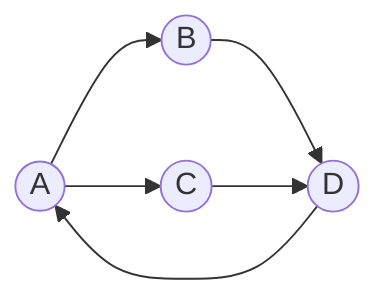
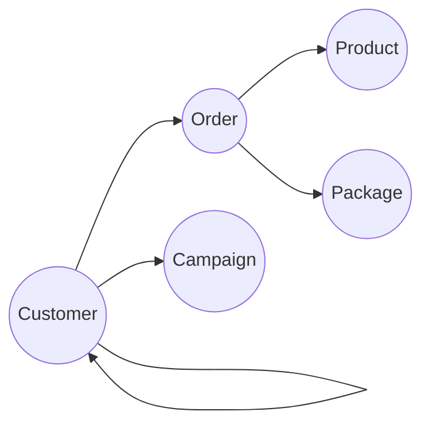

# 电信行业客户画像分析:基于Neo4j的实践

作者：禅与计算机程序设计艺术

## 1.背景介绍

### 1.1 电信行业客户画像分析的重要性
在当今高度竞争的电信行业,深入洞察和理解客户行为与偏好对于企业的生存与发展至关重要。通过构建全面的客户画像,电信公司可以更好地了解客户需求,提供个性化服务,提升客户满意度和忠诚度,从而在激烈的市场竞争中脱颖而出。

### 1.2 传统客户画像分析方法的局限性
传统的客户画像分析通常采用关系型数据库进行存储和分析,然而面对海量、多维度、动态变化的客户数据,关系型数据库在性能和灵活性方面都显得力不从心。此外,客户数据通常分散在不同的业务系统中,数据孤岛问题突出,难以形成全面、统一的客户视图。

### 1.3 图数据库Neo4j在客户画像分析中的优势
图数据库以图形结构存储数据,节点表示实体,边表示实体间的关系。这种数据模型更加贴近现实世界中的关系网络,非常适合处理高度关联的复杂数据。Neo4j作为市场领先的原生图数据库,具有高性能、高可用、易使用等特点,在客户画像分析领域大放异彩。

## 2.核心概念与联系

### 2.1 图数据库基本概念
- 节点(Node):图中的基本单元,用来表示实体对象,如客户、产品等。 
- 关系(Relationship):连接节点的有向边,表示节点之间的关联。
- 属性(Property):节点和关系都可以拥有属性,用来描述它们的特性。
- 标签(Label):为节点添加标签,可以将节点分组,便于索引和查询。

### 2.2 电信行业客户画像分析中的核心实体和关系
- 客户(Customer):业务的核心实体,拥有各种属性标签和行为。
- 产品(Product):电信运营商提供的产品服务,如语音、流量、宽带等。
- 套餐(Package):由各类产品组合而成,客户订购的服务集合。
- 订单(Order):客户订购业务产生的交易记录。
- 活动(Campaign):营销活动可影响客户的购买行为。
- 客户关系:亲情、朋友圈等社交关系会影响客户的消费决策。  

### 2.3 基于Neo4j构建电信行业客户画像知识图谱
利用Neo4j灵活的图数据模型,我们可以将客户相关的各类实体和关系映射到图中的节点和边,形成一张全面立体的客户知识图谱。通过图算法和查询,可以挖掘蕴藏在海量关联数据中的规律和价值。

## 3.核心算法原理具体操作步骤

### 3.1 数据采集与预处理
- 明确业务需求和分析目标,确定需要采集的数据维度。
- 从CRM、计费、营销等各个业务系统中采集客户相关数据。
- 对原始数据进行清洗、转换和集成,消除噪声,规范格式。
- 设计图数据库的数据模型,定义节点、关系和属性。

### 3.2 数据导入与建模
- 利用Neo4j的批量导入工具将结构化数据快速导入数据库。
- 对于复杂的非结构化数据,可使用Neo4j的Cypher语言灵活建模。
- 创建节点的同时添加合适的标签,建立节点间的关系。
- 为节点和关系添加属性,丰富知识图谱的语义信息。

### 3.3 图算法挖掘分析
- 连通性算法:识别图中的连通组件,发现隐藏的关联。
- 中心性算法:计算节点的重要性,如PageRank、Betweenness等。
- 社区发现算法:挖掘紧密关联的社区结构,如Louvain、LPA等。
- 相似性算法:计算节点的相似度,为推荐系统提供支持。
- 路径算法:寻找节点间的最短路径,优化网络资源配置。

### 3.4 可视化与展示
- Neo4j提供了原生的可视化工具Neo4j Browser,可以方便地探索和展示图数据。
- 针对复杂的业务场景,可以使用D3.js、Echarts等前端可视化库进行定制开发。
- 将图分析挖掘的结果通过可视化仪表盘呈现,让业务人员一目了然。

## 4.数学模型和公式详细讲解举例说明

### 4.1 PageRank中心性算法
PageRank是Google开发的著名网页排名算法,也可用于评估图中节点的重要性。假设图有$N$个节点,PageRank值$PR(i)$表示节点$i$的中心性。基本公式如下:

$$PR(i)=\frac{1-d}{N}+d\sum_{j\in M(i)}\frac{PR(j)}{L(j)}$$

其中,$d$是阻尼因子,$M(i)$是指向$i$的节点集合,$L(j)$是$j$的出度。

例如,下图展示了客户关系网络,节点表示客户,边表示客户间的社交关联:



根据公式,可以计算出各个节点的PageRank值:

```
PR(A) = 0.15 + 0.85 * (PR(D)/1) = 0.38
PR(B) = 0.15 + 0.85 * (PR(A)/2) = 0.32 
PR(C) = 0.15 + 0.85 * (PR(A)/2) = 0.32
PR(D) = 0.15 + 0.85 * (PR(B)/1 + PR(C)/1) = 0.69
```

可见,D的PageRank值最高,在网络中处于核心位置,对其他客户的连接影响力最大。

### 4.2 Jaccard相似度
Jaccard相似度用于衡量两个集合$A$和$B$的重叠程度,公式为:

$$J(A,B)=\frac{|A\cap B|}{|A\cup B|}=\frac{|A\cap B|}{|A|+|B|-|A\cap B|}$$

在客户画像分析中,可以利用Jaccard相似度比较两个客户节点的属性标签重合度,从而量化客户之间的相似性。

例如,客户A的标签为{男性,北京,iPhone,游戏迷},客户B的标签为{男性,上海,iPhone,旅游爱好者},则:

```
J(A,B) = 2/(4+4-2) = 1/3
```

这表明A和B有1/3的标签是重合的,即兴趣有一定相似性。可以利用这种相似性进行个性化推荐。

## 5.项目实践:基于电信数据的Neo4j客户画像系统

### 5.1 业务背景与需求

某电信运营商拥有海量的客户数据,包括客户基本信息、消费记录、通话记录、活动参与记录等,数据来源众多,关联复杂。传统的数据仓库和分析工具已经无法满足其精细化运营、个性化服务的需求。因此,决定采用图数据库Neo4j构建一个全新的客户画像分析系统。

主要需求包括:
1. 汇聚各源数据,构建统一的客户信息视图,打破数据孤岛。
2. 多维度刻画客户特征,包括人口属性、消费行为、社交关系等。
3. 利用图算法和机器学习能力,深入挖掘客户价值,把握客户流失风险。
4. 实现客户细分、关联分析、个性化推荐等业务功能。
5. 提供灵活的查询分析和可视化展示能力,赋能一线业务运营。


### 5.2 数据准备

源数据涉及十多个分散的业务系统,包括:
- CRM系统:客户基本信息、资产信息、签约信息等。
- 计费系统:通话、流量、话费等详单数据。
- 营销系统:营销活动、客户参与响应数据。
- 服务系统:客户投诉、故障申告、服务记录等。
- 社交网络:集团内部的亲情网、朋友圈等用户关系数据。

我们首先利用ETL工具从各个源系统中抽取数据,经过清洗、转换和关联,形成结构化的客户信息、产品信息、订单信息等维度表和事实表,存储在Hadoop集群中。

### 5.3 图数据库设计

根据业务需求,我们设计了如下图数据库模型:



模型核心要素:
- Customer节点:客户实体,属性包括客户ID、姓名、手机号、年龄、性别、地址、信用分、终端偏好等标签。
- Product节点:产品实体,属性包括产品ID、产品名称、产品类型、资费标准等。常见的电信产品如语音、流量、宽带、固话、IPTV等。
- Package节点:套餐实体,属性包括套餐ID、套餐名称、定价、组合关系等。
- Order节点:客户订单实体,属性包括订单ID、订购时间、订购金额、订单状态等,与Customer和Product/Package建立关系。
- Campaign节点:营销活动实体,属性包括活动ID、活动名称、活动时间、参与客户等。
- Customer-Customer边:客户间的社交关系,如亲情网内的A号码与B号码的亲情关系,边上可以有亲密度属性。

### 5.4 数据导入与查询

利用Neo4j官方提供的`neo4j-admin import`工具,我们将Hive中处理好的结构化数据文件批量导入图数据库。导入命令如下:

```
neo4j-admin import --nodes Customer.csv --nodes Product.csv --nodes Package.csv \
--nodes Order.csv --nodes Campaign.csv \
--relationships Customer_Order.csv --relationships Order_Product.csv \ 
--relationships Order_Package.csv --relationships Customer_Campaign.csv \
--relationships Customer_Customer.csv
``` 

数据导入完成后,就可以使用Cypher查询语言进行各种图探索和分析。例如,查询客户A的订购故事:

```cypher
MATCH (c:Customer {customerId:"A"})-[:PURCHASE]->(o:Order),
 (o)-[:INCLUDE]->(p:Package),
 (o)-[:CONTAIN]->(pr:Product)
RETURN c,o,p,pr
```

再如,查询参加过某营销活动X的客户,及其购买的TOP 3产品:

```cypher
MATCH (ca:Campaign {name:"X"})<-[:PARTICIPATE]-(c:Customer)-[:PURCHASE]->(o:Order)-[:CONTAIN]->(pr:Product)
WITH c, pr, count(*) as total
ORDER BY total DESC 
RETURN c, COLLECT(pr)[..3] AS top_products
```

### 5.5 图算法应用

在客户画像系统中,我们应用了多种图算法对客户数据进行挖掘分析,主要包括:

**社区发现**: 采用Louvain算法识别紧密联系的客户社区,例如家庭成员、朋友圈等。这有助于我们开展圈层营销。

```cypher
CALL algo.louvain('Customer','Contact',{}) YIELD nodeId, community
MATCH (c:Customer {customerId: nodeId})
RETURN c.customerId AS customer, community
ORDER BY community
```

**影响力分析**: 采用PageRank算法计算客户的中心性和影响力,识别关键意见领袖。这有助于识别高价值客户,开展KOL营销。

```cypher
CALL algo.pageRank('Customer','Contact',{iterations:20, dampingFactor:0.85})
YIELD nodeId, score
RETURN nodeId,score
ORDER BY score DESC 
LIMIT 100
```

**客户流失预测**: 采用GraphSAGE图神经网络,结合客户自身属性和社交网络影响,构建流失预测模型。

首先生成流失标签:
```cypher
MATCH (c:Customer)
WHERE c.status = 'inactive' AND c.lifecycleLength < 3 
SET c:ChurnedCustomer
```

然后进行模型训练和预测:
```cypher
CALL gds.beta.graphSage.train('myGraphSage', {
 nodeProjection: 'Customer',
 relationshipProjection: {
   CONTACT: {
     type: 'Contact',
     orientation: 'UNDIRECTED'
   }
 },
 modelName: 'customerChurn',
 featureProperties: ['lifecycleLength', 'avgRevenue', 'complaintCount'],
 aggregator: 'mean',
 activ