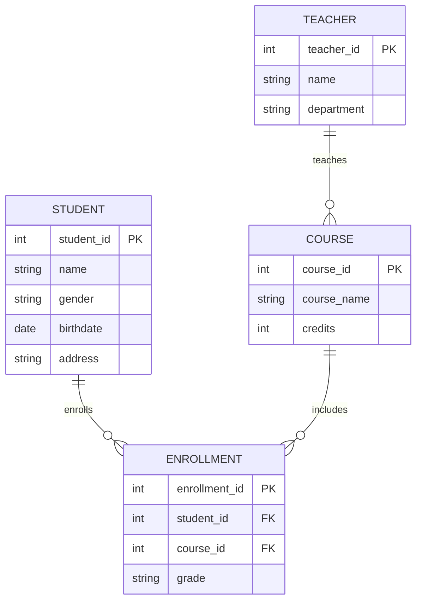

# 电子教务管理系统详细设计与具体代码实现

作者：禅与计算机程序设计艺术

## 1. 背景介绍

### 1.1 教务管理系统的定义

教务管理系统是一种用于高效管理教育机构内各类教务事务的软件系统。它涵盖了从学生注册、课程安排、成绩管理、学籍管理到教师管理等多个方面，旨在提高教务管理的效率和准确性。

### 1.2 教务管理系统的重要性

在现代教育环境中，教育机构的规模和复杂性不断增加，手工管理教务事务已经无法满足需求。教务管理系统通过自动化和信息化手段，能够大幅提升教务管理的效率，减少人为错误，并提供实时的数据分析和决策支持。

### 1.3 本文的目标

本文旨在详细介绍一个电子教务管理系统的设计与实现过程，包括核心概念、算法原理、数学模型、项目实践、实际应用场景、工具和资源推荐，以及未来发展趋势与挑战。

## 2. 核心概念与联系

### 2.1 教务管理系统的模块划分

一个完整的教务管理系统通常包括以下几个主要模块：

- 学生管理模块
- 课程管理模块
- 成绩管理模块
- 教师管理模块
- 学籍管理模块
- 报表与统计模块

### 2.2 各模块之间的联系

各模块之间通过共享的数据和相互调用的接口紧密联系。例如，学生管理模块和课程管理模块需要通过学生选课信息进行交互，而成绩管理模块则需要从课程管理模块获取课程信息。

### 2.3 数据库设计

数据库是教务管理系统的核心，所有的教务数据都存储在数据库中。一个合理的数据库设计可以大幅提升系统的性能和扩展性。下面是一个简单的数据库设计示意图：



## 3. 核心算法原理具体操作步骤

### 3.1 学生选课算法

学生选课是教务管理系统中的一个重要功能。选课算法需要考虑课程容量、学生优先级等因素。下面是一个简单的选课算法步骤：

1. 获取学生的选课请求。
2. 检查课程的容量是否已满。
3. 根据学生的优先级排序选课请求。
4. 为每个符合条件的学生分配课程。

### 3.2 成绩管理算法

成绩管理需要对学生的成绩进行录入、计算和统计。下面是一个基本的成绩管理算法步骤：

1. 教师录入学生成绩。
2. 系统计算每门课程的平均成绩。
3. 生成学生的成绩单和绩点。
4. 提供成绩查询和分析功能。

### 3.3 学籍管理算法

学籍管理涉及学生的注册、转学、毕业等操作。下面是一个学籍管理算法步骤：

1. 学生注册：录入学生基本信息，生成学号。
2. 学生转学：更新学生的学籍信息，通知相关部门。
3. 学生毕业：核对学生的学分和成绩，生成毕业证书。

## 4. 数学模型和公式详细讲解举例说明

### 4.1 选课容量模型

选课容量模型用于描述课程的最大容纳人数。假设某课程的最大容量为 $C_{max}$，学生选课数量为 $S$，则选课是否成功的条件为：

$$
S \leq C_{max}
$$

### 4.2 成绩计算模型

成绩计算模型用于计算学生的绩点（GPA）。假设某学生修读了 $n$ 门课程，每门课程的学分为 $c_i$，成绩为 $g_i$，则绩点计算公式为：

$$
GPA = \frac{\sum_{i=1}^{n} c_i \cdot g_i}{\sum_{i=1}^{n} c_i}
$$

### 4.3 学分核算模型

学分核算模型用于核对学生是否满足毕业要求。假设某学生需要修满 $C_{total}$ 个学分才能毕业，已修学分为 $C_{completed}$，则毕业条件为：

$$
C_{completed} \geq C_{total}
$$

## 5. 项目实践：代码实例和详细解释说明

### 5.1 学生管理模块代码实例

下面是学生管理模块的一个简单代码实例，使用Python和Flask框架实现：

```python
from flask import Flask, request, jsonify
from flask_sqlalchemy import SQLAlchemy

app = Flask(__name__)
app.config['SQLALCHEMY_DATABASE_URI'] = 'sqlite:///students.db'
db = SQLAlchemy(app)

class Student(db.Model):
    id = db.Column(db.Integer, primary_key=True)
    name = db.Column(db.String(80), nullable=False)
    gender = db.Column(db.String(10), nullable=False)
    birthdate = db.Column(db.Date, nullable=False)
    address = db.Column(db.String(200), nullable=False)

@app.route('/students', methods=['POST'])
def add_student():
    data = request.get_json()
    new_student = Student(
        name=data['name'],
        gender=data['gender'],
        birthdate=data['birthdate'],
        address=data['address']
    )
    db.session.add(new_student)
    db.session.commit()
    return jsonify({'message': 'Student added successfully'}), 201

@app.route('/students', methods=['GET'])
def get_students():
    students = Student.query.all()
    return jsonify([{
        'id': student.id,
        'name': student.name,
        'gender': student.gender,
        'birthdate': student.birthdate,
        'address': student.address
    } for student in students])

if __name__ == '__main__':
    db.create_all()
    app.run(debug=True)
```

### 5.2 课程管理模块代码实例

下面是课程管理模块的一个简单代码实例：

```python
class Course(db.Model):
    id = db.Column(db.Integer, primary_key=True)
    course_name = db.Column(db.String(80), nullable=False)
    credits = db.Column(db.Integer, nullable=False)

@app.route('/courses', methods=['POST'])
def add_course():
    data = request.get_json()
    new_course = Course(
        course_name=data['course_name'],
        credits=data['credits']
    )
    db.session.add(new_course)
    db.session.commit()
    return jsonify({'message': 'Course added successfully'}), 201

@app.route('/courses', methods=['GET'])
def get_courses():
    courses = Course.query.all()
    return jsonify([{
        'id': course.id,
        'course_name': course.course_name,
        'credits': course.credits
    } for course in courses])
```

### 5.3 成绩管理模块代码实例

下面是成绩管理模块的一个简单代码实例：

```python
class Enrollment(db.Model):
    id = db.Column(db.Integer, primary_key=True)
    student_id = db.Column(db.Integer, db.ForeignKey('student.id'), nullable=False)
    course_id = db.Column(db.Integer, db.ForeignKey('course.id'), nullable=False)
    grade = db.Column(db.String(2), nullable=True)

@app.route('/enrollments', methods=['POST'])
def add_enrollment():
    data = request.get_json()
    new_enrollment = Enrollment(
        student_id=data['student_id'],
        course_id=data['course_id'],
        grade=data.get('grade')
    )
    db.session.add(new_enrollment)
    db.session.commit()
    return jsonify({'message': 'Enrollment added successfully'}), 201

@app.route('/enrollments', methods=['GET'])
def get_enrollments():
    enrollments = Enrollment.query.all()
    return jsonify([{
        'id': enrollment.id,
        'student_id': enrollment.student_id,
        'course_id': enrollment.course_id,
        'grade': enrollment.grade
    } for enrollment in enrollments])
```

## 6. 实际应用场景

### 6.1 高校教务管理

高校教务管理是教务管理系统的主要应用场景之一。系统可以帮助高校实现学生注册、课程安排、成绩管理等功能，提高管理效率，减少人为错误。

### 6.2 中小学教务管理

中小学教务管理系统可以帮助学校实现学生信息管理、课程安排、成绩管理等功能，减轻教师的工作负担，提高教学质量。

### 6.3 培训机构教务管理

培训机构的教务管理系统可以帮助机构管理学员信息、课程安排、成绩管理等，提高管理效率，提升学员满意度。

## 7. 工具和资源推荐

### 