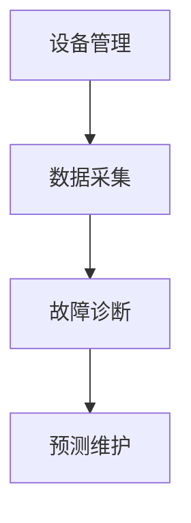

## 1.背景介绍

在全球化的今天，电力设施的管理和维护成为了一个世界性的挑战。许多组织正在努力寻求更加高效、可靠的电气设备管理系统。这篇文章将详述电气设备管理系统的详细设计和具体代码实现，帮助读者深入理解其工作机制，并提供一种可行的解决方案。

## 2.核心概念与联系

电气设备管理系统（Electrical Equipment Management System，EEMS）是一个用于监控和管理电力设施的系统。其核心概念包括设备管理、数据采集、故障诊断和预测维护等。各个概念之间的关系可以通过以下的流程图来表示：



## 3.核心算法原理具体操作步骤

电气设备管理系统的核心算法主要包括数据采集算法、故障诊断算法和预测维护算法。数据采集算法用于收集设备的运行数据；故障诊断算法通过对数据的分析，检测设备的运行是否存在问题；预测维护算法通过对历史数据和当前数据的分析，预测设备的未来运行状况，并提供维护建议。

## 4.数学模型和公式详细讲解举例说明

设备运行状态的判断主要利用了概率论的相关知识。例如，设备的运行状态可以用一个随机变量$X$表示，其取值为1表示设备正常，取值为0表示设备故障。设备的运行数据可以看作是随机变量$X$的一次观测结果。通过对大量的观测结果进行分析，可以估计$X$的期望值$E(X)$，以此来判断设备的运行状态。

## 5.项目实践：代码实例和详细解释说明

下面我们将通过一个简单的例子来演示如何实现电气设备管理系统的核心算法。假设我们需要采集一个设备的运行数据，并判断其是否正常运行。

```python
class Equipment:
    def __init__(self, id, status):
        self.id = id
        self.status = status

    def collect_data(self):
        # 模拟数据采集过程
        data = random.randint(0,1)
        return data
    
    def diagnose(self, data):
        # 模拟故障诊断过程
        if data == 0:
            self.status = "Faulty"
        else:
            self.status = "Normal"
    
    def predict_maintenance(self, data):
        # 模拟预测维护过程
        if data == 0:
            return "Maintenance needed"
        else:
            return "No maintenance needed"
```

## 6.实际应用场景

电气设备管理系统广泛应用于电力、制造、石化等行业。例如，在电力行业，可以通过电气设备管理系统实时监控电网设备的运行状态，及时发现并处理故障，保证电网的稳定运行。

## 7.工具和资源推荐

实现电气设备管理系统需要一些专业的硬件和软件支持。硬件方面，需要数据采集设备和通讯设备；软件方面，需要数据库管理系统、数据分析工具和开发环境等。

## 8.总结：未来发展趋势与挑战

随着科技的发展，电气设备管理系统将越来越智能化、自动化。但同时也面临着数据安全、设备兼容、系统稳定等挑战。

## 9.附录：常见问题与解答

1. Q: 电气设备管理系统的数据采集设备如何选择？
   A: 数据采集设备的选择需要根据设备的种类和运行环境等因素进行考虑。一般来说，需要选择能够稳定、准确地采集数据的设备。

2. Q: 如何保证电气设备管理系统的数据安全？
   A: 可以通过数据加密、访问控制、网络隔离等方法来保证数据的安全。

3. Q: 电气设备管理系统的维护工作包括哪些内容？
   A: 电气设备管理系统的维护工作主要包括设备的定期检查、数据的备份和恢复、系统的升级和优化等。