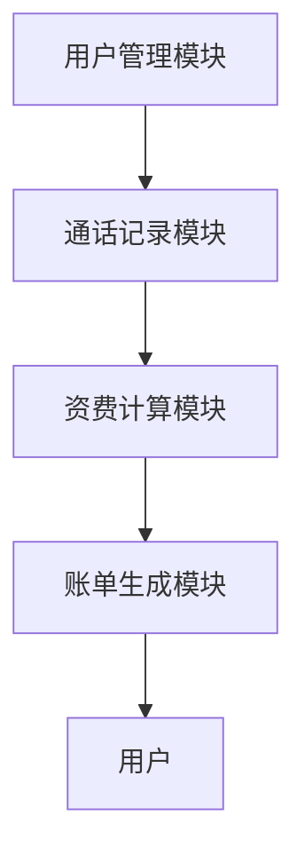

# 电话资费系统详细设计与具体代码实现

作者：禅与计算机程序设计艺术

## 1.背景介绍

### 1.1 需求背景

在现代社会，电话资费系统在电信行业中扮演着至关重要的角色。随着通信技术的不断发展，用户对电信服务的需求也日益增长，资费系统的复杂性和灵活性要求也随之提高。一个高效、准确、灵活的电话资费系统可以帮助电信运营商更好地管理资费策略，提升用户满意度，并在市场竞争中占据优势。

### 1.2 目标和范围

本文旨在详细介绍电话资费系统的设计与实现，包括从需求分析、架构设计、核心算法、数学模型、代码实例到实际应用场景的全面解析。通过这篇文章，读者将能够深入理解电话资费系统的工作原理，并掌握设计和实现此类系统的最佳实践。

### 1.3 行业现状与挑战

当前，电信行业面临的主要挑战包括用户需求的多样化、资费策略的复杂性、数据处理的高效性以及系统的可扩展性和维护性。如何设计一个既能满足复杂需求，又能高效运行的电话资费系统，是每个电信运营商亟待解决的问题。

## 2.核心概念与联系

### 2.1 电话资费系统的基本概念

电话资费系统是一个用于计算用户通话费用的系统，通常包括以下几个核心模块：

- **用户管理模块**：负责用户信息的管理，包括用户的基本信息、账户信息、资费套餐等。
- **通话记录模块**：记录用户的通话详细信息，包括通话时间、通话时长、通话类型等。
- **资费计算模块**：根据用户的资费套餐和通话记录，计算用户的通话费用。
- **账单生成模块**：生成用户的账单，展示用户的通话费用明细。

### 2.2 资费策略与规则

资费策略是电话资费系统的核心，它决定了用户通话费用的计算规则。常见的资费策略包括：

- **按时长计费**：根据通话时长计算费用。
- **按次数计费**：根据通话次数计算费用。
- **包月计费**：用户支付固定费用，享受一定的通话时长或次数。

### 2.3 数据流与系统架构

电话资费系统的数据流通常包括以下几个步骤：

1. **数据采集**：采集用户的通话记录。
2. **数据处理**：对通话记录进行预处理，如去重、格式化等。
3. **资费计算**：根据预处理后的通话记录和资费策略，计算通话费用。
4. **账单生成**：生成用户的账单，并推送给用户。

下图展示了电话资费系统的整体架构：



## 3.核心算法原理具体操作步骤

### 3.1 数据采集与预处理

数据采集是电话资费系统的第一步，通常通过电信运营商的交换机或计费系统获取用户的通话记录。预处理步骤包括数据清洗、格式化和去重等。

### 3.2 通话记录的存储与管理

通话记录通常存储在关系型数据库中，如MySQL或PostgreSQL。为了提高查询效率，可以对通话记录表进行适当的索引设计。

### 3.3 资费计算算法

资费计算是电话资费系统的核心。以下是一个简单的按时长计费的算法示例：

1. 获取用户的资费套餐信息。
2. 获取用户的通话记录。
3. 根据通话时长和资费套餐中的计费规则，计算通话费用。

### 3.4 账单生成与推送

账单生成是电话资费系统的最后一步。系统根据计算出的通话费用，生成用户的账单，并通过短信、邮件或App推送给用户。

## 4.数学模型和公式详细讲解举例说明

### 4.1 资费计算的数学模型

资费计算的数学模型通常基于通话时长、通话次数和资费套餐中的计费规则。以下是一个简单的按时长计费的数学模型：

$$
C = \sum_{i=1}^{n} T_i \cdot R
$$

其中，$C$ 是总通话费用，$n$ 是通话记录的数量，$T_i$ 是第 $i$ 条通话记录的时长，$R$ 是每分钟的资费。

### 4.2 复杂资费策略的数学模型

对于复杂的资费策略，如包月计费，可以使用分段函数表示：

$$
C = 
\begin{cases} 
F & \text{如果} \ T \leq L \\
F + (T - L) \cdot R & \text{如果} \ T > L
\end{cases}
$$

其中，$F$ 是包月费用，$T$ 是总通话时长，$L$ 是包月包含的通话时长，$R$ 是超出部分的资费。

### 4.3 实例讲解

假设某用户的资费套餐为包月100元，包含500分钟通话时长，超出部分按每分钟0.5元计费。该用户当月通话总时长为600分钟，则其通话费用计算如下：

$$
C = 100 + (600 - 500) \cdot 0.5 = 100 + 50 = 150 \ \text{元}
$$

## 5.项目实践：代码实例和详细解释说明

### 5.1 数据库设计

首先，我们需要设计数据库表来存储用户信息、通话记录和资费套餐。以下是一个简单的数据库设计：

```sql
CREATE TABLE Users (
    user_id INT PRIMARY KEY,
    name VARCHAR(100),
    package_id INT
);

CREATE TABLE Packages (
    package_id INT PRIMARY KEY,
    name VARCHAR(100),
    monthly_fee DECIMAL(10, 2),
    included_minutes INT,
    extra_fee_per_minute DECIMAL(10, 2)
);

CREATE TABLE CallRecords (
    record_id INT PRIMARY KEY,
    user_id INT,
    call_time DATETIME,
    duration INT
);
```

### 5.2 资费计算代码实例

接下来，我们编写资费计算的代码。以下是一个简单的Python实现：

```python
import sqlite3
from datetime import datetime

def calculate_fee(user_id):
    conn = sqlite3.connect('billing_system.db')
    cursor = conn.cursor()

    # 获取用户的资费套餐信息
    cursor.execute("SELECT package_id FROM Users WHERE user_id=?", (user_id,))
    package_id = cursor.fetchone()[0]

    cursor.execute("SELECT monthly_fee, included_minutes, extra_fee_per_minute FROM Packages WHERE package_id=?", (package_id,))
    package = cursor.fetchone()

    monthly_fee, included_minutes, extra_fee_per_minute = package

    # 获取用户的通话记录
    cursor.execute("SELECT duration FROM CallRecords WHERE user_id=?", (user_id,))
    call_records = cursor.fetchall()

    total_duration = sum(record[0] for record in call_records)

    # 计算通话费用
    if total_duration <= included_minutes:
        total_fee = monthly_fee
    else:
        extra_minutes = total_duration - included_minutes
        total_fee = monthly_fee + extra_minutes * extra_fee_per_minute

    conn.close()
    return total_fee

# 示例调用
user_id = 1
fee = calculate_fee(user_id)
print(f"User {user_id}'s total fee is: {fee}")
```

### 5.3 账单生成代码实例

生成账单的代码如下：

```python
def generate_bill(user_id):
    fee = calculate_fee(user_id)

    # 生成账单
    bill = f"User {user_id}'s total fee for this month is: {fee} USD"

    # 推送账单（此处仅打印，实际应用中可以通过短信、邮件等方式推送）
    print(bill)

# 示例调用
generate_bill(user_id)
```

## 6.实际应用场景

### 6.1 电信运营商

电信运营商可以使用电话资费系统来管理用户的通话费用，提供灵活多样的资费套餐，提高用户满意度和市场竞争力。

### 6.2 企业内部通信

企业可以使用电话资费系统来管理内部员工的通信费用，优化通信成本，提高企业运营效率。

### 6.3 虚拟运营商

虚拟运营商可以使用电话资费系统来提供个性化的资费套餐，吸引更多用户，扩大市场份额。

## 7.工具和资源推荐

### 7.1 数据库

- **MySQL**：开