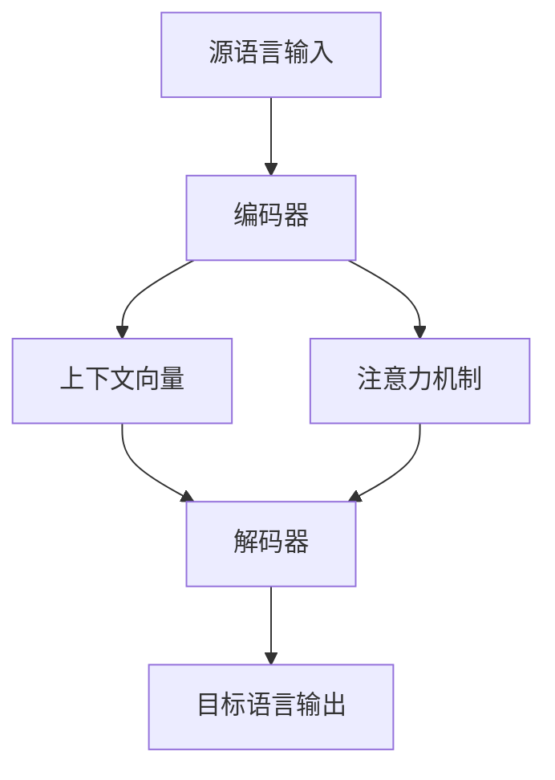

# 神经机器翻译 原理与代码实例讲解

作者：禅与计算机程序设计艺术

## 1. 背景介绍

### 1.1 神经机器翻译的发展历程

神经机器翻译（Neural Machine Translation, NMT）是近年来自然语言处理（NLP）领域的一个重要突破。传统的机器翻译方法主要依赖于统计模型和基于规则的方法，这些方法在处理复杂语言现象时显得力不从心。随着深度学习技术的发展，NMT逐渐成为主流，尤其是基于深度神经网络的方法，如序列到序列（Sequence-to-Sequence, Seq2Seq）模型，进一步推动了机器翻译技术的进步。

### 1.2 NMT的优势

与传统方法相比，NMT具有以下几个显著优势：

1. **端到端训练**：NMT模型可以通过端到端的方式进行训练，直接从源语言到目标语言进行映射，不需要中间的特征工程。
2. **上下文理解**：NMT模型能够更好地理解和利用上下文信息，从而在翻译过程中保持句子的连贯性和一致性。
3. **可扩展性**：NMT模型可以通过增加数据和计算资源来提升性能，具有较好的扩展性。

### 1.3 主要挑战

尽管NMT取得了显著进展，但仍然面临一些挑战：

1. **数据需求量大**：NMT模型需要大量的平行语料进行训练，数据获取成本较高。
2. **计算资源要求高**：训练NMT模型需要大量的计算资源，尤其是GPU的支持。
3. **翻译质量问题**：在处理长句子和复杂语法结构时，NMT模型仍然可能出现翻译错误。

## 2. 核心概念与联系

### 2.1 序列到序列模型

序列到序列（Seq2Seq）模型是NMT的基础架构之一。它由两个主要部分组成：编码器（Encoder）和解码器（Decoder）。编码器将源语言序列编码成一个固定长度的上下文向量，解码器则根据这个上下文向量生成目标语言序列。

### 2.2 注意力机制

注意力机制（Attention Mechanism）是NMT中的一个重要创新。它允许解码器在生成每个目标词时，动态地选择和关注源语言序列中的相关部分，从而提高翻译质量。常见的注意力机制包括Bahdanau Attention和Luong Attention。

### 2.3 变换器模型

变换器（Transformer）模型是目前最先进的NMT架构之一。与传统的Seq2Seq模型不同，变换器完全基于注意力机制，不再使用循环神经网络（RNN）。这种架构不仅提高了训练速度，还显著提升了翻译质量。



## 3. 核心算法原理具体操作步骤

### 3.1 数据预处理

数据预处理是NMT训练的第一步，包括数据清洗、分词、去重等。高质量的平行语料是训练高性能NMT模型的基础。

### 3.2 模型训练

模型训练包括以下几个步骤：

1. **模型初始化**：初始化模型参数，包括编码器、解码器和注意力机制的参数。
2. **前向传播**：将源语言序列输入编码器，得到上下文向量；然后将上下文向量输入解码器，生成目标语言序列。
3. **损失计算**：计算模型输出与真实目标之间的损失，常用的损失函数是交叉熵损失。
4. **反向传播和参数更新**：通过反向传播算法计算梯度，并使用优化算法（如Adam）更新模型参数。

### 3.3 模型评估

模型评估通常使用BLEU（Bilingual Evaluation Understudy）得分来衡量翻译质量。BLEU得分越高，表示翻译结果越接近人工翻译。

### 3.4 模型优化

常见的模型优化方法包括：

1. **超参数调优**：调整学习率、批量大小等超参数，以获得更好的模型性能。
2. **正则化**：使用Dropout等正则化技术，防止模型过拟合。
3. **数据增强**：通过数据增强技术增加训练数据的多样性，提高模型的泛化能力。

## 4. 数学模型和公式详细讲解举例说明

### 4.1 编码器和解码器

编码器和解码器通常使用RNN、LSTM或GRU实现。假设源语言序列为 $X = (x_1, x_2, \ldots, x_n)$，目标语言序列为 $Y = (y_1, y_2, \ldots, y_m)$，编码器的计算过程如下：

$$
h_t = \text{RNN}(x_t, h_{t-1})
$$

其中，$h_t$ 是第 $t$ 个时间步的隐藏状态。

解码器的计算过程如下：

$$
s_t = \text{RNN}(y_{t-1}, s_{t-1}, c_t)
$$

其中，$s_t$ 是解码器第 $t$ 个时间步的隐藏状态，$c_t$ 是上下文向量。

### 4.2 注意力机制

注意力机制的计算过程如下：

$$
e_{ij} = \text{score}(h_i, s_{j-1})
$$

$$
\alpha_{ij} = \frac{\exp(e_{ij})}{\sum_{k=1}^{n} \exp(e_{ik})}
$$

$$
c_j = \sum_{i=1}^{n} \alpha_{ij} h_i
$$

其中，$e_{ij}$ 是第 $i$ 个源语言隐藏状态和第 $j$ 个目标语言隐藏状态之间的得分，$\alpha_{ij}$ 是注意力权重，$c_j$ 是上下文向量。

### 4.3 变换器模型

变换器模型的核心是多头自注意力机制和前馈神经网络。多头自注意力机制的计算过程如下：

$$
\text{MultiHead}(Q, K, V) = \text{Concat}(\text{head}_1, \ldots, \text{head}_h)W^O
$$

$$
\text{head}_i = \text{Attention}(QW_i^Q, KW_i^K, VW_i^V)
$$

其中，$Q$、$K$、$V$ 分别是查询、键和值矩阵，$W_i^Q$、$W_i^K$、$W_i^V$ 和 $W^O$ 是参数矩阵。

前馈神经网络的计算过程如下：

$$
\text{FFN}(x) = \max(0, xW_1 + b_1)W_2 + b_2
$$

其中，$W_1$、$W_2$、$b_1$ 和 $b_2$ 是参数矩阵和偏置向量。

## 5. 项目实践：代码实例和详细解释说明

### 5.1 数据准备

在项目实践中，我们以英语到法语的翻译为例。首先，需要准备平行语料数据集，如WMT（Workshop on Machine Translation）数据集。

```python
import torch
from torchtext.data import Field, TabularDataset, BucketIterator

SRC = Field(tokenize='spacy', tokenizer_language='en_core_web_sm', lower=True)
TRG = Field(tokenize='spacy', tokenizer_language='fr_core_news_sm', lower=True)

data_fields = [('src', SRC), ('trg', TRG)]
train_data, valid_data, test_data = TabularDataset.splits(
    path='data/',
    train='train.csv',
    validation='valid.csv',
    test='test.csv',
    format='csv',
    fields=data_fields
)

SRC.build_vocab(train_data, min_freq=2)
TRG.build_vocab(train_data, min_freq=2)

train_iterator, valid_iterator, test_iterator = BucketIterator.splits(
    (train_data, valid_data, test_data),
    batch_size=32,
    device=torch.device('cuda' if torch.cuda.is_available() else 'cpu')
)
```

### 5.2 模型定义

接下来，定义Seq2Seq模型，包括编码器、解码器和注意力机制。

```python
import torch.nn as nn

class Encoder(nn.Module):
    def __init__(self, input_dim, emb_dim, hid_dim, n_layers, dropout):
        super().__init__()
        self.embedding = nn.Embedding(input_dim, emb_dim)
        self.rnn = nn.LSTM(emb_dim, hid_dim, n_layers, dropout=dropout)
